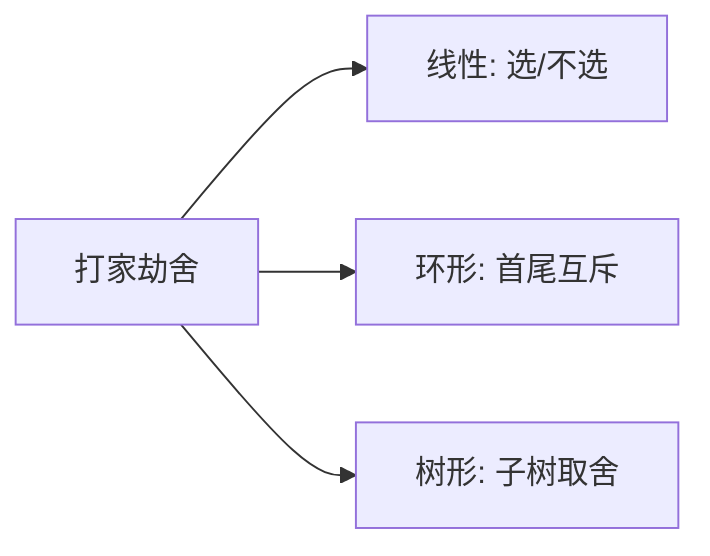

# 打家劫舍系列：线性 DP 的入门典范

## 一、问题族全景



"打家劫舍"是线性 DP 最经典的入门模型族，三道题层层递进：

| 题目 | 结构 | 核心约束 |
|------|------|----------|
| LC 198. 打家劫舍 | 一排房屋（线性） | 相邻不能偷 |
| LC 213. 打家劫舍 II | 环形房屋 | 相邻不能偷 + 首尾相邻 |
| LC 337. 打家劫舍 III | 二叉树 | 直接父子不能偷 |

**共同本质**：在一个有"相邻冲突"约束的结构上，选取权值最大的独立子集。

## 二、LC 198：线性版本

### 2.1 状态定义

`dp[i]` = 考虑前 `i` 间房屋能偷到的最大金额。

### 2.2 转移方程

```text
dp[i] = max(dp[i-1], dp[i-2] + nums[i-1])
        // 不偷第i间    // 偷第i间（则第i-1间不能偷）
```

**决策直觉**：站在第 i 间门口，只有两个选择——跳过它（继承 dp[i-1]），或者偷它（拿 dp[i-2] + 当前金额）。

### 2.3 完整实现

```java tab
public int rob(int[] nums) {
    int n = nums.length;
    if (n == 1) return nums[0];
    int[] dp = new int[n + 1];
    dp[1] = nums[0];
    for (int i = 2; i <= n; i++) {
        dp[i] = Math.max(dp[i - 1], dp[i - 2] + nums[i - 1]);
    }
    return dp[n];
}
```

```typescript tab
function rob(nums: number[]): number {
    const n = nums.length;
    if (n === 1) return nums[0];
    const dp = new Array(n + 1).fill(0);
    dp[1] = nums[0];
    for (let i = 2; i <= n; i++) {
        dp[i] = Math.max(dp[i - 1], dp[i - 2] + nums[i - 1]);
    }
    return dp[n];
}
```

```python tab
def rob(nums: list[int]) -> int:
    n = len(nums)
    if n == 1:
        return nums[0]
    dp = [0] * (n + 1)
    dp[1] = nums[0]
    for i in range(2, n + 1):
        dp[i] = max(dp[i - 1], dp[i - 2] + nums[i - 1])
    return dp[n]
```

### 2.4 空间优化：O(1)

`dp[i]` 只依赖前两个值，用两个变量滚动：

```typescript tab
function rob(nums: number[]): number {
    let prev2 = 0, prev1 = 0;
    for (const num of nums) {
        const cur = Math.max(prev1, prev2 + num);
        prev2 = prev1;
        prev1 = cur;
    }
    return prev1;
}
```

```java tab
public int rob(int[] nums) {
    int prev2 = 0, prev1 = 0;
    for (int num : nums) {
        int cur = Math.max(prev1, prev2 + num);
        prev2 = prev1;
        prev1 = cur;
    }
    return prev1;
}
```

**复杂度**：时间 O(n)，空间 O(1)。

## 三、LC 213：环形版本

### 3.1 关键洞察

首尾相邻意味着**第一间和最后一间不能同时偷**。分两种情况取最大值：

```text
答案 = max(
    rob(nums[0..n-2]),   // 偷第一间，不偷最后一间
    rob(nums[1..n-1])    // 不偷第一间，可以偷最后一间
)
```

两种情况覆盖了所有合法方案（第一间和最后一间至少有一个不偷）。

### 3.2 完整实现

```typescript tab
function rob(nums: number[]): number {
    const n = nums.length;
    if (n === 1) return nums[0];
    if (n === 2) return Math.max(nums[0], nums[1]);
    return Math.max(
        robRange(nums, 0, n - 2),  // 含首不含尾
        robRange(nums, 1, n - 1),  // 含尾不含首
    );
}

function robRange(nums: number[], lo: number, hi: number): number {
    let prev2 = 0, prev1 = 0;
    for (let i = lo; i <= hi; i++) {
        const cur = Math.max(prev1, prev2 + nums[i]);
        prev2 = prev1;
        prev1 = cur;
    }
    return prev1;
}
```

```java tab
public int rob(int[] nums) {
    int n = nums.length;
    if (n == 1) return nums[0];
    if (n == 2) return Math.max(nums[0], nums[1]);
    return Math.max(robRange(nums, 0, n - 2), robRange(nums, 1, n - 1));
}

private int robRange(int[] nums, int lo, int hi) {
    int prev2 = 0, prev1 = 0;
    for (int i = lo; i <= hi; i++) {
        int cur = Math.max(prev1, prev2 + nums[i]);
        prev2 = prev1;
        prev1 = cur;
    }
    return prev1;
}
```

```python tab
def rob(nums: list[int]) -> int:
    n = len(nums)
    if n == 1:
        return nums[0]
    if n == 2:
        return max(nums)
    return max(rob_range(nums, 0, n - 2), rob_range(nums, 1, n - 1))

def rob_range(nums: list[int], lo: int, hi: int) -> int:
    prev2 = prev1 = 0
    for i in range(lo, hi + 1):
        prev2, prev1 = prev1, max(prev1, prev2 + nums[i])
    return prev1
```

**易错**：`n=1` 和 `n=2` 的边界必须特判，否则拆分会出错。

## 四、LC 337：树形版本

### 4.1 状态定义

对每个节点返回一个二元组：

```text
rob(node) = [不偷node的最大收益, 偷node的最大收益]
```

### 4.2 转移

```text
不偷 node：左右子节点可偷可不偷
    → max(左偷,左不偷) + max(右偷,右不偷)

偷 node：左右子节点都不能偷
    → node.val + 左不偷 + 右不偷
```

### 4.3 完整实现

```java tab
public int rob(TreeNode root) {
    int[] res = dfs(root);
    return Math.max(res[0], res[1]);
}

private int[] dfs(TreeNode node) {
    if (node == null) return new int[]{0, 0};
    int[] left = dfs(node.left);
    int[] right = dfs(node.right);
    int notRob = Math.max(left[0], left[1]) + Math.max(right[0], right[1]);
    int rob = node.val + left[0] + right[0];
    return new int[]{notRob, rob};
}
```

```typescript tab
function rob(root: TreeNode | null): number {
    const [notRob, robIt] = dfs(root);
    return Math.max(notRob, robIt);
}

function dfs(node: TreeNode | null): [number, number] {
    if (!node) return [0, 0];
    const [ln, lr] = dfs(node.left);
    const [rn, rr] = dfs(node.right);
    const notRob = Math.max(ln, lr) + Math.max(rn, rr);
    const robIt = node.val + ln + rn;
    return [notRob, robIt];
}
```

```python tab
def rob(root: TreeNode) -> int:
    def dfs(node):
        if not node:
            return (0, 0)  # (不偷, 偷)
        ln, lr = dfs(node.left)
        rn, rr = dfs(node.right)
        not_rob = max(ln, lr) + max(rn, rr)
        rob_it = node.val + ln + rn
        return (not_rob, rob_it)
    return max(dfs(root))
```

**复杂度**：时间 O(n)，每个节点访问一次；空间 O(h) 递归栈。

## 五、三道题的统一视角

| 版本 | 结构 | "相邻"的定义 | 技巧 |
|------|------|-------------|------|
| 线性 | 数组 | 下标相邻 | 滚动变量 |
| 环形 | 数组首尾相连 | 下标相邻 + 首尾 | 拆两段 |
| 树形 | 二叉树 | 父子关系 | 后序遍历返回二元组 |

**通用模式**：「选或不选」+ 冲突约束 → 状态设计为 `(不选当前, 选当前)`。

## 六、变体与推广

### 6.1 相邻距离扩展为 k

如果不能偷距离 ≤ k 的房屋：`dp[i] = max(dp[i-1], dp[i-k-1] + nums[i])`。

### 6.2 环形 + 树形结合

"环形链表上的打家劫舍"：同样拆成两段线性问题。

### 6.3 与"删除并获得点数"的关系

LC 740：选了值 x 就要删除所有 x±1。排序/桶化后**就是打家劫舍**。

## 七、面试常见题

- 🟡 LC 198. 打家劫舍
- 🟡 LC 213. 打家劫舍 II
- 🟡 LC 337. 打家劫舍 III
- 🟡 LC 740. 删除并获得点数（打家劫舍变体）
- 🟢 LC 2320. 统计放置房子的方式数（斐波那契变体）

## 八、易错点

1. **环形版本忘记特判 n≤2**：拆分会产生空区间或重复。
2. **树形版本漏掉"不偷时子节点可偷可不偷"**：不是子节点必须偷。
3. **dp 下标偏移**：`dp[i]` 对应 `nums[i-1]`，初始化 `dp[1]=nums[0]`。
4. **滚动变量更新顺序**：必须先算 cur 再更新 prev2/prev1。

## 九、心法口诀

> **每间门口二选一，跳过继承偷加钱；**
> **环形拆成两段跑，树上后序返双元。**
