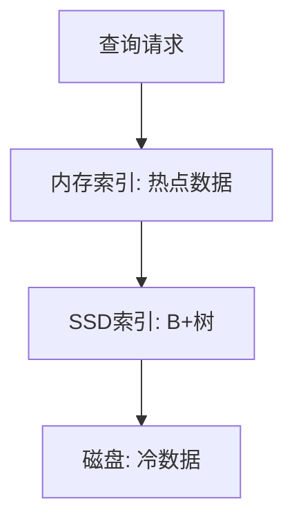

# 索引设计与海量数据查找


## 一、问题背景

当数据量达到千万、亿级时，如何在海量数据中**快速查找**某条记录？

核心矛盾：
- 内存放不下所有数据 → 必须依赖磁盘
- 磁盘 IO 极慢（毫秒级 vs 内存纳秒级）→ 必须减少 IO 次数
- 数据持续增长 → 索引必须支持动态插入/删除

## 二、索引的需求定义

以数据库为例，索引需支持：

| 需求类型 | 示例 |
|----------|------|
| 等值查询 | `WHERE id = 1234` |
| 区间查询 | `WHERE id BETWEEN 1000 AND 2000` |
| 前缀匹配 | `WHERE name LIKE '张%'` |
| 排序 | `ORDER BY create_time DESC` |

性能约束：
- 查询尽可能少磁盘 IO
- 索引本身不能占太多内存
- 写入时索引维护代价可控

## 三、候选数据结构对比

| 数据结构 | 等值查询 | 区间查询 | 磁盘友好 | 动态更新 |
|----------|----------|----------|----------|----------|
| 散列表 | O(1) | ❌ | 一般 | ✅ |
| 有序数组 | O(log n) | ✅ | ✅ | ❌ 插入慢 |
| 二叉搜索树 | O(log n) | ✅ | ❌ 树高 | ✅ |
| 跳表 | O(log n) | ✅ | 一般 | ✅ |
| **B+树** | O(log_m n) | ✅ | ✅ 矮胖 | ✅ |

结论：**B+树**是磁盘存储场景下的最优解。

## 四、索引的常见类型

### 4.1 主键索引（聚簇索引）

- 叶子节点存储**完整行数据**
- 一张表只有一个
- 数据物理有序

### 4.2 二级索引（非聚簇索引）

- 叶子节点存储**主键值**
- 查到主键后需"回表"查聚簇索引
- 可有多个

### 4.3 联合索引

多列组合建索引，遵循**最左前缀**原则：

```text
INDEX(a, b, c)

✅ WHERE a = 1
✅ WHERE a = 1 AND b = 2
✅ WHERE a = 1 AND b = 2 AND c = 3
❌ WHERE b = 2（跳过了 a）
❌ WHERE c = 3（跳过了 a, b）
```

### 4.4 覆盖索引

查询的列全部包含在索引中，无需回表：

```sql
-- 索引 INDEX(name, age)
SELECT name, age FROM user WHERE name = '张三';
-- 直接从索引返回，不访问数据行
```

## 五、索引设计原则

### 5.1 选择性（区分度）

选择性 = 不重复值数 / 总行数

| 字段 | 选择性 | 是否适合建索引 |
|------|--------|---------------|
| 身份证号 | ~1.0 | ✅ 非常适合 |
| 手机号 | ~1.0 | ✅ |
| 性别 | 2/总行数 | ❌ 区分度太低 |
| 状态(0/1) | 极低 | ❌ |

### 5.2 索引数量控制

| 代价 | 说明 |
|------|------|
| 写入放大 | 每次 INSERT/UPDATE 都要维护所有索引 |
| 空间占用 | 每个索引是一棵独立 B+树 |
| 优化器负担 | 索引越多，选错索引概率越大 |

> 经验法则：单表索引不超过 5~6 个。

### 5.3 索引失效场景

| 场景 | 示例 |
|------|------|
| 对索引列使用函数 | `WHERE YEAR(create_time) = 2024` |
| 隐式类型转换 | `WHERE phone = 13800138000`（phone 是 varchar） |
| LIKE 左模糊 | `WHERE name LIKE '%张'` |
| OR 连接非索引列 | `WHERE a = 1 OR b = 2`（b 无索引） |
| NOT IN / != | 通常导致全表扫描 |

## 六、海量数据索引策略

### 6.1 分库分表

当单表超过千万行：
- **水平分表**：按用户 ID 哈希分到 N 张表
- **垂直分库**：按业务拆分（订单库、用户库）

### 6.2 多级索引



### 6.3 倒排索引（搜索引擎）

关键词 → 文档 ID 列表，适合全文检索场景。

## 七、面试高频题

**Q：为什么 MySQL 用 B+树而不用 Hash 索引？**

Hash 不支持范围查询、排序、最左前缀匹配。只有等值查询场景（如 Memory 引擎）才适合 Hash。

**Q：索引越多越好吗？**

不是。索引加速读但拖慢写，且占空间。应根据实际查询模式（慢查询日志）有针对性地建索引。

**Q：如何判断索引是否生效？**

使用 `EXPLAIN` 查看执行计划，关注 type（const > ref > range > ALL）和 rows 扫描行数。

## 八、总结

索引设计的核心权衡：

| 维度 | 权衡 |
|------|------|
| 读 vs 写 | 索引加速读，拖慢写 |
| 空间 vs 时间 | 索引占空间，换查询速度 |
| 精度 vs 通用 | 联合索引精确但受最左前缀限制 |

选择索引结构时的决策路径：
1. 是否需要区间查询？→ 排除 Hash
2. 数据是否在磁盘？→ 排除二叉树（选 B+树）
3. 是否内存数据库？→ 可选跳表/红黑树
4. 是否全文检索？→ 倒排索引
