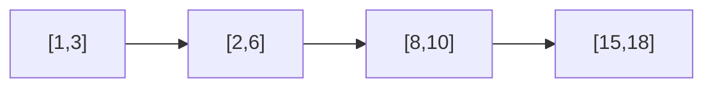
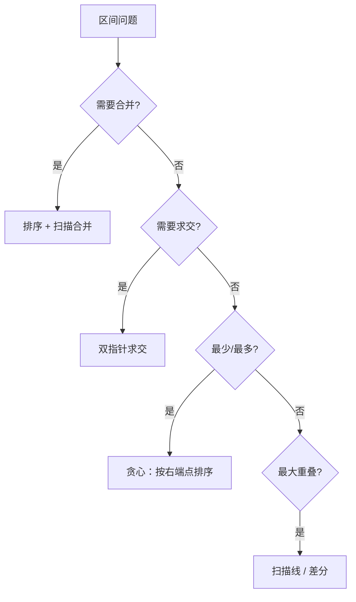

# 区间合并与区间操作


## 一、为什么单独讲区间

区间类题目在面试中高频出现，且共享一套核心操作：**排序 → 扫描 → 合并/插入/求交**。掌握这套框架后，所有区间题都是变体。

| 题目 | 操作 | 难度 |
|------|------|------|
| LC 56. 合并区间 | 合并重叠 | Medium |
| LC 57. 插入区间 | 插入并合并 | Medium |
| LC 986. 区间列表的交集 | 求交集 | Medium |
| LC 435. 无重叠区间 | 最少移除 | Medium |
| LC 452. 用最少的箭引爆气球 | 最少覆盖 | Medium |
| LC 252. 会议室 | 判断重叠 | Easy |
| LC 253. 会议室 II | 最大并发 | Medium |

## 二、核心操作：合并区间

### 2.1 思路

1. 按区间左端点排序
2. 扫描：若当前区间与结果末尾重叠（`cur.start <= last.end`），合并；否则追加



排序后扫描：[1,3] 与 [2,6] 重叠 → 合并为 [1,6]；[8,10] 不重叠 → 追加。

### 2.2 模板

```java tab
int[][] merge(int[][] intervals) {
    Arrays.sort(intervals, (a, b) -> a[0] - b[0]);
    List<int[]> merged = new ArrayList<>();
    for (int[] cur : intervals) {
        if (merged.isEmpty() || merged.get(merged.size() - 1)[1] < cur[0]) {
            merged.add(cur);  // 不重叠，追加
        } else {
            // 重叠，合并（取右端点最大值）
            merged.get(merged.size() - 1)[1] =
                Math.max(merged.get(merged.size() - 1)[1], cur[1]);
        }
    }
    return merged.toArray(new int[0][]);
}
```

```typescript tab
function merge(intervals: number[][]): number[][] {
  intervals.sort((a, b) => a[0] - b[0]);
  const merged: number[][] = [];
  for (const cur of intervals) {
    const last = merged[merged.length - 1];
    if (!last || last[1] < cur[0]) {
      merged.push(cur);
    } else {
      last[1] = Math.max(last[1], cur[1]);
    }
  }
  return merged;
}
```

```python tab
def merge(intervals):
    intervals.sort(key=lambda x: x[0])
    merged = []
    for cur in intervals:
        if not merged or merged[-1][1] < cur[0]:
            merged.append(cur)
        else:
            merged[-1][1] = max(merged[-1][1], cur[1])
    return merged
```

## 三、插入区间

给定已排序且不重叠的区间列表，插入一个新区间并保持有序。

### 3.1 三段式扫描

```
[左侧不重叠] + [合并重叠部分] + [右侧不重叠]
```

```java tab
int[][] insert(int[][] intervals, int[] newInterval) {
    List<int[]> res = new ArrayList<>();
    int i = 0, n = intervals.length;

    // 1. 左侧：完全在 newInterval 之前
    while (i < n && intervals[i][1] < newInterval[0]) {
        res.add(intervals[i++]);
    }
    // 2. 中间：与 newInterval 重叠，合并
    while (i < n && intervals[i][0] <= newInterval[1]) {
        newInterval[0] = Math.min(newInterval[0], intervals[i][0]);
        newInterval[1] = Math.max(newInterval[1], intervals[i][1]);
        i++;
    }
    res.add(newInterval);
    // 3. 右侧：完全在 newInterval 之后
    while (i < n) {
        res.add(intervals[i++]);
    }
    return res.toArray(new int[0][]);
}
```

```typescript tab
function insert(intervals: number[][], newInterval: number[]): number[][] {
  const res: number[][] = [];
  let i = 0;
  const n = intervals.length;

  while (i < n && intervals[i][1] < newInterval[0]) res.push(intervals[i++]);
  while (i < n && intervals[i][0] <= newInterval[1]) {
    newInterval[0] = Math.min(newInterval[0], intervals[i][0]);
    newInterval[1] = Math.max(newInterval[1], intervals[i][1]);
    i++;
  }
  res.push(newInterval);
  while (i < n) res.push(intervals[i++]);
  return res;
}
```

```python tab
def insert(intervals, newInterval):
    res = []
    i, n = 0, len(intervals)
    while i < n and intervals[i][1] < newInterval[0]:
        res.append(intervals[i]); i += 1
    while i < n and intervals[i][0] <= newInterval[1]:
        newInterval[0] = min(newInterval[0], intervals[i][0])
        newInterval[1] = max(newInterval[1], intervals[i][1])
        i += 1
    res.append(newInterval)
    while i < n:
        res.append(intervals[i]); i += 1
    return res
```

## 四、区间交集

两个已排序区间列表，求所有交集。

**关键判断**：两个区间 [a1,a2] 和 [b1,b2] 有交集 ⟺ `a1 <= b2 && b1 <= a2`

交集为 `[max(a1,b1), min(a2,b2)]`。

```java tab
int[][] intervalIntersection(int[][] A, int[][] B) {
    List<int[]> res = new ArrayList<>();
    int i = 0, j = 0;
    while (i < A.length && j < B.length) {
        int lo = Math.max(A[i][0], B[j][0]);
        int hi = Math.min(A[i][1], B[j][1]);
        if (lo <= hi) res.add(new int[]{lo, hi});
        // 右端点小的那个前进
        if (A[i][1] < B[j][1]) i++;
        else j++;
    }
    return res.toArray(new int[0][]);
}
```

```typescript tab
function intervalIntersection(A: number[][], B: number[][]): number[][] {
  const res: number[][] = [];
  let i = 0, j = 0;
  while (i < A.length && j < B.length) {
    const lo = Math.max(A[i][0], B[j][0]);
    const hi = Math.min(A[i][1], B[j][1]);
    if (lo <= hi) res.push([lo, hi]);
    if (A[i][1] < B[j][1]) i++;
    else j++;
  }
  return res;
}
```

```python tab
def intervalIntersection(A, B):
    res = []
    i = j = 0
    while i < len(A) and j < len(B):
        lo = max(A[i][0], B[j][0])
        hi = min(A[i][1], B[j][1])
        if lo <= hi:
            res.append([lo, hi])
        if A[i][1] < B[j][1]:
            i += 1
        else:
            j += 1
    return res
```

## 五、贪心视角：最少移除 / 最少箭

### 5.1 无重叠区间（LC 435）

求最少移除几个区间使剩余不重叠。等价于：**最多保留几个不重叠区间**（活动选择问题）。

贪心：按右端点排序，每次选右端点最小的不冲突区间。

```java tab
int eraseOverlapIntervals(int[][] intervals) {
    Arrays.sort(intervals, (a, b) -> a[1] - b[1]);
    int keep = 1, end = intervals[0][1];
    for (int i = 1; i < intervals.length; i++) {
        if (intervals[i][0] >= end) {
            keep++;
            end = intervals[i][1];
        }
    }
    return intervals.length - keep;
}
```

```typescript tab
function eraseOverlapIntervals(intervals: number[][]): number {
  intervals.sort((a, b) => a[1] - b[1]);
  let keep = 1, end = intervals[0][1];
  for (let i = 1; i < intervals.length; i++) {
    if (intervals[i][0] >= end) {
      keep++;
      end = intervals[i][1];
    }
  }
  return intervals.length - keep;
}
```

```python tab
def eraseOverlapIntervals(intervals):
    intervals.sort(key=lambda x: x[1])
    keep, end = 1, intervals[0][1]
    for i in range(1, len(intervals)):
        if intervals[i][0] >= end:
            keep += 1
            end = intervals[i][1]
    return len(intervals) - keep
```

### 5.2 最少箭引爆气球（LC 452）

与 435 几乎相同，区别是边界相切（`==`）也算重叠。

## 六、扫描线：会议室问题

### 6.1 会议室 II（LC 253）

求同时进行的最多会议数 = 区间最大重叠深度。

**扫描线做法**：将开始和结束拆成事件，排序后扫描。

```java tab
int minMeetingRooms(int[][] intervals) {
    int n = intervals.length;
    int[] starts = new int[n], ends = new int[n];
    for (int i = 0; i < n; i++) {
        starts[i] = intervals[i][0];
        ends[i] = intervals[i][1];
    }
    Arrays.sort(starts);
    Arrays.sort(ends);

    int rooms = 0, maxRooms = 0, j = 0;
    for (int i = 0; i < n; i++) {
        if (starts[i] < ends[j]) {
            rooms++;
            maxRooms = Math.max(maxRooms, rooms);
        } else {
            rooms--;
            i--;  // 当前开始事件留到下一轮
            j++;
        }
    }
    return maxRooms;
}
```

```typescript tab
function minMeetingRooms(intervals: number[][]): number {
  const starts = intervals.map(i => i[0]).sort((a, b) => a - b);
  const ends = intervals.map(i => i[1]).sort((a, b) => a - b);
  let rooms = 0, max = 0, j = 0;
  for (let i = 0; i < starts.length; i++) {
    if (starts[i] < ends[j]) {
      rooms++;
      max = Math.max(max, rooms);
    } else {
      rooms--;
      i--;
      j++;
    }
  }
  return max;
}
```

```python tab
def minMeetingRooms(intervals):
    starts = sorted(i[0] for i in intervals)
    ends = sorted(i[1] for i in intervals)
    rooms = max_rooms = j = 0
    i = 0
    while i < len(starts):
        if starts[i] < ends[j]:
            rooms += 1
            i += 1
            max_rooms = max(max_rooms, rooms)
        else:
            rooms -= 1
            j += 1
    return max_rooms
```

## 七、总结：区间题解题框架



**面试口诀**：
- 合并 → 排左端点，扫右端点
- 求交 → 双指针，`max(lefts) <= min(rights)`
- 最少移除 → 排右端点，贪心保留
- 最大并发 → 扫描线 / 最小堆
