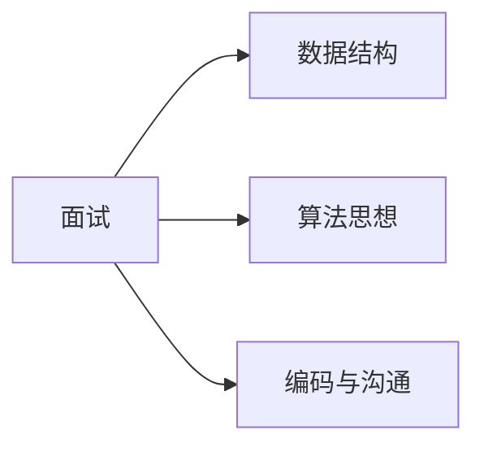

# 算法面试通关指南：从准备到 offer


## 一、面试算法考什么？



大厂面试考察算法，本质是看三件事：

1. **逻辑是否清晰**：能不能把模糊问题抽象出来。
2. **基础是否扎实**：数据结构和套路是否熟练。
3. **沟通是否到位**：能不能边想边讲，把思路交付给面试官。

> **不考**：竞赛级难题（99% 的面试不会出现 Codeforces Div2 E 以上难度）。

## 二、题目难度分布

| 难度 | 出现频率 | 典型 |
|------|----------|------|
| 🟢 Easy | ~30% | 双指针、哈希表、基础 DP |
| 🟡 Medium | ~50% | 经典 DP、二分、滑动窗口 |
| 🟠 Hard | ~15% | 状态机 DP、字典树、线段树 |
| 🔴 偏难怪 | <5% | 莫队、SAM、计算几何 |

**目标**：90 分钟内稳定做出 Medium，偶尔做出 Hard。

## 三、刷题路线（12 周）

### 阶段 1：基础数据结构（2 周）

- 数组、链表、栈、队列
- 哈希表、集合
- 二叉树（遍历、构造）

**目标题量**：30 道 Easy

### 阶段 2：算法思想入门（2 周）

- 双指针、滑动窗口
- 二分查找（变形题）
- BFS / DFS（连通块）
- 基础递归与回溯

**目标题量**：40 道 Easy + Medium

### 阶段 3：算法思想进阶（3 周）

- 动态规划（六大模型）
- 贪心（含证明）
- 图论（最短路、拓扑、环检测）
- 高级数据结构（字典树、并查集、线段树）

**目标题量**：60 道 Medium

### 阶段 4：分专题攻坚（3 周）

按公司高频标签刷：
- 链表专题（反转、合并、环检测）
- 二叉树专题（路径和、最近公共祖先）
- 字符串专题（KMP、Manacher）
- DP 专题（背包、区间、状态机）

### 阶段 5：模拟面试（2 周）

- 限时 30 分钟 1 题 + 5 分钟复盘
- 录音录像回看表达
- 找同学/朋友扮演面试官

## 四、面试中的思考流程

### 4.1 三段式沟通法

```text
1. 复述题目（确认理解）
   "这道题要求在 O(n) 时间内，找到数组中和为 target 的两个下标，对吗？"

2. 给出思路（先讲后写）
   "我打算用哈希表存 (值, 索引)，遍历时检查 target - x 是否在表里。"

3. 写代码 + 边写边讲
   "这行创建哈希表..." "if 条件判断是否已经访问过..."
```

### 4.2 卡壳时的保命技巧

**第一招：举具体例子**

```text
题目：数组 nums，返回中位数。
我卡在 "中位数" 的定义。
举例：nums = [3, 1, 2] → 中位数是 2。
nums = [3, 1, 4, 2] → 中位数是 2.5。
哦，是排序后中间位置，奇偶不同。
```

**第二招：从暴力开始**

```text
“最暴力的方法是把所有子数组枚举出来 O(n²)，找和最大的。
能不能优化？考虑前缀和。
前缀和也是 O(n²)，因为要枚举起点。
考虑单调队列 / 单调栈？"
```

**第三招：分类讨论**

```text
“这道题分两种情况：
- 情况 A：n 为奇数 → 中位数就是中间那个。
- 情况 B：n 为偶数 → 中位数是中间两个的平均值。
两种情况可以分开写。"
```

### 4.3 千万不要做的事

- ❌ 上来就埋头写代码
- ❌ 想太久不跟面试官沟通（>5 分钟没思路一定要讲话）
- ❌ 写完代码不主动测试
- ❌ 边界条件完全不考虑
- ❌ 时间复杂度算错或不算

## 五、代码质量的最低标准

### 5.1 命名清晰

```java tab
// ❌ 不好
int a = nums[0], b = nums[1];

// ✅ 好
int left = 0, right = n - 1;     // 双指针
int target = ...;                  // 目标值
```

```typescript tab
// ❌ 不好
const a = nums[0], b = nums[1];

// ✅ 好
let left = 0, right = n - 1;     // 双指针
const target = ...;               // 目标值
```

```python tab
# ❌ 不好
a, b = nums[0], nums[1]

# ✅ 好
left, right = 0, n - 1           # 双指针
target = ...                     # 目标值
```

### 5.2 关键步骤注释

```java tab
// 窗口不合法时收缩
while (windowInvalid()) {
    char d = s.charAt(left++);
    cnt[d]--;
}
```

```typescript tab
// 窗口不合法时收缩
while (windowInvalid()) {
    const d = s[left++];
    cnt[d.charCodeAt(0)]--;
}
```

```python tab
# 窗口不合法时收缩
while window_invalid():
    d = s[left]
    left += 1
    cnt[ord(d)] -= 1
```

### 5.3 边界检查

```java tab
if (nums == null || nums.length == 0) return -1;
if (n == 1) return nums[0];
```

```typescript tab
if (nums === null || nums.length === 0) return -1;
if (n === 1) return nums[0];
```

```python tab
if not nums:
    return -1
if n == 1:
    return nums[0]
```

### 5.4 测试用例自检

写完后主动问：
- 空数组 / 空字符串？
- 一个元素？
- 全相同？
- 全递增 / 全递减？
- 极端值（INT_MAX, INT_MIN）？

## 六、面试常见问题应对

### Q1: "你有什么思路？"

**回答模板**：
1. 一句话总结题意。
2. 说暴力解法的复杂度。
3. 提出优化方向（哈希？排序？双指针？DP？）。
4. 给具体方案。

### Q2: "时间复杂度能再优化吗？"

**回答模板**：
1. 当前复杂度 + 瓶颈在哪。
2. 可能的优化：换数据结构 / 用单调性 / 用分治。
3. 给新复杂度。

### Q3: "如果数据规模变成 1e9 怎么办？"

**回答模板**：
1. 不能用 O(n)，考虑 O(log n) 算法。
2. 是不是能用数学公式 O(1) 算？
3. 是不是有并行 / 分布式思路？

### Q4: "有更优雅的写法吗？"

诚实承认 or 提出另一个思路（可能伴随空间换时间）。

## 七、Top 100 高频面试题（精选 50 道）

### 数据结构（15 道）

| 题目 | 难度 | 关键点 |
|------|------|--------|
| 反转链表（迭代 / 递归） | 🟢 | 双指针 / 递归 |
| 合并 K 个升序链表 | 🟠 | 优先队列 |
| LRU 缓存 | 🟡 | 哈希 + 双向链表 |
| LFU 缓存 | 🔴 | 多级频率链表 |
| 二叉树的最近公共祖先 | 🟡 | 后序遍历 |
| 二叉树的层序遍历 | 🟡 | BFS |
| 二叉树的锯齿形层序 | 🟡 | BFS + 反转 |
| 有效的括号 | 🟢 | 栈 |
| 最小栈 | 🟡 | 辅助栈 |
| 用队列实现栈 | 🟢 | 双队列 |
| 用栈实现队列 | 🟡 | 双栈 |
| 岛屿数量 | 🟡 | BFS / DFS |
| 单词搜索 | 🟡 | DFS 回溯 |
| 课程表（拓扑排序） | 🟡 | 入度表 |
| 接雨水 II（矩阵） | 🟠 | 优先队列 BFS |

### 算法（25 道）

| 题目 | 难度 | 关键点 |
|------|------|--------|
| 两数之和 | 🟢 | 哈希 |
| 三数之和 | 🟡 | 排序 + 双指针 |
| 最长无重复子串 | 🟡 | 滑动窗口 |
| 最小覆盖子串 | 🟡 | 滑动窗口 |
| 最长回文子串 | 🟡 | 中心扩展 / DP |
| 接雨水（柱状） | 🟡 | 单调栈 / DP |
| 买卖股票系列 I/II/III/IV/含冷冻期 | 🟢-🟠 | 状态机 DP |
| 编辑距离 | 🟡 | 二维 DP |
| 最大子序和 | 🟢 | Kadane |
| 寻找旋转排序数组最小值 | 🟡 | 二分 |
| 搜索二维矩阵 | 🟡 | 二分 |
| 二分查找 | 🟢 | 模板 |
| 最长上升子序列 | 🟡 | DP / 二分 |
| 零钱兑换 | 🟡 | 完全背包 |
| 单词拆分 | 🟡 | 字符串 DP |
| 乘积最大子数组 | 🟡 | 状态机 |
| 跳跃游戏 I/II | 🟢/🟡 | 贪心 |
| 任务调度器 | 🟡 | 贪心 + 桶 |
| 加油站 | 🟡 | 贪心 |
| 分发饼干 | 🟢 | 贪心 |
| 区间调度 | 🟡 | 贪心 + 排序 |
| 柱状图最大矩形 | 🟡 | 单调栈 |
| 每日温度 | 🟡 | 单调栈 |
| 滑动窗口最大值 | 🟠 | 单调队列 |
| 二叉树的直径 | 🟡 | 树形 DP |

### 设计（10 道）

| 题目 | 难度 | 关键点 |
|------|------|--------|
| LRU Cache | 🟡 | 见"LRU 缓存"教程 |
| LFU Cache | 🔴 | 见"LRU 缓存"教程 |
| 实现 Trie（前缀树） | 🟡 | 字典树 |
| 设计推特 | 🟠 | 时间优先队列 |
| 全 O(1) 的数据结构 | 🔴 | 双向链表 + 计数 |
| 设计链表 / HashMap | 🟢 | 基础 |
| 设计循环队列 | 🟡 | 循环数组 |
| 设计跳表 | 🟡 | 概率平衡 |
| 插入删除 O(1) 容器 | 🟡 | 哈希 + 数组 |
| O(1) 时间插入删除获取随机 | 🟡 | 哈希 + 数组 |

## 八、心态与节奏

### 8.1 不要焦虑

> 面试算法不是竞赛。  
> 你是要"在 30 分钟内"解决"中等难度"的题，  
> 不是要"在比赛 1 秒内"解决"难题"。

### 8.2 节奏感

- **前 5 分钟**：读题 + 沟通理解
- **5-15 分钟**：说思路 + 边想边写
- **15-25 分钟**：写代码
- **25-30 分钟**：自测 + 优化

### 8.3 不要放弃

> 即使做不出最优解，写一个**正确的次优解**也远好过放弃。  
> 面试官要看的不仅是结果，更是思考过程。

## 九、面试复盘清单

每次面试后立刻记录：

| 项目 | 记录 |
|------|------|
| 题目 | 题目名称 + 链接 |
| 我的思路 | 第一时间想到的方向 |
| 实际思路 | 面试官引导后的方向 |
| 卡壳点 | 为什么没想出来 |
| 收获 | 学到了什么套路 |
| 行动 | 下一步要练习什么 |

> **坚持 20 次面试复盘，你会脱胎换骨。**

## 十、最后一句

> **算法不是天赋，是熟练度。**  
> 100 道 Medium 写完，你会发现自己比想象中强很多。
