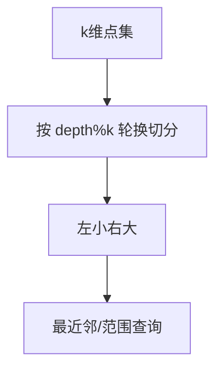

# KD 树（K-Dimensional Tree）

## 一、为什么学 KD 树？



KD 树是多维空间（k 维）的二叉搜索树，用于高效处理：

- **最近邻查询（NN）**：给定点找最近的点
- **范围查询（Range Search）**：找出矩形/超立方体内的所有点
- 低维（k 较小，通常 ≤ 20）下近似 O(log n)，高维退化为 O(n)

## 二、结构

- 每个节点代表一个 k 维点
- 按"深度 mod k"选择切分维度，在该维度中位数处分裂
- 左子树维度值更小，右子树更大

## 三、建树与最近邻查询

```java tab
class Node {
    double[] p; int dim; Node left, right;
}
Node build(double[][] pts, int l, int r, int depth) {
    if (l > r) return null;
    int d = depth % pts[0].length;
    int mid = (l + r) / 2;
    Arrays.sort(pts, l, r + 1, (a, b) -> Double.compare(a[d], b[d]));
    Node node = new Node(); node.p = pts[mid]; node.dim = d;
    node.left = build(pts, l, mid - 1, depth + 1);
    node.right = build(pts, mid + 1, r, depth + 1);
    return node;
}
double best = Double.MAX_VALUE;
void nn(Node u, double[] q) {
    if (u == null) return;
    double dist = 0;
    for (int i = 0; i < q.length; i++) dist += (u.p[i] - q[i]) * (u.p[i] - q[i]);
    best = Math.min(best, dist);
    int d = u.dim;
    Node near = q[d] < u.p[d] ? u.left : u.right;
    Node far = q[d] < u.p[d] ? u.right : u.left;
    nn(near, q);
    // 若超平面可能含更近点，则搜索另一侧
    if ((q[d] - u.p[d]) * (q[d] - u.p[d]) < best) nn(far, q);
}
```

```typescript tab
class Node { p: number[]; dim = 0; left: Node | null = null; right: Node | null = null; }
function build(pts: number[][], l: number, r: number, depth: number): Node | null {
    if (l > r) return null;
    const d = depth % pts[0].length;
    const mid = (l + r) >> 1;
    const sub = pts.slice(l, r + 1).sort((a, b) => a[d] - b[d]);
    for (let i = l; i <= r; i++) pts[i] = sub[i - l];
    const node: Node = { p: pts[mid], dim: d };
    node.left = build(pts, l, mid - 1, depth + 1);
    node.right = build(pts, mid + 1, r, depth + 1);
    return node;
}
let best = Infinity;
function nn(u: Node | null, q: number[]) {
    if (!u) return;
    let dist = 0;
    for (let i = 0; i < q.length; i++) dist += (u.p[i] - q[i]) ** 2;
    best = Math.min(best, dist);
    const d = u.dim;
    const near = q[d] < u.p[d] ? u.left : u.right;
    const far = q[d] < u.p[d] ? u.right : u.left;
    nn(near, q);
    if ((q[d] - u.p[d]) ** 2 < best) nn(far, q);
}
```

```python tab
class Node:
    def __init__(self, p, dim, left=None, right=None):
        self.p, self.dim, self.left, self.right = p, dim, left, right
def build(pts, l, r, depth):
    if l > r:
        return None
    d = depth % len(pts[0])
    mid = (l + r) // 2
    pts[l:r + 1] = sorted(pts[l:r + 1], key=lambda x: x[d])
    node = Node(pts[mid], d)
    node.left = build(pts, l, mid - 1, depth + 1)
    node.right = build(pts, mid + 1, r, depth + 1)
    return node
best = float('inf')
def nn(u, q):
    global best
    if u is None:
        return
    dist = sum((u.p[i] - q[i]) ** 2 for i in range(len(q)))
    best = min(best, dist)
    d = u.dim
    near, far = (u.left, u.right) if q[d] < u.p[d] else (u.right, u.left)
    nn(near, q)
    if (q[d] - u.p[d]) ** 2 < best:
        nn(far, q)
```

## 四、复杂度

| 项目 | 复杂度 |
|------|--------|
| 建树 | O(n log n)（中位数选枢轴） |
| 最近邻（低维） | 平均 O(log n)，最坏 O(n) |
| 范围查询 | 平均 O(√n + k)，k 为输出数 |

## 五、面试要点

1. 切分维度轮换（depth mod k），保证各维均衡
2. 剪枝关键：查询点与分割超平面的距离 < 当前最优才搜远侧
3. 高维"维度灾难"下不如暴力或 LSH / 球树
4. 应用：图像检索、推荐系统邻近、空间数据库
