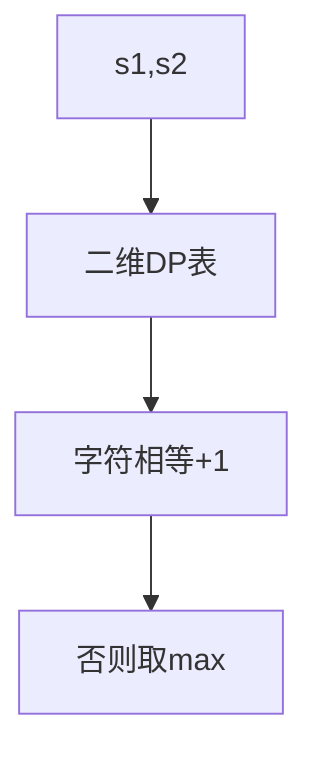

# 最长公共子序列（LCS）

最长公共子序列（Longest Common Subsequence）是动态规划的经典二维问题，广泛应用于 diff 工具、DNA 序列比对、版本控制等领域。

## 一、问题定义



给定两个字符串 s1 和 s2，找出它们的最长公共子序列的长度。子序列不要求连续。

```
s1 = "abcde"
s2 = "ace"
LCS = "ace"，长度 3
```

## 二、O(mn) 动态规划

### 状态定义

`dp[i][j]` = s1[0..i-1] 和 s2[0..j-1] 的 LCS 长度

### 转移方程

```
if s1[i-1] == s2[j-1]:
    dp[i][j] = dp[i-1][j-1] + 1
else:
    dp[i][j] = max(dp[i-1][j], dp[i][j-1])
```

### 代码实现

```java tab
int longestCommonSubsequence(String s1, String s2) {
    int m = s1.length(), n = s2.length();
    int[][] dp = new int[m + 1][n + 1];

    for (int i = 1; i <= m; i++) {
        for (int j = 1; j <= n; j++) {
            if (s1.charAt(i - 1) == s2.charAt(j - 1)) {
                dp[i][j] = dp[i - 1][j - 1] + 1;
            } else {
                dp[i][j] = Math.max(dp[i - 1][j], dp[i][j - 1]);
            }
        }
    }
    return dp[m][n];
}
```
```typescript tab
function longestCommonSubsequence(s1: string, s2: string): number {
    const m = s1.length, n = s2.length;
    const dp: number[][] = Array.from({ length: m + 1 }, () => new Array(n + 1).fill(0));

    for (let i = 1; i <= m; i++) {
        for (let j = 1; j <= n; j++) {
            if (s1[i - 1] === s2[j - 1]) {
                dp[i][j] = dp[i - 1][j - 1] + 1;
            } else {
                dp[i][j] = Math.max(dp[i - 1][j], dp[i][j - 1]);
            }
        }
    }
    return dp[m][n];
}
```
```python tab
def longest_common_subsequence(s1: str, s2: str) -> int:
    m, n = len(s1), len(s2)
    dp = [[0] * (n + 1) for _ in range(m + 1)]

    for i in range(1, m + 1):
        for j in range(1, n + 1):
            if s1[i - 1] == s2[j - 1]:
                dp[i][j] = dp[i - 1][j - 1] + 1
            else:
                dp[i][j] = max(dp[i - 1][j], dp[i][j - 1])
    return dp[m][n]
```

## 三、回溯输出 LCS

```java tab
String getLCS(String s1, String s2, int[][] dp) {
    StringBuilder sb = new StringBuilder();
    int i = s1.length(), j = s2.length();
    while (i > 0 && j > 0) {
        if (s1.charAt(i - 1) == s2.charAt(j - 1)) {
            sb.append(s1.charAt(i - 1));
            i--; j--;
        } else if (dp[i - 1][j] > dp[i][j - 1]) {
            i--;
        } else {
            j--;
        }
    }
    return sb.reverse().toString();
}
```
```typescript tab
function getLCS(s1: string, s2: string, dp: number[][]): string {
    const result: string[] = [];
    let i = s1.length, j = s2.length;
    while (i > 0 && j > 0) {
        if (s1[i - 1] === s2[j - 1]) {
            result.push(s1[i - 1]);
            i--; j--;
        } else if (dp[i - 1][j] > dp[i][j - 1]) {
            i--;
        } else {
            j--;
        }
    }
    return result.reverse().join('');
}
```
```python tab
def get_lcs(s1: str, s2: str, dp: list[list[int]]) -> str:
    result = []
    i, j = len(s1), len(s2)
    while i > 0 and j > 0:
        if s1[i - 1] == s2[j - 1]:
            result.append(s1[i - 1])
            i -= 1
            j -= 1
        elif dp[i - 1][j] > dp[i][j - 1]:
            i -= 1
        else:
            j -= 1
    return ''.join(reversed(result))
```

## 四、空间优化

只需两行（滚动数组）：

```java tab
int lcsOptimized(String s1, String s2) {
    int m = s1.length(), n = s2.length();
    int[] prev = new int[n + 1];
    int[] curr = new int[n + 1];

    for (int i = 1; i <= m; i++) {
        for (int j = 1; j <= n; j++) {
            if (s1.charAt(i - 1) == s2.charAt(j - 1)) {
                curr[j] = prev[j - 1] + 1;
            } else {
                curr[j] = Math.max(prev[j], curr[j - 1]);
            }
        }
        int[] tmp = prev; prev = curr; curr = tmp;
        Arrays.fill(curr, 0);
    }
    return prev[n];
}
```
```typescript tab
function lcsOptimized(s1: string, s2: string): number {
    const m = s1.length, n = s2.length;
    let prev = new Array(n + 1).fill(0);
    let curr = new Array(n + 1).fill(0);

    for (let i = 1; i <= m; i++) {
        for (let j = 1; j <= n; j++) {
            if (s1[i - 1] === s2[j - 1]) {
                curr[j] = prev[j - 1] + 1;
            } else {
                curr[j] = Math.max(prev[j], curr[j - 1]);
            }
        }
        [prev, curr] = [curr, prev];
        curr.fill(0);
    }
    return prev[n];
}
```
```python tab
def lcs_optimized(s1: str, s2: str) -> int:
    m, n = len(s1), len(s2)
    prev = [0] * (n + 1)
    curr = [0] * (n + 1)

    for i in range(1, m + 1):
        for j in range(1, n + 1):
            if s1[i - 1] == s2[j - 1]:
                curr[j] = prev[j - 1] + 1
            else:
                curr[j] = max(prev[j], curr[j - 1])
        prev, curr = curr, [0] * (n + 1)
    return prev[n]
```

## 五、经典变体

| 变体 | 修改 |
|------|------|
| 最长公共子串（连续） | 不匹配时 dp[i][j] = 0 |
| 最短公共超序列 | m + n - LCS |
| 编辑距离 | 三种操作取 min |
| 最长回文子序列 | s 和 reverse(s) 的 LCS |
| diff（最少删除） | m + n - 2×LCS |

### 最长公共子串

```java tab
// 连续！不匹配时归零
if (s1.charAt(i-1) == s2.charAt(j-1)) {
    dp[i][j] = dp[i-1][j-1] + 1;
    maxLen = Math.max(maxLen, dp[i][j]);
} else {
    dp[i][j] = 0;
}
```
```typescript tab
// 连续！不匹配时归零
if (s1[i-1] === s2[j-1]) {
    dp[i][j] = dp[i-1][j-1] + 1;
    maxLen = Math.max(maxLen, dp[i][j]);
} else {
    dp[i][j] = 0;
}
```
```python tab
# 连续！不匹配时归零
if s1[i-1] == s2[j-1]:
    dp[i][j] = dp[i-1][j-1] + 1
    max_len = max(max_len, dp[i][j])
else:
    dp[i][j] = 0
```

## 六、复杂度

| 方法 | 时间 | 空间 |
|------|------|------|
| 标准 DP | O(mn) | O(mn) |
| 空间优化 | O(mn) | O(min(m,n)) |
| 回溯输出 | O(mn) | O(mn)（需完整表） |

## 七、面试要点

1. **转移方程**：匹配→对角+1，不匹配→取左/上最大值
2. **子序列 vs 子串**：子串不匹配归零
3. **空间优化**：滚动数组 O(n)
4. **回溯路径**：从 dp[m][n] 反向追踪
5. **LeetCode**：1143（LCS）、718（最长重复子数组）、583（两个字符串的删除操作）、72（编辑距离）、516（最长回文子序列）

## 八、DP 表格模拟

以 text1="abcde", text2="ace" 为例：

```
        ""  a  c  e
  ""     0  0  0  0
   a     0  1  1  1
   b     0  1  1  1
   c     0  1  2  2
   d     0  1  2  2
   e     0  1  2  3   ← dp[5][3]=3, LCS="ace"

填表规则：
- text1[i]==text2[j]: dp[i][j] = dp[i-1][j-1] + 1  (对角+1)
- 否则: dp[i][j] = max(dp[i-1][j], dp[i][j-1])     (左/上取大)

例: dp[3][2] ('c'=='c') = dp[2][1]+1 = 1+1 = 2
    dp[2][2] ('b'≠'c') = max(dp[1][2], dp[2][1]) = 1
```

## 九、面试真题

| 题目 | 难度 | 核心思路 |
|------|------|----------|
| 最长公共子序列（LC 1143） | 🟡 Medium | 二维 DP 模板 |
| 最长重复子数组（LC 718） | 🟡 Medium | 子串版：不匹配归零 |
| 两个字符串的删除操作（LC 583） | 🟡 Medium | m+n-2*LCS |
| 编辑距离（LC 72） | 🔴 Hard | LCS 的三操作扩展 |
| 最长回文子序列（LC 516） | 🟡 Medium | s 与 reverse(s) 的 LCS |
| 不相交的线（LC 1035） | 🟡 Medium | LCS 换皮题 |

## 十、思考题

1. 为什么 LCS 不能用贪心（每次匹配第一个相同字符）？构造一个反例。
2. LCS 和编辑距离的 DP 结构几乎一样，区别在哪里？（提示：操作类型决定转移）
3. 如果只需要 LCS 的长度而不需要具体序列，空间能优化到多少？（提示：滚动数组 O(min(m,n))）

> 练习推荐：先手填 [LC 1143] 的 DP 表格，再推导 LC 583 和 LC 72。
