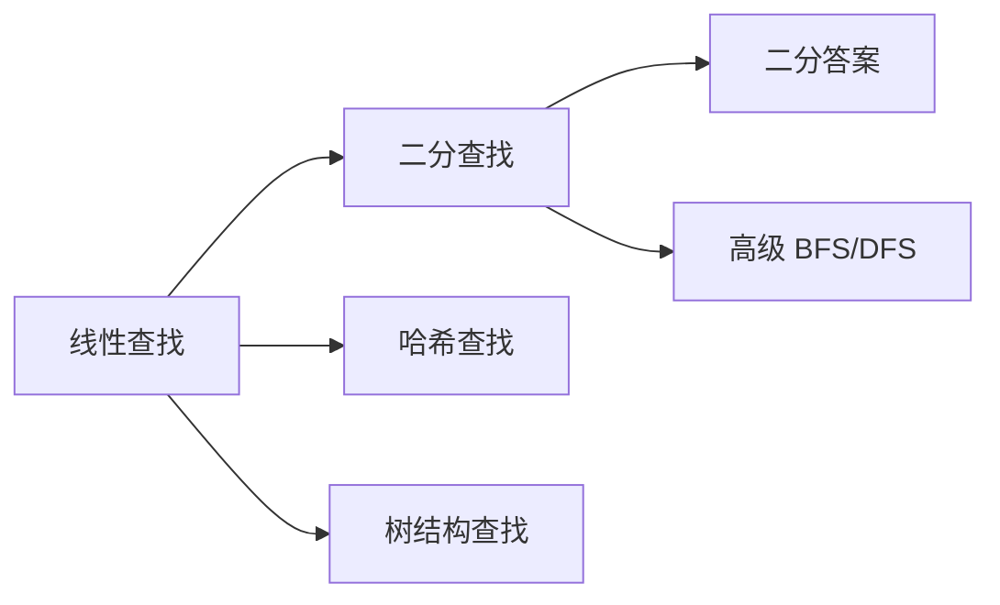

# 线性查找与搜索策略

线性查找（Linear Search）是最基础的搜索算法，也是理解所有高级搜索策略的起点。本篇从线性查找出发，梳理搜索算法的完整谱系。

## 一、线性查找



逐个遍历，直到找到目标或遍历完毕。

### 代码实现

```java tab
public static int linearSearch(int[] arr, int target) {
    for (int i = 0; i < arr.length; i++) {
        if (arr[i] == target) {
            return i;
        }
    }
    return -1;
}
```
```javascript tab
function linearSearch(arr, target) {
    for (let i = 0; i < arr.length; i++) {
        if (arr[i] === target) {
            return i;
        }
    }
    return -1;
}
```
```python tab
def linear_search(arr, target):
    for i in range(len(arr)):
        if arr[i] == target:
            return i
    return -1
```
```go tab
func LinearSearch(arr []int, target int) int {
    for i, v := range arr {
        if v == target {
            return i
        }
    }
    return -1
}
```
```cpp tab
int linearSearch(const vector<int>& arr, int target) {
    for (int i = 0; i < arr.size(); i++) {
        if (arr[i] == target) return i;
    }
    return -1;
}
```

### 哨兵优化

减少每次循环的边界检查：

```java tab
public static int searchWithSentinel(int[] arr, int target) {
    int n = arr.length;
    if (n == 0) return -1;
    int last = arr[n - 1];
    arr[n - 1] = target; // 设置哨兵
    int i = 0;
    while (arr[i] != target) i++;
    arr[n - 1] = last; // 恢复
    if (i == n - 1 && last != target) return -1;
    return i;
}
```
```python tab
def search_with_sentinel(arr, target):
    n = len(arr)
    if n == 0:
        return -1
    last = arr[-1]
    arr[-1] = target  # 哨兵
    i = 0
    while arr[i] != target:
        i += 1
    arr[-1] = last  # 恢复
    return -1 if (i == n - 1 and last != target) else i
```

### 复杂度

| 指标 | 值 |
|------|-----|
| 最好 | O(1)（第一个就命中） |
| 平均 | O(n/2) = O(n) |
| 最坏 | O(n) |
| 空间 | O(1) |

## 二、搜索算法谱系

```
搜索策略
├── 无序数据
│   └── 线性查找 O(n)
├── 有序数据
│   ├── 二分查找 O(log n)
│   └── 插值查找 O(log log n)（均匀分布时）
├── 哈希结构
│   └── 哈希查找 O(1) 平均
├── 树结构
│   ├── BST 查找 O(log n) 平均
│   └── B 树查找 O(log n)（磁盘友好）
└── 图搜索
    ├── BFS（最短路径）
    └── DFS（连通性/路径存在性）
```

## 三、二分查找（回顾）

```java tab
// 标准二分：找 target
public static int binarySearch(int[] arr, int target) {
    int lo = 0, hi = arr.length - 1;
    while (lo <= hi) {
        int mid = lo + (hi - lo) / 2;
        if (arr[mid] == target) return mid;
        else if (arr[mid] < target) lo = mid + 1;
        else hi = mid - 1;
    }
    return -1;
}
```
```typescript tab
// 标准二分：找 target
function binarySearch(arr: number[], target: number): number {
    let lo = 0, hi = arr.length - 1;
    while (lo <= hi) {
        const mid = lo + Math.floor((hi - lo) / 2);
        if (arr[mid] === target) return mid;
        else if (arr[mid] < target) lo = mid + 1;
        else hi = mid - 1;
    }
    return -1;
}
```
```python tab
# 标准二分：找 target
def binary_search(arr: list[int], target: int) -> int:
    lo, hi = 0, len(arr) - 1
    while lo <= hi:
        mid = lo + (hi - lo) // 2
        if arr[mid] == target:
            return mid
        elif arr[mid] < target:
            lo = mid + 1
        else:
            hi = mid - 1
    return -1
```

## 四、插值查找

当数据**均匀分布**时，用插值公式代替 mid = (lo+hi)/2：

```java tab
// mid 按比例估算
int mid = lo + (int)((long)(target - arr[lo]) * (hi - lo) / (arr[hi] - arr[lo]));
```
```typescript tab
// mid 按比例估算
const mid = lo + Math.floor(((target - arr[lo]) * (hi - lo)) / (arr[hi] - arr[lo]));
```
```python tab
# mid 按比例估算
mid = lo + (target - arr[lo]) * (hi - lo) // (arr[hi] - arr[lo])
```

- 均匀分布：O(log log n)
- 极端分布：退化为 O(n)
- 实际工程中很少使用（数据分布未知）

## 五、如何选择搜索策略

| 场景 | 最佳选择 | 原因 |
|------|---------|------|
| 数据无序、查一次 | 线性查找 | 无需预处理 |
| 数据有序、多次查询 | 二分查找 | O(log n)，无额外空间 |
| 频繁增删 + 查找 | 哈希表 | O(1) 平均 |
| 需要范围查询 | BST / B 树 | 有序遍历 |
| 图/网络中找路径 | BFS / DFS | 结构化搜索 |

## 六、面试要点

1. **线性查找的价值**：作为 baseline，任何优化方案都要和它比
2. **哨兵技巧**：减少分支判断，在底层循环中有微小性能提升
3. **二分的边界**：`lo <= hi` vs `lo < hi`，`mid+1` vs `mid`——必须统一
4. **LeetCode**：704（二分查找）、278（第一个错误版本）、35（搜索插入位置）

## 七、二分查找过程模拟

在有序数组 `[1, 3, 5, 7, 9, 11, 13]` 中查找 `target = 9`：

```
下标:  0  1  2  3  4  5  6
值:    1  3  5  7  9  11 13

第1轮: lo=0, hi=6, mid=3 → a[3]=7 < 9 → lo=4
       [1, 3, 5, |7, 9, 11, 13]  搜索区间收缩到右半
第2轮: lo=4, hi=6, mid=5 → a[5]=11 > 9 → hi=4
第3轮: lo=4, hi=4, mid=4 → a[4]=9 == 9 → 找到，返回 4 ✓

共比较 3 次；线性查找需要 5 次（下标0扫到4）
```

**三种边界变体对比**：

| 需求 | 循环条件 | 收缩方式 | 返回值 |
|------|---------|---------|--------|
| 找精确值 | `lo <= hi` | `mid±1` | mid 或 -1 |
| 找左边界（第一个 ≥ target） | `lo < hi` | `hi = mid` | lo |
| 找右边界（最后一个 ≤ target） | `lo < hi` | `lo = mid`（mid 上取整） | lo |

## 八、思考题

1. 为什么二分查找要求数组有序？如果无序，能否先排序再二分？考虑总代价后这样做有意义吗？（提示：排序 O(n log n) vs 多次查找的均摊）
2. 插值查找在什么数据分布下优于二分？什么情况下反而更差？（提示：均匀分布 vs 指数分布）
3. 如果数组是"旋转有序"的（如 `[4,5,6,7,0,1,2]`），二分查找应如何改造？（提示：判断哪一半有序）

> 练习推荐：在练习题模块完成 [二分搜索](/problems/binary-search) 后，再挑战搜索旋转数组类题目。
