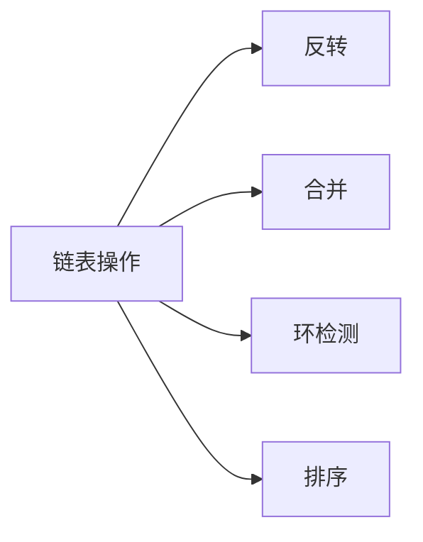

# 链表经典问题

链表是面试中出现频率最高的数据结构之一。反转、合并、环检测、排序等经典操作考察对指针操作的精准掌控。

## 一、链表基础



```java tab
class ListNode {
    int val;
    ListNode next;
    ListNode(int val) { this.val = val; }
}
```

```typescript tab
class ListNode {
    val: number;
    next: ListNode | null;
    constructor(val: number) { this.val = val; this.next = null; }
}
```

```python tab
class ListNode:
    def __init__(self, val=0):
        self.val = val
        self.next = None
```

### 虚拟头节点（Dummy Node）

```java tab
// 避免对头节点的特殊处理
ListNode dummy = new ListNode(0);
dummy.next = head;
// 操作完成后返回 dummy.next
```

```typescript tab
// 避免对头节点的特殊处理
const dummy = new ListNode(0);
dummy.next = head;
// 操作完成后返回 dummy.next
```

```python tab
# 避免对头节点的特殊处理
dummy = ListNode(0)
dummy.next = head
# 操作完成后返回 dummy.next
```

## 二、反转链表（LeetCode 206）

### 迭代

```java tab
ListNode reverseList(ListNode head) {
    ListNode prev = null, cur = head;
    while (cur != null) {
        ListNode next = cur.next;
        cur.next = prev;
        prev = cur;
        cur = next;
    }
    return prev;
}
```

```typescript tab
function reverseList(head: ListNode | null): ListNode | null {
    let prev: ListNode | null = null, cur = head;
    while (cur !== null) {
        const next = cur.next;
        cur.next = prev;
        prev = cur;
        cur = next;
    }
    return prev;
}
```

```python tab
def reverse_list(head: ListNode) -> ListNode:
    prev, cur = None, head
    while cur:
        nxt = cur.next
        cur.next = prev
        prev = cur
        cur = nxt
    return prev
```

### 递归

```java tab
ListNode reverseList(ListNode head) {
    if (head == null || head.next == null) return head;
    ListNode newHead = reverseList(head.next);
    head.next.next = head;
    head.next = null;
    return newHead;
}
```

```typescript tab
function reverseList(head: ListNode | null): ListNode | null {
    if (head === null || head.next === null) return head;
    const newHead = reverseList(head.next);
    head.next.next = head;
    head.next = null;
    return newHead;
}
```

```python tab
def reverse_list(head: ListNode) -> ListNode:
    if not head or not head.next:
        return head
    new_head = reverse_list(head.next)
    head.next.next = head
    head.next = None
    return new_head
```

## 三、环检测（LeetCode 141/142）

### 快慢指针判环

```java tab
boolean hasCycle(ListNode head) {
    ListNode slow = head, fast = head;
    while (fast != null && fast.next != null) {
        slow = slow.next;
        fast = fast.next.next;
        if (slow == fast) return true;
    }
    return false;
}
```

```typescript tab
function hasCycle(head: ListNode | null): boolean {
    let slow = head, fast = head;
    while (fast !== null && fast.next !== null) {
        slow = slow.next;
        fast = fast.next.next;
        if (slow === fast) return true;
    }
    return false;
}
```

```python tab
def has_cycle(head: ListNode) -> bool:
    slow = fast = head
    while fast and fast.next:
        slow = slow.next
        fast = fast.next.next
        if slow is fast:
            return True
    return False
```

### 找环入口

```java tab
ListNode detectCycle(ListNode head) {
    ListNode slow = head, fast = head;
    while (fast != null && fast.next != null) {
        slow = slow.next;
        fast = fast.next.next;
        if (slow == fast) {
            ListNode ptr = head;
            while (ptr != slow) {
                ptr = ptr.next;
                slow = slow.next;
            }
            return ptr;
        }
    }
    return null;
}
```

```typescript tab
function detectCycle(head: ListNode | null): ListNode | null {
    let slow = head, fast = head;
    while (fast !== null && fast.next !== null) {
        slow = slow.next;
        fast = fast.next.next;
        if (slow === fast) {
            let ptr = head;
            while (ptr !== slow) {
                ptr = ptr.next;
                slow = slow.next;
            }
            return ptr;
        }
    }
    return null;
}
```

```python tab
def detect_cycle(head: ListNode) -> ListNode:
    slow = fast = head
    while fast and fast.next:
        slow = slow.next
        fast = fast.next.next
        if slow is fast:
            ptr = head
            while ptr is not slow:
                ptr = ptr.next
                slow = slow.next
            return ptr
    return None
```

## 四、合并两个有序链表（LeetCode 21）

```java tab
ListNode mergeTwoLists(ListNode l1, ListNode l2) {
    ListNode dummy = new ListNode(0), cur = dummy;
    while (l1 != null && l2 != null) {
        if (l1.val <= l2.val) { cur.next = l1; l1 = l1.next; }
        else { cur.next = l2; l2 = l2.next; }
        cur = cur.next;
    }
    cur.next = (l1 != null) ? l1 : l2;
    return dummy.next;
}
```

```typescript tab
function mergeTwoLists(l1: ListNode | null, l2: ListNode | null): ListNode | null {
    const dummy = new ListNode(0);
    let cur = dummy;
    while (l1 !== null && l2 !== null) {
        if (l1.val <= l2.val) { cur.next = l1; l1 = l1.next; }
        else { cur.next = l2; l2 = l2.next; }
        cur = cur.next;
    }
    cur.next = l1 !== null ? l1 : l2;
    return dummy.next;
}
```

```python tab
def merge_two_lists(l1: ListNode, l2: ListNode) -> ListNode:
    dummy = ListNode(0)
    cur = dummy
    while l1 and l2:
        if l1.val <= l2.val:
            cur.next = l1
            l1 = l1.next
        else:
            cur.next = l2
            l2 = l2.next
        cur = cur.next
    cur.next = l1 if l1 else l2
    return dummy.next
```

## 五、删除倒数第 N 个节点（LeetCode 19）

```java tab
ListNode removeNthFromEnd(ListNode head, int n) {
    ListNode dummy = new ListNode(0);
    dummy.next = head;
    ListNode fast = dummy, slow = dummy;
    for (int i = 0; i <= n; i++) fast = fast.next;
    while (fast != null) { fast = fast.next; slow = slow.next; }
    slow.next = slow.next.next;
    return dummy.next;
}
```

```typescript tab
function removeNthFromEnd(head: ListNode | null, n: number): ListNode | null {
    const dummy = new ListNode(0);
    dummy.next = head;
    let fast: ListNode | null = dummy, slow: ListNode = dummy;
    for (let i = 0; i <= n; i++) fast = fast!.next;
    while (fast !== null) { fast = fast.next; slow = slow.next!; }
    slow.next = slow.next!.next;
    return dummy.next;
}
```

```python tab
def remove_nth_from_end(head: ListNode, n: int) -> ListNode:
    dummy = ListNode(0)
    dummy.next = head
    fast = slow = dummy
    for _ in range(n + 1):
        fast = fast.next
    while fast:
        fast = fast.next
        slow = slow.next
    slow.next = slow.next.next
    return dummy.next
```

## 六、链表排序（LeetCode 148）

归并排序：快慢指针找中点 → 递归拆分 → 合并。

```java tab
ListNode sortList(ListNode head) {
    if (head == null || head.next == null) return head;
    ListNode mid = getMid(head);
    ListNode right = mid.next;
    mid.next = null;
    return mergeTwoLists(sortList(head), sortList(right));
}

ListNode getMid(ListNode head) {
    ListNode slow = head, fast = head.next;
    while (fast != null && fast.next != null) {
        slow = slow.next;
        fast = fast.next.next;
    }
    return slow;
}
```

```typescript tab
function sortList(head: ListNode | null): ListNode | null {
    if (head === null || head.next === null) return head;
    const mid = getMid(head);
    const right = mid.next;
    mid.next = null;
    return mergeTwoLists(sortList(head), sortList(right));
}

function getMid(head: ListNode): ListNode {
    let slow = head, fast: ListNode | null = head.next;
    while (fast !== null && fast.next !== null) {
        slow = slow.next!;
        fast = fast.next.next;
    }
    return slow;
}
```

```python tab
def sort_list(head: ListNode) -> ListNode:
    if not head or not head.next:
        return head
    mid = get_mid(head)
    right = mid.next
    mid.next = None
    return merge_two_lists(sort_list(head), sort_list(right))

def get_mid(head: ListNode) -> ListNode:
    slow, fast = head, head.next
    while fast and fast.next:
        slow = slow.next
        fast = fast.next.next
    return slow
```

## 七、其他高频题

| 题目 | 技巧 |
|------|------|
| 回文链表（234） | 找中点 + 反转后半 + 比较 |
| 相交链表（160） | 双指针等长技巧 |
| K 个一组反转（25） | 分组反转 + 连接 |
| 复制带随机指针（138） | 交织法 / HashMap |
| LRU 缓存（146） | 双向链表 + HashMap |

## 八、面试要点

1. **Dummy 节点**：统一处理头节点
2. **快慢指针**：找中点、判环、找倒数第 k 个
3. **反转三指针**：prev, cur, next
4. **递归思维**：链表天然递归结构
5. **LeetCode**：206、21、141/142、19、25、148、234、160
