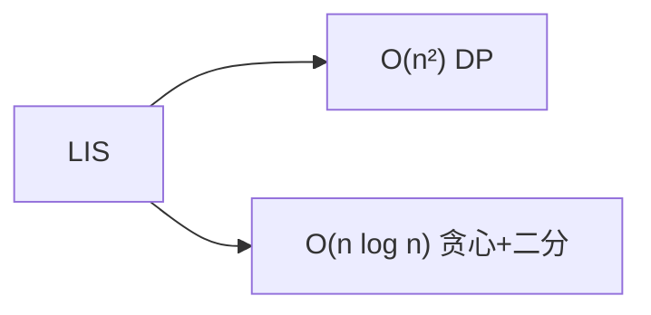

# 最长递增子序列（LIS）

最长递增子序列（Longest Increasing Subsequence）是动态规划的经典问题，从 O(n²) DP 到 O(n log n) 贪心+二分，体现了算法优化的完整思路。

## 一、问题定义



给定数组 nums，找出最长的严格递增子序列的长度（子序列不要求连续）。

```
输入: [10, 9, 2, 5, 3, 7, 101, 18]
输出: 4 （[2, 3, 7, 101]）
```

## 二、O(n²) 动态规划

### 状态定义

`dp[i]` = 以 nums[i] 结尾的 LIS 长度

### 转移方程

```
dp[i] = max(dp[j] + 1)，对所有 j < i 且 nums[j] < nums[i]
```

### 实现

```java tab
int lengthOfLIS(int[] nums) {
    int n = nums.length;
    int[] dp = new int[n];
    Arrays.fill(dp, 1);
    int maxLen = 1;
    for (int i = 1; i < n; i++) {
        for (int j = 0; j < i; j++) {
            if (nums[j] < nums[i]) {
                dp[i] = Math.max(dp[i], dp[j] + 1);
            }
        }
        maxLen = Math.max(maxLen, dp[i]);
    }
    return maxLen;
}
```
```typescript tab
function lengthOfLIS(nums: number[]): number {
    const n = nums.length;
    const dp = new Array(n).fill(1);
    let maxLen = 1;
    for (let i = 1; i < n; i++) {
        for (let j = 0; j < i; j++) {
            if (nums[j] < nums[i]) {
                dp[i] = Math.max(dp[i], dp[j] + 1);
            }
        }
        maxLen = Math.max(maxLen, dp[i]);
    }
    return maxLen;
}
```
```python tab
def length_of_lis(nums: list[int]) -> int:
    n = len(nums)
    dp = [1] * n
    max_len = 1
    for i in range(1, n):
        for j in range(i):
            if nums[j] < nums[i]:
                dp[i] = max(dp[i], dp[j] + 1)
        max_len = max(max_len, dp[i])
    return max_len
```

## 三、O(n log n) 贪心 + 二分

### 核心思想

维护一个数组 `tails`，`tails[i]` = 长度为 i+1 的递增子序列的最小末尾。

- tails 始终有序（可以证明）
- 新元素用二分找到插入位置

### 实现

```java tab
int lengthOfLIS(int[] nums) {
    int[] tails = new int[nums.length];
    int size = 0;
    for (int num : nums) {
        // 二分找第一个 >= num 的位置
        int lo = 0, hi = size;
        while (lo < hi) {
            int mid = (lo + hi) / 2;
            if (tails[mid] < num) lo = mid + 1;
            else hi = mid;
        }
        tails[lo] = num;
        if (lo == size) size++; // 扩展了 LIS 长度
    }
    return size;
}
```
```typescript tab
function lengthOfLIS(nums: number[]): number {
    const tails: number[] = new Array(nums.length);
    let size = 0;
    for (const num of nums) {
        // 二分找第一个 >= num 的位置
        let lo = 0, hi = size;
        while (lo < hi) {
            const mid = (lo + hi) >> 1;
            if (tails[mid] < num) lo = mid + 1;
            else hi = mid;
        }
        tails[lo] = num;
        if (lo === size) size++; // 扩展了 LIS 长度
    }
    return size;
}
```
```python tab
def length_of_lis(nums: list[int]) -> int:
    tails = []
    for num in nums:
        # 二分找第一个 >= num 的位置
        lo, hi = 0, len(tails)
        while lo < hi:
            mid = (lo + hi) // 2
            if tails[mid] < num:
                lo = mid + 1
            else:
                hi = mid
        if lo == len(tails):
            tails.append(num)  # 扩展了 LIS 长度
        else:
            tails[lo] = num
    return len(tails)
```

### 图解

```
nums: [10, 9, 2, 5, 3, 7, 101, 18]

10 → tails: [10]
9  → tails: [9]        (替换 10)
2  → tails: [2]        (替换 9)
5  → tails: [2, 5]     (扩展)
3  → tails: [2, 3]     (替换 5)
7  → tails: [2, 3, 7]  (扩展)
101→ tails: [2, 3, 7, 101] (扩展)
18 → tails: [2, 3, 7, 18]  (替换 101)

答案: size = 4
```

## 四、输出具体序列

O(n²) 方法记录前驱即可回溯。O(n log n) 需要额外记录每个元素在 tails 中的位置。

```java tab
List<Integer> getLIS(int[] nums) {
    int n = nums.length;
    int[] tails = new int[n]; // 存索引
    int[] prev = new int[n];
    int size = 0;
    Arrays.fill(prev, -1);

    for (int i = 0; i < n; i++) {
        int lo = 0, hi = size;
        while (lo < hi) {
            int mid = (lo + hi) / 2;
            if (nums[tails[mid]] < nums[i]) lo = mid + 1;
            else hi = mid;
        }
        if (lo > 0) prev[i] = tails[lo - 1];
        tails[lo] = i;
        if (lo == size) size++;
    }

    // 回溯
    LinkedList<Integer> result = new LinkedList<>();
    int cur = tails[size - 1];
    while (cur != -1) {
        result.addFirst(nums[cur]);
        cur = prev[cur];
    }
    return result;
}
```
```typescript tab
function getLIS(nums: number[]): number[] {
    const n = nums.length;
    const tails: number[] = new Array(n); // 存索引
    const prev: number[] = new Array(n).fill(-1);
    let size = 0;

    for (let i = 0; i < n; i++) {
        let lo = 0, hi = size;
        while (lo < hi) {
            const mid = (lo + hi) >> 1;
            if (nums[tails[mid]] < nums[i]) lo = mid + 1;
            else hi = mid;
        }
        if (lo > 0) prev[i] = tails[lo - 1];
        tails[lo] = i;
        if (lo === size) size++;
    }

    // 回溯
    const result: number[] = [];
    let cur = tails[size - 1];
    while (cur !== -1) {
        result.unshift(nums[cur]);
        cur = prev[cur];
    }
    return result;
}
```
```python tab
def get_lis(nums: list[int]) -> list[int]:
    n = len(nums)
    tails = [0] * n  # 存索引
    prev = [-1] * n
    size = 0

    for i in range(n):
        lo, hi = 0, size
        while lo < hi:
            mid = (lo + hi) // 2
            if nums[tails[mid]] < nums[i]:
                lo = mid + 1
            else:
                hi = mid
        if lo > 0:
            prev[i] = tails[lo - 1]
        tails[lo] = i
        if lo == size:
            size += 1

    # 回溯
    result = []
    cur = tails[size - 1]
    while cur != -1:
        result.append(nums[cur])
        cur = prev[cur]
    result.reverse()
    return result
```

## 五、变体

| 变体 | 修改 |
|------|------|
| 最长非递减子序列 | 二分条件改为 `<=`（upper_bound） |
| 最长递减子序列 | 反转数组或改比较方向 |
| 二维 LIS（俄罗斯套娃） | 第一维升序、第二维降序排序后求 LIS |
| 最少删除使有序 | n - LIS |

### 俄罗斯套娃信封（LeetCode 354）

```java tab
// 宽度升序，宽度相同时高度降序 → 对高度求 LIS
Arrays.sort(envelopes, (a, b) -> a[0] == b[0] ? b[1] - a[1] : a[0] - b[0]);
// 然后对高度列求 LIS
```
```typescript tab
// 宽度升序，宽度相同时高度降序 → 对高度求 LIS
envelopes.sort((a, b) => a[0] === b[0] ? b[1] - a[1] : a[0] - b[0]);
// 然后对高度列求 LIS
```
```python tab
# 宽度升序，宽度相同时高度降序 → 对高度求 LIS
envelopes.sort(key=lambda x: (x[0], -x[1]))
# 然后对高度列求 LIS
```

## 六、复杂度

| 方法 | 时间 | 空间 |
|------|------|------|
| DP | O(n²) | O(n) |
| 贪心+二分 | O(n log n) | O(n) |

## 七、面试要点

1. **O(n log n) 必须掌握**：tails 数组 + 二分
2. **tails 不是 LIS 本身**：只是维护最小末尾
3. **严格 vs 非严格**：二分时 `<` vs `<=`
4. **LeetCode**：300（LIS）、354（俄罗斯套娃）、673（最长递增子序列个数）、1964（最长障碍赛跑路线）
