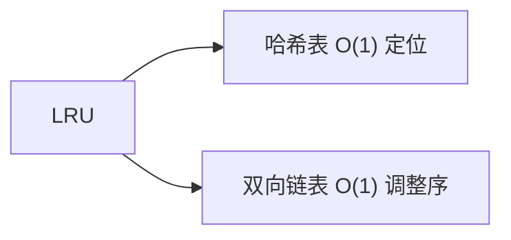

# LRU 缓存：哈希表 + 双向链表的经典设计


## 一、什么是 LRU？



**LRU（Least Recently Used）** 是一种缓存淘汰策略：  
当缓存容量满时，淘汰**最久未被访问**的条目。

要求：
- `get(key)`：O(1) 时间返回 value（不存在返回 -1），同时标记该条目为"最近使用"。
- `put(key, value)`：O(1) 时间插入或更新条目；若插入时容量满，先淘汰最久未使用的条目。

这是面试中最常考的设计题之一。

## 二、数据结构选择

为什么不能用单链表？
- 删除中间节点需要 O(n) 找到前驱。
- 把访问到的节点移到链表头也需要 O(n)。

**最优组合**：哈希表 + 双向链表。

| 数据结构 | 作用 |
|----------|------|
| 哈希表 `Map<K, Node>` | O(1) 查找 key 对应的链表节点 |
| 双向链表 | O(1) 插入 / 删除任意节点（已知指针） |

**链表节点顺序**：从**头到尾**按访问时间递减。  
- 链表头 = 最近使用  
- 链表尾 = 最久未使用（待淘汰）

## 三、代码实现

### 3.1 节点定义

```java tab
class Node {
    int key, value;
    Node prev, next;
    Node(int k, int v) { key = k; value = v; }
}
```

```typescript tab
class Node {
    key: number;
    value: number;
    prev: Node | null = null;
    next: Node | null = null;
    constructor(key: number, value: number) {
        this.key = key;
        this.value = value;
    }
}
```

```python tab
class Node:
    def __init__(self, key: int, value: int):
        self.key = key
        self.value = value
        self.prev = None
        self.next = None
```

### 3.2 完整实现

```java tab
public class LRUCache {
    private final int capacity;
    private final Map<Integer, Node> map = new HashMap<>();
    private final Node head = new Node(0, 0);   // 哨兵：头
    private final Node tail = new Node(0, 0);   // 哨兵：尾

    public LRUCache(int capacity) {
        this.capacity = capacity;
        head.next = tail;
        tail.prev = head;
    }

    public int get(int key) {
        Node node = map.get(key);
        if (node == null) return -1;
        moveToHead(node);
        return node.value;
    }

    public void put(int key, int value) {
        Node node = map.get(key);
        if (node != null) {
            node.value = value;
            moveToHead(node);
            return;
        }
        Node fresh = new Node(key, value);
        map.put(key, fresh);
        addToHead(fresh);
        if (map.size() > capacity) {
            Node removed = removeTail();
            map.remove(removed.key);
        }
    }

    // ===== 双向链表操作 =====
    private void addToHead(Node node) {
        node.prev = head;
        node.next = head.next;
        head.next.prev = node;
        head.next = node;
    }

    private void removeNode(Node node) {
        node.prev.next = node.next;
        node.next.prev = node.prev;
    }

    private void moveToHead(Node node) {
        removeNode(node);
        addToHead(node);
    }

    private Node removeTail() {
        Node node = tail.prev;
        removeNode(node);
        return node;
    }
}
```

```typescript tab
class LRUCache {
    private capacity: number;
    private map = new Map<number, Node>();
    private head = new Node(0, 0);
    private tail = new Node(0, 0);

    constructor(capacity: number) {
        this.capacity = capacity;
        this.head.next = this.tail;
        this.tail.prev = this.head;
    }

    get(key: number): number {
        const node = this.map.get(key);
        if (!node) return -1;
        this.moveToHead(node);
        return node.value;
    }

    put(key: number, value: number): void {
        const node = this.map.get(key);
        if (node) {
            node.value = value;
            this.moveToHead(node);
            return;
        }
        const fresh = new Node(key, value);
        this.map.set(key, fresh);
        this.addToHead(fresh);
        if (this.map.size > this.capacity) {
            const removed = this.removeTail();
            this.map.delete(removed.key);
        }
    }

    private addToHead(node: Node): void {
        node.prev = this.head;
        node.next = this.head.next;
        this.head.next!.prev = node;
        this.head.next = node;
    }

    private removeNode(node: Node): void {
        node.prev!.next = node.next;
        node.next!.prev = node.prev;
    }

    private moveToHead(node: Node): void {
        this.removeNode(node);
        this.addToHead(node);
    }

    private removeTail(): Node {
        const node = this.tail.prev!;
        this.removeNode(node);
        return node;
    }
}
```

```python tab
class LRUCache:
    def __init__(self, capacity: int):
        self.capacity = capacity
        self.cache = {}
        self.head = Node(0, 0)
        self.tail = Node(0, 0)
        self.head.next = self.tail
        self.tail.prev = self.head

    def get(self, key: int) -> int:
        if key not in self.cache:
            return -1
        node = self.cache[key]
        self._move_to_head(node)
        return node.value

    def put(self, key: int, value: int) -> None:
        if key in self.cache:
            node = self.cache[key]
            node.value = value
            self._move_to_head(node)
            return
        node = Node(key, value)
        self.cache[key] = node
        self._add_to_head(node)
        if len(self.cache) > self.capacity:
            removed = self._remove_tail()
            del self.cache[removed.key]

    def _add_to_head(self, node: Node) -> None:
        node.prev = self.head
        node.next = self.head.next
        self.head.next.prev = node
        self.head.next = node

    def _remove_node(self, node: Node) -> None:
        node.prev.next = node.next
        node.next.prev = node.prev

    def _move_to_head(self, node: Node) -> None:
        self._remove_node(node)
        self._add_to_head(node)

    def _remove_tail(self) -> Node:
        node = self.tail.prev
        self._remove_node(node)
        return node
```

## 四、复杂度分析

- `get`：哈希表 O(1) + 移动节点 O(1) = **O(1)**
- `put`：同上 = **O(1)**
- **空间**：O(capacity)

## 五、进阶：LFU（最不经常使用）

LFU 淘汰**访问频率最低**的条目，比 LRU 更复杂。

经典实现需要：
- 节点带 `freq` 字段。
- 用 `Map<Integer, DoublyLinkedList>` 维护 `freq → 节点列表`。
- 维护当前最小频率。

模板：

```java tab
class LFUCache {
    // ===== 双向链表 =====
    static class DLinkedList {
        Node head = new Node(0, 0), tail = new Node(0, 0);  // 哨兵
        int size = 0;
        DLinkedList() { head.next = tail; tail.prev = head; }

        void addFirst(Node n) {
            n.prev = head;
            n.next = head.next;
            head.next.prev = n;
            head.next = n;
            size++;
        }

        void removeNode(Node n) {
            n.prev.next = n.next;
            n.next.prev = n.prev;
            size--;
        }

        Node removeLast() {
            if (size == 0) return null;
            Node n = tail.prev;
            removeNode(n);
            return n;
        }

        boolean isEmpty() { return size == 0; }
    }

    static class Node {
        int key, value, freq;
        Node prev, next;
        Node(int k, int v) { key = k; value = v; freq = 1; }
    }

    Map<Integer, Node> nodeMap = new HashMap<>();                    // key → 节点
    Map<Integer, DLinkedList> freqMap = new HashMap<>();            // freq → 链表
    int minFreq = 0, capacity;

    public LFUCache(int capacity) { this.capacity = capacity; }

    public int get(int key) {
        if (capacity == 0) return -1;
        Node node = nodeMap.get(key);
        if (node == null) return -1;
        increaseFreq(node);
        return node.value;
    }

    public void put(int key, int value) {
        if (capacity == 0) return;
        Node node = nodeMap.get(key);
        if (node != null) {
            node.value = value;
            increaseFreq(node);
            return;
        }
        if (nodeMap.size() == capacity) {
            // 淘汰 minFreq 链表的尾节点（最久未访问）
            DLinkedList list = freqMap.get(minFreq);
            Node removed = list.removeLast();
            nodeMap.remove(removed.key);
        }
        Node fresh = new Node(key, value);
        nodeMap.put(key, fresh);
        freqMap.computeIfAbsent(1, k -> new DLinkedList()).addFirst(fresh);
        minFreq = 1;
    }

    private void increaseFreq(Node node) {
        int freq = node.freq;
        DLinkedList list = freqMap.get(freq);
        list.removeNode(node);
        if (freq == minFreq && list.isEmpty()) minFreq++;
        node.freq++;
        freqMap.computeIfAbsent(node.freq, k -> new DLinkedList()).addFirst(node);
    }
}
```

```typescript tab
class LFUCache {
    private capacity: number;
    private minFreq = 0;
    private nodeMap = new Map<number, LFUNode>();
    private freqMap = new Map<number, Set<LFUNode>>();

    constructor(capacity: number) { this.capacity = capacity; }

    get(key: number): number {
        if (this.capacity === 0) return -1;
        const node = this.nodeMap.get(key);
        if (!node) return -1;
        this.increaseFreq(node);
        return node.value;
    }

    put(key: number, value: number): void {
        if (this.capacity === 0) return;
        const node = this.nodeMap.get(key);
        if (node) {
            node.value = value;
            this.increaseFreq(node);
            return;
        }
        if (this.nodeMap.size >= this.capacity) {
            const set = this.freqMap.get(this.minFreq)!;
            const evict = set.values().next().value;
            set.delete(evict);
            this.nodeMap.delete(evict.key);
        }
        const fresh = new LFUNode(key, value);
        this.nodeMap.set(key, fresh);
        if (!this.freqMap.has(1)) this.freqMap.set(1, new Set());
        this.freqMap.get(1)!.add(fresh);
        this.minFreq = 1;
    }

    private increaseFreq(node: LFUNode): void {
        const oldFreq = node.freq;
        const set = this.freqMap.get(oldFreq)!;
        set.delete(node);
        if (set.size === 0 && oldFreq === this.minFreq) this.minFreq++;
        node.freq++;
        if (!this.freqMap.has(node.freq)) this.freqMap.set(node.freq, new Set());
        this.freqMap.get(node.freq)!.add(node);
    }
}
```

```python tab
class LFUCache:
    def __init__(self, capacity: int):
        self.capacity = capacity
        self.min_freq = 0
        self.node_map = {}  # key -> (value, freq)
        self.freq_map = defaultdict(OrderedDict)  # freq -> {key: value}

    def get(self, key: int) -> int:
        if self.capacity == 0 or key not in self.node_map:
            return -1
        value, freq = self.node_map[key]
        self._increase_freq(key, value, freq)
        return value

    def put(self, key: int, value: int) -> None:
        if self.capacity == 0:
            return
        if key in self.node_map:
            _, freq = self.node_map[key]
            self._increase_freq(key, value, freq)
            return
        if len(self.node_map) >= self.capacity:
            evict_key, _ = self.freq_map[self.min_freq].popitem(last=False)
            del self.node_map[evict_key]
        self.node_map[key] = (value, 1)
        self.freq_map[1][key] = value
        self.min_freq = 1

    def _increase_freq(self, key, value, freq):
        del self.freq_map[freq][key]
        if not self.freq_map[freq] and freq == self.min_freq:
            self.min_freq += 1
        self.node_map[key] = (value, freq + 1)
        self.freq_map[freq + 1][key] = value
```

> **关键点**：`minFreq` 维护当前最低频率。每次 get / put 增加频率后，若旧频率链表空了且等于 minFreq，要把 minFreq +1。

## 六、为什么必须用双向链表？

| 数据结构 | 删除已知节点 | 移动到头 |
|----------|-------------|----------|
| 单链表 | O(n)（找前驱） | O(n) |
| **双向链表** | **O(1)** | **O(1)** |

> 双向链表的核心优势：已知 `prev` 和 `next` 指针，可以**不依赖前驱**完成删除。

## 七、哨兵节点（dummy head/tail）的好处

```java tab
// 有哨兵时：不用判断 head/tail 是不是 null
private void addToHead(Node node) {
    node.prev = head;
    node.next = head.next;
    head.next.prev = node;
    head.next = node;
}
```

```typescript tab
// 有哨兵时：不用判断 head/tail 是不是 null
private addToHead(node: Node): void {
    node.prev = this.head;
    node.next = this.head.next;
    this.head.next!.prev = node;
    this.head.next = node;
}
```

```python tab
# 有哨兵时：不用判断 head/tail 是不是 null
def _add_to_head(self, node: Node) -> None:
    node.prev = self.head
    node.next = self.head.next
    self.head.next.prev = node
    self.head.next = node
```

好处：
- 边界条件减少（链表为空 / 只有一个节点都不用特判）。
- 代码更简洁、更安全。

## 八、Java 内置：LinkedHashMap

Java 提供了一个内置实现：`LinkedHashMap`。

```java tab
public class LRUCache extends LinkedHashMap<Integer, Integer> {
    private final int capacity;

    public LRUCache(int capacity) {
        super(capacity, 0.75f, true);     // accessOrder = true
        this.capacity = capacity;
    }

    @Override
    protected boolean removeEldestEntry(Map.Entry<Integer, Integer> eldest) {
        return size() > capacity;
    }

    public int get(int key) {
        return super.getOrDefault(key, -1);
    }

    public void put(int key, int value) {
        super.put(key, value);
    }
}
```

```typescript tab
// TypeScript 无内置 LinkedHashMap，用 Map 保持插入顺序
class LRUCache {
    private capacity: number;
    private cache = new Map<number, number>();

    constructor(capacity: number) {
        this.capacity = capacity;
    }

    get(key: number): number {
        if (!this.cache.has(key)) return -1;
        const value = this.cache.get(key)!;
        this.cache.delete(key);
        this.cache.set(key, value); // 重新插入表示最近使用
        return value;
    }

    put(key: number, value: number): void {
        this.cache.delete(key);
        this.cache.set(key, value);
        if (this.cache.size > this.capacity) {
            const eldest = this.cache.keys().next().value;
            this.cache.delete(eldest);
        }
    }
}
```

```python tab
from collections import OrderedDict

class LRUCache(OrderedDict):
    def __init__(self, capacity: int):
        super().__init__()
        self.capacity = capacity

    def get(self, key: int) -> int:
        if key not in self:
            return -1
        self.move_to_end(key)
        return self[key]

    def put(self, key: int, value: int) -> None:
        if key in self:
            self.move_to_end(key)
        self[key] = value
        if len(self) > self.capacity:
            self.popitem(last=False)
```

**关键参数**：`accessOrder = true` → 按访问顺序排序。  
`removeEldestEntry` → 容量满时自动删除最旧的条目。

## 九、其他变种

| 变种 | 行为 |
|------|------|
| FIFO | 淘汰最早插入的条目 |
| LRU | 淘汰最久未访问 |
| LFU | 淘汰访问频率最低 |
| ARC | 自适应，融合 LRU + LFU |
| 2Q | 两个队列，新旧缓存区分 |

## 十、面试常见追问

### Q1: 为什么不用 LinkedList？

> `java.util.LinkedList` 查找 O(n)，定位后再删除也是 O(n)。需要双向链表是为了**已知指针就能 O(1) 删除**。

### Q2: 多线程下怎么办？

> 用 `ConcurrentHashMap` + 加锁。读写并发场景下用读写锁 `ReentrantReadWriteLock`。

### Q3: 节点 value 很大怎么办？

> 节点只存引用。value 是大对象时，多份缓存仍能共享同一对象。

### Q4: 内存紧张怎么办？

> 软引用（`SoftReference`）+ LRU：缓存被淘汰时，对象在内存压力下可被 GC 回收。

## 十一、刷题清单

| 题目 | 难度 | 关键点 |
|------|------|--------|
| LRU Cache | 🟡 | 哈希 + 双向链表 |
| LFU Cache | 🔴 | 多级频率链表 |
| Design In-Memory File System | 🟠 | TreeMap + 路径处理 |
| Design Twitter | 🟠 | 时间优先队列 + 关注列表 |
| All O`one Data Structure | 🔴 | 双向链表 + 计数 |

## 十二、心法

> **设计题 = 数据结构选择 + 边界处理 + 代码模板**。  
> 掌握 LRU 模板，再做 LFU、其他变种就是改字段、加链表。
