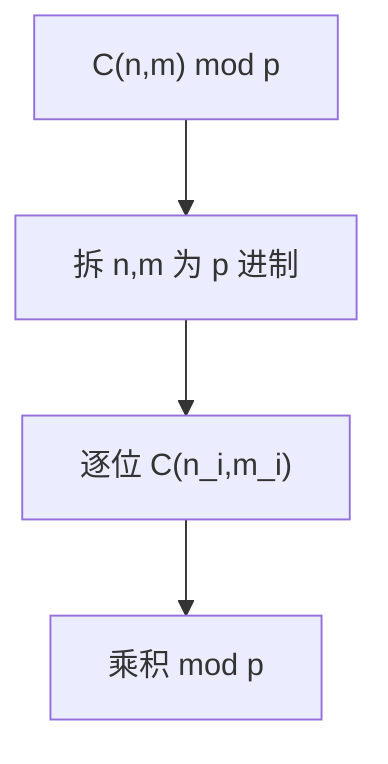

# 卢卡斯定理（Lucas Theorem）

## 一、为什么学卢卡斯定理？



求大组合数模素数：`C(n, m) mod p`（p 为素数，n、m 可达 10^18）。直接阶乘会溢出且 n 太大无法预处理。

## 二、定理

若 `n = n_k p^k + … + n_0`，`m = m_k p^k + … + m_0`（p 进制），
则 `C(n, m) ≡ Π C(n_i, m_i) (mod p)`。

递归形式：`C(n, m) ≡ C(⌊n/p⌋, ⌊m/p⌋) · C(n mod p, m mod p) (mod p)`。

## 三、实现

```java tab
int lucas(long n, long m, int p) {
    if (m == 0) return 1;
    return (int)((long) lucas(n / p, m / p, p) * comb((int)(n % p), (int)(m % p), p) % p);
}
int comb(int n, int m, int p) { // 小范围阶乘
    if (m > n) return 0;
    long r = 1;
    for (int i = 1; i <= m; i++)
        r = r * (n - m + i) % p * inv(i, p) % p;
    return (int) r;
}
```

```typescript tab
function lucas(n: number, m: number, p: number): number {
    if (m === 0) return 1;
    return (lucas(Math.floor(n / p), Math.floor(m / p), p) *
            comb(n % p, m % p, p)) % p;
}
function comb(n: number, m: number, p: number): number {
    if (m > n) return 0;
    let r = 1;
    for (let i = 1; i <= m; i++)
        r = r * (n - m + i) % p * inv(i, p) % p;
    return r;
}
```

```python tab
def lucas(n, m, p):
    if m == 0:
        return 1
    return lucas(n // p, m // p, p) * comb(n % p, m % p, p) % p
def comb(n, m, p):
    if m > n:
        return 0
    r = 1
    for i in range(1, m + 1):
        r = r * (n - m + i) % p * inv(i, p) % p
    return r
```

## 四、复杂度

| 项目 | 复杂度 |
|------|--------|
| 单次查询 | O(p + log_p n) |

## 五、面试要点

1. 仅当 p 为素数可用（否则用扩展卢卡斯）
2. 递归把大组合数拆成 p 进制位上的小组合数
3. 小组合数用阶乘 + 逆元，p 范围内预处理
