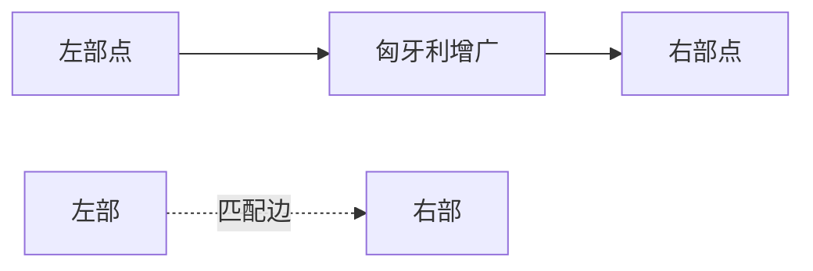

# 二分图最大匹配（Bipartite Maximum Matching）

## 一、为什么学二分图最大匹配？



把两组对象配对（任务↔工人、课程↔时间槽），求最多配对数。是网络流与图论的核心模型。

## 二、匈牙利算法（DFS 增广）

对每个左部点，尝试找"增广路"（未匹配→匹配交替到最后能扩成匹配的路）。

```java tab
boolean dfs(int u) {
    for (int v : g[u]) {
        if (vis[v]) continue;
        vis[v] = true;
        if (match[v] == -1 || dfs(match[v])) {
            match[v] = u; return true;
        }
    }
    return false;
}
int hungarian() {
    Arrays.fill(match, -1);
    int ans = 0;
    for (int u = 0; u < n; u++) {
        Arrays.fill(vis, false);
        if (dfs(u)) ans++;
    }
    return ans;
}
```

```typescript tab
function dfs(u: number): boolean {
    for (const v of g[u]) {
        if (vis[v]) continue;
        vis[v] = true;
        if (match[v] === -1 || dfs(match[v])) { match[v] = u; return true; }
    }
    return false;
}
function hungarian(): number {
    match.fill(-1);
    let ans = 0;
    for (let u = 0; u < n; u++) {
        vis.fill(false);
        if (dfs(u)) ans++;
    }
    return ans;
}
```

```python tab
def dfs(u):
    for v in g[u]:
        if vis[v]:
            continue
        vis[v] = True
        if match[v] == -1 or dfs(match[v]):
            match[v] = u
            return True
    return False
def hungarian():
    match[:] = [-1] * n
    ans = 0
    for u in range(n):
        vis[:] = [False] * m
        if dfs(u):
            ans += 1
    return ans
```

## 三、带权匹配（KM 算法）

求**最大权**完美匹配，用顶标(标签) + 相等子图 + 松弛量调整，复杂度 O(n³)。

## 四、复杂度

| 项目 | 复杂度 |
|------|--------|
| 匈牙利（无向二分图） | O(VE) |
| KM（带权） | O(n³) |

## 五、面试要点

1. 匹配数 = 最小点覆盖数（König 定理）
2. 能二分图染色后才能用匈牙利；否则用网络流
3. 例题：棋盘覆盖、课程排课、情侣牵手
