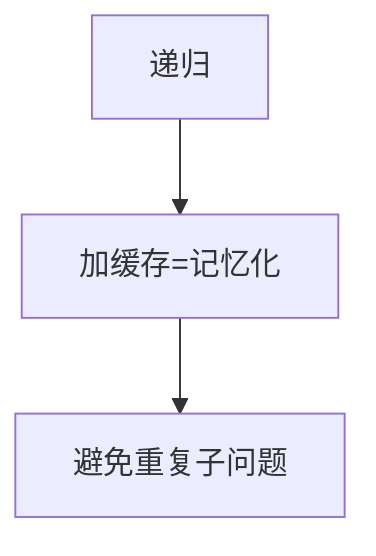

# 记忆化搜索

记忆化搜索（Memoization）是自顶向下的动态规划实现方式，用递归 + 缓存代替递推，代码更直观、状态空间按需计算，是面试中快速写出 DP 的利器。

## 一、自顶向下 vs 自底向上



| 维度 | 记忆化搜索（Top-Down） | 递推（Bottom-Up） |
|------|----------------------|-------------------|
| 方向 | 从目标状态向子问题展开 | 从基础状态向目标推进 |
| 实现 | 递归 + 缓存 | 循环 + 数组 |
| 状态计算 | 按需（只算用到的） | 全量（可能算多余的） |
| 代码直觉 | 更接近数学定义 | 需要确定遍历顺序 |
| 栈溢出风险 | 有（递归深度） | 无 |

## 二、基本模板

```java tab
Map<String, Integer> memo = new HashMap<>();
// 或 int[][] memo（状态是整数时更高效）

int solve(int state1, int state2) {
    // 1. 边界
    if (baseCase) return baseValue;

    // 2. 查缓存
    String key = state1 + "," + state2;
    if (memo.containsKey(key)) return memo.get(key);

    // 3. 递归计算
    int result = 0;
    for (choice : choices) {
        result = Math.max(result, solve(nextState) + gain);
    }

    // 4. 存缓存
    memo.put(key, result);
    return result;
}
```

```typescript tab
const memo = new Map<string, number>();
// 或 number[][] memo（状态是整数时更高效）

function solve(state1: number, state2: number): number {
    // 1. 边界
    if (baseCase) return baseValue;

    // 2. 查缓存
    const key = `${state1},${state2}`;
    if (memo.has(key)) return memo.get(key)!;

    // 3. 递归计算
    let result = 0;
    for (const choice of choices) {
        result = Math.max(result, solve(nextState) + gain);
    }

    // 4. 存缓存
    memo.set(key, result);
    return result;
}
```

```python tab
memo = {}  # 或二维数组 memo（状态是整数时更高效）

def solve(state1: int, state2: int) -> int:
    # 1. 边界
    if base_case:
        return base_value

    # 2. 查缓存
    key = (state1, state2)
    if key in memo:
        return memo[key]

    # 3. 递归计算
    result = 0
    for choice in choices:
        result = max(result, solve(next_state) + gain)

    # 4. 存缓存
    memo[key] = result
    return result
```

## 三、经典例题

### 爬楼梯（LeetCode 70）

```java tab
int[] memo;

int climbStairs(int n) {
    memo = new int[n + 1];
    Arrays.fill(memo, -1);
    return dfs(n);
}

int dfs(int n) {
    if (n <= 1) return 1;
    if (memo[n] != -1) return memo[n];
    memo[n] = dfs(n - 1) + dfs(n - 2);
    return memo[n];
}
```

```typescript tab
let memo: number[];

function climbStairs(n: number): number {
    memo = new Array(n + 1).fill(-1);
    return dfs(n);
}

function dfs(n: number): number {
    if (n <= 1) return 1;
    if (memo[n] !== -1) return memo[n];
    memo[n] = dfs(n - 1) + dfs(n - 2);
    return memo[n];
}
```

```python tab
def climb_stairs(n: int) -> int:
    memo = [-1] * (n + 1)

    def dfs(i: int) -> int:
        if i <= 1:
            return 1
        if memo[i] != -1:
            return memo[i]
        memo[i] = dfs(i - 1) + dfs(i - 2)
        return memo[i]

    return dfs(n)
```

### 最长递增子序列（LeetCode 300）

```java tab
int[] memo;
int[] nums;

int lengthOfLIS(int[] nums) {
    this.nums = nums;
    memo = new int[nums.length];
    Arrays.fill(memo, -1);
    int ans = 0;
    for (int i = 0; i < nums.length; i++) {
        ans = Math.max(ans, dfs(i));
    }
    return ans;
}

// 以 nums[i] 结尾的 LIS 长度
int dfs(int i) {
    if (memo[i] != -1) return memo[i];
    int best = 1;
    for (int j = 0; j < i; j++) {
        if (nums[j] < nums[i]) {
            best = Math.max(best, dfs(j) + 1);
        }
    }
    memo[i] = best;
    return best;
}
```

```typescript tab
let memo: number[];
let nums: number[];

function lengthOfLIS(input: number[]): number {
    nums = input;
    memo = new Array(nums.length).fill(-1);
    let ans = 0;
    for (let i = 0; i < nums.length; i++) {
        ans = Math.max(ans, dfs(i));
    }
    return ans;
}

function dfs(i: number): number {
    if (memo[i] !== -1) return memo[i];
    let best = 1;
    for (let j = 0; j < i; j++) {
        if (nums[j] < nums[i]) {
            best = Math.max(best, dfs(j) + 1);
        }
    }
    memo[i] = best;
    return best;
}
```

```python tab
def length_of_lis(nums: list[int]) -> int:
    memo = [-1] * len(nums)

    def dfs(i: int) -> int:
        if memo[i] != -1:
            return memo[i]
        best = 1
        for j in range(i):
            if nums[j] < nums[i]:
                best = max(best, dfs(j) + 1)
        memo[i] = best
        return best

    return max(dfs(i) for i in range(len(nums)))
```

### 零钱兑换（LeetCode 322）

```java tab
int[] memo;
int[] coins;

int coinChange(int[] coins, int amount) {
    this.coins = coins;
    memo = new int[amount + 1];
    Arrays.fill(memo, -2); // -2 表示未计算
    return dfs(amount);
}

int dfs(int remain) {
    if (remain == 0) return 0;
    if (remain < 0) return -1;
    if (memo[remain] != -2) return memo[remain];

    int best = Integer.MAX_VALUE;
    for (int coin : coins) {
        int sub = dfs(remain - coin);
        if (sub >= 0) best = Math.min(best, sub + 1);
    }
    memo[remain] = (best == Integer.MAX_VALUE) ? -1 : best;
    return memo[remain];
}
```

```typescript tab
let memo: number[];
let coins: number[];

function coinChange(input: number[], amount: number): number {
    coins = input;
    memo = new Array(amount + 1).fill(-2);
    return dfs(amount);
}

function dfs(remain: number): number {
    if (remain === 0) return 0;
    if (remain < 0) return -1;
    if (memo[remain] !== -2) return memo[remain];

    let best = Infinity;
    for (const coin of coins) {
        const sub = dfs(remain - coin);
        if (sub >= 0) best = Math.min(best, sub + 1);
    }
    memo[remain] = best === Infinity ? -1 : best;
    return memo[remain];
}
```

```python tab
def coin_change(coins: list[int], amount: int) -> int:
    memo = [-2] * (amount + 1)  # -2 表示未计算

    def dfs(remain: int) -> int:
        if remain == 0:
            return 0
        if remain < 0:
            return -1
        if memo[remain] != -2:
            return memo[remain]

        best = float('inf')
        for coin in coins:
            sub = dfs(remain - coin)
            if sub >= 0:
                best = min(best, sub + 1)
        memo[remain] = -1 if best == float('inf') else best
        return memo[remain]

    return dfs(amount)
```

## 四、记忆化搜索的优势

1. **代码直观**：直接翻译递推公式
2. **按需计算**：不遍历无用状态
3. **调试方便**：可以打印递归路径
4. **适合稀疏状态**：状态空间大但实际用到的少
5. **面试快速**：不用纠结遍历顺序

## 五、注意事项

| 问题 | 解决 |
|------|------|
| 栈溢出 | 状态数 > 10⁴ 时考虑递推 |
| 缓存键设计 | 多维状态用数组比 HashMap 快 |
| 初始值 | 用 -1 或 -2 标记"未计算"（答案可能是 0） |
| 副作用 | 递归中不要修改全局状态 |

## 六、何时用记忆化 vs 递推

| 场景 | 推荐 |
|------|------|
| 面试快速出解 | 记忆化 |
| 状态空间连续且小 | 递推（更快） |
| 状态空间稀疏/不规则 | 记忆化 |
| 需要输出方案 | 递推（方便回溯） |
| 递归深度 > 10⁴ | 递推（避免栈溢出） |

## 七、面试要点

1. **三步走**：定义递归函数 → 加缓存 → 处理边界
2. **缓存初始化**：-1 或特殊值，区分"未算"和"结果为0"
3. **与递推等价**：记忆化搜索一定能转化为递推 DP
4. **LeetCode**：70、300、322、518、139（单词拆分）、494（目标和）
