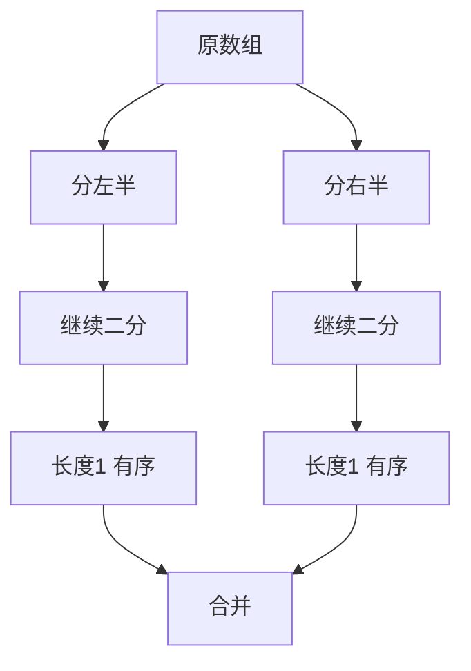

# 归并排序

归并排序（Merge Sort）是一种基于分治思想的高效排序算法。其核心思想包括以下几个步骤：

1. **分解（Divide）**：将待排序的数组分成两个子数组，每个子数组包含大约一半的元素
2. **解决（Conquer）**：递归地对每个子数组进行排序
3. **合并（Combine）**：将两个已排序的子数组合并成一个有序的数组



## 一、算法流程图解

以数组 `[38, 27, 43, 3, 9, 82, 10]` 为例，归并排序的完整过程如下：

**分解阶段**（自顶向下，不断二分直到子数组长度为 1）：

```
                    [38, 27, 43, 3, 9, 82, 10]
                   /                            \
        [38, 27, 43, 3]                  [9, 82, 10]
        /           \                    /          \
   [38, 27]      [43, 3]            [9, 82]       [10]
   /     \       /     \            /     \
 [38]   [27]  [43]   [3]         [9]    [82]
```

**合并阶段**（自底向上，两两归并有序子数组）：

```
 [27, 38]      [3, 43]            [9, 82]       [10]
      \         /                      \         /
   [3, 27, 38, 43]                  [9, 10, 82]
            \                          /
      [3, 9, 10, 27, 38, 43, 82]
```

**合并操作的核心逻辑**——双指针逐个比较：

```
左: [27, 38]    右: [3, 43]    结果: []
     i                j

比较 27 vs 3  → 取 3   → 结果: [3]
比较 27 vs 43 → 取 27  → 结果: [3, 27]
比较 38 vs 43 → 取 38  → 结果: [3, 27, 38]
左边耗尽，追加右边剩余  → 结果: [3, 27, 38, 43]
```

## 二、时间复杂度分析

- **分解**：将数组分成两半，直到每个子数组只有一个元素。递归深度为 O(log n)
- **合并**：每一层的所有合并操作总共处理 n 个元素，每层耗时 O(n)

```
总工作量 = 层数 × 每层工作量 = O(log n) × O(n) = O(n log n)
```

用递推公式严格证明：

```
T(n) = 2T(n/2) + O(n)
     = 2(2T(n/4) + O(n/2)) + O(n) = 4T(n/4) + 2·O(n)
     = ...
     = n·T(1) + O(n log n)
     = O(n log n)
```

**关键特性**：无论输入数据是有序、逆序还是随机，归并排序的时间复杂度**恒定为 O(n log n)**，不存在最坏情况退化。这是它与快速排序（最坏 O(n²)）的本质区别。

## 三、空间复杂度

归并排序在合并过程中需要额外的空间来存储临时数组。因此归并排序的空间复杂度是 **O(n)**。

具体分析：
- 递归版本：临时数组 O(n) + 递归调用栈 O(log n) → 总计 **O(n)**
- 迭代版本（自底向上）：临时数组 O(n)，无递归栈 → 总计 **O(n)**
- 链表版本：只需要 O(log n) 的递归栈（迭代版可做到 O(1)）

## 四、稳定性

归并排序是一种**稳定的排序算法**，因为在合并过程中，当两个元素相等时，优先选择左边子数组中的元素（使用 `<=` 比较），这样可以保持相等元素的相对顺序。

```java
// 稳定性的关键：相等时取左边
if (temp[i].compareTo(temp[j]) <= 0) {  // <= 保证稳定
    arr[k] = temp[i++];
} else {
    arr[k] = temp[j++];
}
```

如果将 `<=` 改为 `<`，相等时会优先取右边元素，排序就变成不稳定的了。

## 五、代码实现（递归版）

```java tab
public class MergeSort {

    public static <E extends Comparable<E>> void sort(E[] arr) {
        sort(arr, 0, arr.length - 1);
    }

    private static <E extends Comparable<E>> void sort(E[] arr, int l, int r) {
        if (l >= r) return;
        int mid = l + (r - l) / 2;
        sort(arr, l, mid);
        sort(arr, mid + 1, r);
        merge(arr, l, mid, r);
    }

    private static <E extends Comparable<E>> void merge(E[] arr, int l, int mid, int r) {
        E[] temp = Arrays.copyOfRange(arr, l, r + 1);
        int i = l, j = mid + 1;
        for (int k = l; k <= r; k++) {
            if (i > mid) { arr[k] = temp[j - l]; j++; }
            else if (j > r) { arr[k] = temp[i - l]; i++; }
            else if (temp[i - l].compareTo(temp[j - l]) <= 0) { arr[k] = temp[i - l]; i++; }
            else { arr[k] = temp[j - l]; j++; }
        }
    }
}
```
```typescript tab
function mergeSort(arr: number[]): number[] {
    if (arr.length <= 1) return arr;
    const mid = Math.floor(arr.length / 2);
    const left = mergeSort(arr.slice(0, mid));
    const right = mergeSort(arr.slice(mid));
    return merge(left, right);
}

function merge(left: number[], right: number[]): number[] {
    const res: number[] = [];
    let i = 0, j = 0;
    while (i < left.length && j < right.length) {
        if (left[i] <= right[j]) res.push(left[i++]);
        else res.push(right[j++]);
    }
    return res.concat(left.slice(i), right.slice(j));
}
```
```python tab
def merge_sort(arr: list[int]) -> list[int]:
    if len(arr) <= 1:
        return arr
    mid = len(arr) // 2
    left = merge_sort(arr[:mid])
    right = merge_sort(arr[mid:])
    return merge(left, right)

def merge(left: list[int], right: list[int]) -> list[int]:
    res = []
    i = j = 0
    while i < len(left) and j < len(right):
        if left[i] <= right[j]:
            res.append(left[i]); i += 1
        else:
            res.append(right[j]); j += 1
    return res + left[i:] + right[j:]
```

## 六、自底向上迭代版

递归版本存在调用栈开销，且对超大数据可能栈溢出。自底向上版本用循环替代递归：从长度为 1 的子数组开始，每轮将相邻的两个有序段合并，段长翻倍，直到整个数组有序。

```java tab
public class MergeSortBU {

    public static <E extends Comparable<E>> void sort(E[] arr) {
        int n = arr.length;
        for (int size = 1; size < n; size *= 2) {
            for (int lo = 0; lo < n - size; lo += 2 * size) {
                int mid = lo + size - 1;
                int hi = Math.min(lo + 2 * size - 1, n - 1);
                merge(arr, lo, mid, hi);
            }
        }
    }

    private static <E extends Comparable<E>> void merge(E[] arr, int lo, int mid, int hi) {
        E[] temp = Arrays.copyOfRange(arr, lo, hi + 1);
        int i = lo, j = mid + 1;
        for (int k = lo; k <= hi; k++) {
            if (i > mid) { arr[k] = temp[j - lo]; j++; }
            else if (j > hi) { arr[k] = temp[i - lo]; i++; }
            else if (temp[i - lo].compareTo(temp[j - lo]) <= 0) { arr[k] = temp[i - lo]; i++; }
            else { arr[k] = temp[j - lo]; j++; }
        }
    }
}
```
```typescript tab
function mergeSortBU(arr: number[]): void {
    const n = arr.length;
    for (let size = 1; size < n; size *= 2) {
        for (let lo = 0; lo < n - size; lo += 2 * size) {
            const mid = lo + size - 1;
            const hi = Math.min(lo + 2 * size - 1, n - 1);
            mergeInPlace(arr, lo, mid, hi);
        }
    }
}

function mergeInPlace(arr: number[], lo: number, mid: number, hi: number): void {
    const temp = arr.slice(lo, hi + 1);
    let i = lo, j = mid + 1;
    for (let k = lo; k <= hi; k++) {
        if (i > mid) arr[k] = temp[j - lo++];
        else if (j > hi) arr[k] = temp[i - lo++];
        else if (temp[i - lo] <= temp[j - lo]) arr[k] = temp[i - lo++];
        else arr[k] = temp[j - lo++];
    }
}
```
```python tab
def merge_sort_bu(arr: list[int]) -> None:
    n = len(arr)
    size = 1
    while size < n:
        for lo in range(0, n - size, 2 * size):
            mid = lo + size - 1
            hi = min(lo + 2 * size - 1, n - 1)
            merge_in_place(arr, lo, mid, hi)
        size *= 2

def merge_in_place(arr: list[int], lo: int, mid: int, hi: int) -> None:
    temp = arr[lo:hi + 1]
    i, j = lo, mid + 1
    for k in range(lo, hi + 1):
        if i > mid:
            arr[k] = temp[j - lo]; j += 1
        elif j > hi:
            arr[k] = temp[i - lo]; i += 1
        elif temp[i - lo] <= temp[j - lo]:
            arr[k] = temp[i - lo]; i += 1
        else:
            arr[k] = temp[j - lo]; j += 1
```

**迭代版的执行过程**（以 `[5, 2, 4, 1]` 为例）：

```
size=1: [5,2] → [2,5]    [4,1] → [1,4]    → [2,5,1,4]
size=2: [2,5,1,4] → 合并 → [1,2,4,5]      → 完成
```

## 七、链表上的归并排序

归并排序是**链表排序的最优选择**：链表不支持随机访问（快排的 partition 效率退化），但归并只需要顺序遍历和指针拼接，可以做到 O(1) 额外空间。

```java tab
public class LinkedListMergeSort {

    public ListNode sortList(ListNode head) {
        if (head == null || head.next == null) return head;
        // 快慢指针找中点
        ListNode slow = head, fast = head.next;
        while (fast != null && fast.next != null) {
            slow = slow.next;
            fast = fast.next.next;
        }
        ListNode mid = slow.next;
        slow.next = null;  // 断开链表
        ListNode left = sortList(head);
        ListNode right = sortList(mid);
        return mergeTwoLists(left, right);
    }

    private ListNode mergeTwoLists(ListNode l1, ListNode l2) {
        ListNode dummy = new ListNode(0), cur = dummy;
        while (l1 != null && l2 != null) {
            if (l1.val <= l2.val) { cur.next = l1; l1 = l1.next; }
            else { cur.next = l2; l2 = l2.next; }
            cur = cur.next;
        }
        cur.next = (l1 != null) ? l1 : l2;
        return dummy.next;
    }
}
```
```typescript tab
function sortList(head: ListNode | null): ListNode | null {
    if (!head || !head.next) return head;
    // 快慢指针找中点
    let slow = head, fast: ListNode | null = head.next;
    while (fast && fast.next) {
        slow = slow.next!;
        fast = fast.next.next;
    }
    const mid = slow.next;
    slow.next = null;
    const left = sortList(head);
    const right = sortList(mid);
    return mergeTwoLists(left, right);
}

function mergeTwoLists(l1: ListNode | null, l2: ListNode | null): ListNode | null {
    const dummy = new ListNode(0);
    let cur = dummy;
    while (l1 && l2) {
        if (l1.val <= l2.val) { cur.next = l1; l1 = l1.next; }
        else { cur.next = l2; l2 = l2.next; }
        cur = cur.next;
    }
    cur.next = l1 ?? l2;
    return dummy.next;
}
```
```python tab
def sort_list(head: ListNode | None) -> ListNode | None:
    if not head or not head.next:
        return head
    # 快慢指针找中点
    slow, fast = head, head.next
    while fast and fast.next:
        slow = slow.next
        fast = fast.next.next
    mid = slow.next
    slow.next = None
    left = sort_list(head)
    right = sort_list(mid)
    return merge_two_lists(left, right)

def merge_two_lists(l1: ListNode | None, l2: ListNode | None) -> ListNode | None:
    dummy = ListNode(0)
    cur = dummy
    while l1 and l2:
        if l1.val <= l2.val:
            cur.next = l1; l1 = l1.next
        else:
            cur.next = l2; l2 = l2.next
        cur = cur.next
    cur.next = l1 or l2
    return dummy.next
```

**链表 vs 数组归并的差异**：

| 维度 | 数组 | 链表 |
|------|------|------|
| 找中点 | O(1) 直接计算下标 | O(n) 快慢指针 |
| 额外空间 | O(n) 临时数组 | O(1)（仅指针操作） |
| 合并方式 | 拷贝到临时数组再写回 | 直接拼接节点 |
| 适用性 | 随机访问场景 | 数据量大、内存受限 |

## 八、经典应用：统计逆序对

归并排序最重要的衍生应用是**统计逆序对**（LeetCode 剑指 Offer 51 / LC 315 的基础）。逆序对定义：若 `i < j` 且 `arr[i] > arr[j]`，则 `(i, j)` 是一个逆序对。

**核心洞察**：在合并阶段，当右边元素 `temp[j]` 先于左边元素 `temp[i]` 被放入结果时，`temp[j]` 与左边剩余的所有元素（`mid - i + 1` 个）都构成逆序对。

```java tab
public class ReversePairs {

    public int reversePairs(int[] nums) {
        return sort(nums, 0, nums.length - 1);
    }

    private int sort(int[] arr, int l, int r) {
        if (l >= r) return 0;
        int mid = l + (r - l) / 2;
        int count = sort(arr, l, mid) + sort(arr, mid + 1, r);
        // 合并时统计跨越左右的逆序对
        int[] temp = Arrays.copyOfRange(arr, l, r + 1);
        int i = l, j = mid + 1;
        for (int k = l; k <= r; k++) {
            if (i > mid) { arr[k] = temp[j - l]; j++; }
            else if (j > r) { arr[k] = temp[i - l]; i++; }
            else if (temp[i - l] <= temp[j - l]) { arr[k] = temp[i - l]; i++; }
            else {
                arr[k] = temp[j - l]; j++;
                count += mid - i + 1;  // 关键：左边剩余元素都比 temp[j] 大
            }
        }
        return count;
    }
}
```
```typescript tab
function reversePairs(nums: number[]): number {
    const arr = [...nums];
    return sort(arr, 0, arr.length - 1);
}

function sort(arr: number[], l: number, r: number): number {
    if (l >= r) return 0;
    const mid = l + ((r - l) >> 1);
    let count = sort(arr, l, mid) + sort(arr, mid + 1, r);
    const temp = arr.slice(l, r + 1);
    let i = l, j = mid + 1;
    for (let k = l; k <= r; k++) {
        if (i > mid) arr[k] = temp[j++ - l];
        else if (j > r) arr[k] = temp[i++ - l];
        else if (temp[i - l] <= temp[j - l]) arr[k] = temp[i++ - l];
        else { arr[k] = temp[j++ - l]; count += mid - i + 1; }
    }
    return count;
}
```
```python tab
def reverse_pairs(nums: list[int]) -> int:
    arr = nums[:]
    return _sort(arr, 0, len(arr) - 1)

def _sort(arr: list[int], l: int, r: int) -> int:
    if l >= r:
        return 0
    mid = (l + r) // 2
    count = _sort(arr, l, mid) + _sort(arr, mid + 1, r)
    temp = arr[l:r + 1]
    i, j = l, mid + 1
    for k in range(l, r + 1):
        if i > mid:
            arr[k] = temp[j - l]; j += 1
        elif j > r:
            arr[k] = temp[i - l]; i += 1
        elif temp[i - l] <= temp[j - l]:
            arr[k] = temp[i - l]; i += 1
        else:
            arr[k] = temp[j - l]; j += 1
            count += mid - i + 1  # 左边剩余元素都与 temp[j-l] 构成逆序对
    return count
```

**为什么是 O(n log n)**：暴力枚举需要 O(n²) 对 (i, j) 逐一检查；归并法在排序过程中"顺便"统计，每一层合并只增加 O(n) 的计数操作。

## 九、归并排序 vs 快速排序

| 维度 | 归并排序 | 快速排序 |
|------|----------|----------|
| 时间复杂度（平均） | O(n log n) | O(n log n) |
| 时间复杂度（最坏） | O(n log n) | O(n²)（有序输入 + 首元素 pivot） |
| 空间复杂度 | O(n) | O(log n)（递归栈） |
| 稳定性 | ✅ 稳定 | ❌ 不稳定 |
| 实际速度 | 常数因子略大（拷贝开销） | 通常更快（原地交换，缓存友好） |
| 数据访问模式 | 顺序访问，缓存不友好 | 局部性好，缓存友好 |
| 链表支持 | ✅ 天然适合 | ❌ partition 需要随机访问 |
| 外部排序 | ✅ 核心算法 | ❌ 不适合磁盘数据 |
| 工程应用 | Java 对象排序（TimSort）、Python sorted() | C 的 qsort、C++ std::sort（IntroSort） |

**选择建议**：
- 需要稳定性 → 归并排序（或其改进 TimSort）
- 内存敏感、原地排序 → 快速排序
- 链表数据 → 归并排序
- 数据量超出内存 → 归并排序（外部排序）
- 通用场景追求极致速度 → 快速排序 / IntroSort

## 十、优化技巧

### 1. 近有序数组优化

在归并排序中，可以添加一个优化：如果 `arr[mid] <= arr[mid + 1]`，说明两个子数组已经有序，可以跳过合并操作。这个优化可以将近乎有序的数组排序时间降低到 **O(n)**。

```java
private static void sort(int[] arr, int l, int r) {
    if (l >= r) return;
    int mid = l + (r - l) / 2;
    sort(arr, l, mid);
    sort(arr, mid + 1, r);
    if (arr[mid] > arr[mid + 1]) {  // 仅在不有序时才合并
        merge(arr, l, mid, r);
    }
}
```

### 2. 小数组切换插入排序

递归到底层时，子数组长度很小（如 ≤ 15），插入排序的常数因子远小于归并。混合策略可减少约 10%~15% 的运行时间：

```java
private static void sort(int[] arr, int l, int r) {
    if (r - l <= 15) {
        insertionSort(arr, l, r);
        return;
    }
    // ... 正常归并逻辑
}
```

### 3. 复用临时数组

标准实现每次 merge 都分配新数组。可以在排序开始时分配一次全局辅助数组，交替使用两个数组作为源和目标，避免反复分配内存。Java 的 TimSort 就采用了这种策略。

## 十一、外部排序

当数据量超出内存容量时（如对 100GB 日志文件排序），归并排序是唯一实用的排序方案：

**外部排序流程**：

1. **分块（Run Generation）**：每次读入内存能容纳的数据块（如 1GB），用内部排序（归并/快排）排好后写回磁盘
2. **多路归并（K-way Merge）**：用大小为 K 的最小堆，从 K 个有序块中各取一个元素，每次弹出堆顶最小值写入输出
3. **多轮归并**：如果有序块数量超过可同时打开的文件数，先分组归并减少块数，再进行下一轮

```
100GB 数据，内存 1GB：
第1步：生成 100 个 1GB 的有序块
第2步：100路归并（堆大小仅100个元素）
       每次从堆顶取最小值 → 输出有序结果
```

**为什么不用快排**：快排的 partition 需要随机访问数据，磁盘随机 IO 比顺序 IO 慢 1000 倍以上。归并排序对每个块只做顺序读写，天然适合磁盘。

## 十二、面试常见题

| 题目 | 难度 | 核心思路 |
|------|------|----------|
| 排序链表（LC 148） | 🟡 Medium | 快慢指针找中点 + 归并两个有序链表 |
| 合并两个有序链表（LC 21） | 🟢 Easy | 归并的 merge 步骤本身 |
| 合并 K 个升序链表（LC 23） | 🔴 Hard | 分治归并 或 最小堆 |
| 数组中的逆序对（剑指51） | 🔴 Hard | 归并过程中统计跨区间逆序对 |
| 计算右侧小于当前元素的个数（LC 315） | 🔴 Hard | 归并排序 + 下标追踪 |
| 翻转对（LC 493） | 🔴 Hard | 归并前统计、合并时不干扰 |
| 外部排序（系统设计） | 🔴 Hard | 分块排序 + 多路归并 |

## 十三、易错点分析

**1. mid 计算溢出**

```java
// ❌ 当 l + r 超过 int 范围时溢出
int mid = (l + r) / 2;
// ✅ 防溢出写法
int mid = l + (r - l) / 2;
```

**2. 临时数组下标偏移**

拷贝 `arr[l..r]` 到 `temp[0..r-l]` 后，访问原下标 i 对应的元素是 `temp[i - l]`，忘记减偏移量是最常见的 bug。

**3. 稳定性破坏**

合并时相等元素必须取左边的（`<=`），否则排序不稳定。面试中如果题目要求稳定排序，这一点必须明确说明。

**4. 链表找中点的快指针起始位置**

```java
// ❌ fast = head：偶数长度时 slow 停在偏右中点，断开后左短右长，可能死循环
// ✅ fast = head.next：slow 停在偏左中点，保证左半部分 ≥ 右半部分
ListNode slow = head, fast = head.next;
```

**5. 迭代版边界条件**

`lo < n - size` 保证右半段至少有一个元素；`hi = min(lo + 2*size - 1, n - 1)` 防止越界。漏掉 min 会导致数组越界。
