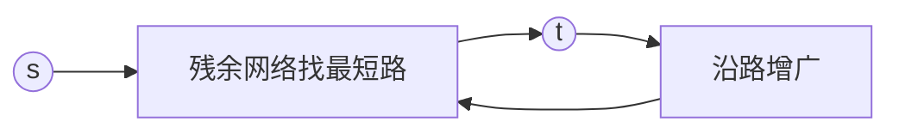

# 最小费用最大流（Min-Cost Max-Flow, MCMF）

## 一、为什么学最小费用最大流？



在最大流基础上，每条边有单位费用 `cost(u,v)`，目标是在**流量最大**的前提下使**总费用最小**。应用：

- 运输问题、任务分配（带成本）
- 最小费用匹配
- 流量有成本约束的调度

## 二、基本思想

在残余网络上反复用 **SPFA / Dijkstra（势优化）** 找从 s 到 t 的**单位费用最短路**，沿该路增广，直到无增广路。

- 反向边费用为 `−cost`，用于"退流"
- 要求无负环（初始无负费用环即可）

## 三、SPFA 版实现

```java tab
static int[] dist = new int[N];
static int[] preV = new int[N], preE = new int[N];
static boolean[] inq = new boolean[N];
static final int INF = 1 << 29;

boolean spfa(int s, int t) {
    Arrays.fill(dist, INF);
    Arrays.fill(inq, false);
    dist[s] = 0;
    Queue<Integer> q = new LinkedList<>(); q.offer(s); inq[s] = true;
    while (!q.isEmpty()) {
        int u = q.poll(); inq[u] = false;
        for (int i = head[u]; i != -1; i = nxt[i]) {
            if (cap[i] > 0 && dist[v[i]] > dist[u] + cost[i]) {
                dist[v[i]] = dist[u] + cost[i];
                preV[v[i]] = u; preE[v[i]] = i;
                if (!inq[v[i]]) { q.offer(v[i]); inq[v[i]] = true; }
            }
        }
    }
    return dist[t] != INF;
}

int minCostMaxFlow(int s, int t) {
    int flow = 0, fee = 0;
    while (spfa(s, t)) {
        int f = INF;
        for (int x = t; x != s; x = preV[x]) f = Math.min(f, cap[preE[x]]);
        for (int x = t; x != s; x = preV[x]) {
            int e = preE[x];
            cap[e] -= f; cap[e ^ 1] += f;
        }
        flow += f; fee += f * dist[t];
    }
    return fee; // 总费用；flow 即最大流
}
```

```typescript tab
const dist: number[] = new Array(N).fill(INF);
const preV: number[] = new Array(N).fill(-1);
const preE: number[] = new Array(N).fill(-1);
const inq: boolean[] = new Array(N).fill(false);
const INF = 1 << 29;

function spfa(s: number, t: number): boolean {
    dist.fill(INF); inq.fill(false);
    dist[s] = 0;
    const q: number[] = [s]; inq[s] = true;
    while (q.length) {
        const u = q.shift()!; inq[u] = false;
        for (let i = head[u]; i !== -1; i = nxt[i]) {
            if (cap[i] > 0 && dist[v[i]] > dist[u] + cost[i]) {
                dist[v[i]] = dist[u] + cost[i];
                preV[v[i]] = u; preE[v[i]] = i;
                if (!inq[v[i]]) { q.push(v[i]); inq[v[i]] = true; }
            }
        }
    }
    return dist[t] !== INF;
}

function minCostMaxFlow(s: number, t: number): number {
    let flow = 0, fee = 0;
    while (spfa(s, t)) {
        let f = INF;
        for (let x = t; x !== s; x = preV[x]) f = Math.min(f, cap[preE[x]]);
        for (let x = t; x !== s; x = preV[x]) {
            const e = preE[x];
            cap[e] -= f; cap[e ^ 1] += f;
        }
        flow += f; fee += f * dist[t];
    }
    return fee;
}
```

```python tab
from collections import deque
INF = 1 << 29
dist = [INF] * N
pre_v = [-1] * N
pre_e = [-1] * N
inq = [False] * N

def spfa(s: int, t: int) -> bool:
    for i in range(N):
        dist[i] = INF
        inq[i] = False
    dist[s] = 0
    q = deque([s]); inq[s] = True
    while q:
        u = q.popleft(); inq[u] = False
        i = head[u]
        while i != -1:
            if cap[i] > 0 and dist[v[i]] > dist[u] + cost[i]:
                dist[v[i]] = dist[u] + cost[i]
                pre_v[v[i]] = u; pre_e[v[i]] = i
                if not inq[v[i]]:
                    q.append(v[i]); inq[v[i]] = True
            i = nxt[i]
    return dist[t] != INF

def min_cost_max_flow(s: int, t: int) -> int:
    flow = fee = 0
    while spfa(s, t):
        f = INF
        x = t
        while x != s:
            f = min(f, cap[pre_e[x]]); x = pre_v[x]
        x = t
        while x != s:
            e = pre_e[x]
            cap[e] -= f; cap[e ^ 1] += f
            x = pre_v[x]
        flow += f; fee += f * dist[t]
    return fee
```

## 四、复杂度

| 项目 | 复杂度 |
|------|--------|
| SPFA 版 | O(VE × 流量)（最坏） |
| Dijkstra + 势（Johnson） | O(V²E log V) / 稀疏 O(VE log V) |

## 五、面试要点

1. 反向边费用取负，保证退流能抵消原费用
2. SPFA 易写但易 TLE，竞赛常用势优化 Dijkstra
3. 若只求"最小费用流（不一定最大）"，达到目标流量即停
4. LeetCode：743 变形、含成本匹配类题常建模为 MCMF
