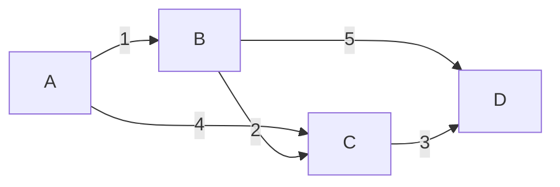

# 最小生成树：Kruskal 与 Prim


## 一、什么是最小生成树

**最小生成树（Minimum Spanning Tree, MST）**：在连通无向带权图中，选取 n-1 条边使所有顶点连通，且边权之和最小。

| 性质 | 说明 |
|------|------|
| 边数 | 恰好 n-1 条 |
| 无环 | 是树 |
| 连通 | 所有顶点可达 |
| 权值和最小 | 全局最优 |



> MST：选边 A-B(1)、B-C(2)、C-D(3)，总权 = 6。

## 二、Kruskal 算法

### 2.1 思想

**贪心**：将所有边按权值排序，从小到大依次选边，若该边连接的两个顶点**不在同一连通分量**（用并查集判断），则选入。

### 2.2 模板

```java tab
public int kruskal(int n, int[][] edges) {
    // edges = {u, v, weight}
    Arrays.sort(edges, (a, b) -> a[2] - b[2]);
    UnionFind uf = new UnionFind(n);
    int mstWeight = 0, edgeCount = 0;

    for (int[] e : edges) {
        if (uf.union(e[0], e[1])) {
            mstWeight += e[2];
            edgeCount++;
            if (edgeCount == n - 1) break;
        }
    }
    return edgeCount == n - 1 ? mstWeight : -1;  // -1 表示不连通
}

class UnionFind {
    int[] parent, rank;
    UnionFind(int n) {
        parent = new int[n]; rank = new int[n];
        for (int i = 0; i < n; i++) parent[i] = i;
    }
    int find(int x) {
        if (parent[x] != x) parent[x] = find(parent[x]);
        return parent[x];
    }
    boolean union(int x, int y) {
        int px = find(x), py = find(y);
        if (px == py) return false;
        if (rank[px] < rank[py]) { int t = px; px = py; py = t; }
        parent[py] = px;
        if (rank[px] == rank[py]) rank[px]++;
        return true;
    }
}
```

```typescript tab
function kruskal(n: number, edges: number[][]): number {
    // edges = [u, v, weight]
    edges.sort((a, b) => a[2] - b[2]);
    const parent = Array.from({ length: n }, (_, i) => i);
    const rank = new Array(n).fill(0);

    const find = (x: number): number => {
        if (parent[x] !== x) parent[x] = find(parent[x]);
        return parent[x];
    };

    let mstWeight = 0, edgeCount = 0;
    for (const [u, v, w] of edges) {
        const pu = find(u), pv = find(v);
        if (pu !== pv) {
            if (rank[pu] < rank[pv]) {
                parent[pu] = pv;
            } else {
                parent[pv] = pu;
                if (rank[pu] === rank[pv]) rank[pu]++;
            }
            mstWeight += w;
            if (++edgeCount === n - 1) break;
        }
    }
    return edgeCount === n - 1 ? mstWeight : -1;  // -1 表示不连通
}
```

```python tab
def kruskal(n: int, edges: list[list[int]]) -> int:
    # edges = [u, v, weight]
    edges.sort(key=lambda e: e[2])
    parent = list(range(n))
    rank = [0] * n

    def find(x: int) -> int:
        while parent[x] != x:
            parent[x] = parent[parent[x]]
            x = parent[x]
        return x

    def union(x: int, y: int) -> bool:
        px, py = find(x), find(y)
        if px == py:
            return False
        if rank[px] < rank[py]:
            px, py = py, px
        parent[py] = px
        if rank[px] == rank[py]:
            rank[px] += 1
        return True

    mst_weight = edge_count = 0
    for u, v, w in edges:
        if union(u, v):
            mst_weight += w
            edge_count += 1
            if edge_count == n - 1:
                break
    return mst_weight if edge_count == n - 1 else -1  # -1 表示不连通
```

- **时间**：O(E log E)（排序主导），**空间**：O(V)

## 三、Prim 算法

### 3.1 思想

**贪心**：从一个顶点出发，每次选**连接已选集合与未选集合**的最小边，将新顶点加入。

类似 Dijkstra，但维护的是"到已选集合的最小边权"而非"到源点的最短距离"。

### 3.2 模板（优先队列优化）

```java tab
public int prim(List<int[]>[] graph, int start) {
    int n = graph.length;
    boolean[] visited = new boolean[n];
    PriorityQueue<int[]> pq = new PriorityQueue<>((a, b) -> a[1] - b[1]);
    // {顶点, 边权}
    pq.offer(new int[]{start, 0});
    int mstWeight = 0, edgeCount = 0;

    while (!pq.isEmpty() && edgeCount < n) {
        int[] cur = pq.poll();
        int u = cur[0], w = cur[1];
        if (visited[u]) continue;
        visited[u] = true;
        mstWeight += w;
        edgeCount++;
        for (int[] edge : graph[u]) {
            int v = edge[0], ew = edge[1];
            if (!visited[v]) pq.offer(new int[]{v, ew});
        }
    }
    return edgeCount == n ? mstWeight : -1;
}
```

```typescript tab
function prim(graph: [number, number][][], start: number): number {
    const n = graph.length;
    const visited = new Array(n).fill(false);
    // [顶点, 边权]
    const pq: [number, number][] = [[start, 0]];
    let mstWeight = 0, edgeCount = 0;

    while (pq.length && edgeCount < n) {
        pq.sort((a, b) => a[1] - b[1]);
        const [u, w] = pq.shift()!;
        if (visited[u]) continue;
        visited[u] = true;
        mstWeight += w;
        edgeCount++;
        for (const [v, ew] of graph[u]) {
            if (!visited[v]) pq.push([v, ew]);
        }
    }
    return edgeCount === n ? mstWeight : -1;
}
```

```python tab
import heapq

def prim(graph: list[list[tuple[int, int]]], start: int) -> int:
    n = len(graph)
    visited = [False] * n
    # (边权, 顶点)
    pq = [(0, start)]
    mst_weight = edge_count = 0

    while pq and edge_count < n:
        w, u = heapq.heappop(pq)
        if visited[u]:
            continue
        visited[u] = True
        mst_weight += w
        edge_count += 1
        for v, ew in graph[u]:
            if not visited[v]:
                heapq.heappush(pq, (ew, v))
    return mst_weight if edge_count == n else -1
```

- **时间**：O(E log V)，**空间**：O(V + E)

## 四、Kruskal vs Prim

| 维度 | Kruskal | Prim |
|------|---------|------|
| 核心 | 选边（全局排序） | 选点（逐步扩展） |
| 数据结构 | 并查集 | 优先队列 / 数组 |
| 适合 | 稀疏图（E 小） | 稠密图（E ≈ V²） |
| 时间 | O(E log E) | O(E log V) / O(V²) |
| 是否需要连通 | 可处理森林 | 需要连通图 |

## 五、MST 的性质与定理

### 5.1 切割性质

> 对图的任意切割，跨越切割的最小权边一定属于某棵 MST。

这是 Kruskal 和 Prim 正确性的理论基础。

### 5.2 环性质

> 对图中的任意环，环上最大权边一定不属于 MST。

### 5.3 MST 唯一性

- 所有边权不同 → MST 唯一
- 有相同边权 → 可能有多棵 MST

## 六、经典应用

| 应用 | 说明 |
|------|------|
| 网络设计 | 最低成本连通所有节点 |
| 聚类分析 | 删除 MST 中最大边 → 两类聚类 |
| 近似 TSP | MST 的 DFS 序给出 2 倍近似 |
| 瓶颈路 | 最小瓶颈路 = MST 上的路径 |

### 连接所有点的最小费用（LeetCode 1584）

```java tab
public int minCostConnectPoints(int[][] points) {
    int n = points.length;
    List<int[]> edges = new ArrayList<>();
    for (int i = 0; i < n; i++) {
        for (int j = i + 1; j < n; j++) {
            int dist = Math.abs(points[i][0] - points[j][0])
                     + Math.abs(points[i][1] - points[j][1]);
            edges.add(new int[]{i, j, dist});
        }
    }
    return kruskal(n, edges.toArray(new int[0][]));
}
```

```typescript tab
function minCostConnectPoints(points: number[][]): number {
    const n = points.length;
    const edges: number[][] = [];
    for (let i = 0; i < n; i++) {
        for (let j = i + 1; j < n; j++) {
            const dist = Math.abs(points[i][0] - points[j][0])
                       + Math.abs(points[i][1] - points[j][1]);
            edges.push([i, j, dist]);
        }
    }
    return kruskal(n, edges);
}
```

```python tab
def min_cost_connect_points(points: list[list[int]]) -> int:
    n = len(points)
    edges = []
    for i in range(n):
        for j in range(i + 1, n):
            dist = abs(points[i][0] - points[j][0]) \
                 + abs(points[i][1] - points[j][1])
            edges.append([i, j, dist])
    return kruskal(n, edges)
```

## 七、面试常见题

- 🟢 连接所有点的最小费用
- 🟡 冗余连接（并查集判环）、最小生成树权值和
- 🟠 优化城市供水（虚节点 + MST）、次小生成树
- 🔴 严格次小生成树、最小瓶颈路

## 八、调试技巧

1. **边数判断**：MST 恰好 n-1 条边，少了说明不连通。
2. **并查集初始化**：每个节点 `parent[i] = i`。
3. **排序方向**：Kruskal 按权值**升序**。
4. **Prim 的 visited**：出队时检查，避免重复加入。
