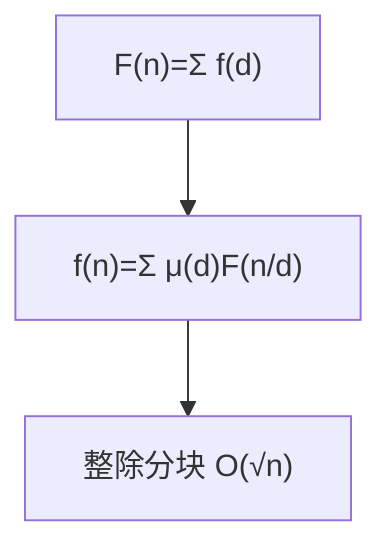

# 莫比乌斯反演（Möbius Inversion）

## 一、为什么学莫比乌斯反演？



在数论与算法竞赛中，常需对"gcd 相关"的求和做优化，如：

- 求 `Σ Σ [gcd(i,j)=1]`（互质对计数）
- 求 `Σ Σ gcd(i,j)`（最大公约数之和）
- 整除分块 + 莫比乌斯函数将 O(n²) 降到 O(n√n)

## 二、莫比乌斯函数 μ(n)

| n 的素因子分解 | μ(n) |
|---------------|------|
| 含平方因子 | 0 |
| k 个不同素因子，k 偶 | 1 |
| k 个不同素因子，k 奇 | −1 |
| n = 1 | 1 |

线性筛求 μ：

```java tab
int[] mu = new int[N];
int[] primes = new int[N];
boolean[] vis = new boolean[N];
int cnt = 0;
mu[1] = 1;
for (int i = 2; i < N; i++) {
    if (!vis[i]) { primes[cnt++] = i; mu[i] = -1; }
    for (int j = 0; j < cnt && i * primes[j] < N; j++) {
        vis[i * primes[j]] = true;
        if (i % primes[j] == 0) { mu[i * primes[j]] = 0; break; }
        mu[i * primes[j]] = -mu[i];
    }
}
```

```typescript tab
const mu: number[] = new Array(N).fill(0);
const primes: number[] = [];
const vis: boolean[] = new Array(N).fill(false);
mu[1] = 1;
for (let i = 2; i < N; i++) {
    if (!vis[i]) { primes.push(i); mu[i] = -1; }
    for (const p of primes) {
        if (i * p >= N) break;
        vis[i * p] = true;
        if (i % p === 0) { mu[i * p] = 0; break; }
        mu[i * p] = -mu[i];
    }
}
```

```python tab
mu = [0] * N
primes = []
vis = [False] * N
mu[1] = 1
for i in range(2, N):
    if not vis[i]:
        primes.append(i)
        mu[i] = -1
    for p in primes:
        if i * p >= N:
            break
        vis[i * p] = True
        if i % p == 0:
            mu[i * p] = 0
            break
        mu[i * p] = -mu[i]
```

## 三、反演公式

若 `F(n) = Σ_{d|n} f(d)`，则 `f(n) = Σ_{d|n} μ(d) · F(n/d)`。

常用形式（gcd 互质对）：
`Σ_{i=1}^n Σ_{j=1}^m [gcd(i,j)=1] = Σ_{d} μ(d) ⌊n/d⌋⌊m/d⌋`

结合**整除分块**（⌊n/d⌋ 取值只有 O(√n) 种），可 O(√n) 求解。

## 四、整除分块模板

```java tab
long solve(int n, int m) {
    long ans = 0;
    for (int l = 1, r; l <= Math.min(n, m); l = r + 1) {
        r = Math.min(n / (n / l), m / (m / l));
        ans += (long)(n / l) * (m / l) * (preMu[r] - preMu[l - 1]);
    }
    return ans;
}
```

```typescript tab
function solve(n: number, m: number): number {
    let ans = 0;
    for (let l = 1, r = 0; l <= Math.min(n, m); l = r + 1) {
        r = Math.min(Math.floor(n / Math.floor(n / l)), Math.floor(m / Math.floor(m / l)));
        ans += Math.floor(n / l) * Math.floor(m / l) * (preMu[r] - preMu[l - 1]);
    }
    return ans;
}
```

```python tab
def solve(n: int, m: int) -> int:
    ans = 0
    l = 1
    while l <= min(n, m):
        r = min(n // (n // l), m // (m // l))
        ans += (n // l) * (m // l) * (pre_mu[r] - pre_mu[l - 1])
        l = r + 1
    return ans
```

## 五、复杂度

| 项目 | 复杂度 |
|------|--------|
| 筛 μ | O(N) |
| 单次互质对查询 | O(√n)（整除分块） |

## 六、面试要点

1. μ 的线性筛与素数筛同源，注意平方因子置 0
2. 反演把"gcd 约束"变成"倍数求和"，再整除分块
3. 常与欧拉函数 φ 互换使用（gcd 和、互质对）
4. 例题：Luogu P2522、POJ 3904 互质四元组
