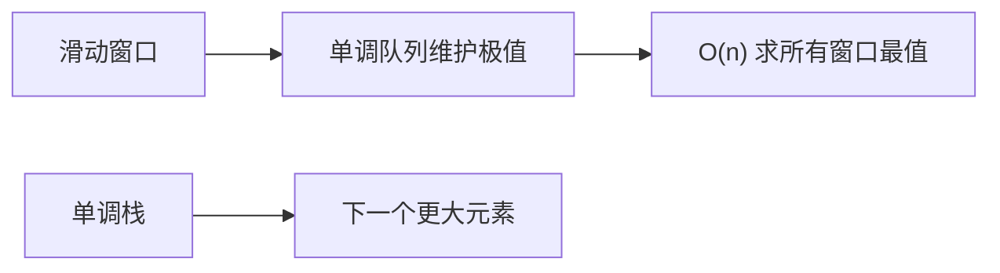

# 单调队列：滑动窗口最值的最优解


## 一、什么是单调队列



**单调队列（Monotonic Deque）** 是一种双端队列，其中元素始终保持**单调递增或递减**的顺序。它最经典的应用是在 **O(n)** 时间内求出所有固定大小窗口的最大值/最小值。

> 单调栈解决"下一个更大元素"，单调队列解决"窗口内最值"。

| 对比 | 单调栈 | 单调队列 |
|------|--------|----------|
| 结构 | 栈（一端进出） | 双端队列（两端操作） |
| 典型问题 | 下一个更大元素 | 滑动窗口最大值 |
| 过期处理 | 无需 | 需要移除窗口外元素 |

## 二、滑动窗口最大值

**问题**：给定数组和窗口大小 k，返回每个窗口的最大值。

### 2.1 暴力 O(nk)

```java tab
// 每个窗口遍历 k 个元素找最大 → O(nk)
```
```typescript tab
// 每个窗口遍历 k 个元素找最大 → O(nk)
```
```python tab
# 每个窗口遍历 k 个元素找最大 → O(nk)
```

### 2.2 单调队列 O(n)

维护一个**递减双端队列**（存下标），队头始终是当前窗口的最大值：

```java tab
public int[] maxSlidingWindow(int[] nums, int k) {
    int n = nums.length;
    int[] result = new int[n - k + 1];
    Deque<Integer> deque = new ArrayDeque<>();   // 存下标，值递减

    for (int i = 0; i < n; i++) {
        // 1. 移除窗口外的元素（队头过期）
        while (!deque.isEmpty() && deque.peekFirst() < i - k + 1) {
            deque.pollFirst();
        }
        // 2. 维护单调性：移除所有比当前值小的队尾
        while (!deque.isEmpty() && nums[deque.peekLast()] <= nums[i]) {
            deque.pollLast();
        }
        // 3. 当前元素入队
        deque.offerLast(i);
        // 4. 记录结果（窗口形成后）
        if (i >= k - 1) {
            result[i - k + 1] = nums[deque.peekFirst()];
        }
    }
    return result;
}
```
```typescript tab
function maxSlidingWindow(nums: number[], k: number): number[] {
    const n = nums.length;
    const result: number[] = new Array(n - k + 1);
    const deque: number[] = [];   // 存下标，值递减

    for (let i = 0; i < n; i++) {
        // 1. 移除窗口外的元素（队头过期）
        while (deque.length && deque[0] < i - k + 1) {
            deque.shift();
        }
        // 2. 维护单调性：移除所有比当前值小的队尾
        while (deque.length && nums[deque[deque.length - 1]] <= nums[i]) {
            deque.pop();
        }
        // 3. 当前元素入队
        deque.push(i);
        // 4. 记录结果（窗口形成后）
        if (i >= k - 1) {
            result[i - k + 1] = nums[deque[0]];
        }
    }
    return result;
}
```
```python tab
from collections import deque

def max_sliding_window(nums: list[int], k: int) -> list[int]:
    n = len(nums)
    result = []
    dq = deque()   # 存下标，值递减

    for i in range(n):
        # 1. 移除窗口外的元素（队头过期）
        while dq and dq[0] < i - k + 1:
            dq.popleft()
        # 2. 维护单调性：移除所有比当前值小的队尾
        while dq and nums[dq[-1]] <= nums[i]:
            dq.pop()
        # 3. 当前元素入队
        dq.append(i)
        # 4. 记录结果（窗口形成后）
        if i >= k - 1:
            result.append(nums[dq[0]])
    return result
```

- **时间**：O(n)（每个元素最多入队出队各一次）
- **空间**：O(k)

## 三、工作原理图解

以 `nums = [1, 3, -1, -3, 5, 3, 6, 7]`, `k = 3` 为例：

| 步骤 | 窗口 | 队列（下标） | 最大值 |
|------|------|-------------|--------|
| i=0 | [1] | [0] | — |
| i=1 | [1,3] | [1] | — |
| i=2 | [1,3,-1] | [1,2] | 3 |
| i=3 | [3,-1,-3] | [1,2,3] | 3 |
| i=4 | [-1,-3,5] | [4] | 5 |
| i=5 | [-3,5,3] | [4,5] | 5 |
| i=6 | [5,3,6] | [6] | 6 |
| i=7 | [3,6,7] | [7] | 7 |

## 四、单调队列模板

### 4.1 求窗口最大值（递减队列）

```java tab
// 队头 = 窗口最大
while (!dq.isEmpty() && nums[dq.peekLast()] <= nums[i]) dq.pollLast();
```
```typescript tab
// 队头 = 窗口最大
while (dq.length && nums[dq[dq.length - 1]] <= nums[i]) dq.pop();
```
```python tab
# 队头 = 窗口最大
while dq and nums[dq[-1]] <= nums[i]:
    dq.pop()
```

### 4.2 求窗口最小值（递增队列）

```java tab
// 队头 = 窗口最小
while (!dq.isEmpty() && nums[dq.peekLast()] >= nums[i]) dq.pollLast();
```
```typescript tab
// 队头 = 窗口最小
while (dq.length && nums[dq[dq.length - 1]] >= nums[i]) dq.pop();
```
```python tab
# 队头 = 窗口最小
while dq and nums[dq[-1]] >= nums[i]:
    dq.pop()
```

### 4.3 通用封装

```java tab
class MonotonicQueue {
    private Deque<Integer> deque = new ArrayDeque<>();
    private int[] nums;

    MonotonicQueue(int[] nums) { this.nums = nums; }

    // 递减队列（求最大值）
    void push(int i) {
        while (!deque.isEmpty() && nums[deque.peekLast()] <= nums[i]) {
            deque.pollLast();
        }
        deque.offerLast(i);
    }

    void popExpired(int windowStart) {
        while (!deque.isEmpty() && deque.peekFirst() < windowStart) {
            deque.pollFirst();
        }
    }

    int getMax() { return nums[deque.peekFirst()]; }
}
```
```typescript tab
class MonotonicQueue {
    private deque: number[] = [];
    private nums: number[];

    constructor(nums: number[]) { this.nums = nums; }

    // 递减队列（求最大值）
    push(i: number): void {
        while (this.deque.length && this.nums[this.deque[this.deque.length - 1]] <= this.nums[i]) {
            this.deque.pop();
        }
        this.deque.push(i);
    }

    popExpired(windowStart: number): void {
        while (this.deque.length && this.deque[0] < windowStart) {
            this.deque.shift();
        }
    }

    getMax(): number { return this.nums[this.deque[0]]; }
}
```
```python tab
from collections import deque

class MonotonicQueue:
    def __init__(self, nums: list[int]):
        self.dq = deque()
        self.nums = nums

    # 递减队列（求最大值）
    def push(self, i: int) -> None:
        while self.dq and self.nums[self.dq[-1]] <= self.nums[i]:
            self.dq.pop()
        self.dq.append(i)

    def pop_expired(self, window_start: int) -> None:
        while self.dq and self.dq[0] < window_start:
            self.dq.popleft()

    def get_max(self) -> int:
        return self.nums[self.dq[0]]
```

## 五、进阶应用

### 5.1 绝对差不超过限制的最长连续子数组

**问题**：找最长子数组，使 max - min ≤ limit。

```java tab
public int longestSubarray(int[] nums, int limit) {
    Deque<Integer> maxDq = new ArrayDeque<>();   // 递减
    Deque<Integer> minDq = new ArrayDeque<>();   // 递增
    int left = 0, ans = 0;

    for (int right = 0; right < nums.length; right++) {
        while (!maxDq.isEmpty() && nums[maxDq.peekLast()] <= nums[right]) maxDq.pollLast();
        while (!minDq.isEmpty() && nums[minDq.peekLast()] >= nums[right]) minDq.pollLast();
        maxDq.offerLast(right);
        minDq.offerLast(right);

        while (nums[maxDq.peekFirst()] - nums[minDq.peekFirst()] > limit) {
            left++;
            if (maxDq.peekFirst() < left) maxDq.pollFirst();
            if (minDq.peekFirst() < left) minDq.pollFirst();
        }
        ans = Math.max(ans, right - left + 1);
    }
    return ans;
}
```
```typescript tab
function longestSubarray(nums: number[], limit: number): number {
    const maxDq: number[] = [];   // 递减
    const minDq: number[] = [];   // 递增
    let left = 0, ans = 0;

    for (let right = 0; right < nums.length; right++) {
        while (maxDq.length && nums[maxDq[maxDq.length - 1]] <= nums[right]) maxDq.pop();
        while (minDq.length && nums[minDq[minDq.length - 1]] >= nums[right]) minDq.pop();
        maxDq.push(right);
        minDq.push(right);

        while (nums[maxDq[0]] - nums[minDq[0]] > limit) {
            left++;
            if (maxDq[0] < left) maxDq.shift();
            if (minDq[0] < left) minDq.shift();
        }
        ans = Math.max(ans, right - left + 1);
    }
    return ans;
}
```
```python tab
from collections import deque

def longest_subarray(nums: list[int], limit: int) -> int:
    max_dq = deque()   # 递减
    min_dq = deque()   # 递增
    left = 0
    ans = 0

    for right in range(len(nums)):
        while max_dq and nums[max_dq[-1]] <= nums[right]:
            max_dq.pop()
        while min_dq and nums[min_dq[-1]] >= nums[right]:
            min_dq.pop()
        max_dq.append(right)
        min_dq.append(right)

        while nums[max_dq[0]] - nums[min_dq[0]] > limit:
            left += 1
            if max_dq[0] < left:
                max_dq.popleft()
            if min_dq[0] < left:
                min_dq.popleft()
        ans = max(ans, right - left + 1)
    return ans
```

### 5.2 和至少为 K 的最短子数组

结合**前缀和 + 单调队列**：

```java tab
public int shortestSubarray(int[] nums, int k) {
    int n = nums.length;
    long[] prefix = new long[n + 1];
    for (int i = 0; i < n; i++) prefix[i + 1] = prefix[i] + nums[i];

    Deque<Integer> dq = new ArrayDeque<>();   // 递增队列（前缀和）
    int ans = n + 1;
    for (int i = 0; i <= n; i++) {
        while (!dq.isEmpty() && prefix[i] - prefix[dq.peekFirst()] >= k) {
            ans = Math.min(ans, i - dq.pollFirst());
        }
        while (!dq.isEmpty() && prefix[dq.peekLast()] >= prefix[i]) {
            dq.pollLast();
        }
        dq.offerLast(i);
    }
    return ans <= n ? ans : -1;
}
```
```typescript tab
function shortestSubarray(nums: number[], k: number): number {
    const n = nums.length;
    const prefix = new Array(n + 1).fill(0);
    for (let i = 0; i < n; i++) prefix[i + 1] = prefix[i] + nums[i];

    const dq: number[] = [];   // 递增队列（前缀和）
    let ans = n + 1;
    for (let i = 0; i <= n; i++) {
        while (dq.length && prefix[i] - prefix[dq[0]] >= k) {
            ans = Math.min(ans, i - dq.shift()!);
        }
        while (dq.length && prefix[dq[dq.length - 1]] >= prefix[i]) {
            dq.pop();
        }
        dq.push(i);
    }
    return ans <= n ? ans : -1;
}
```
```python tab
from collections import deque

def shortest_subarray(nums: list[int], k: int) -> int:
    n = len(nums)
    prefix = [0] * (n + 1)
    for i in range(n):
        prefix[i + 1] = prefix[i] + nums[i]

    dq = deque()   # 递增队列（前缀和）
    ans = n + 1
    for i in range(n + 1):
        while dq and prefix[i] - prefix[dq[0]] >= k:
            ans = min(ans, i - dq.popleft())
        while dq and prefix[dq[-1]] >= prefix[i]:
            dq.pop()
        dq.append(i)
    return ans if ans <= n else -1
```

## 六、单调队列 vs 堆

| 维度 | 单调队列 | 堆 |
|------|----------|-----|
| 窗口最值 | O(n) | O(n log k) |
| 删除过期元素 | 队头弹出 O(1) | 懒删除 O(log k) |
| 适用 | 固定窗口 | 动态窗口/非滑动 |
| 空间 | O(k) | O(k) |

## 七、面试常见题

- 🟡 滑动窗口最大值（经典模板）
- 🟠 绝对差不超过限制的最长连续子数组
- 🔴 和至少为 K 的最短子数组、跳跃游戏 VI

## 八、调试技巧

1. **存下标不存值**：方便判断过期。
2. **先移除过期，再维护单调**：顺序不能反。
3. **等号处理**：`<=` 还是 `<`？相等时移除旧的（保持窗口内最新）。
4. **结果时机**：`i >= k - 1` 时才开始记录。
