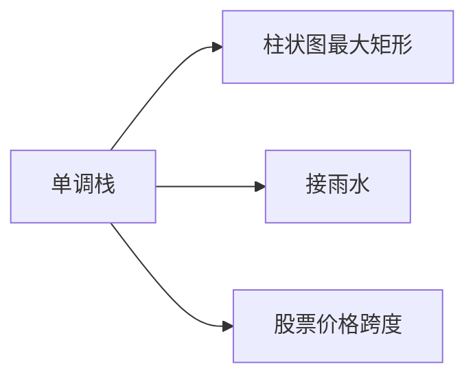

# 单调栈进阶

单调栈在基础应用（下一个更大元素）之上，还能解决柱状图最大矩形、接雨水、股票价格跨度等经典问题。本篇聚焦单调栈的进阶应用与思维模式。

## 一、单调栈回顾



维护一个单调递增（或递减）的栈，每个元素最多入栈出栈各一次 → O(n)。

```java tab
// 模板：找每个元素右边第一个比它大的
int[] nextGreater(int[] nums) {
    int n = nums.length;
    int[] result = new int[n];
    Arrays.fill(result, -1);
    Deque<Integer> stack = new ArrayDeque<>(); // 存索引

    for (int i = 0; i < n; i++) {
        while (!stack.isEmpty() && nums[stack.peek()] < nums[i]) {
            result[stack.pop()] = nums[i];
        }
        stack.push(i);
    }
    return result;
}
```

```typescript tab
// 模板：找每个元素右边第一个比它大的
function nextGreater(nums: number[]): number[] {
    const n = nums.length;
    const result = new Array(n).fill(-1);
    const stack: number[] = []; // 存索引

    for (let i = 0; i < n; i++) {
        while (stack.length > 0 && nums[stack[stack.length - 1]] < nums[i]) {
            result[stack.pop()!] = nums[i];
        }
        stack.push(i);
    }
    return result;
}
```

```python tab
# 模板：找每个元素右边第一个比它大的
def next_greater(nums: list[int]) -> list[int]:
    n = len(nums)
    result = [-1] * n
    stack = []  # 存索引

    for i in range(n):
        while stack and nums[stack[-1]] < nums[i]:
            result[stack.pop()] = nums[i]
        stack.append(i)
    return result
```

## 二、柱状图最大矩形（LeetCode 84）

对每根柱子，找左右第一个比它矮的位置 → 宽度确定 → 面积。

```java tab
int largestRectangleArea(int[] heights) {
    int n = heights.length;
    Deque<Integer> stack = new ArrayDeque<>();
    int maxArea = 0;

    for (int i = 0; i <= n; i++) {
        int h = (i == n) ? 0 : heights[i]; // 哨兵
        while (!stack.isEmpty() && heights[stack.peek()] > h) {
            int height = heights[stack.pop()];
            int width = stack.isEmpty() ? i : i - stack.peek() - 1;
            maxArea = Math.max(maxArea, height * width);
        }
        stack.push(i);
    }
    return maxArea;
}
```

```typescript tab
function largestRectangleArea(heights: number[]): number {
    const n = heights.length;
    const stack: number[] = [];
    let maxArea = 0;

    for (let i = 0; i <= n; i++) {
        const h = i === n ? 0 : heights[i]; // 哨兵
        while (stack.length > 0 && heights[stack[stack.length - 1]] > h) {
            const height = heights[stack.pop()!];
            const width = stack.length === 0 ? i : i - stack[stack.length - 1] - 1;
            maxArea = Math.max(maxArea, height * width);
        }
        stack.push(i);
    }
    return maxArea;
}
```

```python tab
def largest_rectangle_area(heights: list[int]) -> int:
    n = len(heights)
    stack = []
    max_area = 0

    for i in range(n + 1):
        h = 0 if i == n else heights[i]  # 哨兵
        while stack and heights[stack[-1]] > h:
            height = heights[stack.pop()]
            width = i if not stack else i - stack[-1] - 1
            max_area = max(max_area, height * width)
        stack.append(i)
    return max_area
```

## 三、接雨水（LeetCode 42）

### 方法一：单调栈（横向计算）

```java tab
int trap(int[] height) {
    Deque<Integer> stack = new ArrayDeque<>();
    int water = 0;
    for (int i = 0; i < height.length; i++) {
        while (!stack.isEmpty() && height[stack.peek()] < height[i]) {
            int bottom = stack.pop();
            if (stack.isEmpty()) break;
            int w = i - stack.peek() - 1;
            int h = Math.min(height[i], height[stack.peek()]) - height[bottom];
            water += w * h;
        }
        stack.push(i);
    }
    return water;
}
```

```typescript tab
function trap(height: number[]): number {
    const stack: number[] = [];
    let water = 0;
    for (let i = 0; i < height.length; i++) {
        while (stack.length > 0 && height[stack[stack.length - 1]] < height[i]) {
            const bottom = stack.pop()!;
            if (stack.length === 0) break;
            const w = i - stack[stack.length - 1] - 1;
            const h = Math.min(height[i], height[stack[stack.length - 1]]) - height[bottom];
            water += w * h;
        }
        stack.push(i);
    }
    return water;
}
```

```python tab
def trap(height: list[int]) -> int:
    stack = []
    water = 0
    for i in range(len(height)):
        while stack and height[stack[-1]] < height[i]:
            bottom = stack.pop()
            if not stack:
                break
            w = i - stack[-1] - 1
            h = min(height[i], height[stack[-1]]) - height[bottom]
            water += w * h
        stack.append(i)
    return water
```

### 方法二：双指针（纵向计算）

```java tab
int trap(int[] height) {
    int left = 0, right = height.length - 1;
    int leftMax = 0, rightMax = 0, water = 0;
    while (left < right) {
        if (height[left] < height[right]) {
            leftMax = Math.max(leftMax, height[left]);
            water += leftMax - height[left];
            left++;
        } else {
            rightMax = Math.max(rightMax, height[right]);
            water += rightMax - height[right];
            right--;
        }
    }
    return water;
}
```

```typescript tab
function trap(height: number[]): number {
    let left = 0, right = height.length - 1;
    let leftMax = 0, rightMax = 0, water = 0;
    while (left < right) {
        if (height[left] < height[right]) {
            leftMax = Math.max(leftMax, height[left]);
            water += leftMax - height[left];
            left++;
        } else {
            rightMax = Math.max(rightMax, height[right]);
            water += rightMax - height[right];
            right--;
        }
    }
    return water;
}
```

```python tab
def trap(height: list[int]) -> int:
    left, right = 0, len(height) - 1
    left_max = right_max = water = 0
    while left < right:
        if height[left] < height[right]:
            left_max = max(left_max, height[left])
            water += left_max - height[left]
            left += 1
        else:
            right_max = max(right_max, height[right])
            water += right_max - height[right]
            right -= 1
    return water
```

## 四、最大矩形（LeetCode 85）

将二维矩阵逐行转化为柱状图 → 每行调用 84 题：

```java tab
int maximalRectangle(char[][] matrix) {
    int m = matrix.length, n = matrix[0].length;
    int[] heights = new int[n];
    int maxArea = 0;
    for (int i = 0; i < m; i++) {
        for (int j = 0; j < n; j++) {
            heights[j] = matrix[i][j] == '1' ? heights[j] + 1 : 0;
        }
        maxArea = Math.max(maxArea, largestRectangleArea(heights));
    }
    return maxArea;
}
```

```typescript tab
function maximalRectangle(matrix: string[][]): number {
    const m = matrix.length, n = matrix[0].length;
    const heights = new Array(n).fill(0);
    let maxArea = 0;
    for (let i = 0; i < m; i++) {
        for (let j = 0; j < n; j++) {
            heights[j] = matrix[i][j] === '1' ? heights[j] + 1 : 0;
        }
        maxArea = Math.max(maxArea, largestRectangleArea(heights));
    }
    return maxArea;
}
```

```python tab
def maximal_rectangle(matrix: list[list[str]]) -> int:
    m, n = len(matrix), len(matrix[0])
    heights = [0] * n
    max_area = 0
    for i in range(m):
        for j in range(n):
            heights[j] = heights[j] + 1 if matrix[i][j] == '1' else 0
        max_area = max(max_area, largest_rectangle_area(heights))
    return max_area
```

## 五、股票价格跨度（LeetCode 901）

```java tab
// 在线查询：连续 ≤ 今天价格的天数
Deque<int[]> stack = new ArrayDeque<>(); // {price, span}

int next(int price) {
    int span = 1;
    while (!stack.isEmpty() && stack.peek()[0] <= price) {
        span += stack.pop()[1];
    }
    stack.push(new int[]{price, span});
    return span;
}
```

```typescript tab
// 在线查询：连续 ≤ 今天价格的天数
const stack: [number, number][] = []; // [price, span]

function next(price: number): number {
    let span = 1;
    while (stack.length > 0 && stack[stack.length - 1][0] <= price) {
        span += stack.pop()![1];
    }
    stack.push([price, span]);
    return span;
}
```

```python tab
# 在线查询：连续 ≤ 今天价格的天数
stack = []  # (price, span)

def next(price: int) -> int:
    span = 1
    while stack and stack[-1][0] <= price:
        span += stack.pop()[1]
    stack.append((price, span))
    return span
```

## 六、思维模式总结

| 问题 | 栈维护 | 弹出条件 |
|------|--------|---------|
| 下一个更大 | 递减栈 | 当前 > 栈顶 |
| 下一个更小 | 递增栈 | 当前 < 栈顶 |
| 最大矩形 | 递增栈 | 当前 < 栈顶（计算面积） |
| 接雨水 | 递减栈 | 当前 > 栈顶（计算水量） |

## 七、面试要点

1. **哨兵**：在数组末尾加 0，强制清空栈
2. **栈存索引**：方便计算宽度
3. **弹出时计算**：弹出元素确定了高度，栈顶和当前确定了宽度
4. **O(n) 保证**：每个元素最多入栈出栈各一次
5. **LeetCode**：84、85、42、496、503、739、901
