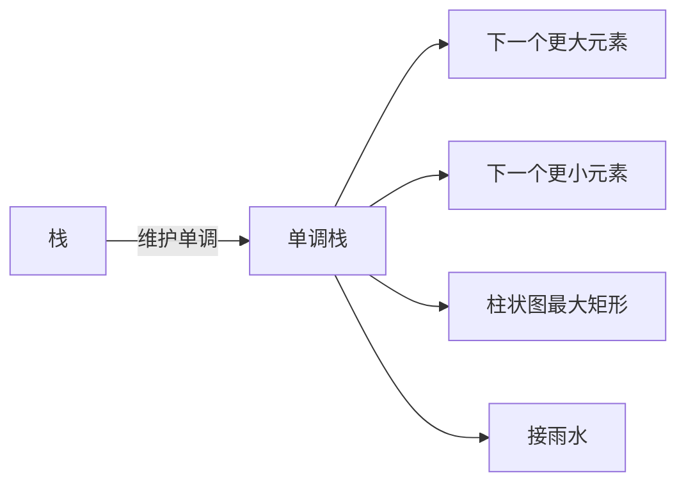

# 单调栈与单调队列：解决"下一个更大元素"类问题


## 一、什么是单调栈？

**单调栈**是栈内元素保持**单调递增**或**单调递减**的栈结构。  
它能在 O(n) 时间内解决一类"下一个更大/更小"问题。



## 二、核心思想

> **栈里保存"待匹配"的元素下标/值**。  
> 当前元素入栈时，把**破坏单调性的栈顶**全部弹出，弹出的就是"答案"。

例：求"下一个更大元素"。

```text
nums = [2, 1, 2, 4, 3]

单调递增栈（栈顶最小 → 栈底最大，遇到更大就弹），每个元素对应"下一个更大"：

i=0 (2): 栈空 → push(0)。栈 = [2]
i=1 (1): 1 < 2，**保持递增**（递增栈，1 让栈更"递增"），入栈。栈 = [2, 1]
i=2 (2): 2 > 1 → 弹出 1（1 的下一个更大就是 2，ans[1] = 2）。
        2 == 2，不弹（严格大于才弹）。
        push(2)。栈 = [2, 2]
i=3 (4): 4 > 2 → 弹出 2（ans[2] = 4）。
        4 > 2 → 弹出 2（ans[0] = 4）。
        栈空，push(3)。栈 = [4]
i=4 (3): 3 < 4，不弹。push(4)。栈 = [4, 3]

剩余栈中 [3, 4] 都没有"下一个更大"，ans 默认 -1。

最终答案：[4, 2, 4, -1, -1]
```

> **口诀**：求下一个更大 → **单调递减栈**（栈顶最小），遇更大就弹。
> 求下一个更小 → **单调递增栈**（栈顶最大），遇更小就弹。

## 三、模板

```java tab
int[] nextGreater(int[] nums) {
    int n = nums.length;
    int[] ans = new int[n];
    Arrays.fill(ans, -1);
    Deque<Integer> stack = new ArrayDeque<>();  // 存下标

    for (int i = 0; i < n; i++) {
        while (!stack.isEmpty() && nums[stack.peek()] < nums[i]) {
            ans[stack.pop()] = nums[i];
        }
        stack.push(i);
    }
    return ans;
}
```
```typescript tab
function nextGreater(nums: number[]): number[] {
    const n = nums.length;
    const ans = new Array(n).fill(-1);
    const stack: number[] = [];  // 存下标

    for (let i = 0; i < n; i++) {
        while (stack.length && nums[stack[stack.length - 1]] < nums[i]) {
            ans[stack.pop()!] = nums[i];
        }
        stack.push(i);
    }
    return ans;
}
```
```python tab
def next_greater(nums: list[int]) -> list[int]:
    n = len(nums)
    ans = [-1] * n
    stack = []  # 存下标

    for i in range(n):
        while stack and nums[stack[-1]] < nums[i]:
            ans[stack.pop()] = nums[i]
        stack.append(i)
    return ans
```

**复杂度**：每个元素最多入栈出栈各一次 → **O(n)**。

## 四、变种

### 4.1 下一个更大元素（含循环数组）

循环数组就是跑两遍：

```java tab
int[] nextGreaterCircular(int[] nums) {
    int n = nums.length;
    int[] ans = new int[n];
    Arrays.fill(ans, -1);
    Deque<Integer> stack = new ArrayDeque<>();
    for (int i = 0; i < 2 * n; i++) {
        while (!stack.isEmpty() && nums[stack.peek()] < nums[i % n]) {
            ans[stack.pop()] = nums[i % n];
        }
        if (i < n) stack.push(i);
    }
    return ans;
}
```
```typescript tab
function nextGreaterCircular(nums: number[]): number[] {
    const n = nums.length;
    const ans = new Array(n).fill(-1);
    const stack: number[] = [];
    for (let i = 0; i < 2 * n; i++) {
        while (stack.length && nums[stack[stack.length - 1]] < nums[i % n]) {
            ans[stack.pop()!] = nums[i % n];
        }
        if (i < n) stack.push(i);
    }
    return ans;
}
```
```python tab
def next_greater_circular(nums: list[int]) -> list[int]:
    n = len(nums)
    ans = [-1] * n
    stack = []
    for i in range(2 * n):
        while stack and nums[stack[-1]] < nums[i % n]:
            ans[stack.pop()] = nums[i % n]
        if i < n:
            stack.append(i)
    return ans
```

### 4.2 接雨水

单调递减栈（存柱子的下标）：

```java tab
public int trap(int[] h) {
    Deque<Integer> stack = new ArrayDeque<>();
    int ans = 0;
    for (int i = 0; i < h.length; i++) {
        while (!stack.isEmpty() && h[stack.peek()] < h[i]) {
            int bottom = stack.pop();
            if (stack.isEmpty()) break;
            int left = stack.peek();
            int width = i - left - 1;
            int height = Math.min(h[left], h[i]) - h[bottom];
            ans += width * height;
        }
        stack.push(i);
    }
    return ans;
}
```
```typescript tab
function trap(h: number[]): number {
    const stack: number[] = [];
    let ans = 0;
    for (let i = 0; i < h.length; i++) {
        while (stack.length && h[stack[stack.length - 1]] < h[i]) {
            const bottom = stack.pop()!;
            if (!stack.length) break;
            const left = stack[stack.length - 1];
            const width = i - left - 1;
            const height = Math.min(h[left], h[i]) - h[bottom];
            ans += width * height;
        }
        stack.push(i);
    }
    return ans;
}
```
```python tab
def trap(h: list[int]) -> int:
    stack = []
    ans = 0
    for i in range(len(h)):
        while stack and h[stack[-1]] < h[i]:
            bottom = stack.pop()
            if not stack:
                break
            left = stack[-1]
            width = i - left - 1
            height = min(h[left], h[i]) - h[bottom]
            ans += width * height
        stack.append(i)
    return ans
```

### 4.3 柱状图最大矩形

经典单调递增栈：

```java tab
public int largestRectangleArea(int[] h) {
    Deque<Integer> stack = new ArrayDeque<>();
    int ans = 0, n = h.length;
    for (int i = 0; i <= n; i++) {                  // 注意 i = n 时弹所有
        int curHeight = i == n ? 0 : h[i];
        while (!stack.isEmpty() && h[stack.peek()] > curHeight) {
            int height = h[stack.pop()];
            int width = stack.isEmpty() ? i : i - stack.peek() - 1;
            ans = Math.max(ans, height * width);
        }
        stack.push(i);
    }
    return ans;
}
```
```typescript tab
function largestRectangleArea(h: number[]): number {
    const stack: number[] = [];
    let ans = 0;
    const n = h.length;
    for (let i = 0; i <= n; i++) {                  // 注意 i = n 时弹所有
        const curHeight = i === n ? 0 : h[i];
        while (stack.length && h[stack[stack.length - 1]] > curHeight) {
            const height = h[stack.pop()!];
            const width = stack.length ? i - stack[stack.length - 1] - 1 : i;
            ans = Math.max(ans, height * width);
        }
        stack.push(i);
    }
    return ans;
}
```
```python tab
def largest_rectangle_area(h: list[int]) -> int:
    stack = []
    ans = 0
    n = len(h)
    for i in range(n + 1):                          # 注意 i = n 时弹所有
        cur_height = 0 if i == n else h[i]
        while stack and h[stack[-1]] > cur_height:
            height = h[stack.pop()]
            width = i if not stack else i - stack[-1] - 1
            ans = max(ans, height * width)
        stack.append(i)
    return ans
```

### 4.4 每日温度

单调栈经典题：

```java tab
public int[] dailyTemperatures(int[] T) {
    int[] ans = new int[T.length];
    Deque<Integer> stack = new ArrayDeque<>();
    for (int i = 0; i < T.length; i++) {
        while (!stack.isEmpty() && T[stack.peek()] < T[i]) {
            int prev = stack.pop();
            ans[prev] = i - prev;
        }
        stack.push(i);
    }
    return ans;
}
```
```typescript tab
function dailyTemperatures(T: number[]): number[] {
    const ans = new Array(T.length).fill(0);
    const stack: number[] = [];
    for (let i = 0; i < T.length; i++) {
        while (stack.length && T[stack[stack.length - 1]] < T[i]) {
            const prev = stack.pop()!;
            ans[prev] = i - prev;
        }
        stack.push(i);
    }
    return ans;
}
```
```python tab
def daily_temperatures(T: list[int]) -> list[int]:
    ans = [0] * len(T)
    stack = []
    for i in range(len(T)):
        while stack and T[stack[-1]] < T[i]:
            prev = stack.pop()
            ans[prev] = i - prev
        stack.append(i)
    return ans
```

## 五、单调队列

**单调队列**（deque 实现）保持队列内元素单调。  
它在 **滑动窗口最值** 问题上 O(1) 维护答案。

```java tab
int[] maxSlidingWindow(int[] nums, int k) {
    int[] ans = new int[nums.length - k + 1];
    Deque<Integer> q = new ArrayDeque<>();  // 单调递减：队首是最大值

    for (int i = 0; i < nums.length; i++) {
        // 1. 入队前清理：移除所有比当前元素小的
        while (!q.isEmpty() && nums[q.peekLast()] < nums[i]) q.pollLast();
        q.offerLast(i);
        // 2. 出队：移除超出窗口的
        if (q.peekFirst() <= i - k) q.pollFirst();
        // 3. 记录答案
        if (i >= k - 1) ans[i - k + 1] = nums[q.peekFirst()];
    }
    return ans;
}
```
```typescript tab
function maxSlidingWindow(nums: number[], k: number): number[] {
    const ans: number[] = new Array(nums.length - k + 1);
    const q: number[] = [];  // 单调递减：队首是最大值

    for (let i = 0; i < nums.length; i++) {
        // 1. 入队前清理：移除所有比当前元素小的
        while (q.length && nums[q[q.length - 1]] < nums[i]) q.pop();
        q.push(i);
        // 2. 出队：移除超出窗口的
        if (q[0] <= i - k) q.shift();
        // 3. 记录答案
        if (i >= k - 1) ans[i - k + 1] = nums[q[0]];
    }
    return ans;
}
```
```python tab
from collections import deque

def max_sliding_window(nums: list[int], k: int) -> list[int]:
    ans = []
    q = deque()  # 单调递减：队首是最大值

    for i in range(len(nums)):
        # 1. 入队前清理：移除所有比当前元素小的
        while q and nums[q[-1]] < nums[i]:
            q.pop()
        q.append(i)
        # 2. 出队：移除超出窗口的
        if q[0] <= i - k:
            q.popleft()
        # 3. 记录答案
        if i >= k - 1:
            ans.append(nums[q[0]])
    return ans
```

**核心规则**：
- 入队前弹掉所有**比当前小**的（维护单调性）。
- 队首总是当前窗口的最大值。
- 离开窗口的下标从队首弹出。

## 六、应用场景速查

| 场景 | 单调栈 | 单调队列 |
|------|--------|----------|
| 下一个更大/小 | ✅ | ❌ |
| 柱状图最大矩形 | ✅ | ❌ |
| 接雨水 | ✅ | ❌ |
| 滑动窗口最值 | ❌ | ✅ |
| 子数组最小和 | ✅ | ✅ |

## 七、易错点

1. **单调方向搞错**：求更大用递增栈（栈顶最小），求更小用递减栈。
2. **栈存下标还是值**：下标可以反推 i 和对应值，**默认存下标**。
3. **边界条件**：循环数组跑 2n；柱状图加一个 0 触发收尾。
4. **相等元素是否弹出**：取决于题目（一般求严格大于时相等不弹）。

## 八、复杂度分析

| 结构 | 操作 | 复杂度 |
|------|------|--------|
| 单调栈 | 入栈 / 出栈 / 查栈顶 | O(1) 均摊 |
| 单调队列 | 入队 / 出队 / 查首尾 | O(1) 均摊 |

> **为什么是"均摊"？** 每个元素最多被加入 / 移除一次。

## 九、刷题清单

| 难度 | 题目 | 类型 |
|------|------|------|
| 🟢 | 下一个更大元素 I | 单调栈 |
| 🟢 | 每日温度 | 单调栈 |
| 🟡 | 柱状图最大矩形 | 单调栈 |
| 🟡 | 接雨水 | 单调栈 / DP |
| 🟡 | 滑动窗口最大值 | 单调队列 |
| 🟠 | 下一个更大元素 II（循环） | 单调栈 |
| 🟠 | 子数组的最小值之和 | 单调栈 |
| 🔴 | 最大矩形（含 0/1 矩阵） | 单调栈 |

## 十、心法

> **单调栈是"反悔"型数据结构**。  
> 先入栈，遇到合适的就回溯处理栈顶。  
> 记住一句话：**"维护单调，破坏时处理"**。
