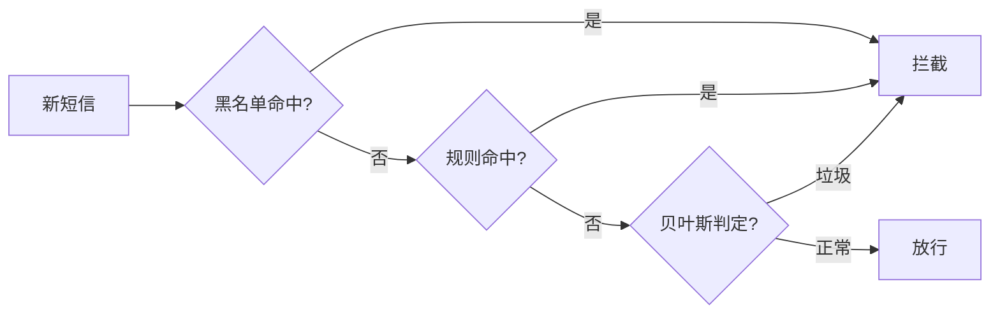

# 朴素贝叶斯与垃圾信息过滤


## 一、问题背景

如何自动过滤垃圾短信/垃圾邮件？三种递进方案：

| 方案 | 思路 | 局限 |
|------|------|------|
| 黑名单 | 散列表/布隆过滤器存储号码 | 新号码无法拦截 |
| 规则匹配 | 预设关键词/格式规则 | 规则有限，易被绕过 |
| **概率统计** | 朴素贝叶斯分类 | 需要大量标注样本 |

## 二、朴素贝叶斯原理

### 2.1 贝叶斯公式

\[
P(A|B) = \frac{P(B|A) \times P(A)}{P(B)}
\]

通俗理解：已知事件 B 发生，反推事件 A 发生的概率。

### 2.2 垃圾短信分类

目标：计算一条短信是垃圾短信的概率。

\[
P(\text{垃圾} | W_1, W_2, ..., W_n) = \frac{P(W_1, W_2, ..., W_n | \text{垃圾}) \times P(\text{垃圾})}{P(W_1, W_2, ..., W_n)}
\]

### 2.3 "朴素"假设

直接计算联合概率 \(P(W_1, W_2, ..., W_n | \text{垃圾})\) 几乎不可能（样本中不存在完全相同的词组合）。

**朴素假设**：各词的出现相互独立，则：

\[
P(W_1, W_2, ..., W_n | \text{垃圾}) = \prod_{i=1}^{n} P(W_i | \text{垃圾})
\]

每个 \(P(W_i | \text{垃圾})\) 都可以通过样本统计轻松获得。

## 三、实现步骤

### 3.1 训练阶段

1. 准备大量已标注样本（垃圾/正常）
2. 对每条短信**分词**，去除停用词
3. 统计每个词在垃圾短信中出现的概率
4. 统计每个词在正常短信中出现的概率
5. 统计垃圾短信的先验概率 P(垃圾)

### 3.2 预测阶段

对新短信分词后，分别计算：

```text
p1 = P(垃圾) × ∏ P(Wi | 垃圾)
p2 = P(正常) × ∏ P(Wi | 正常)
```

比较 p1 与 p2，取概率更大的类别（argmax）作为判定结果。

### 3.3 代码实现

```python tab
import math
from collections import defaultdict

class NaiveBayesClassifier:
    def __init__(self):
        self.word_counts = {'spam': defaultdict(int), 'ham': defaultdict(int)}
        self.class_counts = {'spam': 0, 'ham': 0}
        self.vocab = set()

    def train(self, text, label):
        """训练一条样本"""
        self.class_counts[label] += 1
        words = text.split()
        for w in words:
            self.word_counts[label][w] += 1
            self.vocab.add(w)

    def predict(self, text):
        """预测类别，返回 (label, log_probability)"""
        words = text.split()
        total = self.class_counts['spam'] + self.class_counts['ham']
        vocab_size = len(self.vocab)
        scores = {}

        for label in ['spam', 'ham']:
            # 先验概率（取 log 防下溢）
            score = math.log(self.class_counts[label] / total)
            # 该类总词数
            total_words = sum(self.word_counts[label].values())
            for w in words:
                # 拉普拉斯平滑
                count = self.word_counts[label].get(w, 0)
                score += math.log((count + 1) / (total_words + vocab_size))
            scores[label] = score

        return 'spam' if scores['spam'] > scores['ham'] else 'ham'
```

```java tab
public class NaiveBayes {
    private Map<String, Map<String, Integer>> wordCounts = new HashMap<>();
    private Map<String, Integer> classCounts = new HashMap<>();
    private Set<String> vocab = new HashSet<>();

    public void train(String text, String label) {
        classCounts.merge(label, 1, Integer::sum);
        wordCounts.putIfAbsent(label, new HashMap<>());
        for (String w : text.split("\\s+")) {
            wordCounts.get(label).merge(w, 1, Integer::sum);
            vocab.add(w);
        }
    }

    public String predict(String text) {
        int total = classCounts.values().stream().mapToInt(Integer::intValue).sum();
        int vocabSize = vocab.size();
        double bestScore = Double.NEGATIVE_INFINITY;
        String bestLabel = "";

        for (String label : classCounts.keySet()) {
            double score = Math.log((double) classCounts.get(label) / total);
            int totalWords = wordCounts.get(label).values().stream()
                .mapToInt(Integer::intValue).sum();
            for (String w : text.split("\\s+")) {
                int count = wordCounts.get(label).getOrDefault(w, 0);
                score += Math.log((count + 1.0) / (totalWords + vocabSize));
            }
            if (score > bestScore) {
                bestScore = score;
                bestLabel = label;
            }
        }
        return bestLabel;
    }
}
```

## 四、关键技巧

### 4.1 拉普拉斯平滑

如果某个词从未在垃圾短信中出现，\(P(W_i|垃圾) = 0\)，连乘后整体为 0。

解决：分子 +1，分母 + 词表大小（拉普拉斯平滑）。

### 4.2 取对数防下溢

多个小于 1 的概率连乘 → 浮点数下溢为 0。

解决：取 log，将乘法变为加法。

### 4.3 准确率与召回率的权衡

| 指标 | 含义 | 垃圾短信场景 |
|------|------|-------------|
| 准确率 | 判为垃圾的中，真是垃圾的比例 | 误判正常短信 → 用户投诉 |
| 召回率 | 所有垃圾中，被拦截的比例 | 漏掉垃圾 → 体验差 |

> 实践中宁可漏掉一些垃圾（保准确率），也不能误拦重要短信。

## 五、应用场景

| 场景 | 说明 |
|------|------|
| 垃圾邮件过滤 | Gmail 经典应用 |
| 垃圾短信拦截 | 手机端本地分类 |
| 情感分析 | 正面/负面评论分类 |
| 新闻分类 | 体育/科技/财经自动归类 |
| 垃圾评论检测 | 社交平台内容审核 |

## 六、三种过滤器的组合

实际工程中，将三种方案**串联**使用：



黑名单、规则、贝叶斯三层级联过滤：任一命中即拦截；只有三层全部放行的才判为正常。

## 七、总结

朴素贝叶斯的核心优势：

- **实现简单**：只需统计词频
- **训练快速**：O(样本总词数)
- **效果不错**：在文本分类中表现优异
- **可解释性强**：每个词的贡献清晰

核心取舍：用"特征独立"这个不完全正确的假设，换取了计算上的极大简化。
