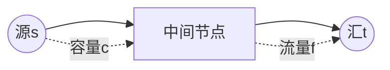

# 网络流基础

网络流是图论中研究"流量"在带容量网络中如何分配的框架。最大流、最小割、费用流是三大核心问题，广泛应用于匹配、调度、资源分配等场景。

## 一、基本概念



- **源点 s**：流的起点
- **汇点 t**：流的终点
- **容量 c(u,v)**：边 (u,v) 的最大流量
- **流量 f(u,v)**：边 (u,v) 的实际流量
- **约束**：0 ≤ f(u,v) ≤ c(u,v)，流量守恒（除 s、t 外入=出）

## 二、最大流问题

求从 s 到 t 的最大总流量。

### Ford-Fulkerson 思想

1. 找一条从 s 到 t 的**增广路**（残余容量 > 0）
2. 沿增广路推送尽可能多的流量
3. 重复直到无增广路

### Edmonds-Karp（BFS 找增广路）

```java tab
int maxFlow(int[][] capacity, int s, int t) {
    int n = capacity.length;
    int[][] residual = new int[n][n]; // 残余网络
    for (int i = 0; i < n; i++) residual[i] = capacity[i].clone();

    int flow = 0;
    int[] parent = new int[n];

    while (bfs(residual, s, t, parent)) {
        // 找增广路上的最小残余容量
        int pathFlow = Integer.MAX_VALUE;
        for (int v = t; v != s; v = parent[v]) {
            pathFlow = Math.min(pathFlow, residual[parent[v]][v]);
        }
        // 更新残余网络
        for (int v = t; v != s; v = parent[v]) {
            int u = parent[v];
            residual[u][v] -= pathFlow;
            residual[v][u] += pathFlow; // 反向边
        }
        flow += pathFlow;
    }
    return flow;
}

boolean bfs(int[][] residual, int s, int t, int[] parent) {
    Arrays.fill(parent, -1);
    parent[s] = s;
    Queue<Integer> q = new LinkedList<>();
    q.offer(s);
    while (!q.isEmpty()) {
        int u = q.poll();
        for (int v = 0; v < residual.length; v++) {
            if (parent[v] == -1 && residual[u][v] > 0) {
                parent[v] = u;
                if (v == t) return true;
                q.offer(v);
            }
        }
    }
    return false;
}
```

```typescript tab
function maxFlow(capacity: number[][], s: number, t: number): number {
    const n = capacity.length;
    const residual = capacity.map(row => [...row]); // 残余网络

    let flow = 0;
    const parent = new Array(n).fill(-1);

    while (bfs(residual, s, t, parent)) {
        // 找增广路上的最小残余容量
        let pathFlow = Infinity;
        for (let v = t; v !== s; v = parent[v]) {
            pathFlow = Math.min(pathFlow, residual[parent[v]][v]);
        }
        // 更新残余网络
        for (let v = t; v !== s; v = parent[v]) {
            const u = parent[v];
            residual[u][v] -= pathFlow;
            residual[v][u] += pathFlow; // 反向边
        }
        flow += pathFlow;
    }
    return flow;
}

function bfs(residual: number[][], s: number, t: number, parent: number[]): boolean {
    parent.fill(-1);
    parent[s] = s;
    const q: number[] = [s];
    while (q.length > 0) {
        const u = q.shift()!;
        for (let v = 0; v < residual.length; v++) {
            if (parent[v] === -1 && residual[u][v] > 0) {
                parent[v] = u;
                if (v === t) return true;
                q.push(v);
            }
        }
    }
    return false;
}
```

```python tab
from collections import deque

def max_flow(capacity: list, s: int, t: int) -> int:
    n = len(capacity)
    residual = [row[:] for row in capacity]  # 残余网络

    flow = 0
    parent = [-1] * n

    while bfs(residual, s, t, parent):
        # 找增广路上的最小残余容量
        path_flow = float('inf')
        v = t
        while v != s:
            path_flow = min(path_flow, residual[parent[v]][v])
            v = parent[v]
        # 更新残余网络
        v = t
        while v != s:
            u = parent[v]
            residual[u][v] -= path_flow
            residual[v][u] += path_flow  # 反向边
            v = parent[v]
        flow += path_flow
    return flow

def bfs(residual: list, s: int, t: int, parent: list) -> bool:
    n = len(residual)
    for i in range(n):
        parent[i] = -1
    parent[s] = s
    q = deque([s])
    while q:
        u = q.popleft()
        for v in range(n):
            if parent[v] == -1 and residual[u][v] > 0:
                parent[v] = u
                if v == t:
                    return True
                q.append(v)
    return False
```

## 三、最小割定理

**最大流 = 最小割**

- 割：将顶点分为 S（含 s）和 T（含 t）两组
- 割容量：从 S 到 T 的所有边容量之和
- 最小割 = 最大流的值

## 四、Dinic 算法（高效最大流）

BFS 分层 + DFS 多路增广：

```java tab
// 时间 O(V²E)，实际远快于此
int dinic(int s, int t) {
    int flow = 0;
    while (bfsLevel(s, t)) { // 建层次图
        Arrays.fill(iter, 0);
        int f;
        while ((f = dfs(s, t, INF)) > 0) {
            flow += f;
        }
    }
    return flow;
}
```

```typescript tab
// 时间 O(V²E)，实际远快于此
function dinic(s: number, t: number): number {
    let flow = 0;
    while (bfsLevel(s, t)) { // 建层次图
        iter.fill(0);
        let f: number;
        while ((f = dfs(s, t, Infinity)) > 0) {
            flow += f;
        }
    }
    return flow;
}
```

```python tab
# 时间 O(V²E)，实际远快于此
def dinic(s: int, t: int) -> int:
    flow = 0
    INF = float('inf')
    while bfs_level(s, t):  # 建层次图
        iter_idx = [0] * n
        while True:
            f = dfs(s, t, INF, iter_idx)
            if f == 0:
                break
            flow += f
    return flow
```

## 五、经典建模

### 二分图最大匹配

```
s → 左部点（容量1）→ 右部点（容量1）→ t
```

最大匹配数 = 最大流。

### 最小路径覆盖

DAG 上用最少的路径覆盖所有顶点 = n - 最大匹配。

### 最大闭合子图

正权点连 s，负权点连 t，原图边容量 ∞。
答案 = 正权总和 - 最小割。

## 六、费用流（了解）

在最大流基础上，每条边有单位费用，求最小费用最大流。
算法：SPFA 找最短路增广（类似 Bellman-Ford）。

## 七、复杂度

| 算法 | 时间 |
|------|------|
| Edmonds-Karp | O(VE²) |
| Dinic | O(V²E) |
| ISAP | O(V²E) |
| 费用流（SPFA） | O(VE × 流量) |

## 八、面试要点

1. **残余网络**：正向减、反向加，允许"撤销"流量
2. **最大流最小割定理**：两者数值相等
3. **二分图匹配 → 最大流**：面试最常考的建模
4. **Dinic 分层**：BFS 建层 + DFS 阻塞流
5. **LeetCode**：无直接最大流题，但 1066（校园自行车分配 II）可用匹配思想
