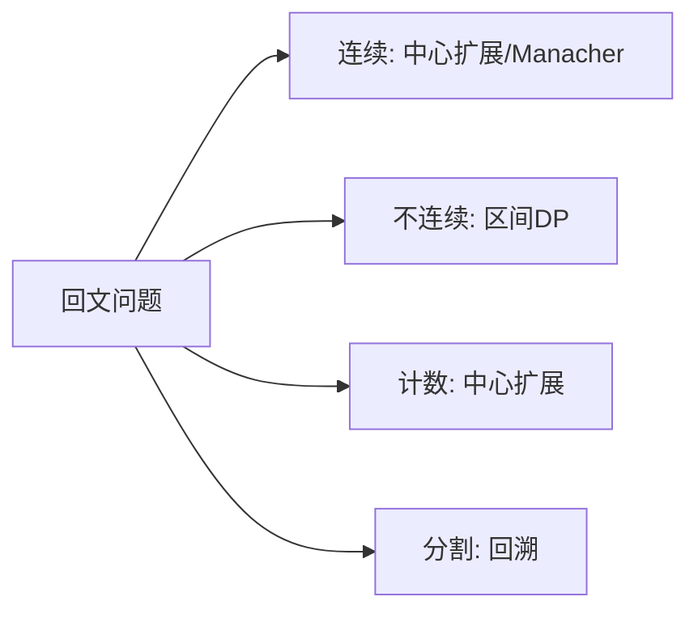

# 回文问题专题：中心扩展、区间 DP 与回溯

## 一、回文问题族全景



回文是面试中出现频率极高的主题，核心题目共享"对称性"这一结构特征：

| 题目 | 问题 | 最优解法 |
|------|------|----------|
| LC 5. 最长回文子串 | 找最长的连续回文 | 中心扩展 O(n²) / Manacher O(n) |
| LC 516. 最长回文子序列 | 找最长的不连续回文 | 区间 DP O(n²) |
| LC 647. 回文子串 | 统计回文子串个数 | 中心扩展 O(n²) |
| LC 131. 分割回文串 | 切成若干回文段 | 回溯 + 预处理 |
| LC 132. 分割回文串 II | 最少切几刀 | DP on 回文判定表 |

**关键区分**：子串（连续）vs 子序列（不连续），解法完全不同。

## 二、LC 5：最长回文子串

### 2.1 中心扩展法

回文的定义天然适合"从中心向两边扩展"：

- 奇数长度回文：中心是 1 个字符
- 偶数长度回文：中心是 2 个字符之间

共 `2n-1` 个中心，每个中心最多扩展 O(n) 次。

```java tab
public String longestPalindrome(String s) {
    int start = 0, maxLen = 0;
    for (int i = 0; i < s.length(); i++) {
        int len1 = expand(s, i, i);      // 奇数中心
        int len2 = expand(s, i, i + 1);  // 偶数中心
        int len = Math.max(len1, len2);
        if (len > maxLen) {
            maxLen = len;
            start = i - (len - 1) / 2;
        }
    }
    return s.substring(start, start + maxLen);
}

private int expand(String s, int l, int r) {
    while (l >= 0 && r < s.length() && s.charAt(l) == s.charAt(r)) {
        l--; r++;
    }
    return r - l - 1;  // 回文长度
}
```

```typescript tab
function longestPalindrome(s: string): string {
    let start = 0, maxLen = 0;

    const expand = (l: number, r: number): number => {
        while (l >= 0 && r < s.length && s[l] === s[r]) { l--; r++; }
        return r - l - 1;
    };

    for (let i = 0; i < s.length; i++) {
        const len = Math.max(expand(i, i), expand(i, i + 1));
        if (len > maxLen) {
            maxLen = len;
            start = i - Math.floor((len - 1) / 2);
        }
    }
    return s.slice(start, start + maxLen);
}
```

```python tab
def longestPalindrome(s: str) -> str:
    def expand(l: int, r: int) -> int:
        while l >= 0 and r < len(s) and s[l] == s[r]:
            l -= 1
            r += 1
        return r - l - 1

    start, max_len = 0, 0
    for i in range(len(s)):
        length = max(expand(i, i), expand(i, i + 1))
        if length > max_len:
            max_len = length
            start = i - (length - 1) // 2
    return s[start:start + max_len]
```

**复杂度**：时间 O(n²)，空间 O(1)。

### 2.2 DP 解法（回文判定表）

`dp[i][j]` = `s[i..j]` 是否为回文：

```text
dp[i][j] = (s[i] == s[j]) && (j - i < 3 || dp[i+1][j-1])
```

注意遍历顺序：`i` 从大到小，`j` 从小到大（保证 `dp[i+1][j-1]` 已算出）。

```typescript tab
function longestPalindrome(s: string): string {
    const n = s.length;
    const dp: boolean[][] = Array.from({ length: n }, () => new Array(n).fill(false));
    let start = 0, maxLen = 1;

    for (let i = n - 1; i >= 0; i--) {
        for (let j = i; j < n; j++) {
            dp[i][j] = s[i] === s[j] && (j - i < 3 || dp[i + 1][j - 1]);
            if (dp[i][j] && j - i + 1 > maxLen) {
                maxLen = j - i + 1;
                start = i;
            }
        }
    }
    return s.slice(start, start + maxLen);
}
```

### 2.3 Manacher 算法（O(n)）

利用已知回文信息跳过重复比较，详见 [Manacher 算法](/tutorials/manacher)。面试中中心扩展足够，Manacher 作为加分项。

## 三、LC 516：最长回文子序列

### 3.1 状态定义

`dp[i][j]` = `s[i..j]` 范围内最长回文**子序列**的长度。

### 3.2 转移方程

```text
若 s[i] == s[j]：dp[i][j] = dp[i+1][j-1] + 2
否则：dp[i][j] = max(dp[i+1][j], dp[i][j-1])
```

**边界**：`dp[i][i] = 1`（单个字符是长度为 1 的回文）。

### 3.3 完整实现

```java tab
public int longestPalindromeSubseq(String s) {
    int n = s.length();
    int[][] dp = new int[n][n];
    for (int i = n - 1; i >= 0; i--) {
        dp[i][i] = 1;
        for (int j = i + 1; j < n; j++) {
            if (s.charAt(i) == s.charAt(j)) {
                dp[i][j] = dp[i + 1][j - 1] + 2;
            } else {
                dp[i][j] = Math.max(dp[i + 1][j], dp[i][j - 1]);
            }
        }
    }
    return dp[0][n - 1];
}
```

```typescript tab
function longestPalindromeSubseq(s: string): number {
    const n = s.length;
    const dp: number[][] = Array.from({ length: n }, () => new Array(n).fill(0));

    for (let i = n - 1; i >= 0; i--) {
        dp[i][i] = 1;
        for (let j = i + 1; j < n; j++) {
            dp[i][j] = s[i] === s[j]
                ? dp[i + 1][j - 1] + 2
                : Math.max(dp[i + 1][j], dp[i][j - 1]);
        }
    }
    return dp[0][n - 1];
}
```

```python tab
def longestPalindromeSubseq(s: str) -> int:
    n = len(s)
    dp = [[0] * n for _ in range(n)]
    for i in range(n - 1, -1, -1):
        dp[i][i] = 1
        for j in range(i + 1, n):
            if s[i] == s[j]:
                dp[i][j] = dp[i + 1][j - 1] + 2
            else:
                dp[i][j] = max(dp[i + 1][j], dp[i][j - 1])
    return dp[0][n - 1]
```

**复杂度**：时间 O(n²)，空间 O(n²)。

### 3.4 与 LCS 的关系

`s` 的最长回文子序列 = `s` 与 `reverse(s)` 的**最长公共子序列**。

## 四、LC 647：回文子串计数

中心扩展法直接统计：

```typescript tab
function countSubstrings(s: string): number {
    let count = 0;
    const expand = (l: number, r: number) => {
        while (l >= 0 && r < s.length && s[l] === s[r]) {
            count++;
            l--; r++;
        }
    };
    for (let i = 0; i < s.length; i++) {
        expand(i, i);      // 奇数
        expand(i, i + 1);  // 偶数
    }
    return count;
}
```

```python tab
def countSubstrings(s: str) -> int:
    count = 0
    def expand(l: int, r: int):
        nonlocal count
        while l >= 0 and r < len(s) and s[l] == s[r]:
            count += 1
            l -= 1
            r += 1
    for i in range(len(s)):
        expand(i, i)
        expand(i, i + 1)
    return count
```

## 五、LC 131：分割回文串（回溯）

### 5.1 思路

回溯枚举所有切法，剪枝条件：当前段不是回文则跳过。先预处理回文表加速判断。

### 5.2 完整实现

```typescript tab
function partition(s: string): string[][] {
    const n = s.length;
    // 预处理回文判定表
    const isPalin: boolean[][] = Array.from({ length: n }, () => new Array(n).fill(false));
    for (let i = n - 1; i >= 0; i--)
        for (let j = i; j < n; j++)
            isPalin[i][j] = s[i] === s[j] && (j - i < 3 || isPalin[i + 1][j - 1]);

    const result: string[][] = [];
    const path: string[] = [];

    const backtrack = (start: number) => {
        if (start === n) { result.push([...path]); return; }
        for (let end = start; end < n; end++) {
            if (!isPalin[start][end]) continue;
            path.push(s.slice(start, end + 1));
            backtrack(end + 1);
            path.pop();
        }
    };

    backtrack(0);
    return result;
}
```

```java tab
public List<List<String>> partition(String s) {
    int n = s.length();
    boolean[][] isPalin = new boolean[n][n];
    for (int i = n - 1; i >= 0; i--)
        for (int j = i; j < n; j++)
            isPalin[i][j] = s.charAt(i) == s.charAt(j) && (j - i < 3 || isPalin[i + 1][j - 1]);

    List<List<String>> result = new ArrayList<>();
    backtrack(s, 0, isPalin, new ArrayList<>(), result);
    return result;
}

private void backtrack(String s, int start, boolean[][] isPalin,
                       List<String> path, List<List<String>> result) {
    if (start == s.length()) { result.add(new ArrayList<>(path)); return; }
    for (int end = start; end < s.length(); end++) {
        if (!isPalin[start][end]) continue;
        path.add(s.substring(start, end + 1));
        backtrack(s, end + 1, isPalin, path, result);
        path.remove(path.size() - 1);
    }
}
```

## 六、LC 132：最少分割次数（DP）

`cuts[i]` = `s[0..i]` 全部切成回文的最少刀数：

```text
若 s[j..i] 是回文：
    cuts[i] = j == 0 ? 0 : min(cuts[i], cuts[j-1] + 1)
```

```typescript tab
function minCut(s: string): number {
    const n = s.length;
    const isPalin: boolean[][] = Array.from({ length: n }, () => new Array(n).fill(false));
    for (let i = n - 1; i >= 0; i--)
        for (let j = i; j < n; j++)
            isPalin[i][j] = s[i] === s[j] && (j - i < 3 || isPalin[i + 1][j - 1]);

    const cuts = new Array(n).fill(Infinity);
    for (let i = 0; i < n; i++) {
        if (isPalin[0][i]) { cuts[i] = 0; continue; }
        for (let j = 1; j <= i; j++) {
            if (isPalin[j][i]) cuts[i] = Math.min(cuts[i], cuts[j - 1] + 1);
        }
    }
    return cuts[n - 1];
}
```

## 七、方法选择决策树

| 问题特征 | 方法 |
|----------|------|
| 最长回文**子串**（连续） | 中心扩展 / DP 表 / Manacher |
| 最长回文**子序列**（不连续） | 区间 DP / LCS 转化 |
| 统计回文数量 | 中心扩展 |
| 枚举所有回文分割 | 回溯 + 回文表剪枝 |
| 最少分割刀数 | DP + 回文表 |

## 八、面试常见题

- 🟡 LC 5. 最长回文子串（超高频）
- 🟡 LC 516. 最长回文子序列
- 🟡 LC 647. 回文子串
- 🟡 LC 131. 分割回文串
- 🔴 LC 132. 分割回文串 II
- 🟢 LC 125. 验证回文串（双指针入门）
- 🟢 LC 680. 验证回文串 II（最多删一个字符）

## 九、易错点

1. **中心扩展忘记偶数情况**：`expand(i, i)` 和 `expand(i, i+1)` 缺一不可。
2. **区间 DP 遍历顺序**：`i` 必须从大到小（依赖 `dp[i+1][...]`）。
3. **`j - i < 3` 的含义**：长度 ≤ 3 且两端相等必为回文，无需查表。
4. **子串 vs 子序列混淆**：子串要求连续，子序列可以跳跃。

## 十、心法口诀

> **子串扩展从中心，奇偶两轮别忘记；**
> **子序列用区间 DP，两端相等加二级。**
