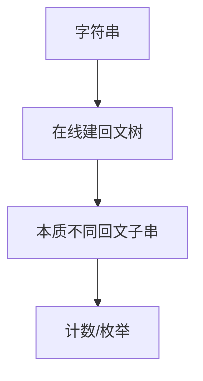

# 回文树（Palindromic Tree / Eertree）

## 一、为什么学回文树？



回文树（又称 Eertree）是用 O(n) 时间和 O(n) 空间，在线维护字符串所有**本质不同回文子串**的数据结构。相比 Manacher（只求半径），回文树能：

- 统计每个回文子串的出现次数
- 枚举所有本质不同回文子串
- 支持在线追加字符（动态串）

## 二、结构

每个节点代表一个回文子串，两条特殊边：

- **next[c]**：在当前回文两侧各加字符 c 得到的新回文
- **fail（后缀失配链）**：当前回文的最长回文真后缀

两个根节点：
- 根 0：代表长度为 −1 的"虚回文"（方便奇长度处理）
- 根 1：代表长度为 0 的空串

## 三、在线构造

```java tab
class Node { int len, fail; int[] next = new int[26]; int cnt; }
Node[] nodes = new Node[2 * N];
nodes[0] = new Node(); nodes[0].len = -1; // 奇根
nodes[1] = new Node();                    // 偶根
int last, sz = 2;
int getFail(int x, String s, int i) {
    while (i - nodes[x].len - 1 < 0 || s.charAt(i - nodes[x].len - 1) != s.charAt(i))
        x = nodes[x].fail;
    return x;
}
void add(char c, int i, String s) {
    int x = getFail(last, s, i);
    int idx = c - 'a';
    if (nodes[x].next[idx] != 0) { last = nodes[x].next[idx]; nodes[last].cnt++; return; }
    int cur = sz++; nodes[cur] = new Node();
    nodes[cur].len = nodes[x].len + 2;
    nodes[x].next[idx] = cur;
    if (nodes[cur].len == 1) nodes[cur].fail = 1;
    else nodes[cur].fail = nodes[getFail(nodes[x].fail, s, i)].next[idx];
    last = cur; nodes[cur].cnt = 1;
}
```

```typescript tab
class Node { len = 0; fail = 0; cnt = 0; next: number[] = new Array(26).fill(0); }
const nodes: Node[] = [new Node(), new Node()];
nodes[0].len = -1; // 奇根
let last = 0, sz = 2;
function getFail(x: number, s: string, i: number): number {
    while (i - nodes[x].len - 1 < 0 || s[i - nodes[x].len - 1] !== s[i]) x = nodes[x].fail;
    return x;
}
function add(c: string, i: number, s: string) {
    const x = getFail(last, s, i);
    const idx = c.charCodeAt(0) - 97;
    if (nodes[x].next[idx] !== 0) { last = nodes[x].next[idx]; nodes[last].cnt++; return; }
    const cur = sz++; nodes.push(new Node());
    nodes[cur].len = nodes[x].len + 2;
    nodes[x].next[idx] = cur;
    if (nodes[cur].len === 1) nodes[cur].fail = 1;
    else nodes[cur].fail = nodes[getFail(nodes[x].fail, s, i)].next[idx];
    last = cur; nodes[cur].cnt = 1;
}
```

```python tab
class Node:
    def __init__(self):
        self.len = 0
        self.fail = 0
        self.cnt = 0
        self.next = [0] * 26
nodes: list[Node] = [Node(), Node()]
nodes[0].len = -1  # 奇根
last = 0
sz = 2
def get_fail(x: int, s: str, i: int) -> int:
    while i - nodes[x].len - 1 < 0 or s[i - nodes[x].len - 1] != s[i]:
        x = nodes[x].fail
    return x
def add(c: str, i: int, s: str):
    global last, sz
    x = get_fail(last, s, i)
    idx = ord(c) - 97
    if nodes[x].next[idx] != 0:
        last = nodes[x].next[idx]
        nodes[last].cnt += 1
        return
    cur = sz; sz += 1
    nodes.append(Node())
    nodes[cur].len = nodes[x].len + 2
    nodes[x].next[idx] = cur
    if nodes[cur].len == 1:
        nodes[cur].fail = 1
    else:
        nodes[cur].fail = nodes[get_fail(nodes[x].fail, s, i)].next[idx]
    last = cur
    nodes[cur].cnt = 1
```

## 四、出现次数统计

构造后按 len 从大到小（拓扑序）累加：`cnt[fail[v]] += cnt[v]`。

## 五、复杂度

| 项目 | 复杂度 |
|------|--------|
| 构造时间 | O(n)（均摊） |
| 空间 | O(n × Σ) |
| 本质不同回文子串数 | ≤ n+1 |

## 六、面试要点

1. 两个根：奇根 len=−1、偶根 len=0
2. fail 链指向"最长回文真后缀"，类似 AC 自动机的 fail
3. 与 Manacher 区别：SAM 求子串、Manacher 求半径、回文树求回文族
4. LeetCode：回文子串计数、本质不同回文子串数
