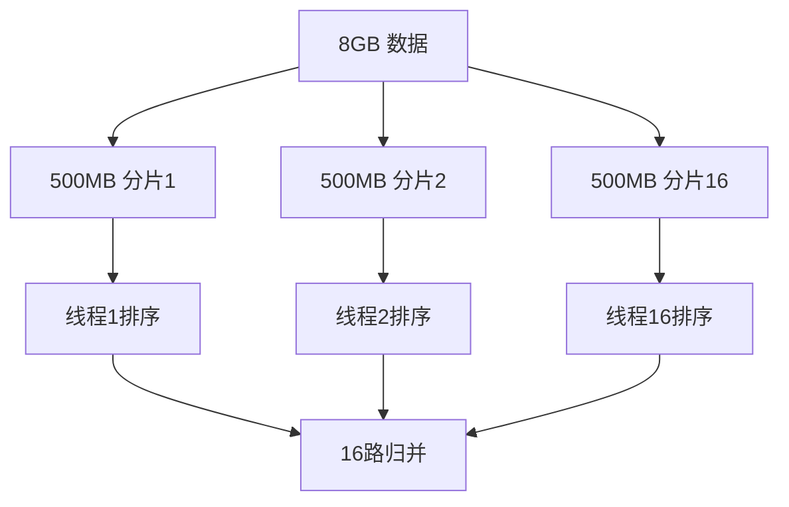
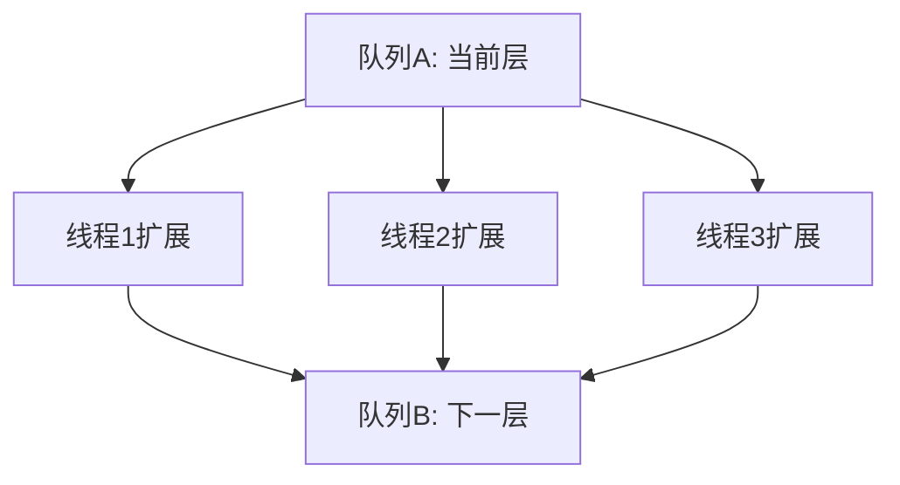
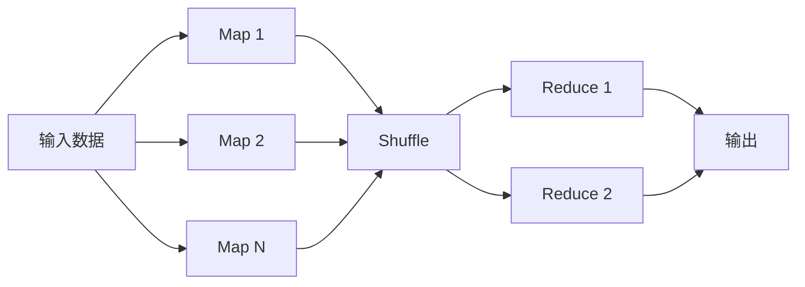

# 并行算法


## 一、问题背景

当算法层面已无法继续优化（如排序已是 O(n log n)），如何进一步提升性能？

答案：**利用多核/多机并行计算**。

核心思想：**对数据分片，对无依赖关系的任务并行执行**。

> 时间复杂度不变，但实际执行时间缩短为 1/K（K 为并行度）。

## 二、并行排序

### 2.1 归并排序并行化

将 8GB 数据分为 16 个 500MB 的子集：



步骤：
1. 将数据**任意分片**为 K 份
2. K 个线程并行排序各自分片
3. 对 K 个有序结果做**多路归并**

### 2.2 快排并行化

1. 扫描一遍数据，确定值域范围
2. 将值域均匀划分为 K 个区间
3. 将数据按值分配到对应区间
4. K 个线程并行排序各区间
5. 拼接结果（无需归并，天然有序）

### 2.3 对比

| 方案 | 分片方式 | 是否需要归并 | 类似算法 |
|------|----------|-------------|----------|
| 归并并行化 | 任意切分 | 需要 | 归并排序 |
| 快排并行化 | 按值域划分 | 不需要 | 桶排序 |

## 三、并行查找

### 3.1 分片散列表

将 2GB 数据分散到 16 个小散列表中：

| 优势 | 说明 |
|------|------|
| 扩容代价低 | 只需扩容单个小表（75MB vs 1GB） |
| 内存利用率高 | 每个小表独立管理装载因子 |
| 并行查找 | 16 线程同时查找，性能不降反升 |

### 3.2 插入策略

新数据放入**装载因子最小**的散列表，均衡负载。

## 四、并行字符串匹配

### 4.1 基本思路

将大文本切分为 K 段，K 个线程并行匹配。

### 4.2 边界问题

关键词可能恰好被切分在两段交界处：

```text
...abc | def...
关键词: "cde" → 在任何单段中都找不到
```

解决方案：每段**首尾各多取 m 个字符**（m = 关键词长度），对重叠区域额外匹配一次。


## 五、并行 BFS

广度优先搜索天然适合并行化——同一层的顶点互不依赖：



实现要点：
- 使用**双队列**交替：A 扩展 → B，B 扩展 → A
- 每层内多线程并行，层间同步等待
- 需要线程安全的入队操作（CAS 或分段锁）

## 六、MapReduce 框架

Google 的 MapReduce 是并行算法思想的工业化实现：



| 阶段 | 作用 | 对应算法思想 |
|------|------|-------------|
| Map | 数据分片、独立处理 | 分治 |
| Shuffle | 按 key 聚合 | 哈希分桶 |
| Reduce | 汇总结果 | 归并 |

## 七、并行算法设计原则

| 原则 | 说明 |
|------|------|
| 数据无依赖 | 分片间不需要通信才能并行 |
| 负载均衡 | 各分片大小/计算量尽量均匀 |
| 减少通信 | 并行开销主要在同步和数据传输 |
| 边界处理 | 分片交界处需额外处理 |
| Amdahl 定律 | 串行部分占比决定加速上限 |

### Amdahl 定律

\[
S = \frac{1}{(1-P) + P/K}
\]

- S：加速比
- P：可并行比例
- K：并行度

> 若 5% 必须串行，即使 K→∞，最大加速比也只有 20 倍。

## 八、总结

并行算法不是"新算法"，而是一种**工程优化思路**：

- 算法复杂度不变，但常数系数大幅降低
- 核心：找到**无依赖关系**的子任务，并行执行
- 适用于：排序、查找、匹配、搜索、图遍历
- 工业实现：MapReduce、Spark、Flink

当单机算法优化到极限时，并行化是突破性能瓶颈的关键手段。
