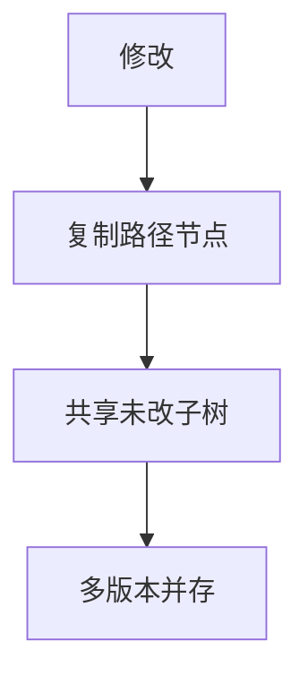

# 主席树（可持久化线段树）

主席树（Persistent Segment Tree）通过对每次修改保留历史版本，实现"查询第 k 个版本中某区间的值"。最经典应用是**静态区间第 k 小**。

## 一、核心思想



每次修改不覆盖旧节点，而是**新建被修改路径上的节点**，共享未修改部分。

```
版本0:  [1,8]
        /    \
     [1,4]  [5,8]
     / \     / \
   [1,2][3,4][5,6][7,8]

修改位置3后（版本1）：
     [1,8]'        ← 新根
     /    \
  [1,4]' [5,8]    ← 右子树共享
  / \
[1,2] [3,4]'      ← 只有路径上新建
```

- 每次修改新建 O(log n) 个节点
- n 次操作总空间 O(n log n)

## 二、静态区间第 k 小

### 问题

给定数组，多次查询 `[l, r]` 中第 k 小的值。

### 思路

1. 离散化原数组
2. 对每个前缀 `[1, i]` 建一棵权值线段树（版本 i）
3. 查询 `[l, r]` = 版本 r - 版本 l-1（差分）
4. 在差分树上二分找第 k 小

### 实现

```java tab
public class PersistentSegTree {
    int[] left, right, sum;
    int[] roots;
    int tot;

    public PersistentSegTree(int n, int q) {
        int maxNodes = (n + q) * 20; // n log n
        left = new int[maxNodes];
        right = new int[maxNodes];
        sum = new int[maxNodes];
        roots = new int[n + 1];
        tot = 0;
    }

    // 在前一版本基础上，给 pos 位置 +1
    int update(int prev, int l, int r, int pos) {
        int cur = ++tot;
        left[cur] = left[prev];
        right[cur] = right[prev];
        sum[cur] = sum[prev] + 1;
        if (l == r) return cur;
        int mid = (l + r) / 2;
        if (pos <= mid) left[cur] = update(left[prev], l, mid, pos);
        else right[cur] = update(right[prev], mid + 1, r, pos);
        return cur;
    }

    // 查询第 k 小（rootR - rootL 的差分）
    int query(int rootL, int rootR, int l, int r, int k) {
        if (l == r) return l;
        int mid = (l + r) / 2;
        int leftCount = sum[left[rootR]] - sum[left[rootL]];
        if (k <= leftCount) {
            return query(left[rootL], left[rootR], l, mid, k);
        } else {
            return query(right[rootL], right[rootR], mid + 1, r, k - leftCount);
        }
    }
}
```

```typescript tab
class PersistentSegTree {
    private left: number[];
    private right: number[];
    private sum: number[];
    private roots: number[];
    private tot: number;

    constructor(n: number, q: number) {
        const maxNodes = (n + q) * 20; // n log n
        this.left = new Array(maxNodes).fill(0);
        this.right = new Array(maxNodes).fill(0);
        this.sum = new Array(maxNodes).fill(0);
        this.roots = new Array(n + 1).fill(0);
        this.tot = 0;
    }

    // 在前一版本基础上，给 pos 位置 +1
    update(prev: number, l: number, r: number, pos: number): number {
        const cur = ++this.tot;
        this.left[cur] = this.left[prev];
        this.right[cur] = this.right[prev];
        this.sum[cur] = this.sum[prev] + 1;
        if (l === r) return cur;
        const mid = Math.floor((l + r) / 2);
        if (pos <= mid) this.left[cur] = this.update(this.left[prev], l, mid, pos);
        else this.right[cur] = this.update(this.right[prev], mid + 1, r, pos);
        return cur;
    }

    // 查询第 k 小（rootR - rootL 的差分）
    query(rootL: number, rootR: number, l: number, r: number, k: number): number {
        if (l === r) return l;
        const mid = Math.floor((l + r) / 2);
        const leftCount = this.sum[this.left[rootR]] - this.sum[this.left[rootL]];
        if (k <= leftCount) {
            return this.query(this.left[rootL], this.left[rootR], l, mid, k);
        } else {
            return this.query(this.right[rootL], this.right[rootR], mid + 1, r, k - leftCount);
        }
    }
}
```

```python tab
class PersistentSegTree:
    def __init__(self, n: int, q: int):
        max_nodes = (n + q) * 20  # n log n
        self.left = [0] * max_nodes
        self.right = [0] * max_nodes
        self.sum = [0] * max_nodes
        self.roots = [0] * (n + 1)
        self.tot = 0

    # 在前一版本基础上，给 pos 位置 +1
    def update(self, prev: int, l: int, r: int, pos: int) -> int:
        self.tot += 1
        cur = self.tot
        self.left[cur] = self.left[prev]
        self.right[cur] = self.right[prev]
        self.sum[cur] = self.sum[prev] + 1
        if l == r:
            return cur
        mid = (l + r) // 2
        if pos <= mid:
            self.left[cur] = self.update(self.left[prev], l, mid, pos)
        else:
            self.right[cur] = self.update(self.right[prev], mid + 1, r, pos)
        return cur

    # 查询第 k 小（rootR - rootL 的差分）
    def query(self, root_l: int, root_r: int, l: int, r: int, k: int) -> int:
        if l == r:
            return l
        mid = (l + r) // 2
        left_count = self.sum[self.left[root_r]] - self.sum[self.left[root_l]]
        if k <= left_count:
            return self.query(self.left[root_l], self.left[root_r], l, mid, k)
        else:
            return self.query(self.right[root_l], self.right[root_r], mid + 1, r, k - left_count)
```

### 使用

```java tab
// 离散化
int[] sorted = arr.clone();
Arrays.sort(sorted);
int m = unique(sorted);

// 建 n 个版本
for (int i = 1; i <= n; i++) {
    int pos = lowerBound(sorted, m, arr[i]) + 1;
    roots[i] = update(roots[i - 1], 1, m, pos);
}

// 查询 [l, r] 第 k 小
int idx = query(roots[l - 1], roots[r], 1, m, k);
int answer = sorted[idx - 1];
```

```typescript tab
// 离散化
const sorted = [...arr].sort((a, b) => a - b);
const m = unique(sorted);

// 建 n 个版本
for (let i = 1; i <= n; i++) {
    const pos = lowerBound(sorted, m, arr[i]) + 1;
    roots[i] = update(roots[i - 1], 1, m, pos);
}

// 查询 [l, r] 第 k 小
const idx = query(roots[l - 1], roots[r], 1, m, k);
const answer = sorted[idx - 1];
```

```python tab
# 离散化
sorted_arr = sorted(arr)
m = unique(sorted_arr)

# 建 n 个版本
for i in range(1, n + 1):
    pos = lower_bound(sorted_arr, m, arr[i]) + 1
    roots[i] = update(roots[i - 1], 1, m, pos)

# 查询 [l, r] 第 k 小
idx = query(roots[l - 1], roots[r], 1, m, k)
answer = sorted_arr[idx - 1]
```

## 三、复杂度

| 操作 | 时间 | 空间 |
|------|------|------|
| 建树（n 个版本） | O(n log n) | O(n log n) |
| 单次查询 | O(log n) | — |

## 四、主席树 vs 其他方案

| 方案 | 区间第 k 小 | 修改 |
|------|------------|------|
| 排序 + 暴力 | O(n log n) 每次 | — |
| 归并树 | O(log³n) | 不支持 |
| 主席树 | O(log n) | 不支持（静态） |
| 树套树 | O(log²n) | 支持 |

## 五、面试要点

1. **路径复制**：只新建被修改的 O(log n) 个节点，其余共享
2. **前缀差分**：版本 r - 版本 l-1 得到 [l, r] 的信息
3. **离散化**：值域压缩到 [1, n]
4. **空间估算**：n × (log₂n + 1) 个节点
5. **LeetCode**：无直接题，但思想用于“可持久化并查集”等

## 六、路径复制过程模拟

以对 `[1, 3, 2]` 建主席树，插入第 2 个元素（值 3 → 版本2）为例：

```
值域离散化后为 [1, 3]，线段树维护“值域区间内出现次数”

版本1（插入值1）：        版本2（再插入值3）：
     [1,3]:1                   [1,3]:2  ← 新建
     /    \                    /    \
  [1,2]:1 [3,3]:0           [1,2]:1  [3,3]:1 ← 新建
   / \      (空)             (共享)    (空)
 [1,1]:1 [2,2]:0

关键：从根到叶 [3,3] 的路径上节点全部新建（O(log n) 个），
      其余节点（如 [1,2]:1 子树）直接共享版本1 的指针

空间：每次插入只新增 log₂(值域)+1 个节点，而非整棵 O(值域)
```

**查询区间 [l, r] 内第 k 小**：

```
用“版本 r 的树 - 版本 l-1 的树”做差分：
  在值域线段树上，左子树的差分值 = 区间内落在左半值域的元素个数
  若差分值 ≥ k → 答案在左子树，否则去右子树找第 k-左计数 小

例：数组 [1,3,2,4]，查询 [2,4] 第 2 小：
  版本4 - 版本1 的树 → 统计值在 [2,4] 的元素 {3,2,4}
  左子树[1,2]计数=1 < 2 → 去右子树找第 2-1=1 小 → 3 ✓
```

## 七、思考题

1. 为什么主席树能用“版本差分”求任意区间 [l, r] 的信息？这依赖什么性质？（提示：前缀和的可减性）
2. 如果每次修改都复制整棵树，空间复杂度是多少？路径复制如何优化到 O(n log n)？（提示：只有 O(log n) 个节点被影响）
3. 主席树能否支持“区间修改”？为什么懒标记会带来困难？（提示：共享节点被多个版本引用，打标记会互相污染）

> 练习推荐：先掌握 [线段树](/tutorials/segment-tree) 与 [离散化](/tutorials/coordinate-compression)，再理解主席树如何组合两者。
