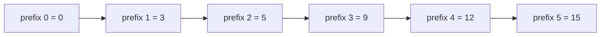

# 前缀和与差分：区间操作的利器


## 一、为什么需要前缀和？

**问题**：给定数组，频繁查询区间 `[l, r]` 的和。

- 暴力：每次 O(n) 遍历 → m 次查询 O(mn)
- 前缀和：预处理 O(n)，每次查询 **O(1)** → 总计 O(n + m)

> 前缀和是**空间换时间**的经典范例，也是差分的逆运算。

## 二、一维前缀和

### 2.1 定义

```text
prefix[0] = 0
prefix[i] = nums[0] + nums[1] + ... + nums[i-1]
```

区间和：`sum(l, r) = prefix[r+1] - prefix[l]`

### 2.2 构建与查询

```java tab
// 构建
int n = nums.length;
int[] prefix = new int[n + 1];
for (int i = 0; i < n; i++) {
    prefix[i + 1] = prefix[i] + nums[i];
}

// 查询 [l, r] 的和（0-indexed）
int rangeSum = prefix[r + 1] - prefix[l];
```

```typescript tab
// 构建
const n = nums.length;
const prefix = new Array<number>(n + 1).fill(0);
for (let i = 0; i < n; i++) {
    prefix[i + 1] = prefix[i] + nums[i];
}

// 查询 [l, r] 的和（0-indexed）
const rangeSum = prefix[r + 1] - prefix[l];
```

```python tab
# 构建
n = len(nums)
prefix = [0] * (n + 1)
for i in range(n):
    prefix[i + 1] = prefix[i] + nums[i]

# 查询 [l, r] 的和（0-indexed）
range_sum = prefix[r + 1] - prefix[l]
```



> 以 `nums = [3, 2, 4, 3, 3]` 为例，`sum(1,3) = prefix[4] - prefix[1] = 12 - 3 = 9`。

### 2.3 前缀和 + 哈希表

**问题**：和为 K 的子数组个数（LeetCode 560）。

```java tab
public int subarraySum(int[] nums, int k) {
    Map<Integer, Integer> count = new HashMap<>();
    count.put(0, 1);          // prefix = 0 出现 1 次
    int prefix = 0, ans = 0;
    for (int num : nums) {
        prefix += num;
        ans += count.getOrDefault(prefix - k, 0);
        count.merge(prefix, 1, Integer::sum);
    }
    return ans;
}
```

```typescript tab
function subarraySum(nums: number[], k: number): number {
    const count = new Map<number, number>([[0, 1]]);
    let prefix = 0, ans = 0;
    for (const num of nums) {
        prefix += num;
        ans += count.get(prefix - k) ?? 0;
        count.set(prefix, (count.get(prefix) ?? 0) + 1);
    }
    return ans;
}
```

```python tab
def subarray_sum(nums: list[int], k: int) -> int:
    from collections import defaultdict
    count = defaultdict(int)
    count[0] = 1
    prefix = ans = 0
    for num in nums:
        prefix += num
        ans += count[prefix - k]
        count[prefix] += 1
    return ans
```

- **时间**：O(n)，**空间**：O(n)
- **原理**：`prefix[j] - prefix[i] = k` → 找之前有多少个 `prefix[i] = prefix[j] - k`

## 三、二维前缀和

### 3.1 定义

`prefix[i][j]` = 左上角 `(0,0)` 到 `(i-1, j-1)` 的矩形和。

### 3.2 构建

```java tab
int[][] prefix = new int[m + 1][n + 1];
for (int i = 1; i <= m; i++) {
    for (int j = 1; j <= n; j++) {
        prefix[i][j] = matrix[i-1][j-1]
                     + prefix[i-1][j]
                     + prefix[i][j-1]
                     - prefix[i-1][j-1];
    }
}
```

```typescript tab
const prefix: number[][] = Array.from({ length: m + 1 }, () => new Array(n + 1).fill(0));
for (let i = 1; i <= m; i++) {
    for (let j = 1; j <= n; j++) {
        prefix[i][j] = matrix[i - 1][j - 1]
                     + prefix[i - 1][j]
                     + prefix[i][j - 1]
                     - prefix[i - 1][j - 1];
    }
}
```

```python tab
prefix = [[0] * (n + 1) for _ in range(m + 1)]
for i in range(1, m + 1):
    for j in range(1, n + 1):
        prefix[i][j] = (matrix[i - 1][j - 1]
                      + prefix[i - 1][j]
                      + prefix[i][j - 1]
                      - prefix[i - 1][j - 1])
```

### 3.3 查询子矩阵和

查询 `(r1,c1)` 到 `(r2,c2)` 的和：

```java tab
int sum = prefix[r2+1][c2+1]
        - prefix[r1][c2+1]
        - prefix[r2+1][c1]
        + prefix[r1][c1];
```

```typescript tab
const sum = prefix[r2 + 1][c2 + 1]
          - prefix[r1][c2 + 1]
          - prefix[r2 + 1][c1]
          + prefix[r1][c1];
```

```python tab
total = (prefix[r2 + 1][c2 + 1]
       - prefix[r1][c2 + 1]
       - prefix[r2 + 1][c1]
       + prefix[r1][c1])
```

> 容斥原理：大矩形 - 上方 - 左方 + 重叠部分。

## 四、差分数组

### 4.1 定义

差分是前缀和的**逆运算**：

```text
diff[0] = nums[0]
diff[i] = nums[i] - nums[i-1]   (i >= 1)
```

对 diff 求前缀和即可还原 nums。

### 4.2 区间修改

**问题**：对区间 `[l, r]` 的所有元素加 `val`，执行 m 次操作。

- 暴力：每次 O(n) → 总计 O(mn)
- 差分：每次 **O(1)**，最后还原 O(n) → 总计 O(m + n)

```java tab
int[] diff = new int[n + 1];

// 对 [l, r] 加 val
diff[l] += val;
diff[r + 1] -= val;

// 还原
int[] result = new int[n];
result[0] = diff[0];
for (int i = 1; i < n; i++) {
    result[i] = result[i - 1] + diff[i];
}
```

```typescript tab
const diff = new Array<number>(n + 1).fill(0);

// 对 [l, r] 加 val
diff[l] += val;
diff[r + 1] -= val;

// 还原
const result = new Array<number>(n);
result[0] = diff[0];
for (let i = 1; i < n; i++) {
    result[i] = result[i - 1] + diff[i];
}
```

```python tab
diff = [0] * (n + 1)

# 对 [l, r] 加 val
diff[l] += val
diff[r + 1] -= val

# 还原
result = [0] * n
result[0] = diff[0]
for i in range(1, n):
    result[i] = result[i - 1] + diff[i]
```

### 4.3 经典应用：航班预订统计

**问题**：n 个航班，`bookings[i] = [first, last, seats]` 表示对 `[first, last]` 每个航班增加 seats 个座位。

```java tab
public int[] corpFlightBookings(int[][] bookings, int n) {
    int[] diff = new int[n + 1];
    for (int[] b : bookings) {
        diff[b[0] - 1] += b[2];
        diff[b[1]]     -= b[2];
    }
    int[] ans = new int[n];
    ans[0] = diff[0];
    for (int i = 1; i < n; i++) {
        ans[i] = ans[i - 1] + diff[i];
    }
    return ans;
}
```

```typescript tab
function corpFlightBookings(bookings: number[][], n: number): number[] {
    const diff = new Array<number>(n + 1).fill(0);
    for (const [first, last, seats] of bookings) {
        diff[first - 1] += seats;
        diff[last]      -= seats;
    }
    const ans = new Array<number>(n);
    ans[0] = diff[0];
    for (let i = 1; i < n; i++) {
        ans[i] = ans[i - 1] + diff[i];
    }
    return ans;
}
```

```python tab
def corp_flight_bookings(bookings: list[list[int]], n: int) -> list[int]:
    diff = [0] * (n + 1)
    for first, last, seats in bookings:
        diff[first - 1] += seats
        diff[last]      -= seats
    ans = [0] * n
    ans[0] = diff[0]
    for i in range(1, n):
        ans[i] = ans[i - 1] + diff[i]
    return ans
```

## 五、前缀和的变体

| 变体 | 用途 | 示例 |
|------|------|------|
| 前缀异或 | 区间异或查询 | `xor(l,r) = preXor[r+1] ^ preXor[l]` |
| 前缀乘积 | 区间乘积（注意零） | 分段处理 |
| 前缀最大值 | 区间最值（静态） | `max(l,r)` 需 Sparse Table |
| 模前缀和 | 子数组和整除 K | `(prefix[j] - prefix[i]) % k == 0` |

### 前缀异或

```java tab
int[] preXor = new int[n + 1];
for (int i = 0; i < n; i++) {
    preXor[i + 1] = preXor[i] ^ nums[i];
}
// 区间 [l, r] 异或
int xorLR = preXor[r + 1] ^ preXor[l];
```

```typescript tab
const preXor = new Array<number>(n + 1).fill(0);
for (let i = 0; i < n; i++) {
    preXor[i + 1] = preXor[i] ^ nums[i];
}
// 区间 [l, r] 异或
const xorLR = preXor[r + 1] ^ preXor[l];
```

```python tab
pre_xor = [0] * (n + 1)
for i in range(n):
    pre_xor[i + 1] = pre_xor[i] ^ nums[i]
# 区间 [l, r] 异或
xor_lr = pre_xor[r + 1] ^ pre_xor[l]
```

## 六、前缀和 vs 线段树 vs 树状数组

| 数据结构 | 单点修改 | 区间查询 | 区间修改 | 适用场景 |
|----------|----------|----------|----------|----------|
| 前缀和 | ❌ O(n) | ✅ O(1) | ❌ | 静态数组、离线查询 |
| 差分 | ✅ O(1) | ❌ O(n) | ✅ O(1) | 批量修改、最后统一查询 |
| 树状数组 | ✅ O(log n) | ✅ O(log n) | ⚠️ 需双 BIT O(log n) | 动态单点 + 前缀查询 |
| 线段树 | ✅ O(log n) | ✅ O(log n) | ✅ O(log n) | 动态区间修改 + 查询 |

## 七、面试常见题

- 🟢 区域和检索、和为 K 的子数组、航班预订统计
- 🟡 二维区域和检索、除自身以外数组的乘积、连续数组
- 🟠 和可被 K 整除的子数组、使数组和能被 P 整除
- 🔴 最大侧边正方形、子矩阵元素总和

## 八、调试技巧

1. **下标对齐**：prefix 数组多开一位（`n+1`），避免边界特判。
2. **画图验证**：手动画出 prefix 和 diff 数组，确认加减逻辑。
3. **差分解题三步走**：构建 diff → 执行操作 → 前缀和还原。
4. **哈希表初始化**：`count.put(0, 1)` 别忘——处理从头开始的子数组。
