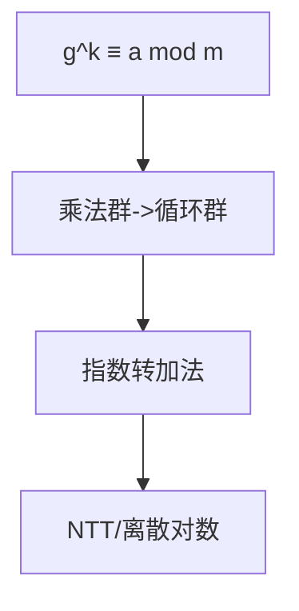

# 原根（Primitive Root）

## 一、为什么学原根？



原根把**模 m 的乘法群**变成循环群，使指数运算可映射为加法（离散对数）：
`g^k ≡ a (mod m)`。用途：

- 构造离散对数问题（密码学）
- NTT（数论变换）需要模素数原根做单位根
- 简化幂次循环节分析

## 二、定义

若 `gcd(g, m) = 1` 且 `g` 模 `m` 的阶 `ord_m(g) = φ(m)`，则称 `g` 为模 `m` 的**原根**。

存在原根的 m：`2, 4, p^k, 2p^k`（p 为奇素数）。

## 三、判定与求原根

若 `φ(m) = p1^e1 · p2^e2 · …`，则 `g` 是原根当且仅当对所有质因子 `pi`，
`g^(φ(m)/pi) ≢ 1 (mod m)`。

```java tab
long pow(long a, long b, long m) {
    long r = 1; a %= m;
    while (b > 0) { if ((b & 1) == 1) r = r * a % m; a = a * a % m; b >>= 1; }
    return r;
}
int phi(int n) {
    int r = n;
    for (int i = 2; i * i <= n; i++)
        if (n % i == 0) { while (n % i == 0) n /= i; r = r / i * (i - 1); }
    if (n > 1) r = r / n * (n - 1);
    return r;
}
int primitiveRoot(int m) {
    int ph = phi(m);
    int tmp = ph;
    java.util.ArrayList<Integer> ps = new java.util.ArrayList<>();
    for (int i = 2; i * i <= tmp; i++)
        if (tmp % i == 0) { ps.add(i); while (tmp % i == 0) tmp /= i; }
    for (int g = 1; g < m; g++) {
        if (gcd(g, m) != 1) continue;
        boolean ok = true;
        for (int p : ps) if (pow(g, ph / p, m) == 1) { ok = false; break; }
        if (ok) return g;
    }
    return -1;
}
```

```typescript tab
function pow(a: number, b: number, m: number): number {
    let r = 1; a %= m;
    while (b > 0) { if (b & 1) r = r * a % m; a = a * a % m; b >>= 1; }
    return r;
}
function primitiveRoot(m: number): number {
    const ph = phi(m);
    let tmp = ph; const ps: number[] = [];
    for (let i = 2; i * i <= tmp; i++)
        if (tmp % i === 0) { ps.push(i); while (tmp % i === 0) tmp /= i; }
    for (let g = 1; g < m; g++) {
        if (gcd(g, m) !== 1) continue;
        if (ps.every(p => pow(g, ph / p, m) !== 1)) return g;
    }
    return -1;
}
```

```python tab
def pow_mod(a, b, m):
    r = 1; a %= m
    while b > 0:
        if b & 1: r = r * a % m
        a = a * a % m; b >>= 1
    return r
def primitive_root(m):
    ph = phi(m)
    tmp, ps = ph, []
    i = 2
    while i * i <= tmp:
        if tmp % i == 0:
            ps.append(i)
            while tmp % i == 0: tmp //= i
        i += 1
    for g in range(1, m):
        if math.gcd(g, m) != 1: continue
        if all(pow_mod(g, ph // p, m) != 1 for p in ps):
            return g
    return -1
```

## 四、复杂度

| 项目 | 复杂度 |
|------|--------|
| 求 φ(m) | O(√m) |
| 枚举 g | O(m · log m) |

## 五、面试要点

1. 仅 `2,4,p^k,2p^k` 有原根
2. 判定靠"对 φ(m) 每个质因子 p，g^(φ/p)≠1"
3. NTT 用原根构造单位根 `ω = g^((p-1)/n)`
