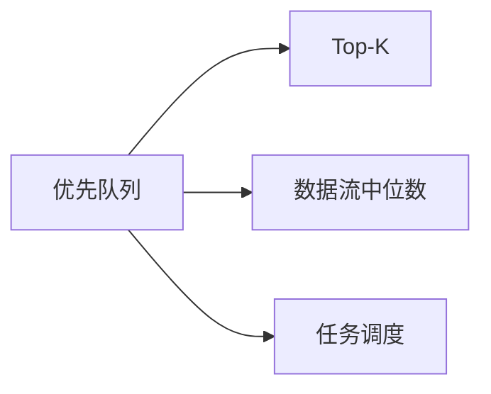

# 优先队列与堆进阶

优先队列（PriorityQueue）在基础的 Top-K 之外，还能解决数据流中位数、任务调度、图的最短路径优化等复杂问题。本篇聚焦堆的进阶应用与多堆协作模式。

## 一、Java PriorityQueue 速查



```java tab
// 最小堆（默认）
PriorityQueue<Integer> minHeap = new PriorityQueue<>();
// 最大堆
PriorityQueue<Integer> maxHeap = new PriorityQueue<>(Collections.reverseOrder());
// 自定义
PriorityQueue<int[]> pq = new PriorityQueue<>((a, b) -> a[0] - b[0]);

// 操作
pq.offer(x);    // 入堆 O(log n)
pq.peek();      // 查看堆顶 O(1)
pq.poll();      // 弹出堆顶 O(log n)
pq.size();      // 大小 O(1)
```

```typescript tab
// TypeScript 无内置堆，常用第三方库或自实现
// 最小堆：用数组 + 上浮/下沉
// 最大堆：取反存入最小堆
// 自定义：传入比较函数

// 操作（以自实现 MinHeap 为例）
heap.push(x);    // 入堆 O(log n)
heap.peek();     // 查看堆顶 O(1)
heap.pop();      // 弹出堆顶 O(log n)
heap.size;       // 大小 O(1)
```

```python tab
import heapq

# 最小堆（默认）
min_heap = []
# 最大堆：取反存入
max_heap = []

# 操作
heapq.heappush(min_heap, x)    # 入堆 O(log n)
min_heap[0]                    # 查看堆顶 O(1)
heapq.heappop(min_heap)        # 弹出堆顶 O(log n)
len(min_heap)                  # 大小 O(1)
```

## 二、数据流中位数（LeetCode 295）

用两个堆：大顶堆存较小半，小顶堆存较大半。

```java tab
class MedianFinder {
    PriorityQueue<Integer> lo = new PriorityQueue<>(Collections.reverseOrder()); // 大顶堆
    PriorityQueue<Integer> hi = new PriorityQueue<>(); // 小顶堆

    void addNum(int num) {
        lo.offer(num);
        hi.offer(lo.poll());
        if (hi.size() > lo.size()) lo.offer(hi.poll());
    }

    double findMedian() {
        if (lo.size() > hi.size()) return lo.peek();
        return (lo.peek() + hi.peek()) / 2.0;
    }
}
```

```typescript tab
class MedianFinder {
    private lo = new MaxPriorityQueue();
    private hi = new MinPriorityQueue();

    addNum(num: number): void {
        this.lo.enqueue(num);
        this.hi.enqueue(this.lo.dequeue().element);
        if (this.hi.size() > this.lo.size()) this.lo.enqueue(this.hi.dequeue().element);
    }

    findMedian(): number {
        if (this.lo.size() > this.hi.size()) return this.lo.front().element;
        return (this.lo.front().element + this.hi.front().element) / 2;
    }
}
```

```python tab
class MedianFinder:
    def __init__(self):
        self.lo = []  # 大顶堆（取反）
        self.hi = []  # 小顶堆

    def addNum(self, num: int) -> None:
        heapq.heappush(self.lo, -num)
        heapq.heappush(self.hi, -heapq.heappop(self.lo))
        if len(self.hi) > len(self.lo):
            heapq.heappush(self.lo, -heapq.heappop(self.hi))

    def findMedian(self) -> float:
        if len(self.lo) > len(self.hi):
            return -self.lo[0]
        return (-self.lo[0] + self.hi[0]) / 2
```

## 三、Top-K 问题

### 第 K 大元素（LeetCode 215）

```java tab
// 方法一：最小堆 O(n log k)
int findKthLargest(int[] nums, int k) {
    PriorityQueue<Integer> pq = new PriorityQueue<>();
    for (int num : nums) {
        pq.offer(num);
        if (pq.size() > k) pq.poll();
    }
    return pq.peek();
}
```

```typescript tab
// 方法一：最小堆 O(n log k)
function findKthLargest(nums: number[], k: number): number {
    const pq = new MinPriorityQueue();
    for (const num of nums) {
        pq.enqueue(num);
        if (pq.size() > k) pq.dequeue();
    }
    return pq.front().element;
}
```

```python tab
# 方法一：最小堆 O(n log k)
def find_kth_largest(nums: list[int], k: int) -> int:
    pq = []
    for num in nums:
        heapq.heappush(pq, num)
        if len(pq) > k:
            heapq.heappop(pq)
    return pq[0]
```

### 前 K 个高频元素（LeetCode 347）

```java tab
int[] topKFrequent(int[] nums, int k) {
    Map<Integer, Integer> freq = new HashMap<>();
    for (int n : nums) freq.merge(n, 1, Integer::sum);

    PriorityQueue<int[]> pq = new PriorityQueue<>((a, b) -> a[1] - b[1]);
    for (var entry : freq.entrySet()) {
        pq.offer(new int[]{entry.getKey(), entry.getValue()});
        if (pq.size() > k) pq.poll();
    }
    int[] result = new int[k];
    for (int i = 0; i < k; i++) result[i] = pq.poll()[0];
    return result;
}
```

```typescript tab
function topKFrequent(nums: number[], k: number): number[] {
    const freq = new Map<number, number>();
    for (const n of nums) freq.set(n, (freq.get(n) ?? 0) + 1);

    const pq = new MinPriorityQueue({ priority: (x: [number, number]) => x[1] });
    for (const [key, count] of freq) {
        pq.enqueue([key, count]);
        if (pq.size() > k) pq.dequeue();
    }
    const result: number[] = [];
    for (let i = 0; i < k; i++) result.push(pq.dequeue().element[0]);
    return result;
}
```

```python tab
def top_k_frequent(nums: list[int], k: int) -> list[int]:
    freq = Counter(nums)
    pq = []
    for key, count in freq.items():
        heapq.heappush(pq, (count, key))
        if len(pq) > k:
            heapq.heappop(pq)
    return [key for count, key in pq]
```

## 四、合并 K 个有序链表（LeetCode 23）

```java tab
ListNode mergeKLists(ListNode[] lists) {
    PriorityQueue<ListNode> pq = new PriorityQueue<>((a, b) -> a.val - b.val);
    for (ListNode node : lists) {
        if (node != null) pq.offer(node);
    }
    ListNode dummy = new ListNode(0), cur = dummy;
    while (!pq.isEmpty()) {
        ListNode node = pq.poll();
        cur.next = node;
        cur = cur.next;
        if (node.next != null) pq.offer(node.next);
    }
    return dummy.next;
}
```

```typescript tab
function mergeKLists(lists: (ListNode | null)[]): ListNode | null {
    const pq = new MinPriorityQueue({ priority: (node: ListNode) => node.val });
    for (const node of lists) {
        if (node) pq.enqueue(node);
    }
    const dummy = new ListNode(0);
    let cur = dummy;
    while (!pq.isEmpty()) {
        const node = pq.dequeue().element;
        cur.next = node;
        cur = cur.next;
        if (node.next) pq.enqueue(node.next);
    }
    return dummy.next;
}
```

```python tab
def merge_k_lists(lists: list[ListNode | None]) -> ListNode | None:
    pq = []
    for i, node in enumerate(lists):
        if node:
            heapq.heappush(pq, (node.val, i, node))
    dummy = ListNode(0)
    cur = dummy
    while pq:
        _, i, node = heapq.heappop(pq)
        cur.next = node
        cur = cur.next
        if node.next:
            heapq.heappush(pq, (node.next.val, i, node.next))
    return dummy.next
```

## 五、任务调度（LeetCode 621）

```java tab
// 贪心 + 堆：每轮选频率最高的任务
int leastInterval(char[] tasks, int n) {
    int[] freq = new int[26];
    for (char c : tasks) freq[c - 'A']++;
    PriorityQueue<Integer> pq = new PriorityQueue<>(Collections.reverseOrder());
    for (int f : freq) if (f > 0) pq.offer(f);

    int time = 0;
    while (!pq.isEmpty()) {
        List<Integer> temp = new ArrayList<>();
        for (int i = 0; i <= n; i++) {
            if (!pq.isEmpty()) temp.add(pq.poll() - 1);
        }
        for (int f : temp) if (f > 0) pq.offer(f);
        time += pq.isEmpty() ? temp.size() : n + 1;
    }
    return time;
}
```

```typescript tab
// 贪心 + 堆：每轮选频率最高的任务
function leastInterval(tasks: string[], n: number): number {
    const freq = new Array(26).fill(0);
    for (const c of tasks) freq[c.charCodeAt(0) - 65]++;
    const pq = new MaxPriorityQueue();
    for (const f of freq) if (f > 0) pq.enqueue(f);

    let time = 0;
    while (!pq.isEmpty()) {
        const temp: number[] = [];
        for (let i = 0; i <= n; i++) {
            if (!pq.isEmpty()) temp.push(pq.dequeue().element - 1);
        }
        for (const f of temp) if (f > 0) pq.enqueue(f);
        time += pq.isEmpty() ? temp.length : n + 1;
    }
    return time;
}
```

```python tab
# 贪心 + 堆：每轮选频率最高的任务
def least_interval(tasks: list[str], n: int) -> int:
    freq = Counter(tasks)
    pq = [-f for f in freq.values()]  # 大顶堆（取反）
    heapq.heapify(pq)

    time = 0
    while pq:
        temp = []
        for _ in range(n + 1):
            if pq:
                temp.append(-heapq.heappop(pq) - 1)
        for f in temp:
            if f > 0:
                heapq.heappush(pq, -f)
        time += len(temp) if not pq else n + 1
    return time
```

## 六、Dijkstra 中的堆优化

```java tab
// 标准 Dijkstra
PriorityQueue<int[]> pq = new PriorityQueue<>((a, b) -> a[1] - b[1]); // {node, dist}
pq.offer(new int[]{src, 0});
while (!pq.isEmpty()) {
    int[] cur = pq.poll();
    int u = cur[0], d = cur[1];
    if (d > dist[u]) continue; // 过期条目
    for (int[] edge : adj[u]) {
        int v = edge[0], w = edge[1];
        if (dist[v] > d + w) {
            dist[v] = d + w;
            pq.offer(new int[]{v, dist[v]});
        }
    }
}
```

```typescript tab
// 标准 Dijkstra
const pq = new MinPriorityQueue({ priority: (x: [number, number]) => x[1] }); // [node, dist]
pq.enqueue([src, 0]);
while (!pq.isEmpty()) {
    const [u, d] = pq.dequeue().element;
    if (d > dist[u]) continue; // 过期条目
    for (const [v, w] of adj[u]) {
        if (dist[v] > d + w) {
            dist[v] = d + w;
            pq.enqueue([v, dist[v]]);
        }
    }
}
```

```python tab
# 标准 Dijkstra
pq = [(0, src)]  # (dist, node)
while pq:
    d, u = heapq.heappop(pq)
    if d > dist[u]:
        continue  # 过期条目
    for v, w in adj[u]:
        if dist[v] > d + w:
            dist[v] = d + w
            heapq.heappush(pq, (dist[v], v))
```

## 七、面试要点

1. **双堆中位数**：大顶堆+小顶堆平衡
2. **Top-K 用最小堆**：维护 k 个最大
3. **多路归并用堆**：K 个有序序列合并
4. **懒删除**：Dijkstra 中跳过过期条目
5. **LeetCode**：215、295、347、23、621、703、973
