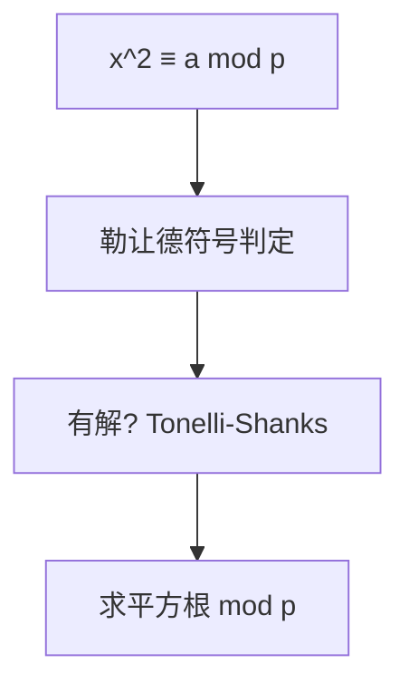

# 二次剩余（Quadratic Residue）

## 一、为什么学二次剩余？



判断同余方程 `x² ≡ a (mod p)`（p 奇素数）是否有解，并求解。应用：

- 素数模平方根（椭圆曲线、密码学）
- 符号判别（勒让德符号）
- 与原根、离散对数配合

## 二、勒让德符号

`(a/p) = a^((p-1)/2) mod p`，取值：
- `1`：a 是二次剩余（有解）
- `-1`：非剩余（无解）
- `0`：p | a

## 三、求解（Tonelli–Shanks）

```java tab
long modSqrt(long a, long p) {
    a %= p;
    if (pow(a, (p - 1) / 2, p) != 1) return -1; // 无解
    long q = p - 1, s = 0;
    while (q % 2 == 0) { q /= 2; s++; }
    long z = 2;
    while (pow(z, (p - 1) / 2, p) != p - 1) z++;
    long m = s, c = pow(z, q, p), t = pow(a, q, p), r = pow(a, (q + 1) / 2, p);
    while (t != 0 && t != 1) {
        long t2 = t; int i = 0;
        while (t2 != 1) { t2 = t2 * t2 % p; i++; }
        long b = pow(c, 1 << (m - i - 1), p);
        r = r * b % p; c = b * b % p; t = t * c % p; m = i;
    }
    return r;
}
```

```typescript tab
function modSqrt(a: number, p: number): number {
    a %= p;
    if (pow(a, (p - 1) / 2, p) !== 1) return -1;
    let q = p - 1, s = 0;
    while (q % 2 === 0) { q /= 2; s++; }
    let z = 2;
    while (pow(z, (p - 1) / 2, p) !== p - 1) z++;
    let m = s, c = pow(z, q, p), t = pow(a, q, p), r = pow(a, (q + 1) / 2, p);
    while (t !== 0 && t !== 1) {
        let t2 = t, i = 0;
        while (t2 !== 1) { t2 = t2 * t2 % p; i++; }
        const b = pow(c, 1 << (m - i - 1), p);
        r = r * b % p; c = b * b % p; t = t * c % p; m = i;
    }
    return r;
}
```

```python tab
def mod_sqrt(a, p):
    a %= p
    if pow(a, (p - 1) // 2, p) != 1:
        return -1
    q, s = p - 1, 0
    while q % 2 == 0:
        q //= 2; s += 1
    z = 2
    while pow(z, (p - 1) // 2, p) != p - 1:
        z += 1
    m, c, t, r = s, pow(z, q, p), pow(a, q, p), pow(a, (q + 1) // 2, p)
    while t != 0 and t != 1:
        t2, i = t, 0
        while t2 != 1:
            t2 = t2 * t2 % p; i += 1
        b = pow(c, 1 << (m - i - 1), p)
        r = r * b % p; c = b * b % p; t = t * c % p; m = i
    return r
```

## 四、复杂度

| 项目 | 复杂度 |
|------|--------|
| 单次求解 | O(log² p) |

## 五、面试要点

1. 先判勒让德符号：`a^((p-1)/2) ≡ 1` 才有解
2. p≡3 (mod 4) 时直接 `x = a^((p+1)/4)`
3. 一般情形用 Tonelli–Shanks
