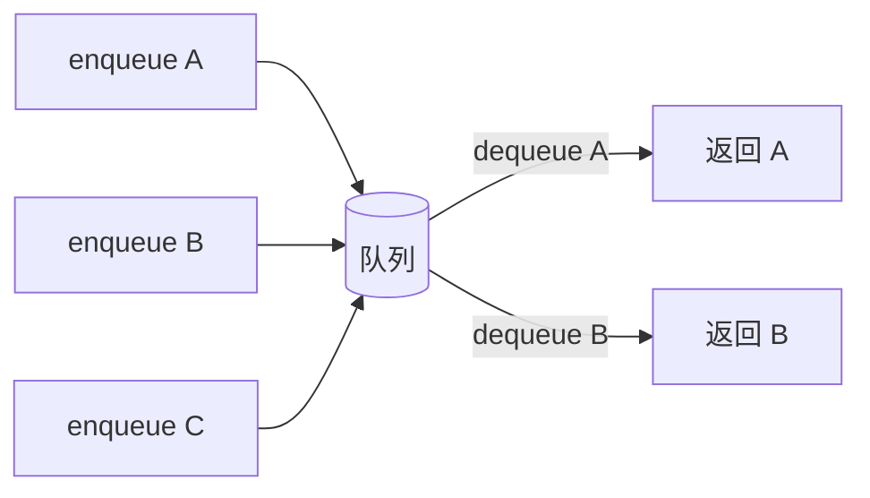

# 队列 Queue


## 一、什么是队列？

**队列（Queue）** 是一种**先进先出（FIFO, First In First Out）** 的线性数据结构。  
像排队买票：先到的人先被服务。



## 二、核心操作

| 操作 | 说明 | 复杂度 |
|------|------|--------|
| `enqueue` | 入队（从队尾添加） | O(1) |
| `dequeue` | 出队（从队首移除） | O(1) |
| `front` / `peek` | 查看队首 | O(1) |
| `rear` | 查看队尾 | O(1) |
| `isEmpty` / `size` | 判空 / 元素数 | O(1) |

## 三、实现方式

### 3.1 普通数组队列（动态数组）

```java tab
public class ArrayQueue<E> {
    private ArrayList<E> data = new ArrayList<>();

    public void enqueue(E e) { data.add(e); }

    public E dequeue() {
        if (data.isEmpty()) throw new NoSuchElementException();
        return data.remove(0);     // ❌ O(n)
    }
}
```
```typescript tab
class ArrayQueue<T> {
    private data: T[] = [];

    enqueue(e: T): void { this.data.push(e); }

    dequeue(): T {
        if (!this.data.length) throw new Error('队列空');
        return this.data.shift()!;  // ❌ O(n)
    }
}
```
```python tab
class ArrayQueue:
    def __init__(self):
        self._data = []

    def enqueue(self, e):
        self._data.append(e)

    def dequeue(self):
        if not self._data:
            raise Exception('队列空')
        return self._data.pop(0)  # ❌ O(n)
```

> **问题**：`remove(0)` 涉及数组搬移，每次出队 O(n)。

### 3.2 循环队列（推荐）

循环队列通过 `front` 和 `tail` 指针 + **模运算**，实现 O(1) 的入队和出队。

```java tab
public class LoopQueue<E> {
    private E[] data;
    private int front, tail, size;

    @SuppressWarnings("unchecked")
    public LoopQueue(int capacity) {
        data = (E[]) new Object[capacity];
        front = tail = size = 0;
    }

    public void enqueue(E e) {
        if (size == data.length) resize(data.length * 2);
        data[tail] = e;
        tail = (tail + 1) % data.length;
        size++;
    }

    public E dequeue() {
        if (isEmpty()) throw new NoSuchElementException();
        E ret = data[front];
        data[front] = null;
        front = (front + 1) % data.length;
        size--;
        if (size <= data.length / 4 && data.length > 1) resize(data.length / 2);
        return ret;
    }

    public E getFront() {
        if (isEmpty()) throw new NoSuchElementException();
        return data[front];
    }

    public int getSize() { return size; }
    public boolean isEmpty() { return size == 0; }

    private void resize(int newCapacity) {
        E[] newData = (E[]) new Object[newCapacity];
        for (int i = 0; i < size; i++) {
            newData[i] = data[(i + front) % data.length];
        }
        data = newData;
        front = 0;
        tail = size;
    }
}
```
```typescript tab
class LoopQueue<T> {
    private data: (T | undefined)[];
    private front = 0;
    private tail = 0;
    private size = 0;

    constructor(capacity: number) {
        this.data = new Array(capacity);
    }

    enqueue(e: T): void {
        if (this.size === this.data.length) this.resize(this.data.length * 2);
        this.data[this.tail] = e;
        this.tail = (this.tail + 1) % this.data.length;
        this.size++;
    }

    dequeue(): T {
        if (this.isEmpty()) throw new Error('队列空');
        const ret = this.data[this.front] as T;
        this.data[this.front] = undefined;
        this.front = (this.front + 1) % this.data.length;
        this.size--;
        if (this.size <= this.data.length / 4 && this.data.length > 1)
            this.resize(this.data.length >> 1);
        return ret;
    }

    getFront(): T {
        if (this.isEmpty()) throw new Error('队列空');
        return this.data[this.front] as T;
    }

    getSize(): number { return this.size; }
    isEmpty(): boolean { return this.size === 0; }

    private resize(newCapacity: number): void {
        const newData = new Array(newCapacity);
        for (let i = 0; i < this.size; i++)
            newData[i] = this.data[(i + this.front) % this.data.length];
        this.data = newData;
        this.front = 0;
        this.tail = this.size;
    }
}
```
```python tab
class LoopQueue:
    def __init__(self, capacity: int):
        self._data = [None] * capacity
        self._front = 0
        self._tail = 0
        self._size = 0

    def enqueue(self, e):
        if self._size == len(self._data):
            self._resize(len(self._data) * 2)
        self._data[self._tail] = e
        self._tail = (self._tail + 1) % len(self._data)
        self._size += 1

    def dequeue(self):
        if self.is_empty():
            raise Exception('队列空')
        ret = self._data[self._front]
        self._data[self._front] = None
        self._front = (self._front + 1) % len(self._data)
        self._size -= 1
        if self._size <= len(self._data) // 4 and len(self._data) > 1:
            self._resize(len(self._data) // 2)
        return ret

    def get_front(self):
        if self.is_empty():
            raise Exception('队列空')
        return self._data[self._front]

    def get_size(self): return self._size
    def is_empty(self): return self._size == 0

    def _resize(self, new_capacity: int):
        new_data = [None] * new_capacity
        for i in range(self._size):
            new_data[i] = self._data[(i + self._front) % len(self._data)]
        self._data = new_data
        self._front = 0
        self._tail = self._size
```

**关键点**：
- `(i + front) % data.length` 把环形索引转成线性数组下标。
- 扩容时统一展平；缩容阈值通常为 1/4（避免抖动）。

### 3.3 链式队列

```java tab
public class LinkedQueue<E> {
    private Node<E> head, tail;
    private int size;

    private static class Node<E> { E val; Node<E> next; Node(E v) { val = v; } }

    public void enqueue(E e) {
        Node<E> node = new Node<>(e);
        if (tail == null) head = tail = node;
        else { tail.next = node; tail = node; }
        size++;
    }

    public E dequeue() {
        if (head == null) throw new NoSuchElementException();
        E v = head.val;
        head = head.next;
        if (head == null) tail = null;
        size--;
        return v;
    }
}
```
```typescript tab
class LinkedQueue<T> {
    private head: { val: T; next: any } | null = null;
    private tail: { val: T; next: any } | null = null;
    private size = 0;

    enqueue(e: T): void {
        const node = { val: e, next: null };
        if (!this.tail) { this.head = this.tail = node; }
        else { this.tail.next = node; this.tail = node; }
        this.size++;
    }

    dequeue(): T {
        if (!this.head) throw new Error('队列空');
        const v = this.head.val;
        this.head = this.head.next;
        if (!this.head) this.tail = null;
        this.size--;
        return v;
    }
}
```
```python tab
class LinkedQueue:
    def __init__(self):
        self._head = None
        self._tail = None
        self._size = 0

    def enqueue(self, e):
        node = {'val': e, 'next': None}
        if not self._tail:
            self._head = self._tail = node
        else:
            self._tail['next'] = node
            self._tail = node
        self._size += 1

    def dequeue(self):
        if not self._head:
            raise Exception('队列空')
        v = self._head['val']
        self._head = self._head['next']
        if not self._head:
            self._tail = None
        self._size -= 1
        return v
```

| 实现 | 入队 | 出队 | 空间 |
|------|------|------|------|
| 数组（无循环） | O(1) | O(n) | 连续 |
| 循环数组 | O(1) 均摊 | O(1) 均摊 | 连续 |
| 链表 | O(1) | O(1) | 离散 |

> Java 推荐 `ArrayDeque`（基于循环数组）或 `LinkedList`（基于链表）。

## 四、特殊队列

### 4.1 双端队列（Deque）

**两端都能入队/出队**。Java 用 `ArrayDeque` 或 `LinkedList`。

```java tab
Deque<Integer> dq = new ArrayDeque<>();
dq.offerFirst(1);     // 队首入队
dq.offerLast(2);      // 队尾入队
dq.pollFirst();       // 队首出队
dq.pollLast();        // 队尾出队
```
```typescript tab
const dq: number[] = [];
dq.unshift(1);        // 队首入队
dq.push(2);           // 队尾入队
dq.shift();           // 队首出队
dq.pop();             // 队尾出队
```
```python tab
from collections import deque
dq = deque()
dq.appendleft(1)      # 队首入队
dq.append(2)          # 队尾入队
dq.popleft()          # 队首出队
dq.pop()              # 队尾出队
```

### 4.2 优先队列（Priority Queue）

**元素按优先级出队**，而非 FIFO。底层通常用**堆**实现。

```java tab
PriorityQueue<Integer> minPQ = new PriorityQueue<>();        // 最小堆
PriorityQueue<Integer> maxPQ = new PriorityQueue<>((a, b) -> b - a);  // 最大堆
```
```typescript tab
// TS 无内置优先队列，可用数组模拟或第三方库
const minPQ: number[] = [];  // 手动维护最小堆
const maxPQ: number[] = [];  // 手动维护最大堆
```
```python tab
import heapq
min_pq = []            # 最小堆
heapq.heappush(min_pq, 3)
heapq.heappop(min_pq)
# 最大堆：取负
max_pq = []
heapq.heappush(max_pq, -3)
```

> 见"堆与优先队列"专题。

### 4.3 阻塞队列（Blocking Queue）

线程安全，队列为空时 `take` 会阻塞。常用于生产者-消费者模式。

```java tab
BlockingQueue<Integer> queue = new LinkedBlockingQueue<>(1024);
queue.put(1);           // 满时阻塞
int x = queue.take();   // 空时阻塞
```
```typescript tab
// Node.js 中可用 async 模拟阻塞队列
async function put(queue: number[], item: number) { queue.push(item); }
async function take(queue: number[]): Promise<number> {
    while (!queue.length) await new Promise(r => setTimeout(r, 10));
    return queue.shift()!;
}
```
```python tab
from queue import Queue
q = Queue(maxsize=1024)
q.put(1)           # 满时阻塞
x = q.get()        # 空时阻塞
```

## 五、典型应用

### 5.1 广度优先搜索（BFS）

```java tab
void bfs(Node start) {
    Deque<Node> q = new ArrayDeque<>();
    Set<Node> visited = new HashSet<>();
    q.offer(start); visited.add(start);
    while (!q.isEmpty()) {
        Node u = q.poll();
        for (Node v : u.neighbors) {
            if (!visited.contains(v)) {
                visited.add(v);
                q.offer(v);
            }
        }
    }
}
```
```typescript tab
function bfs(start: Node): void {
    const q: Node[] = [start];
    const visited = new Set<Node>([start]);
    while (q.length) {
        const u = q.shift()!;
        for (const v of u.neighbors) {
            if (!visited.has(v)) {
                visited.add(v);
                q.push(v);
            }
        }
    }
}
```
```python tab
from collections import deque

def bfs(start):
    q = deque([start])
    visited = {start}
    while q:
        u = q.popleft()
        for v in u.neighbors:
            if v not in visited:
                visited.add(v)
                q.append(v)
```

### 5.2 任务调度 / 消息队列

操作系统任务调度、消息中间件（Kafka、RocketMQ）的核心。

### 5.3 滑动窗口最大值（单调队列）

见"单调栈与单调队列"专题。

### 5.4 用队列实现栈（设计题）

```java tab
class MyStack {
    Deque<Integer> q = new ArrayDeque<>();

    public void push(int x) {
        q.offer(x);
        for (int i = 1; i < q.size(); i++) q.offer(q.poll());
    }

    public int pop() { return q.poll(); }
    public int top() { return q.peek(); }
    public boolean empty() { return q.isEmpty(); }
}
```
```typescript tab
class MyStack {
    private q: number[] = [];

    push(x: number): void {
        this.q.push(x);
        for (let i = 1; i < this.q.length; i++)
            this.q.push(this.q.shift()!);
    }

    pop(): number { return this.q.shift()!; }
    top(): number { return this.q[0]; }
    empty(): boolean { return this.q.length === 0; }
}
```
```python tab
from collections import deque

class MyStack:
    def __init__(self):
        self.q = deque()

    def push(self, x: int):
        self.q.append(x)
        for _ in range(len(self.q) - 1):
            self.q.append(self.q.popleft())

    def pop(self) -> int: return self.q.popleft()
    def top(self) -> int: return self.q[0]
    def empty(self) -> bool: return not self.q
```

每次 `push` 后，把队列其他元素轮转一遍，让新元素到队首。  
**复杂度**：`push` O(n)，`pop` O(1) 均摊。

## 六、复杂度汇总

| 操作 | 时间 | 空间 |
|------|------|------|
| enqueue | O(1) 均摊 | O(1) |
| dequeue | O(1) 均摊 | O(1) |
| front | O(1) | O(1) |

## 七、循环队列的设计题

> LeetCode 622：设计循环队列。

```java tab
class MyCircularQueue {
    int[] data;
    int front, tail, size;

    public MyCircularQueue(int k) {
        data = new int[k];
    }

    public boolean enQueue(int v) {
        if (size == data.length) return false;
        data[tail] = v;
        tail = (tail + 1) % data.length;
        size++;
        return true;
    }

    public boolean deQueue() {
        if (size == 0) return false;
        data[front] = 0;
        front = (front + 1) % data.length;
        size--;
        return true;
    }

    public int Front() { return size == 0 ? -1 : data[front]; }
    public int Rear() { return size == 0 ? -1 : data[(tail - 1 + data.length) % data.length]; }
    public boolean isEmpty() { return size == 0; }
    public boolean isFull() { return size == data.length; }
}
```
```typescript tab
class MyCircularQueue {
    private data: number[];
    private front = 0;
    private tail = 0;
    private size = 0;

    constructor(k: number) { this.data = new Array(k).fill(0); }

    enQueue(v: number): boolean {
        if (this.size === this.data.length) return false;
        this.data[this.tail] = v;
        this.tail = (this.tail + 1) % this.data.length;
        this.size++;
        return true;
    }

    deQueue(): boolean {
        if (this.size === 0) return false;
        this.data[this.front] = 0;
        this.front = (this.front + 1) % this.data.length;
        this.size--;
        return true;
    }

    Front(): number { return this.size === 0 ? -1 : this.data[this.front]; }
    Rear(): number { return this.size === 0 ? -1 : this.data[(this.tail - 1 + this.data.length) % this.data.length]; }
    isEmpty(): boolean { return this.size === 0; }
    isFull(): boolean { return this.size === this.data.length; }
}
```
```python tab
class MyCircularQueue:
    def __init__(self, k: int):
        self.data = [0] * k
        self.front = 0
        self.tail = 0
        self.size = 0

    def en_queue(self, v: int) -> bool:
        if self.size == len(self.data):
            return False
        self.data[self.tail] = v
        self.tail = (self.tail + 1) % len(self.data)
        self.size += 1
        return True

    def de_queue(self) -> bool:
        if self.size == 0:
            return False
        self.data[self.front] = 0
        self.front = (self.front + 1) % len(self.data)
        self.size -= 1
        return True

    def get_front(self) -> int:
        return -1 if self.size == 0 else self.data[self.front]

    def rear(self) -> int:
        return -1 if self.size == 0 else self.data[(self.tail - 1 + len(self.data)) % len(self.data)]

    def is_empty(self) -> bool: return self.size == 0
    def is_full(self) -> bool: return self.size == len(self.data)
```

**关键技巧**：`(tail - 1 + n) % n` 取队尾元素。

## 八、易错点

1. **空指针**：链表队列 `dequeue` 时要先检查 head。
2. **扩容错乱**：resize 后忘了重置 front / tail。
3. **队尾指针**：取队尾用 `(tail - 1 + n) % n`，别直接 `data[tail-1]`。
4. **Java `Queue` 接口**：注意区分 `add`（抛异常）vs `offer`（返回 false）。

## 九、刷题清单

| 难度 | 题目 | 类型 |
|------|------|------|
| 🟢 | 用队列实现栈 | 双队列 |
| 🟢 | 用栈实现队列 | 双栈 |
| 🟡 | 设计循环队列 | 循环数组 |
| 🟡 | 滑动窗口最大值 | 单调队列 |
| 🟡 | 二叉树的层序遍历 | BFS |
| 🟠 | 数据流的中位数 | 双堆 |
| 🟠 | 任务调度器 | 优先队列 |
| 🔴 | 滑动窗口中位数 | 平衡树 |

## 十、心法

> **队列的本质：让"先到的先处理"**。  
> 看到"按时间顺序 / 层层扩散 / 排队"这些关键词，99% 是队列。
