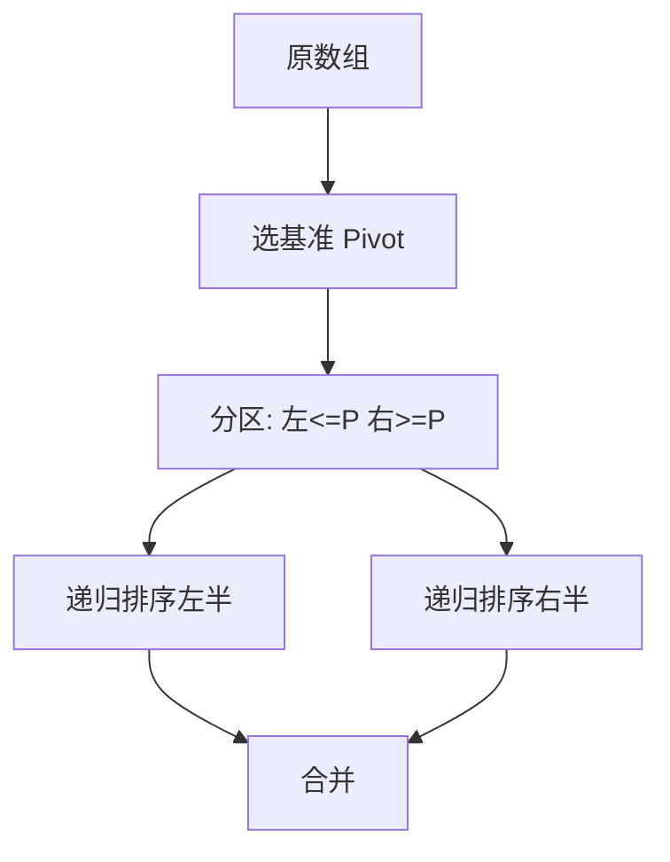

# 快速排序


快速排序（Quick Sort）是一种高效的排序算法，由托尼·霍尔（Tony Hoare）于1960年提出。它基于分治法（Divide and Conquer）策略，通过选择一个"基准"元素（pivot），将数组分为两部分，使得左边部分的所有元素都小于或等于基准，右边部分的所有元素都大于或等于基准，然后递归地对这两部分进行排序。

## 一、快速排序的基本步骤



1. **选择基准（Pivot Selection）**：
   - 从数组中选择一个元素作为基准。选择的方法有多种，常见的包括选择第一个元素、最后一个元素、中间元素，或者随机选择一个元素

2. **分区（Partitioning）**：
   - 重新排列数组，使得所有比基准小的元素放在基准的左边，所有比基准大的元素放在基准的右边。分区完成后，基准元素处于其最终排序的位置

3. **递归排序（Recursive Sorting）**：
   - 递归地对基准左边和右边的子数组进行快速排序

## 二、快速排序的代码实现

以下是快速排序的实现示例，包括基本的快速排序和优化后的快速排序（随机选择基准）。

### 1. 基本快速排序实现

```java tab
public class QuickSortBasic {
    public static void quickSort(int[] arr) {
        if (arr == null || arr.length == 0) return;
        quickSort(arr, 0, arr.length - 1);
    }

    private static void quickSort(int[] arr, int low, int high) {
        if (low < high) {
            int pi = partition(arr, low, high);
            quickSort(arr, low, pi - 1);
            quickSort(arr, pi + 1, high);
        }
    }

    private static int partition(int[] arr, int low, int high) {
        int pivot = arr[high];
        int i = low - 1;
        for (int j = low; j < high; j++) {
            if (arr[j] <= pivot) {
                i++;
                int temp = arr[i]; arr[i] = arr[j]; arr[j] = temp;
            }
        }
        int temp = arr[i + 1]; arr[i + 1] = arr[high]; arr[high] = temp;
        return i + 1;
    }
}
```
```typescript tab
function quickSort(arr: number[], low = 0, high = arr.length - 1): void {
    if (low < high) {
        const pi = partition(arr, low, high);
        quickSort(arr, low, pi - 1);
        quickSort(arr, pi + 1, high);
    }
}

function partition(arr: number[], low: number, high: number): number {
    const pivot = arr[high];
    let i = low - 1;
    for (let j = low; j < high; j++) {
        if (arr[j] <= pivot) {
            i++;
            [arr[i], arr[j]] = [arr[j], arr[i]];
        }
    }
    [arr[i + 1], arr[high]] = [arr[high], arr[i + 1]];
    return i + 1;
}
```
```python tab
def quick_sort(arr: list[int], low=0, high=None):
    if high is None:
        high = len(arr) - 1
    if low < high:
        pi = partition(arr, low, high)
        quick_sort(arr, low, pi - 1)
        quick_sort(arr, pi + 1, high)

def partition(arr: list[int], low: int, high: int) -> int:
    pivot = arr[high]
    i = low - 1
    for j in range(low, high):
        if arr[j] <= pivot:
            i += 1
            arr[i], arr[j] = arr[j], arr[i]
    arr[i + 1], arr[high] = arr[high], arr[i + 1]
    return i + 1
```

### 2. 优化快速排序：随机选择基准

```java tab
import java.util.Random;

public class QuickSortRandomPivot {
    private static final Random rand = new Random();

    public static void quickSort(int[] arr) {
        if (arr == null || arr.length == 0) return;
        quickSort(arr, 0, arr.length - 1);
    }

    private static void quickSort(int[] arr, int low, int high) {
        if (low < high) {
            int pi = randomizedPartition(arr, low, high);
            quickSort(arr, low, pi - 1);
            quickSort(arr, pi + 1, high);
        }
    }

    private static int randomizedPartition(int[] arr, int low, int high) {
        int randomIndex = low + rand.nextInt(high - low + 1);
        swap(arr, randomIndex, high);
        return partition(arr, low, high);
    }

    private static int partition(int[] arr, int low, int high) {
        int pivot = arr[high];
        int i = low - 1;
        for (int j = low; j < high; j++) {
            if (arr[j] <= pivot) { i++; swap(arr, i, j); }
        }
        swap(arr, i + 1, high);
        return i + 1;
    }

    private static void swap(int[] arr, int i, int j) {
        if (i == j) return;
        int temp = arr[i]; arr[i] = arr[j]; arr[j] = temp;
    }
}
```
```typescript tab
function quickSortRandom(arr: number[], low = 0, high = arr.length - 1): void {
    if (low < high) {
        const pi = randomizedPartition(arr, low, high);
        quickSortRandom(arr, low, pi - 1);
        quickSortRandom(arr, pi + 1, high);
    }
}

function randomizedPartition(arr: number[], low: number, high: number): number {
    const randomIndex = low + Math.floor(Math.random() * (high - low + 1));
    [arr[randomIndex], arr[high]] = [arr[high], arr[randomIndex]];
    return partition(arr, low, high);
}

function partition(arr: number[], low: number, high: number): number {
    const pivot = arr[high];
    let i = low - 1;
    for (let j = low; j < high; j++) {
        if (arr[j] <= pivot) { i++; [arr[i], arr[j]] = [arr[j], arr[i]]; }
    }
    [arr[i + 1], arr[high]] = [arr[high], arr[i + 1]];
    return i + 1;
}
```
```python tab
import random

def quick_sort_random(arr: list[int], low=0, high=None):
    if high is None:
        high = len(arr) - 1
    if low < high:
        pi = randomized_partition(arr, low, high)
        quick_sort_random(arr, low, pi - 1)
        quick_sort_random(arr, pi + 1, high)

def randomized_partition(arr: list[int], low: int, high: int) -> int:
    random_index = random.randint(low, high)
    arr[random_index], arr[high] = arr[high], arr[random_index]
    return partition(arr, low, high)

def partition(arr: list[int], low: int, high: int) -> int:
    pivot = arr[high]
    i = low - 1
    for j in range(low, high):
        if arr[j] <= pivot:
            i += 1
            arr[i], arr[j] = arr[j], arr[i]
    arr[i + 1], arr[high] = arr[high], arr[i + 1]
    return i + 1
```

## 三、Partition 过程图解

以 `[3, 6, 8, 10, 1, 2, 1]`，pivot = arr[high] = 1 为例（Lomuto 分区）：

```
初始: [3, 6, 8, 10, 1, 2, |1]  pivot=1, i=-1

j=0: 3>1 不动         [3, 6, 8, 10, 1, 2, 1]
j=1: 6>1 不动         [3, 6, 8, 10, 1, 2, 1]
j=2: 8>1 不动         [3, 6, 8, 10, 1, 2, 1]
j=3: 10>1 不动        [3, 6, 8, 10, 1, 2, 1]
j=4: 1<=1 → i=0, 交换arr[0],arr[4]  [1, 6, 8, 10, 3, 2, 1]
j=5: 2>1 不动         [1, 6, 8, 10, 3, 2, 1]

最后: 交换arr[i+1]=arr[1]与arr[6]  [1, 1, 8, 10, 3, 2, |6]
                                        pivot=1 就位 ↑

结果: pivot 左边全 ≤1，右边全 >1，pivot 在最终位置
```

**Lomuto vs Hoare 分区**：

| 维度 | Lomuto（单边扫描） | Hoare（双指针相向） |
|------|-------------------|--------------------|
| 交换次数 | 较多 | 较少（约为 Lomuto 的 1/3） |
| 代码复杂度 | 简单直观 | 边界条件微妙 |
| 重复元素 | 退化严重 | 相对均衡 |
| 教学推荐 | ✅ 入门首选 | 工程实现常用 |

## 四、三路快排（处理大量重复元素）

当数组有大量重复元素时，标准 partition 把等于 pivot 的元素分散在两侧，导致递归不均衡。三路快排将数组分为 `<pivot`、`==pivot`、`>pivot` 三段：

```java tab
public static void quickSort3Way(int[] arr, int low, int high) {
    if (low >= high) return;
    // 随机选 pivot
    int randIdx = low + (int)(Math.random() * (high - low + 1));
    swap(arr, low, randIdx);
    int pivot = arr[low];
    // arr[low+1..lt] < pivot, arr[lt+1..i-1] == pivot, arr[gt..high] > pivot
    int lt = low, i = low + 1, gt = high + 1;
    while (i < gt) {
        if (arr[i] < pivot) { swap(arr, i, lt + 1); lt++; i++; }
        else if (arr[i] > pivot) { swap(arr, i, gt - 1); gt--; }
        else i++;
    }
    swap(arr, low, lt);
    quickSort3Way(arr, low, lt - 1);
    quickSort3Way(arr, gt, high);
}
```
```python tab
def quick_sort_3way(arr: list[int], low: int, high: int) -> None:
    if low >= high:
        return
    import random
    rand_idx = random.randint(low, high)
    arr[low], arr[rand_idx] = arr[rand_idx], arr[low]
    pivot = arr[low]
    lt, i, gt = low, low + 1, high + 1
    while i < gt:
        if arr[i] < pivot:
            arr[i], arr[lt + 1] = arr[lt + 1], arr[i]
            lt += 1; i += 1
        elif arr[i] > pivot:
            arr[i], arr[gt - 1] = arr[gt - 1], arr[i]
            gt -= 1
        else:
            i += 1
    arr[low], arr[lt] = arr[lt], arr[low]
    quick_sort_3way(arr, low, lt - 1)
    quick_sort_3way(arr, gt, high)
```

```
三路分区示意（pivot=3）:
[3, 1, 3, 5, 3, 2, 3, 4]
         ↓ 分区后
[1, 2 | 3, 3, 3, 3 | 5, 4]
  <3      ==3（不再递归！）   >3

全部元素相等时：一次分区即完成 → O(n)！
```

## 五、快速选择（QuickSelect）

找第 K 大元素不需要完整排序——partition 后 pivot 已在最终位置，只需递归一侧：

```java tab
public int findKthLargest(int[] nums, int k) {
    int target = nums.length - k;  // 第k大 = 排序后下标 n-k
    int lo = 0, hi = nums.length - 1;
    while (lo <= hi) {
        int p = partition(nums, lo, hi);
        if (p == target) return nums[p];
        else if (p < target) lo = p + 1;
        else hi = p - 1;
    }
    return -1;
}
// 平均 O(n)：n + n/2 + n/4 + ... = 2n
// 最坏 O(n²)：随机化 pivot 可规避
```
```python tab
def find_kth_largest(nums: list[int], k: int) -> int:
    import random
    target = len(nums) - k
    lo, hi = 0, len(nums) - 1
    while lo <= hi:
        rand_idx = random.randint(lo, hi)
        nums[lo], nums[rand_idx] = nums[rand_idx], nums[lo]
        pivot = nums[lo]
        # Hoare 分区
        i, j = lo, hi + 1
        while True:
            i += 1
            while i <= hi and nums[i] < pivot: i += 1
            j -= 1
            while nums[j] > pivot: j -= 1
            if i >= j: break
            nums[i], nums[j] = nums[j], nums[i]
        nums[lo], nums[j] = nums[j], nums[lo]
        if j == target: return nums[j]
        elif j < target: lo = j + 1
        else: hi = j - 1
    return -1
```

## 六、时间复杂度分析

| 情况 | 复杂度 |
|------|--------|
| 最佳情况 | O(n log n) |
| 平均情况 | O(n log n) |
| 最坏情况 | O(n²) |

## 七、空间复杂度分析

- **递归栈空间**：快速排序是一种原地排序算法，但在递归过程中需要消耗栈空间。平均情况下，空间复杂度为 O(log n)，最坏情况下为 O(n)

## 八、优化策略

1. **随机选择基准**：通过随机选择基准元素，减少最坏情况发生的概率
2. **三数取中法**：选择数组的左端、中间和右端三个元素的中位数作为基准
3. **小数组使用插入排序**：对于规模较小的子数组，切换到插入排序可以提高整体性能
4. **尾递归优化**：通过优化递归调用顺序，减少栈空间的使用

## 九、实际应用

由于其高效性和原地排序的特性，快速排序在实际应用中被广泛使用。许多编程语言的标准库中的排序函数都采用了快速排序或其变种（如 IntroSort = 快排 + 堆排兜底 + 小数组插入排序）。

## 十、面试真题

| 题目 | 难度 | 核心思路 |
|------|------|----------|
| 颜色分类（LC 75） | 🟡 Medium | 三路快排 partition |
| 数组中的第K个最大元素（LC 215） | 🟡 Medium | QuickSelect 平均 O(n) |
| 排序数组（LC 912） | 🟡 Medium | 手写快排（注意随机化防卡） |
| 摆动排序 II（LC 324） | 🟡 Medium | 快速选择 + 三路划分重排 |
| 最小的k个数（剑指40） | 🟢 Easy | QuickSelect 或堆 |

## 十一、易错点分析

**1. 递归边界死循环**

```java
// ❌ partition 返回 p 后递归 [lo, p] 和 [p+1, hi]
//    如果 p == hi，[lo, p] 没有缩小 → 无限递归
// ✅ Lomuto: 递归 [lo, p-1] 和 [p+1, hi]（pivot 已就位）
```

**2. 有序输入 + 固定 pivot = O(n²)**

LC 912 会故意用有序/逆序/全等数据卡固定选首/尾元素的快排。**必须随机化 pivot** 或用三路快排。

**3. QuickSelect 中 k 的含义**

第 k 大 = 升序排列后下标 n-k。搞混"第k大"和"下标k"是最常见错误。

## 十二、思考题

1. 为什么 QuickSelect 的平均时间是 O(n) 而不是 O(n log n)？（提示：几何级数 n + n/2 + n/4 + ...）
2. 如果数组中 90% 的元素都相同，标准快排和三路快排的表现差异有多大？
3. 如何修改快排使其成为稳定排序？代价是什么？（提示：额外空间记录原始下标）

> 练习推荐：先手写 [排序数组（LC 912）] 通过全部测试用例，再实现 QuickSelect 解决 LC 215。
