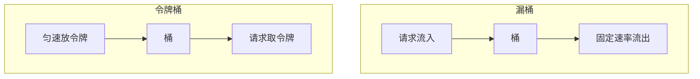

# 算法实战：限流与鉴权


## 一、问题背景

微服务架构中，两个核心安全问题：

- **鉴权**：如何快速判断一个请求是否有权限访问某资源？
- **限流**：如何控制接口调用频率，防止系统被打垮？

两者背后都依赖经典数据结构与算法。

## 二、鉴权：快速权限判断

### 2.1 权限模型


典型 RBAC（基于角色的访问控制）：
- 用户 → 角色（多对多）
- 角色 → 权限（多对多）
- 权限 → 接口 URL

### 2.2 数据结构选择

鉴权是**超高频读**操作（每个请求都要判断），需要 O(1) 查找：

| 数据结构 | 用途 |
|----------|------|
| 散列表 | 用户 ID → 角色集合 |
| 散列表 | 角色 → 权限 URL 集合 |
| Trie 树 | URL 前缀匹配（`/api/admin/*`） |
| 位图 | 权限位掩码（权限数有限时） |

### 2.3 实现方案

```java tab
public class AuthService {
    // 用户 -> 角色集合
    private Map<String, Set<String>> userRoles = new HashMap<>();
    // 角色 -> 权限URL集合
    private Map<String, Set<String>> rolePermissions = new HashMap<>();

    public boolean hasPermission(String userId, String requestUrl) {
        Set<String> roles = userRoles.get(userId);
        if (roles == null) return false;

        for (String role : roles) {
            Set<String> perms = rolePermissions.get(role);
            if (perms != null && matchUrl(perms, requestUrl)) {
                return true;
            }
        }
        return false;
    }

    private boolean matchUrl(Set<String> perms, String url) {
        // 精确匹配
        if (perms.contains(url)) return true;
        // 前缀通配: /api/admin/* 匹配 /api/admin/users
        for (String perm : perms) {
            if (perm.endsWith("/*")) {
                String prefix = perm.substring(0, perm.length() - 1);
                if (url.startsWith(prefix)) return true;
            }
        }
        return false;
    }
}
```

### 2.4 性能优化

| 优化手段 | 说明 |
|----------|------|
| 本地缓存 | 权限数据加载到内存，避免每次查 DB |
| 位运算 | 权限编号为 bit 位，判断用 `&` 操作 |
| 布隆过滤器 | 快速排除"一定无权限"的请求 |
| 定期刷新 | 权限变更时异步更新缓存 |

## 三、限流：保护系统不被打垮

### 3.1 四种经典限流算法

| 算法 | 原理 | 特点 |
|------|------|------|
| 固定窗口 | 时间窗内计数 | 简单，有临界突刺 |
| 滑动窗口 | 细分子窗口滑动 | 平滑，精度更高 |
| 漏桶 | 固定速率出水 | 绝对平滑，无法应对突发 |
| 令牌桶 | 匀速放令牌 | 允许一定突发流量 |

### 3.2 固定窗口计数器

```java tab
public class FixedWindowLimiter {
    private final int limit;
    private final long windowMs;
    private long windowStart;
    private int count;

    public FixedWindowLimiter(int limit, long windowMs) {
        this.limit = limit;
        this.windowMs = windowMs;
        this.windowStart = System.currentTimeMillis();
        this.count = 0;
    }

    public synchronized boolean tryAcquire() {
        long now = System.currentTimeMillis();
        if (now - windowStart >= windowMs) {
            windowStart = now;
            count = 0;
        }
        if (count < limit) {
            count++;
            return true;
        }
        return false;
    }
}
```

### 3.3 令牌桶（推荐）

```python tab
import time

class TokenBucket:
    def __init__(self, rate, capacity):
        """
        rate: 每秒放入令牌数
        capacity: 桶容量（允许的最大突发）
        """
        self.rate = rate
        self.capacity = capacity
        self.tokens = capacity
        self.last_time = time.time()

    def try_acquire(self, tokens=1):
        now = time.time()
        # 补充令牌
        elapsed = now - self.last_time
        self.tokens = min(self.capacity, self.tokens + elapsed * self.rate)
        self.last_time = now

        if self.tokens >= tokens:
            self.tokens -= tokens
            return True
        return False
```

```java tab
public class TokenBucketLimiter {
    private final double rate;      // 每秒令牌数
    private final double capacity;  // 桶容量
    private double tokens;
    private long lastTime;

    public TokenBucketLimiter(double rate, double capacity) {
        this.rate = rate;
        this.capacity = capacity;
        this.tokens = capacity;
        this.lastTime = System.nanoTime();
    }

    public synchronized boolean tryAcquire() {
        long now = System.nanoTime();
        double elapsed = (now - lastTime) / 1e9;
        tokens = Math.min(capacity, tokens + elapsed * rate);
        lastTime = now;

        if (tokens >= 1) {
            tokens -= 1;
            return true;
        }
        return false;
    }
}
```

### 3.4 漏桶 vs 令牌桶



| 对比 | 漏桶 | 令牌桶 |
|------|------|--------|
| 突发流量 | 严格平滑，拒绝突发 | 允许桶内积攒的令牌应对突发 |
| 实现复杂度 | 简单 | 稍复杂 |
| 典型应用 | Nginx 限流 | Guava RateLimiter、Sentinel |

## 四、分布式限流

单机限流用内存计数器即可，分布式场景需要：

| 方案 | 实现 |
|------|------|
| Redis + Lua | 原子性计数 + 过期时间 |
| Redis + 滑动窗口 | ZSET 存储时间戳 |
| 令牌桶集群 | 中心化令牌分发 |

```text
-- Redis Lua 限流脚本
local key = KEYS[1]
local limit = tonumber(ARGV[1])
local current = redis.call('INCR', key)
if current == 1 then
    redis.call('EXPIRE', key, 60)
end
if current > limit then
    return 0
end
return 1
```

## 五、总结

| 问题 | 核心数据结构 | 关键算法 |
|------|-------------|----------|
| 鉴权 | 散列表 + Trie | O(1) 查找 + 前缀匹配 |
| 限流 | 队列/计数器 | 滑动窗口/令牌桶/漏桶 |

设计原则：
- 鉴权追求**低延迟**（每请求必走）→ 内存缓存 + 位运算
- 限流追求**精确与平滑**→ 令牌桶允许合理突发
- 分布式场景 → Redis 原子操作保证一致性
