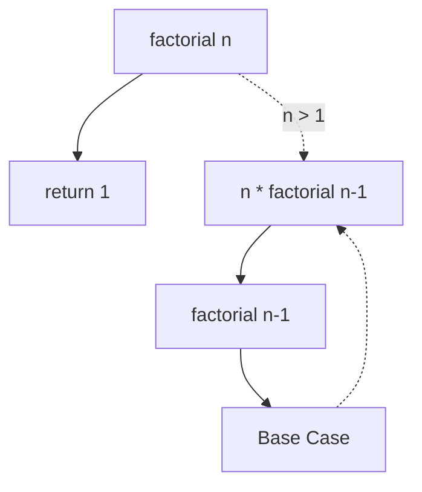

# 递归


## 一、什么是递归？

**递归（Recursion）** 是一种解决问题的方法，其中函数调用自身来解决问题的小实例。



> 递归 = 自己调用自己，**必须有 base case**。

## 二、递归的核心要素

1. **基本案例（Base Case）**：递归终止的条件
2. **递归案例（Recursive Case）**：函数调用自身的部分

## 三、递归示例：阶乘

```java tab
public class Factorial {
    
    public static int factorial(int n) {
        if (n == 0 || n == 1) {
            return 1;
        }
        return n * factorial(n - 1);
    }
    
    public static int factorialIterative(int n) {
        int result = 1;
        for (int i = 2; i <= n; i++) {
            result *= i;
        }
        return result;
    }
}
```
```typescript tab
function factorial(n: number): number {
    if (n === 0 || n === 1) return 1;
    return n * factorial(n - 1);
}

function factorialIterative(n: number): number {
    let result = 1;
    for (let i = 2; i <= n; i++) {
        result *= i;
    }
    return result;
}
```
```python tab
def factorial(n: int) -> int:
    if n == 0 or n == 1:
        return 1
    return n * factorial(n - 1)

def factorial_iterative(n: int) -> int:
    result = 1
    for i in range(2, n + 1):
        result *= i
    return result
```

## 四、递归调用栈

递归函数调用会形成调用栈：

```text
factorial(4)
  = 4 * factorial(3)
  = 4 * 3 * factorial(2)
  = 4 * 3 * 2 * factorial(1)
  = 4 * 3 * 2 * 1
  = 24
```

## 五、递归的经典应用

### 1. 汉诺塔

```java tab
public class Hanoi {
    
    public static void hanoi(int n, char from, char to, char aux) {
        if (n == 1) {
            System.out.println("Move disk 1 from " + from + " to " + to);
            return;
        }
        hanoi(n - 1, from, aux, to);
        System.out.println("Move disk " + n + " from " + from + " to " + to);
        hanoi(n - 1, aux, to, from);
    }
}
```
```typescript tab
function hanoi(n: number, from: string, to: string, aux: string): void {
    if (n === 1) {
        console.log(`Move disk 1 from ${from} to ${to}`);
        return;
    }
    hanoi(n - 1, from, aux, to);
    console.log(`Move disk ${n} from ${from} to ${to}`);
    hanoi(n - 1, aux, to, from);
}
```
```python tab
def hanoi(n: int, from_rod: str, to_rod: str, aux_rod: str):
    if n == 1:
        print(f"Move disk 1 from {from_rod} to {to_rod}")
        return
    hanoi(n - 1, from_rod, aux_rod, to_rod)
    print(f"Move disk {n} from {from_rod} to {to_rod}")
    hanoi(n - 1, aux_rod, to_rod, from_rod)
```

### 2. 斐波那契数列

```java tab
public static int fibonacci(int n) {
    if (n <= 1) return n;
    return fibonacci(n - 1) + fibonacci(n - 2);
}
```
```typescript tab
function fibonacci(n: number): number {
    if (n <= 1) return n;
    return fibonacci(n - 1) + fibonacci(n - 2);
}
```
```python tab
def fibonacci(n: int) -> int:
    if n <= 1:
        return n
    return fibonacci(n - 1) + fibonacci(n - 2)
```

## 六、递归 vs 迭代

| 特点 | 递归 | 迭代 |
|------|------|------|
| 代码简洁性 | ✅ 更简洁 | 需要循环 |
| 空间复杂度 | O(n) 调用栈 | O(1) |
| 时间复杂度 | 可能较高 | 通常较低 |
| 思维难度 | 容易理解 | 需要构造循环 |

## 七、递归优化：记忆化

对于斐波那契数列，可以使用记忆化避免重复计算：

```java tab
public static int fibonacciMemo(int n, Map<Integer, Integer> memo) {
    if (n <= 1) return n;
    if (memo.containsKey(n)) return memo.get(n);
    
    int result = fibonacciMemo(n - 1, memo) + fibonacciMemo(n - 2, memo);
    memo.put(n, result);
    return result;
}
```
```typescript tab
function fibonacciMemo(n: number, memo: Map<number, number> = new Map()): number {
    if (n <= 1) return n;
    if (memo.has(n)) return memo.get(n)!;
    
    const result = fibonacciMemo(n - 1, memo) + fibonacciMemo(n - 2, memo);
    memo.set(n, result);
    return result;
}
```
```python tab
def fibonacci_memo(n: int, memo: dict = {}) -> int:
    if n <= 1:
        return n
    if n in memo:
        return memo[n]
    result = fibonacci_memo(n - 1, memo) + fibonacci_memo(n - 2, memo)
    memo[n] = result
    return result
```

## 八、什么时候用递归？

- 问题可以分解为相似的子问题
- 树和图结构的遍历
- 分治算法（如归并排序、快速排序）
- 回溯算法（如八皇后、数独）

## 九、递归树与复杂度分析

用递归树直观理解递归的时间复杂度：

```
fib(n) 的递归树（未记忆化）：

                fib(5)
              /        \
         fib(4)        fib(3)
        /     \        /     \
    fib(3)  fib(2)  fib(2)  fib(1)
    /   \    /  \    /  \
fib(2) fib(1) ...  ...

问题：fib(3) 被计算了 2 次，fib(2) 被计算了 3 次！
节点总数 ≈ 2^n → 指数复杂度 O(2^n)

加上记忆化后：每个 fib(i) 只算一次 → O(n)
```

**递归复杂度分析三步法**：

1. 写出递推式：T(n) = aT(n/b) + f(n)
2. 画递归树：每层工作量 × 层数
3. 或用主定理（Master Theorem）直接得结论

```
归并排序：T(n) = 2T(n/2) + O(n) → O(n log n)
二分查找：T(n) = T(n/2) + O(1) → O(log n)
冒泡递归：T(n) = T(n-1) + O(n) → O(n²)
```

## 十、面试真题

| 题目 | 难度 | 核心思路 |
|------|------|----------|
| 反转链表（LC 206） | 🟢 Easy | 递归反转：假设后面已反转，处理当前节点 |
| 汉诺塔（经典） | 🟡 Medium | n-1 个移开 → 移最大的 → n-1 个移回 |
| 全排列（LC 46） | 🟡 Medium | 递归 + 回溯 |
| 子集（LC 78） | 🟡 Medium | 每个元素选/不选 |
| 实现 pow(x,n)（LC 50） | 🟡 Medium | 快速幂：x^n = (x^{n/2})² |
| 第 N 个泰波那契数（LC 1137） | 🟢 Easy | 记忆化递归 or 迭代 |

## 十一、易错点分析

**1. 忘记基准条件 → 栈溢出**

```java
// ❌ 没有终止条件，无限递归直到 StackOverflowError
int sum(int n) { return n + sum(n - 1); }
// ✅ 必须有基准条件
int sum(int n) { return n <= 0 ? 0 : n + sum(n - 1); }
```

**2. 递归深度超限**

Python 默认递归深度限制 1000，Java 栈默认约 10⁴ 层。n = 10⁵ 的链状递归必须改写为迭代或显式栈。

**3. 重复子问题未记忆化**

```python
# ❌ fib(40) 就要算上亿次
# ✅ 加 lru_cache 或手写 memo
from functools import lru_cache

@lru_cache(maxsize=None)
def fib(n): return n if n < 2 else fib(n-1) + fib(n-2)
```

**4. 递归中修改外部状态的顺序**

回溯算法中，“做选择 → 递归 → 撤销选择”的顺序不能乱，撤销必须在递归返回后立即执行。

## 十二、思考题

1. 为什么“能用递归的都能用迭代”？反过来呢？（提示：显式栈模拟调用栈）
2. 尾递归是什么？为什么某些语言（如 Scheme）能优化尾递归而 Java/Python 不能？
3. 快速幂 x^n 的递归式 T(n) = T(n/2) + O(1)，为什么是 O(log n) 而不是 O(n)？

> 练习推荐：先手写 [反转链表（LC 206）] 的递归版，理解“假设子问题已解决”的思维。
