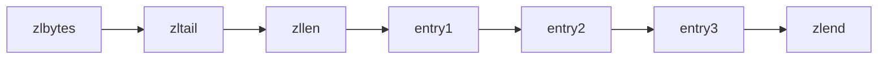
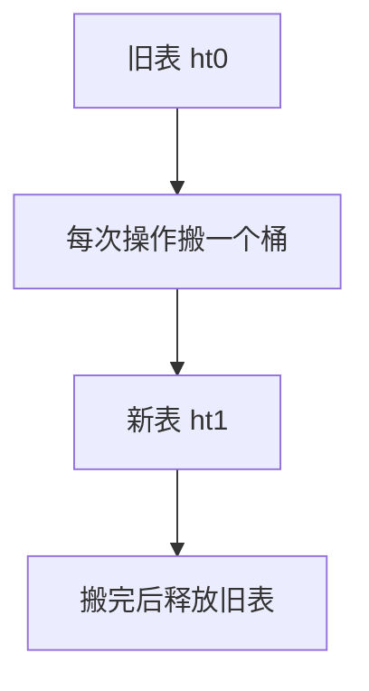
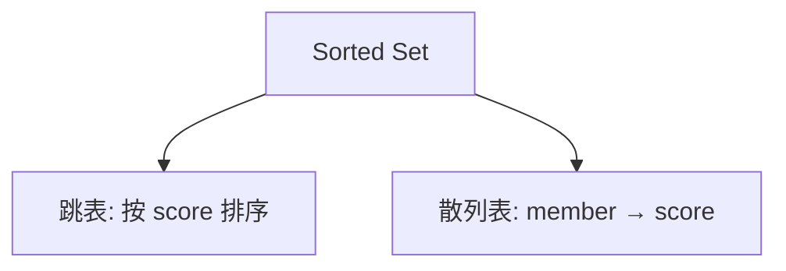

# 算法实战：Redis 数据结构剖析


## 一、概述

Redis 是高性能 Key-Value 内存数据库，其 5 种常用数据类型底层依赖了多种经典数据结构。理解这些底层实现，能帮助我们：

- 根据业务场景选择最合适的数据类型
- 预估内存消耗，避免性能陷阱
- 理解框架设计背后的权衡取舍

| Redis 数据类型 | 底层数据结构 |
|---------------|-------------|
| String | SDS（简单动态字符串） |
| List | 压缩列表 / 双向链表 / QuickList |
| Hash | 压缩列表 / 散列表 |
| Set | 整数集合 / 散列表 |
| Sorted Set | 压缩列表 / 跳表 + 散列表 |

## 二、列表（List）

### 2.1 压缩列表（ziplist）

当数据量小时使用，需**同时满足**：
- 单个元素 < 64 字节
- 元素个数 < 512



核心优势：**连续内存**，比数组更省空间（允许不同大小的元素紧凑排列）。

### 2.2 双向链表

数据量大时使用。Redis 的链表实现值得借鉴：

```c tab
typedef struct listNode {
    struct listNode *prev;
    struct listNode *next;
    void *value;
} listNode;

typedef struct list {
    listNode *head;
    listNode *tail;
    unsigned long len;
    void *(*dup)(void *ptr);
    void (*free)(void *ptr);
    int (*match)(void *ptr, void *key);
} list;
```

> 额外定义 `list` 结构体封装首尾指针和长度，O(1) 获取链表长度。

### 2.3 QuickList（Redis 3.2+）

实际是**双向链表 + 压缩列表**的混合体：链表节点内部使用 ziplist 存储，兼顾内存效率和操作性能。

## 三、字典（Hash）

### 3.1 实现选择

| 条件 | 实现 |
|------|------|
| 键值都 < 64B 且个数 < 512 | 压缩列表 |
| 否则 | 散列表 |

### 3.2 散列表设计要点

- 哈希函数：**MurmurHash2**（速度快、随机性好）
- 冲突解决：**链表法**
- 动态扩容：装载因子 > 1 时触发，扩容为 2 倍
- **渐进式 rehash**：不是一次性搬迁，而是在每次 CRUD 操作时搬一部分，避免阻塞

### 3.3 渐进式 rehash 的意义



> 如果一次性 rehash 百万级数据，会导致 Redis 短暂不可用。渐进式将代价分摊到每次操作中。

## 四、集合（Set）

### 4.1 整数集合（intset）

当集合中只包含整数且个数 < 512 时使用。

- 底层是有序整数数组
- 支持升级（int16 → int32 → int64），不支持降级

### 4.2 散列表

不满足 intset 条件时，使用散列表存储，保证 O(1) 的添加/删除/判存。

## 五、有序集合（Sorted Set）

### 5.1 为什么用跳表？

有序集合需要支持：
- O(log n) 插入、删除、查找
- **按分数区间查询**（ZRANGEBYSCORE）
- **按排名查询**（ZRANK）

| 候选方案 | 区间查询 | 实现复杂度 | 内存局部性 |
|----------|----------|-----------|-----------|
| 红黑树 | 需中序遍历 | 高（旋转） | 一般 |
| 跳表 | 链表顺序遍历 | 低 | 好 |

Redis 选择**跳表**，原因：实现简单、区间操作天然友好、性能与红黑树相当。

### 5.2 跳表 + 散列表的组合



- **跳表**：支持按分数范围查询、排名查询
- **散列表**：O(1) 通过 member 查 score（ZSCORE 命令）

两者共享 member 和 score 数据，不重复存储。

## 六、持久化中的数据结构

### 6.1 RDB 快照

将内存数据序列化为二进制文件，重启时全量加载。

### 6.2 AOF 日志

追加写命令日志，支持每秒/每次写入同步。

### 6.3 混合持久化（Redis 4.0+）

RDB + 增量 AOF，兼顾加载速度和数据安全。

## 七、设计思想总结

| 设计原则 | 体现 |
|----------|------|
| 空间换时间 | 跳表多层索引加速查找 |
| 时间换空间 | 压缩列表紧凑存储 |
| 渐进式操作 | rehash 分摊到每次操作 |
| 组合数据结构 | 跳表+散列表互补 |
| 阈值切换 | 小数据用紧凑结构，大数据用高效结构 |

## 八、面试高频题

**Q：Redis 有序集合为什么不用红黑树？**

1. 跳表实现更简单，调试方便
2. 跳表对范围查询天然友好（找到起点后沿链表遍历）
3. 通过调整索引概率，跳表性能与红黑树相当
4. 跳表更灵活，可以方便地调整层数

**Q：Redis 散列表为什么用渐进式 rehash？**

避免一次性搬迁大量数据导致主线程阻塞（Redis 单线程模型），将 O(n) 的一次性开销分摊为每次操作的 O(1) 额外开销。

## 九、总结

Redis 是"数据结构教科书级"的工程实现：

- 根据数据规模**动态选择**底层结构（ziplist ↔ hashtable）
- 通过**组合**多种结构互补优劣（跳表+散列表）
- 用**渐进式**策略避免瞬时性能抖动
- 每个设计决策都是时间、空间、实现复杂度的**工程权衡**
