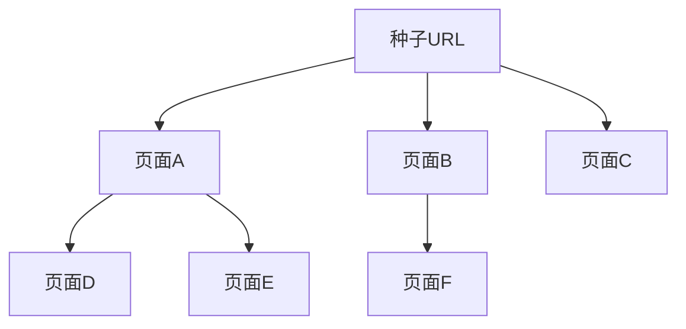
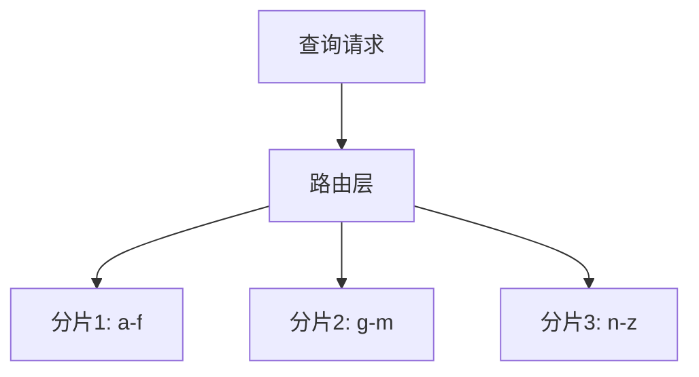

# 算法实战：搜索引擎背后的数据结构与算法


## 一、概述

搜索引擎是数据结构与算法的"集大成者"。从网页爬取到最终返回搜索结果，几乎用到了所有经典数据结构和算法。


| 阶段 | 核心问题 | 涉及算法/结构 |
|------|----------|--------------|
| 搜集 | 爬取网页、去重 | BFS/DFS、布隆过滤器、散列表 |
| 分析 | 提取关键词、计算权重 | 分词、TF-IDF、PageRank |
| 索引 | 建立倒排索引 | 散列表、跳表、B+树 |
| 查询 | 匹配+排序返回 | 字符串匹配、堆、归并排序 |

## 二、搜集阶段

### 2.1 爬虫的 BFS 策略

从种子 URL 出发，**广度优先**逐层爬取：



- 用**队列**存储待爬 URL
- 逐层扩展，优先爬取"浅层"重要页面

### 2.2 URL 去重

10 亿级 URL 判重方案：

| 方案 | 内存 | 准确性 |
|------|------|--------|
| 散列表 | ~100GB | 100% |
| 布隆过滤器 | ~1.2GB | ~99%（存在误判） |
| 分治+散列表 | 多机分摊 | 100% |

> 实际工程中常用**布隆过滤器初筛 + 散列表精确判重**的两级方案。

### 2.3 礼貌性爬取

- 遵守 `robots.txt` 协议
- 对同一域名限速（令牌桶/漏桶算法）
- 用**优先级队列**调度不同重要度的 URL

## 三、分析阶段

### 3.1 分词与关键词提取

对网页内容进行分词（中文需 NLP 分词器），提取有意义的关键词，去除停用词（的、是、在...）。

### 3.2 TF-IDF 权重

| 指标 | 含义 |
|------|------|
| TF（词频） | 关键词在本文档中出现的频率 |
| IDF（逆文档频率） | 关键词在所有文档中的稀有程度 |
| TF-IDF | TF × IDF，越高越能代表文档主题 |

> "的"在所有文档中都出现 → IDF 极低 → 权重低
> "布隆过滤器"只在少数文档出现 → IDF 高 → 权重高

### 3.3 PageRank

将互联网抽象为**有向图**（页面=顶点，超链接=边），用类似迭代的方式计算每个页面的重要性得分。

核心思想：被越多"重要页面"链接的页面，自身也越重要。

## 四、索引阶段

### 4.1 倒排索引

正排：文档 → 包含哪些关键词
倒排：关键词 → 出现在哪些文档

```text
"算法" → [doc1, doc5, doc12, doc99, ...]
"布隆" → [doc3, doc12, ...]
"过滤器" → [doc3, doc12, doc45, ...]
```

### 4.2 索引的数据结构

| 需求 | 数据结构 |
|------|----------|
| 关键词 → 文档列表 | 散列表（O(1) 定位） |
| 文档列表有序（按权重） | 跳表 / 有序数组 |
| 海量索引持久化 | B+树（磁盘友好） |
| 前缀搜索（搜索建议） | Trie 树 |

### 4.3 分布式索引

单机存不下所有索引 → 按关键词哈希分片到多台机器：



## 五、查询阶段

### 5.1 查询处理流程

1. **分词**：将用户查询拆分为关键词
2. **匹配**：在倒排索引中查找每个关键词的文档列表
3. **交集/并集**：多关键词取交集（AND）或并集（OR）
4. **排序**：按相关性得分（TF-IDF + PageRank）排序
5. **返回 Top-K**：用**堆**取前 K 条

### 5.2 字符串匹配

用户输入联想（搜索建议）：
- **Trie 树**：前缀匹配，O(前缀长度)
- **AC 自动机**：多模式串同时匹配

### 5.3 Top-K 排序

从百万级结果中取前 10 条：

| 方案 | 时间复杂度 |
|------|-----------|
| 全量排序 | O(n log n) |
| 小顶堆（大小 K） | O(n log K) |
| 快速选择 | 平均 O(n) |

> 实际使用**多路归并**：各分片各自取 Top-K，再归并取全局 Top-K。

## 六、知识点串联

| 学过的知识 | 在搜索引擎中的应用 |
|-----------|-------------------|
| 散列表 | URL 去重、倒排索引 |
| 布隆过滤器 | 海量 URL 初筛去重 |
| 队列 | BFS 爬虫 |
| 优先级队列/堆 | URL 调度、Top-K |
| Trie 树 | 搜索建议 |
| 字符串匹配 | 查询分词匹配 |
| 图 + PageRank | 网页重要性排序 |
| B+树 | 索引持久化存储 |
| 分治/归并 | 分布式多路归并排序 |
| 跳表 | 有序文档列表 |

## 七、总结

搜索引擎是一个**算法密度极高**的系统工程：

- 搜集层：图遍历 + 去重（布隆过滤器）
- 分析层：统计 + 图算法（PageRank）
- 索引层：散列表 + B+树 + Trie
- 查询层：字符串匹配 + 堆排序 + 归并

掌握数据结构和算法，就能理解这些复杂系统背后的设计逻辑，而不只是"调 API"。
