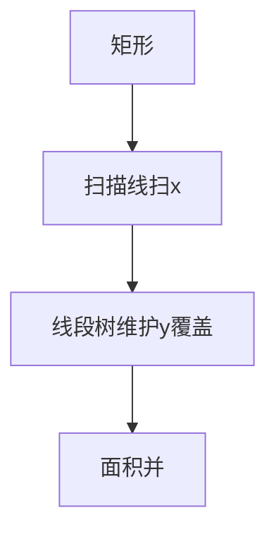

# 线段树进阶

线段树的基础在于"区间查询 + 区间修改"，但真正的威力在于它的**可扩展性**：扫描线、区间合并、动态开点、可持久化……本节覆盖线段树在竞赛与面试中的进阶用法。

## 一、扫描线：矩形面积并



经典问题：平面上若干矩形，求它们的面积并。

**思路**：沿 x 轴扫描，每遇到一条竖直边就计算"当前覆盖的 y 轴总长度 × 到下一条边的距离"。覆盖长度用线段树维护。

```java tab
// 矩形面积并（LeetCode 850 思路）
class Solution {
    public int rectangleArea(int[][] rectangles) {
        // 事件：(x, y1, y2, +1/-1) 表示进入/离开
        List<int[]> events = new ArrayList<>();
        Set<Integer> ySet = new TreeSet<>();
        for (int[] r : rectangles) {
            events.add(new int[]{r[0], r[1], r[3], 1});
            events.add(new int[]{r[2], r[1], r[3], -1});
            ySet.add(r[1]); ySet.add(r[3]);
        }
        events.sort((a, b) -> a[0] - b[0]);

        // y 坐标离散化
        List<Integer> ys = new ArrayList<>(ySet);
        Map<Integer, Integer> yIdx = new HashMap<>();
        for (int i = 0; i < ys.size(); i++) yIdx.put(ys.get(i), i);

        int[] count = new int[4 * ys.size()];  // 覆盖次数
        long[] cover = new long[4 * ys.size()]; // 覆盖长度
        long area = 0;
        int prevX = events.get(0)[0];

        for (int[] e : events) {
            area += cover[1] * (e[0] - prevX);
            update(count, cover, 1, 0, ys.size() - 2,
                   yIdx.get(e[1]), yIdx.get(e[2]) - 1, e[3], ys);
            prevX = e[0];
        }
        return (int) (area % 1_000_000_007);
    }

    void update(int[] count, long[] cover, int node, int lo, int hi,
                int l, int r, int val, List<Integer> ys) {
        if (r < lo || hi < l) return;
        if (l <= lo && hi <= r) {
            count[node] += val;
        } else {
            int mid = (lo + hi) / 2;
            update(count, cover, node * 2, lo, mid, l, r, val, ys);
            update(count, cover, node * 2 + 1, mid + 1, hi, l, r, val, ys);
        }
        if (count[node] > 0) {
            cover[node] = ys.get(hi + 1) - ys.get(lo);
        } else if (lo == hi) {
            cover[node] = 0;
        } else {
            cover[node] = cover[node * 2] + cover[node * 2 + 1];
        }
    }
}
```

```typescript tab
// 矩形面积并（LeetCode 850 思路）
function rectangleArea(rectangles: number[][]): number {
    const MOD = 1_000_000_007n;
    // 事件：(x, y1, y2, +1/-1) 表示进入/离开
    const events: number[][] = [];
    const ySet = new Set<number>();
    for (const r of rectangles) {
        events.push([r[0], r[1], r[3], 1]);
        events.push([r[2], r[1], r[3], -1]);
        ySet.add(r[1]); ySet.add(r[3]);
    }
    events.sort((a, b) => a[0] - b[0]);

    // y 坐标离散化
    const ys = [...ySet].sort((a, b) => a - b);
    const yIdx = new Map<number, number>();
    ys.forEach((y, i) => yIdx.set(y, i));

    const count = new Array(4 * ys.length).fill(0);  // 覆盖次数
    const cover = new Array(4 * ys.length).fill(0);  // 覆盖长度
    let area = 0n;
    let prevX = events[0][0];

    for (const e of events) {
        area += BigInt(cover[1]) * BigInt(e[0] - prevX);
        update(count, cover, 1, 0, ys.length - 2,
               yIdx.get(e[1])!, yIdx.get(e[2])! - 1, e[3], ys);
        prevX = e[0];
    }
    return Number(area % MOD);
}

function update(count: number[], cover: number[], node: number, lo: number, hi: number,
                l: number, r: number, val: number, ys: number[]): void {
    if (r < lo || hi < l) return;
    if (l <= lo && hi <= r) {
        count[node] += val;
    } else {
        const mid = Math.floor((lo + hi) / 2);
        update(count, cover, node * 2, lo, mid, l, r, val, ys);
        update(count, cover, node * 2 + 1, mid + 1, hi, l, r, val, ys);
    }
    if (count[node] > 0) {
        cover[node] = ys[hi + 1] - ys[lo];
    } else if (lo === hi) {
        cover[node] = 0;
    } else {
        cover[node] = cover[node * 2] + cover[node * 2 + 1];
    }
}
```

```python tab
# 矩形面积并（LeetCode 850 思路）
class Solution:
    def rectangleArea(self, rectangles: list[list[int]]) -> int:
        MOD = 1_000_000_007
        # 事件：(x, y1, y2, +1/-1) 表示进入/离开
        events = []
        y_set = set()
        for r in rectangles:
            events.append([r[0], r[1], r[3], 1])
            events.append([r[2], r[1], r[3], -1])
            y_set.add(r[1])
            y_set.add(r[3])
        events.sort(key=lambda e: e[0])

        # y 坐标离散化
        ys = sorted(y_set)
        y_idx = {y: i for i, y in enumerate(ys)}

        count = [0] * (4 * len(ys))   # 覆盖次数
        cover = [0] * (4 * len(ys))   # 覆盖长度
        area = 0
        prev_x = events[0][0]

        for e in events:
            area += cover[1] * (e[0] - prev_x)
            self._update(count, cover, 1, 0, len(ys) - 2,
                         y_idx[e[1]], y_idx[e[2]] - 1, e[3], ys)
            prev_x = e[0]
        return area % MOD

    def _update(self, count: list[int], cover: list[int], node: int, lo: int, hi: int,
                l: int, r: int, val: int, ys: list[int]) -> None:
        if r < lo or hi < l:
            return
        if l <= lo and hi <= r:
            count[node] += val
        else:
            mid = (lo + hi) // 2
            self._update(count, cover, node * 2, lo, mid, l, r, val, ys)
            self._update(count, cover, node * 2 + 1, mid + 1, hi, l, r, val, ys)
        if count[node] > 0:
            cover[node] = ys[hi + 1] - ys[lo]
        elif lo == hi:
            cover[node] = 0
        else:
            cover[node] = cover[node * 2] + cover[node * 2 + 1]
```

> 关键点：这里的线段树**不需要懒标记下推**——每次修改都是成对的（+1 后必有 -1），pushUp 时根据 count 值直接决定覆盖长度。

## 二、区间合并：最长连续区间

问题：维护一个 01 序列，支持翻转区间、查询最长连续 1 的长度。

每个节点需要维护三个值：

| 字段 | 含义 |
|------|------|
| `pre` | 从左端点开始的最长连续 1 |
| `suf` | 从右端点结束的最长连续 1 |
| `max` | 区间内最长连续 1 |

合并逻辑：

```java tab
void pushUp(int node, int lo, int hi) {
    int mid = (lo + hi) / 2;
    int l = node * 2, r = node * 2 + 1;

    pre[node] = pre[l];
    if (pre[l] == mid - lo + 1) pre[node] += pre[r]; // 左区间全1，接上右区间

    suf[node] = suf[r];
    if (suf[r] == hi - mid) suf[node] += suf[l];     // 右区间全1，接上左区间

    max[node] = Math.max(Math.max(max[l], max[r]), suf[l] + pre[r]);
}
```

```typescript tab
function pushUp(node: number, lo: number, hi: number): void {
    const mid = Math.floor((lo + hi) / 2);
    const l = node * 2, r = node * 2 + 1;

    pre[node] = pre[l];
    if (pre[l] === mid - lo + 1) pre[node] += pre[r]; // 左区间全1，接上右区间

    suf[node] = suf[r];
    if (suf[r] === hi - mid) suf[node] += suf[l];     // 右区间全1，接上左区间

    max[node] = Math.max(Math.max(max[l], max[r]), suf[l] + pre[r]);
}
```

```python tab
def push_up(node: int, lo: int, hi: int) -> None:
    mid = (lo + hi) // 2
    l, r = node * 2, node * 2 + 1

    pre[node] = pre[l]
    if pre[l] == mid - lo + 1:
        pre[node] += pre[r]  # 左区间全1，接上右区间

    suf[node] = suf[r]
    if suf[r] == hi - mid:
        suf[node] += suf[l]  # 右区间全1，接上左区间

    max_[node] = max(max_[l], max_[r], suf[l] + pre[r])
```

> 翻转操作就是懒标记取反：`pre ↔ 区间长度 - pre` 不成立——正确做法是 `pre = len - pre` 只在"全翻转"时成立，实际上翻转后 pre 变成"从左端点开始的最长连续 0"……所以更通用的做法是同时维护 0 和 1 的信息，翻转时交换两者。

## 三、动态开点：值域巨大时

当值域达到 10⁹ 但实际操作只有 10⁵ 个时，4n 数组开不下。动态开点：**用到哪个节点才创建哪个节点**。

```java tab
class DynamicSegTree {
    int[] left = new int[MAX_NODES], right = new int[MAX_NODES];
    long[] sum = new long[MAX_NODES];
    long[] lazy = new long[MAX_NODES];
    int cnt = 1; // 节点 1 为根

    void pushDown(int node, int lo, int hi) {
        if (lazy[node] == 0) return;
        if (left[node] == 0) left[node] = ++cnt;
        if (right[node] == 0) right[node] = ++cnt;
        int mid = (lo + hi) / 2;
        // 下推懒标记
        sum[left[node]] += lazy[node] * (mid - lo + 1);
        lazy[left[node]] += lazy[node];
        sum[right[node]] += lazy[node] * (hi - mid);
        lazy[right[node]] += lazy[node];
        lazy[node] = 0;
    }

    void update(int node, int lo, int hi, int l, int r, long val) {
        if (r < lo || hi < l) return;
        if (l <= lo && hi <= r) {
            sum[node] += val * (hi - lo + 1);
            lazy[node] += val;
            return;
        }
        pushDown(node, lo, hi);
        int mid = (lo + hi) / 2;
        update(left[node], lo, mid, l, r, val);
        update(right[node], mid + 1, hi, l, r, val);
        sum[node] = sum[left[node]] + sum[right[node]];
    }
}
```

```typescript tab
class DynamicSegTree {
    private left: number[] = new Array(MAX_NODES).fill(0);
    private right: number[] = new Array(MAX_NODES).fill(0);
    private sum: number[] = new Array(MAX_NODES).fill(0);
    private lazy: number[] = new Array(MAX_NODES).fill(0);
    private cnt = 1; // 节点 1 为根

    private pushDown(node: number, lo: number, hi: number): void {
        if (this.lazy[node] === 0) return;
        if (this.left[node] === 0) this.left[node] = ++this.cnt;
        if (this.right[node] === 0) this.right[node] = ++this.cnt;
        const mid = Math.floor((lo + hi) / 2);
        // 下推懒标记
        this.sum[this.left[node]] += this.lazy[node] * (mid - lo + 1);
        this.lazy[this.left[node]] += this.lazy[node];
        this.sum[this.right[node]] += this.lazy[node] * (hi - mid);
        this.lazy[this.right[node]] += this.lazy[node];
        this.lazy[node] = 0;
    }

    update(node: number, lo: number, hi: number, l: number, r: number, val: number): void {
        if (r < lo || hi < l) return;
        if (l <= lo && hi <= r) {
            this.sum[node] += val * (hi - lo + 1);
            this.lazy[node] += val;
            return;
        }
        this.pushDown(node, lo, hi);
        const mid = Math.floor((lo + hi) / 2);
        this.update(this.left[node], lo, mid, l, r, val);
        this.update(this.right[node], mid + 1, hi, l, r, val);
        this.sum[node] = this.sum[this.left[node]] + this.sum[this.right[node]];
    }
}
```

```python tab
class DynamicSegTree:
    def __init__(self, max_nodes: int):
        self.left = [0] * max_nodes
        self.right = [0] * max_nodes
        self.sum = [0] * max_nodes
        self.lazy = [0] * max_nodes
        self.cnt = 1  # 节点 1 为根

    def _push_down(self, node: int, lo: int, hi: int) -> None:
        if self.lazy[node] == 0:
            return
        if self.left[node] == 0:
            self.cnt += 1
            self.left[node] = self.cnt
        if self.right[node] == 0:
            self.cnt += 1
            self.right[node] = self.cnt
        mid = (lo + hi) // 2
        # 下推懒标记
        self.sum[self.left[node]] += self.lazy[node] * (mid - lo + 1)
        self.lazy[self.left[node]] += self.lazy[node]
        self.sum[self.right[node]] += self.lazy[node] * (hi - mid)
        self.lazy[self.right[node]] += self.lazy[node]
        self.lazy[node] = 0

    def update(self, node: int, lo: int, hi: int, l: int, r: int, val: int) -> None:
        if r < lo or hi < l:
            return
        if l <= lo and hi <= r:
            self.sum[node] += val * (hi - lo + 1)
            self.lazy[node] += val
            return
        self._push_down(node, lo, hi)
        mid = (lo + hi) // 2
        self.update(self.left[node], lo, mid, l, r, val)
        self.update(self.right[node], mid + 1, hi, l, r, val)
        self.sum[node] = self.sum[self.left[node]] + self.sum[self.right[node]]
```

> 空间复杂度：每次操作最多新建 O(log V) 个节点，m 次操作共 O(m log V)。

## 四、线段树 + 二分：第 k 小

在权值线段树（下标为值域）上，查询全局第 k 小只需 O(log V)：

```java tab
int kth(int node, int lo, int hi, int k) {
    if (lo == hi) return lo;
    int mid = (lo + hi) / 2;
    if (sum[left[node]] >= k) return kth(left[node], lo, mid, k);
    return kth(right[node], mid + 1, hi, k - sum[left[node]]);
}
```

```typescript tab
function kth(node: number, lo: number, hi: number, k: number): number {
    if (lo === hi) return lo;
    const mid = Math.floor((lo + hi) / 2);
    if (sum[left[node]] >= k) return kth(left[node], lo, mid, k);
    return kth(right[node], mid + 1, hi, k - sum[left[node]]);
}
```

```python tab
def kth(node: int, lo: int, hi: int, k: int) -> int:
    if lo == hi:
        return lo
    mid = (lo + hi) // 2
    if sum_[left[node]] >= k:
        return kth(left[node], lo, mid, k)
    return kth(right[node], mid + 1, hi, k - sum_[left[node]])
```

配合**可持久化**（主席树），就能回答任意历史版本的区间第 k 小——详见《主席树》一节。

## 五、典型应用速查

| 问题 | 线段树维护的信息 |
|------|------------------|
| 矩形面积并 | 扫描线 + 覆盖长度 |
| 最长连续区间 | pre / suf / max 三元组 |
| 值域 10⁹ | 动态开点 |
| 区间第 k 小 | 权值线段树 + 二分 |
| 区间 GCD | gcd 结合律，差分转化 |
| 历史最值 | 懒标记记录"历史最大值" |

## 六、总结

- 扫描线的本质是**事件排序 + 线段树维护截面信息**
- 区间合并的关键是设计**可合并的节点信息**（pre/suf/max）
- 动态开点把空间从 O(V) 降到 O(m log V)
- 线段树是"分块思想"的极致——只要能定义合并操作，就能用它维护
