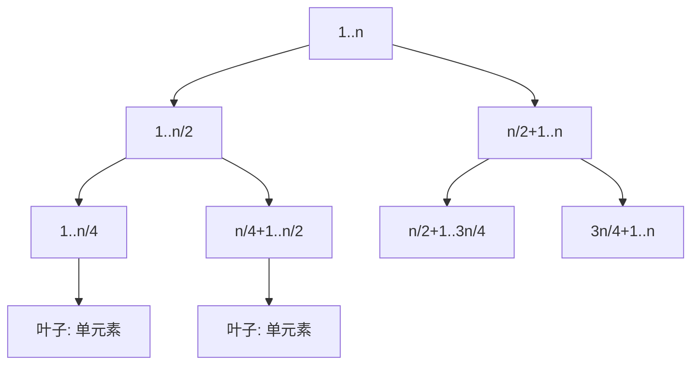

# 线段树 Segment Tree

**线段树**是一种用于高效处理区间查询和区间更新的数据结构。它通常用于解决诸如区间求和、区间最小值/最大值查询等问题。

## 一、线段树的特点



- 线段树是一种二叉树结构
- 每个节点代表一个区间
- 叶子节点代表数组中的单个元素
- 不是完全二叉树，但是**平衡二叉树**

> 如果区间有 n 个元素，数组表示需要 **4n** 个节点

**结构图解**（数组 `[2, 5, 1, 4, 9, 3]` 的求和线段树）：

```
                    [0,5] sum=24
                   /            \
            [0,2] sum=8          [3,5] sum=16
            /      \             /       \
      [0,1] sum=7  [2,2]=1  [3,4] sum=13  [5,5]=3
       /    \                /    \
   [0,0]=2 [1,1]=5      [3,3]=4 [4,4]=9

规律：
- 节点 [l,r] 的左孩子 = [l, mid]，右孩子 = [mid+1, r]
- 树高 = ⌈log₂n⌉ + 1
- 每层最多覆盖整个区间 → 查询只需访问 O(log n) 个节点
```

## 二、基本操作

1. **构建线段树**：从给定的数组构建线段树，O(n)
2. **区间查询**：查询某个区间的信息，O(log n)
3. **区间更新**：更新某个区间的值 + 懒标记，O(log n)

**查询过程模拟**（查询 [1, 4] 的和）：

```
query([1,4]) 从根 [0,5] 开始：

[0,5] 不被 [1,4] 完全覆盖 → 分裂为 [0,2] 和 [3,5]
  ├── [0,2] 不被完全覆盖 → 分裂为 [0,1] 和 [2,2]
  │     ├── [0,1] 不被完全覆盖 → 分裂为 [0,0] 和 [1,1]
  │     │     ├── [0,0] 与查询无交集 → 返回 0（剪枝！）
  │     │     └── [1,1] 被完全覆盖 → 返回 5 ✓
  │     └── [2,2] 被完全覆盖 → 返回 1 ✓
  └── [3,5] 不被完全覆盖 → 分裂为 [3,4] 和 [5,5]
        ├── [3,4] 被完全覆盖 → 返回 13 ✓（不再往下走！）
        └── [5,5] 与查询无交集 → 返回 0（剪枝！）

结果 = 5 + 1 + 13 = 19
实际只访问了 9 个节点（而非全部 11 个）
```

**核心洞察**：任何区间 [l, r] 最多被分解为 O(log n) 个"恰好覆盖"的节点，这就是线段树高效的本质。

## 三、懒标记（Lazy Propagation）

区间更新如果逐个修改叶子节点，复杂度退化为 O(n)。**懒标记**的思想：更新时如果当前节点被完全覆盖，只在该节点打上标记，**延迟**向子节点传播，等到真正需要访问子节点时才下推。

```
update([3,4], +2) 的过程：

更新前:       [0,5]=24
             /        \
       [0,2]=8      [3,5]=16
                    /      \
              [3,4]=13    [5,5]=3

更新时:  [3,4] 被完全覆盖 → 直接修改：
         tree[3,4] += 2×2 = 17, lazy[3,4] += 2
         回溯更新父节点: [3,5]=20, [0,5]=28

         此时 [3,3] 和 [4,4] 的值还是旧的！
         但没关系——等下次查询访问到它们时再下推

下推（pushDown）: 访问 [3,4] 的子节点前：
         lazy[3,3] += 2, tree[3,3] += 2
         lazy[4,4] += 2, tree[4,4] += 2
         lazy[3,4] = 0  （标记清零）
```

## 四、代码实现（含完整懒标记）

```java tab
public class SegmentTree {
    private int[] tree;
    private int[] lazy;
    private int n;

    public SegmentTree(int[] nums) {
        n = nums.length;
        tree = new int[4 * n];
        lazy = new int[4 * n];
        buildTree(nums, 0, 0, n - 1);
    }

    private void buildTree(int[] nums, int idx, int left, int right) {
        if (left == right) {
            tree[idx] = nums[left];
            return;
        }
        int mid = left + (right - left) / 2;
        buildTree(nums, idx * 2 + 1, left, mid);
        buildTree(nums, idx * 2 + 2, mid + 1, right);
        tree[idx] = tree[idx * 2 + 1] + tree[idx * 2 + 2];
    }

    private void pushDown(int idx, int start, int end) {
        if (lazy[idx] != 0) {
            int mid = start + (end - start) / 2;
            int l = idx * 2 + 1, r = idx * 2 + 2;
            tree[l] += lazy[idx] * (mid - start + 1);
            tree[r] += lazy[idx] * (end - mid);
            lazy[l] += lazy[idx];
            lazy[r] += lazy[idx];
            lazy[idx] = 0;
        }
    }

    public int query(int left, int right) {
        return query(0, 0, n - 1, left, right);
    }

    private int query(int idx, int start, int end, int left, int right) {
        if (start > right || end < left) return 0;
        if (left <= start && end <= right) return tree[idx];
        pushDown(idx, start, end);  // 访问子节点前先下推
        int mid = start + (end - start) / 2;
        return query(idx * 2 + 1, start, mid, left, right) +
               query(idx * 2 + 2, mid + 1, end, left, right);
    }

    public void update(int left, int right, int val) {
        update(0, 0, n - 1, left, right, val);
    }

    private void update(int idx, int start, int end, int left, int right, int val) {
        if (start > right || end < left) return;
        if (left <= start && end <= right) {
            tree[idx] += val * (end - start + 1);
            lazy[idx] += val;
            return;
        }
        pushDown(idx, start, end);  // 访问子节点前先下推
        int mid = start + (end - start) / 2;
        update(idx * 2 + 1, start, mid, left, right, val);
        update(idx * 2 + 2, mid + 1, end, left, right, val);
        tree[idx] = tree[idx * 2 + 1] + tree[idx * 2 + 2];
    }
}
```

```typescript tab
class SegmentTree {
    private tree: number[];
    private lazy: number[];
    private n: number;

    constructor(nums: number[]) {
        this.n = nums.length;
        this.tree = new Array(4 * this.n).fill(0);
        this.lazy = new Array(4 * this.n).fill(0);
        this.buildTree(nums, 0, 0, this.n - 1);
    }

    private buildTree(nums: number[], idx: number, left: number, right: number): void {
        if (left === right) {
            this.tree[idx] = nums[left];
            return;
        }
        const mid = left + Math.floor((right - left) / 2);
        this.buildTree(nums, idx * 2 + 1, left, mid);
        this.buildTree(nums, idx * 2 + 2, mid + 1, right);
        this.tree[idx] = this.tree[idx * 2 + 1] + this.tree[idx * 2 + 2];
    }

    private pushDown(idx: number, start: number, end: number): void {
        if (this.lazy[idx] !== 0) {
            const mid = start + Math.floor((end - start) / 2);
            const l = idx * 2 + 1, r = idx * 2 + 2;
            this.tree[l] += this.lazy[idx] * (mid - start + 1);
            this.tree[r] += this.lazy[idx] * (end - mid);
            this.lazy[l] += this.lazy[idx];
            this.lazy[r] += this.lazy[idx];
            this.lazy[idx] = 0;
        }
    }

    query(left: number, right: number): number {
        return this.queryHelper(0, 0, this.n - 1, left, right);
    }

    private queryHelper(idx: number, start: number, end: number, left: number, right: number): number {
        if (start > right || end < left) return 0;
        if (left <= start && end <= right) return this.tree[idx];
        this.pushDown(idx, start, end);
        const mid = start + Math.floor((end - start) / 2);
        return this.queryHelper(idx * 2 + 1, start, mid, left, right) +
               this.queryHelper(idx * 2 + 2, mid + 1, end, left, right);
    }

    update(left: number, right: number, val: number): void {
        this.updateHelper(0, 0, this.n - 1, left, right, val);
    }

    private updateHelper(idx: number, start: number, end: number, left: number, right: number, val: number): void {
        if (start > right || end < left) return;
        if (left <= start && end <= right) {
            this.tree[idx] += val * (end - start + 1);
            this.lazy[idx] += val;
            return;
        }
        this.pushDown(idx, start, end);
        const mid = start + Math.floor((end - start) / 2);
        this.updateHelper(idx * 2 + 1, start, mid, left, right, val);
        this.updateHelper(idx * 2 + 2, mid + 1, end, left, right, val);
        this.tree[idx] = this.tree[idx * 2 + 1] + this.tree[idx * 2 + 2];
    }
}
```

```python tab
class SegmentTree:
    def __init__(self, nums: list[int]):
        self.n = len(nums)
        self.tree = [0] * (4 * self.n)
        self.lazy = [0] * (4 * self.n)
        self._build_tree(nums, 0, 0, self.n - 1)

    def _build_tree(self, nums: list[int], idx: int, left: int, right: int) -> None:
        if left == right:
            self.tree[idx] = nums[left]
            return
        mid = left + (right - left) // 2
        self._build_tree(nums, idx * 2 + 1, left, mid)
        self._build_tree(nums, idx * 2 + 2, mid + 1, right)
        self.tree[idx] = self.tree[idx * 2 + 1] + self.tree[idx * 2 + 2]

    def _push_down(self, idx: int, start: int, end: int) -> None:
        if self.lazy[idx] != 0:
            mid = start + (end - start) // 2
            l, r = idx * 2 + 1, idx * 2 + 2
            self.tree[l] += self.lazy[idx] * (mid - start + 1)
            self.tree[r] += self.lazy[idx] * (end - mid)
            self.lazy[l] += self.lazy[idx]
            self.lazy[r] += self.lazy[idx]
            self.lazy[idx] = 0

    def query(self, left: int, right: int) -> int:
        return self._query(0, 0, self.n - 1, left, right)

    def _query(self, idx: int, start: int, end: int, left: int, right: int) -> int:
        if start > right or end < left:
            return 0
        if left <= start and end <= right:
            return self.tree[idx]
        self._push_down(idx, start, end)  # 访问子节点前先下推
        mid = start + (end - start) // 2
        return (self._query(idx * 2 + 1, start, mid, left, right) +
                self._query(idx * 2 + 2, mid + 1, end, left, right))

    def update(self, left: int, right: int, val: int) -> None:
        self._update(0, 0, self.n - 1, left, right, val)

    def _update(self, idx: int, start: int, end: int, left: int, right: int, val: int) -> None:
        if start > right or end < left:
            return
        if left <= start and end <= right:
            self.tree[idx] += val * (end - start + 1)
            self.lazy[idx] += val
            return
        self._push_down(idx, start, end)  # 访问子节点前先下推
        mid = start + (end - start) // 2
        self._update(idx * 2 + 1, start, mid, left, right, val)
        self._update(idx * 2 + 2, mid + 1, end, left, right, val)
        self.tree[idx] = self.tree[idx * 2 + 1] + self.tree[idx * 2 + 2]
```

## 五、时间复杂度

| 操作 | 时间复杂度 | 说明 |
|------|----------|------|
| 构建 | O(n) | 每个节点只访问一次 |
| 区间查询 | O(log n) | 每层最多访问 4 个节点 |
| 区间更新 | O(log n) | 懒标记保证不深入无关子树 |
| 空间 | O(4n) | 数组开 4n 是安全上界 |

**为什么查询是 O(log n)**：区间 [l,r] 在每一层最多命中 2 个"边界节点"（左边一个、右边一个），中间的整块节点直接返回。总访问节点数 ≤ 4·log₂n。

## 六、线段树 vs 树状数组

| 维度 | 线段树 | 树状数组（BIT） |
|------|--------|----------------|
| 代码量 | 较长（~60行） | 短（~15行） |
| 区间更新+区间查询 | ✅ 懒标记天然支持 | 需要差分技巧 |
| 可维护的信息 | 任意可合并信息（sum/min/max/gcd） | 主要是前缀和类 |
| 常数 | 较大（递归开销） | 小（位运算） |
| 扩展性 | 强（可持久化、扫描线、动态开点） | 弱 |
| 面试建议 | 必须掌握 | 了解即可 |

**选择原则**：能用前缀和/差分解决的用 BIT，需要区间最值、区间赋值等复杂操作用线段树。

## 七、应用场景

- 区间求和、区间最小值/最大值（LC 307 区域和检索）
- 动态区间查询和更新
- 扫描线算法（矩形面积并、天际线问题）
- 逆序对统计（离散化 + 单点更新 + 前缀查询）
- 竞赛编程中的复杂查询

### 面试真题

| 题目 | 难度 | 线段树用法 |
|------|------|-----------|
| 区域和检索-可修改（LC 307） | 🟡 Medium | 单点更新 + 区间求和 |
| 矩形面积 II（LC 850） | 🔴 Hard | 扫描线 + 区间覆盖计数 |
| 天际线问题（LC 218） | 🔴 Hard | 扫描线 or 分治 |
| 我的日程安排表 III（LC 732） | 🔴 Hard | 区间加 + 全局最大值 |
| 区间列表的交集（LC 986） | 🟡 Medium | 双指针即可，无需线段树 |

## 八、易错点分析

**1. 忘记 pushDown**

最常见的 bug：区间更新打了懒标记，但查询时不下推，导致子节点值过期。规则：**只要准备递归进入子节点，必须先 pushDown**。

**2. 数组开太小**

```java
// ❌ 2n 不够（线段树不是完全二叉树）
tree = new int[2 * n];
// ✅ 4n 是安全上界
tree = new int[4 * n];
```

**3. pushDown 时忘记乘区间长度**

```java
// ❌ tree[l] += lazy[idx];  （左孩子覆盖多个元素！）
// ✅ 必须乘子区间的元素个数
tree[l] += lazy[idx] * (mid - start + 1);
tree[r] += lazy[idx] * (end - mid);
```

**4. 区间边界判断方向写反**

```java
// ❌ if (start > left || end < right)  （与查询区间比较）
// ✅ 与当前节点区间比较
if (start > right || end < left) return 0;  // 无交集
if (left <= start && end <= right) return tree[idx];  // 完全覆盖
```

## 九、思考题

1. 如果需要支持"区间赋值"（而非区间加），懒标记应该如何修改？（提示：赋值标记需要区分"无标记"和"赋值为0"）
2. 如果数组下标范围是 [1, 10⁹] 但实际操作只有 10⁵ 次，如何避免开 4×10⁹ 的数组？（提示：动态开点 or 离散化）
3. 如何用线段树维护"区间最小值"？pushDown 和合并逻辑需要哪些改动？

> 练习推荐：完成 [区域和检索](/problems/maximum-subarray) 相关题目后，尝试用线段树重新求解。
