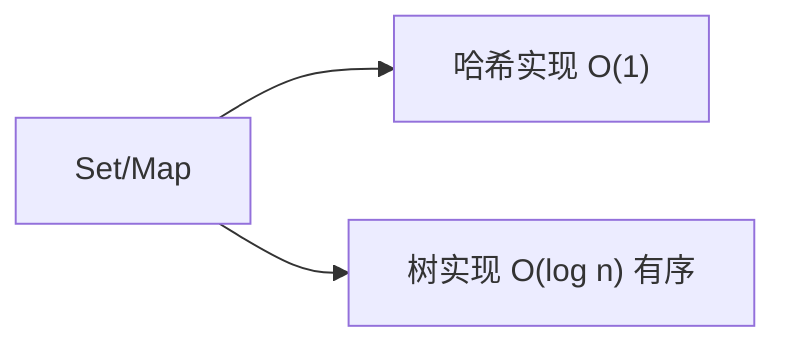

# 集合与映射

集合（Set）和映射（Map）是两种最基础的抽象数据类型。理解它们的底层实现（哈希表 vs 搜索树）是选择正确数据结构的关键。

## 一、集合 Set



集合存储**不重复**的元素，核心操作：`add`、`remove`、`contains`。

### 有序集合 vs 无序集合

| 实现 | 底层结构 | 有序性 | 时间复杂度 | Java 类 |
|------|---------|--------|-----------|---------|
| 哈希集合 | 哈希表 | 无序 | O(1) 平均 | `HashSet` |
| 树集合 | 红黑树 | 有序 | O(log n) | `TreeSet` |

```java tab
// HashSet：O(1) 判重
Set<Integer> set = new HashSet<>();
set.add(3); set.add(1); set.add(3); // 重复不生效
System.out.println(set.contains(3)); // true
System.out.println(set.size());      // 2

// TreeSet：自动排序
TreeSet<Integer> treeSet = new TreeSet<>();
treeSet.add(5); treeSet.add(2); treeSet.add(8);
System.out.println(treeSet.first()); // 2
System.out.println(treeSet.last());  // 8
System.out.println(treeSet.ceiling(3)); // 5（>=3 的最小值）
```

```typescript tab
// Set：O(1) 判重
const set = new Set<number>();
set.add(3); set.add(1); set.add(3); // 重复不生效
console.log(set.has(3)); // true
console.log(set.size);   // 2

// 有序集合：排序后模拟 TreeSet
const treeSet = [5, 2, 8].sort((a, b) => a - b);
console.log(treeSet[0]);                    // 2（first）
console.log(treeSet[treeSet.length - 1]);   // 8（last）
// ceiling(3)：>=3 的最小值
const ceiling = treeSet.find(x => x >= 3);
console.log(ceiling); // 5
```

```python tab
# set：O(1) 判重
s = set()
s.add(3); s.add(1); s.add(3)  # 重复不生效
print(3 in s)   # True
print(len(s))   # 2

# 有序集合：sortedcontainers.SortedList 模拟 TreeSet
from sortedcontainers import SortedList
tree_set = SortedList()
tree_set.add(5); tree_set.add(2); tree_set.add(8)
print(tree_set[0])    # 2（first）
print(tree_set[-1])   # 8（last）
# ceiling(3)：>=3 的最小值
idx = tree_set.bisect_left(3)
print(tree_set[idx])  # 5
```

### 基于 BST 的集合实现

```java tab
public class BSTSet<E extends Comparable<E>> {
    private BST<E> bst;

    public BSTSet() { bst = new BST<>(); }

    public void add(E e) { bst.add(e); }
    public void remove(E e) { bst.remove(e); }
    public boolean contains(E e) { return bst.contains(e); }
    public int getSize() { return bst.size(); }
}
// 最坏 O(n)（退化为链表），平均 O(log n)
```

```typescript tab
class BSTSet<E> {
    private bst: BST<E>;

    constructor() { this.bst = new BST<E>(); }

    add(e: E): void { this.bst.add(e); }
    remove(e: E): void { this.bst.remove(e); }
    contains(e: E): boolean { return this.bst.contains(e); }
    getSize(): number { return this.bst.size(); }
}
// 最坏 O(n)（退化为链表），平均 O(log n)
```

```python tab
class BSTSet:
    def __init__(self):
        self._bst = BST()

    def add(self, e):
        self._bst.add(e)

    def remove(self, e):
        self._bst.remove(e)

    def contains(self, e) -> bool:
        return self._bst.contains(e)

    def get_size(self) -> int:
        return self._bst.size()

# 最坏 O(n)（退化为链表），平均 O(log n)
```

## 二、映射 Map（字典）

映射存储**键值对**，键唯一，核心操作：`put`、`get`、`remove`。

| 实现 | 底层结构 | 有序性 | 时间复杂度 | Java 类 |
|------|---------|--------|-----------|---------|
| 哈希映射 | 哈希表 + 链表/红黑树 | 无序 | O(1) 平均 | `HashMap` |
| 树映射 | 红黑树 | 按 key 有序 | O(log n) | `TreeMap` |
| 链表映射 | 链表 | 插入序 | O(n) | `LinkedHashMap` |

```java tab
// HashMap：最高频
Map<String, Integer> freq = new HashMap<>();
freq.put("apple", 3);
freq.put("banana", 5);
freq.getOrDefault("cherry", 0); // 0

// 统计词频
for (String word : words) {
    freq.put(word, freq.getOrDefault(word, 0) + 1);
}

// TreeMap：需要有序遍历
TreeMap<Integer, String> map = new TreeMap<>();
map.put(3, "c"); map.put(1, "a"); map.put(2, "b");
for (var entry : map.entrySet()) {
    System.out.println(entry.getKey() + "=" + entry.getValue());
    // 1=a, 2=b, 3=c（按 key 升序）
}
```

```typescript tab
// Map：最高频
const freq = new Map<string, number>();
freq.set("apple", 3);
freq.set("banana", 5);
freq.get("cherry") ?? 0; // 0

// 统计词频
for (const word of words) {
    freq.set(word, (freq.get(word) ?? 0) + 1);
}

// 有序遍历：按 key 排序
const map = new Map<number, string>([[3, "c"], [1, "a"], [2, "b"]]);
const sorted = [...map.entries()].sort((a, b) => a[0] - b[0]);
for (const [key, value] of sorted) {
    console.log(`${key}=${value}`);
    // 1=a, 2=b, 3=c（按 key 升序）
}
```

```python tab
# dict：最高频
freq = {}
freq["apple"] = 3
freq["banana"] = 5
freq.get("cherry", 0)  # 0

# 统计词频
from collections import defaultdict
freq = defaultdict(int)
for word in words:
    freq[word] += 1

# 有序遍历：按 key 排序
d = {3: "c", 1: "a", 2: "b"}
for key in sorted(d):
    print(f"{key}={d[key]}")
    # 1=a, 2=b, 3=c（按 key 升序）
```

## 三、HashMap 底层原理（Java 8+）

```
数组 + 链表 + 红黑树

put(key, value):
1. hash(key) → 数组下标
2. 无冲突 → 直接放入
3. 有冲突 → 链表尾插（JDK8）
4. 链表长度 ≥ 8 且数组长度 ≥ 64 → 转红黑树
5. 负载因子 > 0.75 → 扩容 2x
```

关键参数：
- 初始容量：16
- 负载因子：0.75
- 树化阈值：8
- 退化阈值：6

## 四、选择指南

```
需要去重？
├── 不需要排序 → HashSet
└── 需要排序 → TreeSet

需要键值对？
├── 不需要排序 → HashMap
├── 需要排序 → TreeMap
└── 需要插入顺序 → LinkedHashMap
```

## 五、面试高频

1. **HashMap vs Hashtable**：HashMap 允许 null key/value，非线程安全；Hashtable 反之
2. **ConcurrentHashMap**：JDK8 用 CAS + synchronized 锁单个桶，替代分段锁
3. **为什么容量是 2 的幂**：`hash & (n-1)` 等价于取模，位运算更快
4. **LeetCode 应用**：1（两数之和）、49（字母异位词分组）、128（最长连续序列）

## 六、哈希冲突处理过程模拟

以容量 4、负载因子 0.75 的简化 HashMap 为例，依次插入 `A, E, I, O, U`（假设哈希后下标分别为 0, 0, 1, 0, 1）：

```
初始: [_, _, _, _]

put(A)→桶0:  [A, _, _, _]
put(E)→桶0:  [A→E, _, _, _]        冲突，链表尾插
put(I)→桶1:  [A→E, I, _, _]
put(O)→桶0:  [A→E→O, I, _, _]      链长=3
put(U)→桶1:  [A→E→O, I→U, _, _]

size=5 > 4*0.75=3 → 扩容为 8，重新哈希分配：
[A, _, E, _, I, _, O, U]   （新下标由新哈希决定）

查找 E：hash(E)%8=2 → 桶2 首元素即 E → O(1)
最坏情况：所有键落在同一桶 → 退化为链表 O(n)
```

**为什么链长 ≥ 8 转红黑树**：理想随机哈希下，桶内元素个数服从泊松分布，达到 8 的概率仅约 0.00000006——转树是为了防御恶意构造的哈希碰撞攻击。

## 七、哈希思维模板

很多题目的突破口都是"用 Set/Map 把 O(n) 的内层查找降为 O(1)"：

```python tab
# 模板1：两数之和 —— 边遍历边查表
def two_sum(nums, target):
    seen = {}  # 值 -> 下标
    for i, x in enumerate(nums):
        if target - x in seen:
            return [seen[target - x], i]
        seen[x] = i

# 模板2：去重/存在性判断 —— Set
def has_duplicate(nums):
    return len(set(nums)) < len(nums)

# 模板3：频次统计 —— Map
def group_anagrams(strs):
    groups = {}
    for s in strs:
        key = ''.join(sorted(s))
        groups.setdefault(key, []).append(s)
    return list(groups.values())
```

## 八、面试真题

| 题目 | 难度 | 核心思路 |
|------|------|----------|
| 两数之和（LC 1） | 🟢 Easy | Map 存"值→下标" |
| 存在重复元素（LC 217） | 🟢 Easy | Set 去重 |
| 字母异位词分组（LC 49） | 🟡 Medium | 排序后的串作 key |
| 最长连续序列（LC 128） | 🟡 Medium | Set + 只从序列起点扩展 |
| 设计哈希映射（LC 706） | 🟢 Easy | 手写链地址法 |

## 九、思考题

1. LC 128 要求 O(n) 复杂度，为什么"先排序再扫描"不满足？用 Set 时如何避免同一个序列被重复统计？（提示：只从 `x-1` 不存在的 x 出发）
2. 为什么重写 `equals` 就必须重写 `hashCode`？不重写会导致什么后果？（提示：HashMap 的查找流程）
3. TreeMap 基于红黑树，插入/查找是 O(log n)，为什么很多场景仍然首选 O(1) 的 HashMap？什么场景下 TreeMap 反而更优？（提示：范围查询与有序遍历）

> 练习推荐：在练习题模块完成 [两数之和](/problems/two-sum) 后，尝试用本节模板3 独立完成字母异位词分组。
