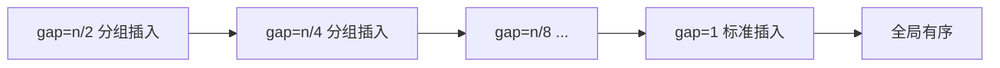

# 希尔排序

希尔排序（Shell Sort）是插入排序的改进版本，也称为**缩小增量排序**。它通过将数组分割成若干子序列进行插入排序，逐步缩小间隔，最终完成全局有序。由 Donald Shell 于 1959 年提出，是**第一个突破 O(n²) 的排序算法**。

## 一、核心思想



希尔排序的关键在于**先让数组"大致有序"，再做精细排序**。

1. **选择增量序列（Gap Sequence）**：初始增量为数组长度的一半，逐步缩小至 1
2. **分组插入排序**：按当前增量将数组分组，对每组执行插入排序
3. **缩小增量**：重复直到增量为 1，此时等价于一次标准插入排序

> 为什么有效？插入排序在"近乎有序"的数组上接近 O(n)。希尔排序通过前期粗排大幅减少逆序对。

**插入排序的痛点**：每次只能将元素向前移动一个位置。如果最小值在末尾，需要移动 n-1 次。

```
插入排序移动最小值 1（从位置9到位置0，需要9次交换）：
[9, 8, 7, 6, 5, 4, 3, 2, 1] → 每次只挪一步 → O(n) 次移动

希尔排序：gap=4 时，1 一步就跳到位置 4，再跳到位置 0 → 只需 2 次移动
```

## 二、排序过程图解

以数组 `[5, 3, 8, 6, 1, 9, 2, 7, 4]`（n=9）为例，使用 Shell 原始增量序列 4→2→1：

```
═══ 第1轮：gap = 4 ═══
分组（同色为一组，组内插入排序）：
位置:  0  1  2  3  4  5  6  7  8
值:   [5, 3, 8, 6, 1, 9, 2, 7, 4]
组A:   5 ─────────── 1 ─────────── 4   → 排序 → 1, 5, 4? 不对...

按组提取：
组A(位置0,4,8): [5, 1, 4] → 插入排序 → [1, 4, 5]
组B(位置1,5):   [3, 9]    → 已有序   → [3, 9]
组C(位置2,6):   [8, 2]    → 插入排序 → [2, 8]
组D(位置3,7):   [6, 7]    → 已有序   → [6, 7]

放回原位置:
位置:  0  1  2  3  4  5  6  7  8
值:   [1, 3, 2, 6, 4, 9, 8, 7, 5]

═══ 第2轮：gap = 2 ═══
组A(位置0,2,4,6,8): [1, 2, 4, 8, 5] → [1, 2, 4, 5, 8]
组B(位置1,3,5,7):   [3, 6, 9, 7]    → [3, 6, 7, 9]

放回:
位置:  0  1  2  3  4  5  6  7  8
值:   [1, 3, 2, 6, 4, 7, 5, 9, 8]

═══ 第3轮：gap = 1（标准插入排序）═══
此时数组已经"近乎有序"，插入排序只需少量移动：
[1, 3, 2, 6, 4, 7, 5, 9, 8]
→ [1, 2, 3, 4, 5, 6, 7, 8, 9] ✓（仅 8 次移动，而非最坏的 36 次）
```

**关键观察**：每一轮排序都保持了上一轮的成果——gap=2 排序后，数组仍然满足 gap=4 有序。

## 三、代码实现

```java tab
public class ShellSort {

    public static void shellSort(int[] arr) {
        int n = arr.length;
        for (int gap = n / 2; gap > 0; gap /= 2) {
            // 对每个组执行插入排序（交错实现，无需显式分组）
            for (int i = gap; i < n; i++) {
                int temp = arr[i];
                int j = i;
                while (j >= gap && arr[j - gap] > temp) {
                    arr[j] = arr[j - gap];
                    j -= gap;
                }
                arr[j] = temp;
            }
        }
    }
}
```
```typescript tab
function shellSort(arr: number[]): void {
    const n = arr.length;
    for (let gap = Math.floor(n / 2); gap > 0; gap = Math.floor(gap / 2)) {
        for (let i = gap; i < n; i++) {
            const temp = arr[i];
            let j = i;
            while (j >= gap && arr[j - gap] > temp) {
                arr[j] = arr[j - gap];
                j -= gap;
            }
            arr[j] = temp;
        }
    }
}
```
```python tab
def shell_sort(arr: list[int]) -> None:
    n = len(arr)
    gap = n // 2
    while gap > 0:
        for i in range(gap, n):
            temp = arr[i]
            j = i
            while j >= gap and arr[j - gap] > temp:
                arr[j] = arr[j - gap]
                j -= gap
            arr[j] = temp
        gap //= 2
```

**代码理解要点**：内层循环 `for (int i = gap; i < n; i++)` 看起来只排了一组，实际上它交错处理了所有组——i 遍历到哪个位置，就在那个位置所属的组内做插入。这避免了显式分组的额外空间。

## 四、增量序列的选择

不同增量序列直接影响性能：

| 增量序列 | 提出者 | 最坏时间复杂度 | 备注 |
|---------|--------|--------------|------|
| n/2, n/4, ..., 1 | Shell (1959) | O(n²) | 原始版本，教学用 |
| 2^k - 1 | Hibbard (1963) | O(n^{3/2}) | 1, 3, 7, 15, ... |
| (3^k - 1) / 2 | Knuth (1973) | O(n^{3/2}) | 1, 4, 13, 40, ... 推荐 |
| 4^k + 3·2^{k-1} + 1 | Sedgewick (1986) | O(n^{4/3}) | 1, 5, 19, 41, ... 已知最优之一 |

**为什么 Shell 原始序列差**：n/2 序列中，相邻轮次的增量都是 2 的倍数，导致元素只能在同奇偶位置间比较，大量逆序对消除不了。而 Knuth 序列（3x+1）相邻增量互质，效率更高。

```java tab
// Knuth 增量序列实现
public static void shellSortKnuth(int[] arr) {
    int n = arr.length;
    int gap = 1;
    while (gap < n / 3) gap = gap * 3 + 1;  // 1, 4, 13, 40, 121, ...
    while (gap >= 1) {
        for (int i = gap; i < n; i++) {
            int temp = arr[i];
            int j = i;
            while (j >= gap && arr[j - gap] > temp) {
                arr[j] = arr[j - gap];
                j -= gap;
            }
            arr[j] = temp;
        }
        gap /= 3;
    }
}
```
```typescript tab
function shellSortKnuth(arr: number[]): void {
    const n = arr.length;
    let gap = 1;
    while (gap < Math.floor(n / 3)) gap = gap * 3 + 1;
    while (gap >= 1) {
        for (let i = gap; i < n; i++) {
            const temp = arr[i];
            let j = i;
            while (j >= gap && arr[j - gap] > temp) {
                arr[j] = arr[j - gap];
                j -= gap;
            }
            arr[j] = temp;
        }
        gap = Math.floor(gap / 3);
    }
}
```
```python tab
def shell_sort_knuth(arr: list[int]) -> None:
    n = len(arr)
    gap = 1
    while gap < n // 3:
        gap = gap * 3 + 1
    while gap >= 1:
        for i in range(gap, n):
            temp = arr[i]
            j = i
            while j >= gap and arr[j - gap] > temp:
                arr[j] = arr[j - gap]
                j -= gap
            arr[j] = temp
        gap //= 3
```

## 五、复杂度分析

- **时间复杂度**：
  - 最好：O(n log n)（使用好的增量序列）
  - 平均：取决于增量序列，约 O(n^{1.3})
  - 最坏：O(n²)（Shell 原始序列）/ O(n^{3/2})（Knuth 序列）
- **空间复杂度**：O(1)，原地排序
- **稳定性**：❌ 不稳定（分组可能打乱相等元素的相对顺序）

**不稳定的具体例子**：

```
数组: [5a, 3, 5b, 2]，gap = 2

分组: 组A(位置0,2) = [5a, 5b]  组B(位置1,3) = [3, 2]
组B排序: [2, 3]

结果: [5a, 2, 5b, 3]
gap=1 插入排序: [2, 3, 5a, 5b] — 这个例子恰好稳定

换一个: [3, 5a, 2, 5b]，gap = 2
组A(位置0,2) = [3, 2] → [2, 3]
组B(位置1,3) = [5a, 5b] → 不动
结果: [2, 5a, 3, 5b]
gap=1: [2, 3, 5a, 5b] — 5a 仍在 5b 前...

真正不稳定的场景: [5a, 2, 5b, 1]，gap=2
组A: [5a, 5b] 不动；组B: [2, 1] → [1, 2]
→ [5a, 1, 5b, 2]
gap=1 插入: 1前移 → [1, 5a, 5b, 2] → 2前移到5a前 → [1, 2, 5a, 5b]
实际上不稳定出现在: 5b 在 gap 排序中跳到了 5a 前面的情况
例如 [5a, 1, 5b, 0]: 组A=[5a,5b] 组B=[1,0]→[0,1]
→ [5a, 0, 5b, 1] → gap=1 → [0, 1, 5a, 5b]

构造: [2, 5a, 1, 5b] gap=2: 组A=[2,1]→[1,2], 组B=[5a,5b]
→ [1, 5a, 2, 5b] → gap=1 → [1, 2, 5a, 5b]

经典反例: [5a, 5b, 3] gap=2:
组A(位置0,2) = [5a, 3] → [3, 5a]
→ [3, 5b, 5a]
gap=1: [3, 5b, 5a] — 5b 在 5a 前面了！不稳定 ✓
```

## 六、为什么希尔排序有效——逆序对视角

**定理**：插入排序的交换次数 = 数组的逆序对数量。

希尔排序的大增量轮次，每次交换能消除**多个**逆序对：

```
[9, 8, 7, 6, 5, 4, 3, 2, 1] — 共 36 个逆序对

gap=4: 每次交换消除 ≥ 4 个逆序对（元素跳跃4个位置）
一轮后逆序对可能只剩 ~10 个

gap=2: 继续大幅消除
gap=1: 只剩几个逆序对，插入排序几乎线性完成
```

**g-有序的性质**：如果数组是 g-有序的（即对所有 i，arr[i] ≤ arr[i+g]），那么它也是 2g-有序的吗？不是。但关键性质是：**g-有序数组经过 h-排序后仍然保持 g-有序**。这保证了每轮的工作不会白做。

## 七、与其他排序的对比

| 排序算法 | 平均时间 | 最坏时间 | 空间 | 稳定 | 适用规模 |
|---------|---------|---------|------|------|---------|
| 插入排序 | O(n²) | O(n²) | O(1) | ✅ | n < 50 |
| 希尔排序 | O(n^{1.3}) | O(n²) | O(1) | ❌ | n < 5000 |
| 快速排序 | O(n log n) | O(n²) | O(log n) | ❌ | 大规模 |
| 归并排序 | O(n log n) | O(n log n) | O(n) | ✅ | 大规模/需稳定 |
| 堆排序 | O(n log n) | O(n log n) | O(1) | ❌ | 大规模/最坏保证 |

**希尔排序的现代定位**：

1. **嵌入式/受限环境**：代码极短（~15行），无需递归、无额外内存
2. **中等规模数据**：n 在 500~5000 之间时，性能接近 O(n log n) 算法
3. **教学价值**：展示"预排序 + 精排"的算法设计思想
4. **实际基准测试**：n=10⁴ 时，Knuth 序列希尔排序约比快排慢 2~3 倍，但比纯插入排序快 100 倍以上

## 八、面试要点

1. **希尔排序 vs 插入排序**：希尔排序是插入排序的"预排序"优化版
2. **为什么增量最终必须为 1**：保证最终全局有序（g-有序只对间隔 g 保证）
3. **实际工程中的定位**：适合中等规模数据（n < 5000），大规模数据用快排/归并
4. **Java Arrays.sort 对基本类型**：使用 Dual-Pivot QuickSort，非希尔排序
5. **为什么不稳定**：不同组的插入排序可能使相等元素跨组交换位置

### 面试常见问答

**Q: 希尔排序的时间复杂度到底是多少？**

严格答案取决于增量序列。这是一个开放问题——至今没有人能证明任何增量序列的精确平均复杂度。面试中回答"Knuth 序列最坏 O(n^{3/2})，实践中约 O(n^{1.3})"即可。

**Q: 什么场景下希尔排序比快排好？**

- 数据量中等（几百到几千）且对最坏情况不敏感
- 内存极度受限（嵌入式系统）
- 代码空间受限（希尔排序可以写成无函数的紧凑循环）
- 数据已经部分有序

**Q: 增量序列需要满足什么条件？**

唯一硬性要求：**最后一个增量必须为 1**。其他都是性能优化。增量互质的序列通常更好（避免"共振"效应）。
