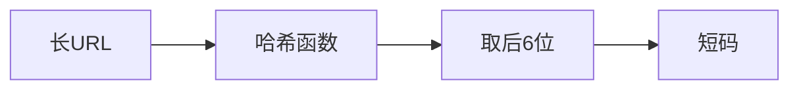
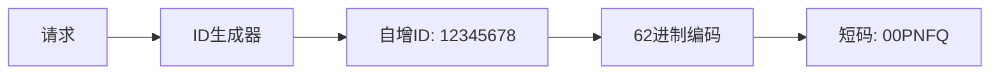
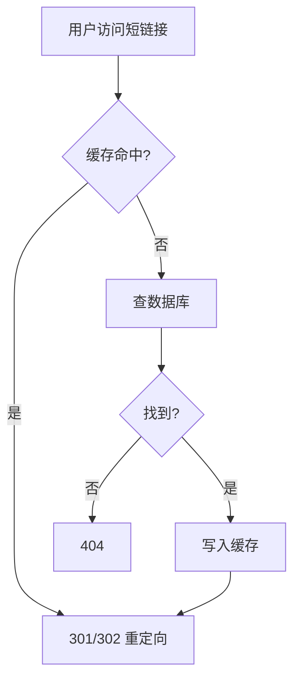

# 算法实战：短网址系统设计


## 一、问题背景

将长 URL（如 `https://example.com/very/long/path?param=xxx`）转换为短链接（如 `https://s.cn/Ab3xK9`），用户访问短链接时重定向到原始 URL。

核心需求：
- 生成的短码**唯一**且**尽可能短**
- 生成速度要快（高并发写入）
- 重定向查询要快（高频读取）
- 短码不可预测（安全性）

## 二、方案一：哈希算法

### 2.1 思路

对长 URL 做哈希，取哈希值的一部分作为短码。



### 2.2 短码编码

用 **62 进制**（0-9, a-z, A-Z）编码，6 位短码可表示：

\[
62^6 = 56,800,235,584 \approx 568 亿
\]

足够覆盖绝大多数场景。

### 2.3 冲突处理

哈希必然存在冲突，解决方案：

| 方案 | 说明 |
|------|------|
| 拼接时间戳再哈希 | 同一 URL 不同时间生成不同短码 |
| 冲突检测+重试 | 查库判重，冲突则换哈希种子 |
| 拼接随机数 | URL + random → 哈希 |

### 2.4 优缺点

| 优点 | 缺点 |
|------|------|
| 相同 URL 可生成相同短码 | 冲突处理复杂 |
| 实现简单 | 哈希计算有开销 |
| 无需全局协调 | 无法保证绝对唯一 |

## 三、方案二：ID 生成器

### 3.1 思路

用全局自增 ID 生成器分配唯一编号，再将 ID 转为 62 进制短码。



### 3.2 ID 生成器选择

| 方案 | 特点 |
|------|------|
| 数据库自增 | 简单，但有单点瓶颈 |
| 号段模式 | 批量取 ID，减少 DB 访问 |
| Snowflake | 分布式，趋势递增，含时间信息 |
| Redis INCR | 原子自增，性能高 |

### 3.3 ID → 短码转换

```java tab
public class ShortUrlEncoder {
    private static final String CHARS = "0123456789abcdefghijklmnopqrstuvwxyzABCDEFGHIJKLMNOPQRSTUVWXYZ";

    public static String encode(long id) {
        StringBuilder sb = new StringBuilder();
        while (id > 0) {
            sb.append(CHARS.charAt((int)(id % 62)));
            id /= 62;
        }
        // 补齐到6位
        while (sb.length() < 6) {
            sb.append('0');
        }
        return sb.reverse().toString();
    }

    public static long decode(String shortCode) {
        long id = 0;
        for (char c : shortCode.toCharArray()) {
            id = id * 62 + CHARS.indexOf(c);
        }
        return id;
    }
}
```

```python tab
CHARS = "0123456789abcdefghijklmnopqrstuvwxyzABCDEFGHIJKLMNOPQRSTUVWXYZ"

def encode(num):
    if num == 0:
        return "000000"
    result = []
    while num > 0:
        result.append(CHARS[num % 62])
        num //= 62
    # 补齐到6位
    while len(result) < 6:
        result.append('0')
    return ''.join(reversed(result))

def decode(short_code):
    num = 0
    for c in short_code:
        num = num * 62 + CHARS.index(c)
    return num
```

### 3.4 优缺点

| 优点 | 缺点 |
|------|------|
| 绝对唯一，无冲突 | 需要全局 ID 生成器 |
| 短码长度可控 | ID 可被推测（安全性） |
| 性能极高 | 分布式 ID 有复杂度 |

## 四、存储与查询

### 4.1 数据模型

```text
short_url_mapping:
  short_code (PK)  →  original_url
  created_at
  expire_at (可选)
```

### 4.2 数据结构选择

| 场景 | 数据结构 |
|------|----------|
| 内存缓存（热点） | 散列表（O(1) 查找） |
| 持久化存储 | B+树索引（支持范围查询） |
| 分布式缓存 | Redis Hash |

### 4.3 重定向流程



## 五、安全性设计

| 风险 | 对策 |
|------|------|
| 短码可枚举 | 使用非连续 ID（Snowflake）或加盐哈希 |
| 恶意 URL | 入库前做黑名单/安全检测 |
| 滥用生成 | 限流（令牌桶）+ 用户配额 |
| 隐私泄露 | 短码映射加密存储 |

## 六、两种方案对比

| 对比项 | 哈希方案 | ID 生成器方案 |
|--------|----------|--------------|
| 唯一性 | 需额外处理冲突 | 天然唯一 |
| 幂等性 | 同 URL 同短码 | 每次生成不同短码 |
| 安全性 | 较好（不可预测） | 需额外处理 |
| 性能 | 哈希计算 | ID 生成 + 编码 |
| 工程复杂度 | 冲突处理 | 分布式 ID 生成器 |

> 工业实践中，**ID 生成器方案**更主流（如新浪短链接、t.cn），因为唯一性保证更简单。

## 七、总结

短网址系统是**哈希算法 + 进制转换 + 散列表查找**的综合应用：

- 生成：ID → 62 进制编码（数学映射）
- 存储：散列表/B+树（快速读写）
- 查询：缓存 + DB 两级（性能保障）
- 安全：不可预测 + 限流（防滥用）

一个看似简单的"缩短"功能，背后是数据结构与算法的系统性工程。
