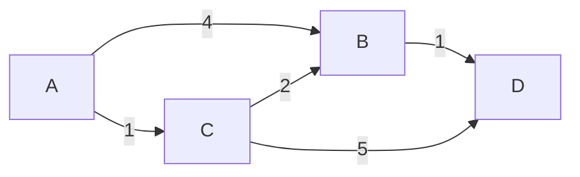
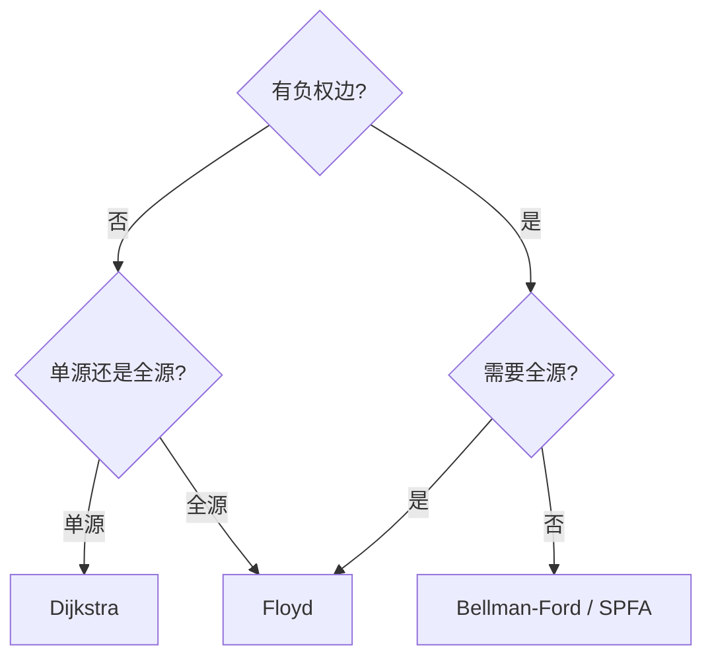

# 最短路径算法：Dijkstra、Bellman-Ford 与 Floyd


## 一、问题定义

**最短路径问题**：在带权图中，找到从源点 s 到目标点 t（或所有点）的路径，使得路径上边的权值之和最小。

| 变体 | 描述 |
|------|------|
| 单源最短路径（SSSP） | 从一个源点到所有其他点 |
| 单源到单点 | 从 s 到 t |
| 全源最短路径（APSP） | 任意两点之间 |



> 上图中 A→D 最短路径：A→C→B→D = 1+2+1 = 4（而非 A→B→D = 5）。

## 二、算法对比总览

| 算法 | 适用场景 | 时间复杂度 | 负权边 | 负权环 |
|------|----------|-----------|--------|--------|
| BFS | 无权图 | O(V + E) | ❌ | ❌ |
| Dijkstra | 非负权图 | O((V+E) log V) | ❌ | ❌ |
| Bellman-Ford | 通用（可检测负环） | O(VE) | ✅ | 检测 |
| SPFA | Bellman-Ford 优化 | 平均 O(kE)，最坏 O(VE) | ✅ | 检测 |
| Floyd-Warshall | 全源、稠密图 | O(V³) | ✅ | 检测 |

## 三、Dijkstra 算法

### 3.1 核心思想

**贪心**：每次从未确定的点中选**距离最小**的，确定后不再更改。

前提：**所有边权 ≥ 0**。

### 3.2 模板（优先队列优化）

```java tab
public int[] dijkstra(List<int[]>[] graph, int src) {
    int n = graph.length;
    int[] dist = new int[n];
    Arrays.fill(dist, Integer.MAX_VALUE);
    dist[src] = 0;

    // {距离, 节点}
    PriorityQueue<int[]> pq = new PriorityQueue<>((a, b) -> a[0] - b[0]);
    pq.offer(new int[]{0, src});

    while (!pq.isEmpty()) {
        int[] cur = pq.poll();
        int d = cur[0], u = cur[1];
        if (d > dist[u]) continue;       // 已确定，跳过
        for (int[] edge : graph[u]) {
            int v = edge[0], w = edge[1];
            if (dist[u] + w < dist[v]) {
                dist[v] = dist[u] + w;
                pq.offer(new int[]{dist[v], v});
            }
        }
    }
    return dist;
}
```

```typescript tab
function dijkstra(graph: [number, number][][], src: number): number[] {
    const n = graph.length;
    const dist = new Array(n).fill(Infinity);
    dist[src] = 0;

    // [距离, 节点]
    const pq: [number, number][] = [[0, src]];

    while (pq.length) {
        pq.sort((a, b) => a[0] - b[0]);
        const [d, u] = pq.shift()!;
        if (d > dist[u]) continue;       // 已确定，跳过
        for (const [v, w] of graph[u]) {
            if (dist[u] + w < dist[v]) {
                dist[v] = dist[u] + w;
                pq.push([dist[v], v]);
            }
        }
    }
    return dist;
}
```

```python tab
import heapq

def dijkstra(graph: list[list[tuple[int, int]]], src: int) -> list[int]:
    n = len(graph)
    dist = [float('inf')] * n
    dist[src] = 0

    # (距离, 节点)
    pq = [(0, src)]

    while pq:
        d, u = heapq.heappop(pq)
        if d > dist[u]:
            continue                     # 已确定，跳过
        for v, w in graph[u]:
            if dist[u] + w < dist[v]:
                dist[v] = dist[u] + w
                heapq.heappush(pq, (dist[v], v))
    return dist
```

- **时间**：O((V + E) log V)，**空间**：O(V + E)

### 3.3 为什么不能有负权边？

> 负权边可能使"已确定"的点距离再次变小，破坏贪心的正确性。

反例：`A→B(2), A→C(3), C→B(-2)` → B 的真实最短是 1，但 Dijkstra 先确定 B=2。

## 四、Bellman-Ford 算法

### 4.1 核心思想

对所有边**松弛 V-1 轮**。如果第 V 轮还能松弛，说明存在**负权环**。

### 4.2 模板

```java tab
public int[] bellmanFord(int n, int[][] edges, int src) {
    int[] dist = new int[n];
    Arrays.fill(dist, Integer.MAX_VALUE);
    dist[src] = 0;

    // 松弛 V-1 轮
    for (int i = 0; i < n - 1; i++) {
        boolean updated = false;
        for (int[] e : edges) {   // e = {from, to, weight}
            int u = e[0], v = e[1], w = e[2];
            if (dist[u] != Integer.MAX_VALUE && dist[u] + w < dist[v]) {
                dist[v] = dist[u] + w;
                updated = true;
            }
        }
        if (!updated) break;      // 提前终止
    }

    // 检测负权环
    for (int[] e : edges) {
        if (dist[e[0]] != Integer.MAX_VALUE && dist[e[0]] + e[2] < dist[e[1]]) {
            throw new RuntimeException("存在负权环");
        }
    }
    return dist;
}
```

```typescript tab
function bellmanFord(n: number, edges: number[][], src: number): number[] {
    const dist = new Array(n).fill(Infinity);
    dist[src] = 0;

    // 松弛 V-1 轮
    for (let i = 0; i < n - 1; i++) {
        let updated = false;
        for (const [u, v, w] of edges) {
            if (dist[u] !== Infinity && dist[u] + w < dist[v]) {
                dist[v] = dist[u] + w;
                updated = true;
            }
        }
        if (!updated) break;      // 提前终止
    }

    // 检测负权环
    for (const [u, v, w] of edges) {
        if (dist[u] !== Infinity && dist[u] + w < dist[v]) {
            throw new Error("存在负权环");
        }
    }
    return dist;
}
```

```python tab
def bellman_ford(n: int, edges: list[list[int]], src: int) -> list[int]:
    dist = [float('inf')] * n
    dist[src] = 0

    # 松弛 V-1 轮
    for _ in range(n - 1):
        updated = False
        for u, v, w in edges:
            if dist[u] != float('inf') and dist[u] + w < dist[v]:
                dist[v] = dist[u] + w
                updated = True
        if not updated:
            break  # 提前终止

    # 检测负权环
    for u, v, w in edges:
        if dist[u] != float('inf') and dist[u] + w < dist[v]:
            raise ValueError("存在负权环")
    return dist
```

- **时间**：O(VE)，**空间**：O(V)

### 4.3 SPFA（队列优化）

```java tab
public int[] spfa(List<int[]>[] graph, int src) {
    int n = graph.length;
    int[] dist = new int[n];
    Arrays.fill(dist, Integer.MAX_VALUE);
    dist[src] = 0;
    boolean[] inQueue = new boolean[n];
    Queue<Integer> queue = new LinkedList<>();
    queue.offer(src);
    inQueue[src] = true;

    while (!queue.isEmpty()) {
        int u = queue.poll();
        inQueue[u] = false;
        for (int[] edge : graph[u]) {
            int v = edge[0], w = edge[1];
            if (dist[u] + w < dist[v]) {
                dist[v] = dist[u] + w;
                if (!inQueue[v]) {
                    queue.offer(v);
                    inQueue[v] = true;
                }
            }
        }
    }
    return dist;
}
```

```typescript tab
function spfa(graph: [number, number][][], src: number): number[] {
    const n = graph.length;
    const dist = new Array(n).fill(Infinity);
    dist[src] = 0;
    const inQueue = new Array(n).fill(false);
    const queue: number[] = [src];
    inQueue[src] = true;

    while (queue.length) {
        const u = queue.shift()!;
        inQueue[u] = false;
        for (const [v, w] of graph[u]) {
            if (dist[u] + w < dist[v]) {
                dist[v] = dist[u] + w;
                if (!inQueue[v]) {
                    queue.push(v);
                    inQueue[v] = true;
                }
            }
        }
    }
    return dist;
}
```

```python tab
from collections import deque

def spfa(graph: list[list[tuple[int, int]]], src: int) -> list[int]:
    n = len(graph)
    dist = [float('inf')] * n
    dist[src] = 0
    in_queue = [False] * n
    queue = deque([src])
    in_queue[src] = True

    while queue:
        u = queue.popleft()
        in_queue[u] = False
        for v, w in graph[u]:
            if dist[u] + w < dist[v]:
                dist[v] = dist[u] + w
                if not in_queue[v]:
                    queue.append(v)
                    in_queue[v] = True
    return dist
```

## 五、Floyd-Warshall 算法

### 5.1 核心思想

**DP 思想**：`dist[i][j]` 表示只经过编号 ≤ k 的中间点时，i 到 j 的最短距离。

转移：`dist[i][j] = min(dist[i][j], dist[i][k] + dist[k][j])`

### 5.2 模板

```java tab
public int[][] floyd(int n, int[][] edges) {
    int[][] dist = new int[n][n];
    for (int[] row : dist) Arrays.fill(row, Integer.MAX_VALUE / 2);
    for (int i = 0; i < n; i++) dist[i][i] = 0;
    for (int[] e : edges) {
        dist[e[0]][e[1]] = Math.min(dist[e[0]][e[1]], e[2]);
    }

    for (int k = 0; k < n; k++) {
        for (int i = 0; i < n; i++) {
            for (int j = 0; j < n; j++) {
                dist[i][j] = Math.min(dist[i][j], dist[i][k] + dist[k][j]);
            }
        }
    }
    return dist;
}
```

```typescript tab
function floyd(n: number, edges: number[][]): number[][] {
    const dist: number[][] = Array.from({ length: n }, () => new Array(n).fill(Infinity));
    for (let i = 0; i < n; i++) dist[i][i] = 0;
    for (const [u, v, w] of edges) {
        dist[u][v] = Math.min(dist[u][v], w);
    }

    for (let k = 0; k < n; k++) {
        for (let i = 0; i < n; i++) {
            for (let j = 0; j < n; j++) {
                dist[i][j] = Math.min(dist[i][j], dist[i][k] + dist[k][j]);
            }
        }
    }
    return dist;
}
```

```python tab
def floyd(n: int, edges: list[list[int]]) -> list[list[int]]:
    INF = float('inf')
    dist = [[INF] * n for _ in range(n)]
    for i in range(n):
        dist[i][i] = 0
    for u, v, w in edges:
        dist[u][v] = min(dist[u][v], w)

    for k in range(n):
        for i in range(n):
            for j in range(n):
                dist[i][j] = min(dist[i][j], dist[i][k] + dist[k][j])
    return dist
```

- **时间**：O(V³)，**空间**：O(V²)
- **注意**：k 必须在最外层循环！

## 六、如何选择？



| 场景 | 推荐 |
|------|------|
| 非负权 + 单源 | Dijkstra（堆优化） |
| 有负权 + 单源 | Bellman-Ford / SPFA |
| 全源 + 点少（V≤500） | Floyd |
| 无权图 | BFS |
| 需要检测负环 | Bellman-Ford |

## 七、路径还原

Dijkstra 中记录前驱：

```java tab
int[] prev = new int[n];
Arrays.fill(prev, -1);
// 松弛时：
if (dist[u] + w < dist[v]) {
    dist[v] = dist[u] + w;
    prev[v] = u;
    pq.offer(new int[]{dist[v], v});
}

// 还原路径
List<Integer> path = new ArrayList<>();
for (int cur = target; cur != -1; cur = prev[cur]) {
    path.add(cur);
}
Collections.reverse(path);
```

```typescript tab
const prev = new Array(n).fill(-1);
// 松弛时：
if (dist[u] + w < dist[v]) {
    dist[v] = dist[u] + w;
    prev[v] = u;
    pq.push([dist[v], v]);
}

// 还原路径
const path: number[] = [];
for (let cur = target; cur !== -1; cur = prev[cur]) {
    path.push(cur);
}
path.reverse();
```

```python tab
prev = [-1] * n
# 松弛时：
if dist[u] + w < dist[v]:
    dist[v] = dist[u] + w
    prev[v] = u
    heapq.heappush(pq, (dist[v], v))

# 还原路径
path = []
cur = target
while cur != -1:
    path.append(cur)
    cur = prev[cur]
path.reverse()
```

## 八、面试常见题

- 🟢 网络延迟时间（Dijkstra 模板）
- 🟡 路径最大概率、最便宜的航班（K 站中转）
- 🟠 迷宫最短路径（BFS + 状态）、到达终点的最短路径
- 🔴 外星文字典（拓扑排序）、负环检测

## 九、调试技巧

1. **初始化**：`dist[src] = 0`，其余为 `INF`（用 `Integer.MAX_VALUE / 2` 防溢出）。
2. **Dijkstra 的 continue**：`if (d > dist[u]) continue` 不能省，否则超时。
3. **Floyd 的 k 在外层**：顺序错会导致错误结果。
4. **负权边**：看到负权立刻排除 Dijkstra。
5. **建图方式**：邻接表适合稀疏图，邻接矩阵适合稠密图。
