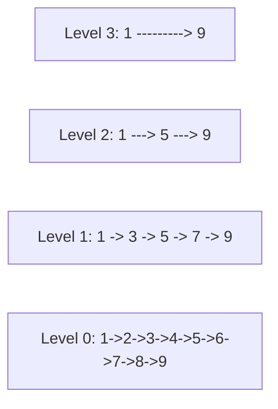

# 跳表：链表上的二分查找


## 一、什么是跳表

**跳表（Skip List）** 是一种基于有序链表的数据结构，通过建立多层索引实现 **O(log n)** 的查找、插入和删除。

> 核心思想：给链表加"快速通道"，像二分查找一样跳跃前进。



> 查找 7：Level 3 跳到 9（太大）→ Level 2 跳到 5 → Level 1 跳到 7 ✅

## 二、为什么需要跳表？

| 数据结构 | 查找 | 插入/删除 | 实现难度 |
|----------|------|-----------|----------|
| 有序数组 | O(log n) | O(n) | 简单 |
| 有序链表 | O(n) | O(1)（已知位置） | 简单 |
| BST / AVL | O(log n) | O(log n) | 复杂 |
| **跳表** | **O(log n)** | **O(log n)** | **中等** |

跳表的优势：
- 实现比平衡树**简单得多**
- 范围查询天然支持（沿底层链表遍历）
- 并发友好（局部锁）

> Redis 的有序集合（ZSet）底层就是**跳表 + 哈希表**。

## 三、核心操作

### 3.1 查找

从最高层开始，向右走到不能走（下一个 > target），就下降一层：

```java tab
public boolean search(int target) {
    Node cur = head;
    for (int level = maxLevel - 1; level >= 0; level--) {
        while (cur.next[level] != null && cur.next[level].val < target) {
            cur = cur.next[level];
        }
    }
    cur = cur.next[0];   // 底层下一个
    return cur != null && cur.val == target;
}
```

```typescript tab
function search(head: SkipNode, maxLevel: number, target: number): boolean {
    let cur = head;
    for (let level = maxLevel - 1; level >= 0; level--) {
        while (cur.next[level] && cur.next[level]!.val < target) {
            cur = cur.next[level]!;
        }
    }
    cur = cur.next[0]!;   // 底层下一个
    return cur !== null && cur !== undefined && cur.val === target;
}
```

```python tab
def search(self, target: int) -> bool:
    cur = self.head
    for level in range(self.max_level - 1, -1, -1):
        while cur.next[level] and cur.next[level].val < target:
            cur = cur.next[level]
    cur = cur.next[0]  # 底层下一个
    return cur is not None and cur.val == target
```

### 3.2 插入

1. 用查找过程记录每层的**前驱节点**（update 数组）。
2. 随机决定新节点的层数（抛硬币）。
3. 在每层将新节点链入。

```java tab
public void insert(int val) {
    Node[] update = new Node[maxLevel];
    Node cur = head;
    for (int level = maxLevel - 1; level >= 0; level--) {
        while (cur.next[level] != null && cur.next[level].val < val) {
            cur = cur.next[level];
        }
        update[level] = cur;
    }

    int newLevel = randomLevel();
    Node newNode = new Node(val, newLevel);
    for (int i = 0; i < newLevel; i++) {
        newNode.next[i] = update[i].next[i];
        update[i].next[i] = newNode;
    }
}
```

```typescript tab
function insert(head: SkipNode, maxLevel: number, val: number): void {
    const update: SkipNode[] = new Array(maxLevel);
    let cur = head;
    for (let level = maxLevel - 1; level >= 0; level--) {
        while (cur.next[level] && cur.next[level]!.val < val) {
            cur = cur.next[level]!;
        }
        update[level] = cur;
    }

    const newLevel = randomLevel(maxLevel);
    const newNode = new SkipNode(val, newLevel);
    for (let i = 0; i < newLevel; i++) {
        newNode.next[i] = update[i].next[i];
        update[i].next[i] = newNode;
    }
}
```

```python tab
def insert(self, val: int) -> None:
    update = [None] * self.max_level
    cur = self.head
    for level in range(self.max_level - 1, -1, -1):
        while cur.next[level] and cur.next[level].val < val:
            cur = cur.next[level]
        update[level] = cur

    new_level = self.random_level()
    new_node = Node(val, new_level)
    for i in range(new_level):
        new_node.next[i] = update[i].next[i]
        update[i].next[i] = new_node
```

### 3.3 随机层数

```java tab
private int randomLevel() {
    int level = 1;
    while (Math.random() < 0.5 && level < maxLevel) {
        level++;
    }
    return level;
}
```

```typescript tab
function randomLevel(maxLevel: number): number {
    let level = 1;
    while (Math.random() < 0.5 && level < maxLevel) {
        level++;
    }
    return level;
}
```

```python tab
def random_level(self) -> int:
    level = 1
    while random.random() < 0.5 and level < self.max_level:
        level += 1
    return level
```

> 每个节点有 50% 概率晋升一层。期望层数 = 2，最高层 ≈ log₂(n)。

### 3.4 删除

```java tab
public boolean delete(int val) {
    Node[] update = new Node[maxLevel];
    Node cur = head;
    for (int level = maxLevel - 1; level >= 0; level--) {
        while (cur.next[level] != null && cur.next[level].val < val) {
            cur = cur.next[level];
        }
        update[level] = cur;
    }

    cur = cur.next[0];
    if (cur == null || cur.val != val) return false;

    for (int i = 0; i < cur.next.length; i++) {
        update[i].next[i] = cur.next[i];
    }
    return true;
}
```

```typescript tab
function deleteNode(head: SkipNode, maxLevel: number, val: number): boolean {
    const update: SkipNode[] = new Array(maxLevel);
    let cur = head;
    for (let level = maxLevel - 1; level >= 0; level--) {
        while (cur.next[level] && cur.next[level]!.val < val) {
            cur = cur.next[level]!;
        }
        update[level] = cur;
    }

    cur = cur.next[0]!;
    if (!cur || cur.val !== val) return false;

    for (let i = 0; i < cur.next.length; i++) {
        update[i].next[i] = cur.next[i];
    }
    return true;
}
```

```python tab
def delete(self, val: int) -> bool:
    update = [None] * self.max_level
    cur = self.head
    for level in range(self.max_level - 1, -1, -1):
        while cur.next[level] and cur.next[level].val < val:
            cur = cur.next[level]
        update[level] = cur

    cur = cur.next[0]
    if cur is None or cur.val != val:
        return False

    for i in range(len(cur.next)):
        update[i].next[i] = cur.next[i]
    return True
```

## 四、复杂度分析

| 操作 | 期望时间 | 最坏时间 | 空间 |
|------|---------|---------|------|
| 查找 | O(log n) | O(n) | — |
| 插入 | O(log n) | O(n) | O(log n) |
| 删除 | O(log n) | O(n) | — |
| 总空间 | — | — | O(n) |

> 期望意义下与平衡树相同，但实现简单得多。

## 五、跳表 vs 其他结构

| 维度 | 跳表 | 红黑树 | B+ 树 |
|------|------|--------|-------|
| 实现复杂度 | 低 | 高 | 高 |
| 范围查询 | 优秀（链表遍历） | 需中序遍历 | 优秀（叶节点链表） |
| 并发性能 | 好（局部锁） | 一般 | 好 |
| 内存局部性 | 一般 | 一般 | 好（磁盘友好） |
| 典型应用 | Redis ZSet | Java TreeMap | MySQL 索引 |

## 六、Redis 中跳表的设计

Redis ZSet 的跳表实现有几个工程细节：
1. **最大层数 32**（足够 2³² 个元素）
2. **晋升概率 1/4**（比 1/2 更省空间）
3. **backward 指针**：底层链表有反向指针，支持逆序遍历
4. **span 字段**：记录跨度，支持 O(log n) 的 rank 查询

## 七、面试常见题

- 🟡 设计跳表（LeetCode 1206）
- 🟠 手写跳表的查找/插入/删除
- 🔴 分析 Redis ZSet 为什么选跳表而非红黑树

## 八、调试技巧

1. **层数上限**：设 `maxLevel = 16` 或 32，避免无限晋升。
2. **update 数组**：确保每层都正确记录前驱。
3. **删除后清理**：如果最高层变空，降低 maxLevel。
4. **随机种子**：测试时用固定种子保证可复现。
