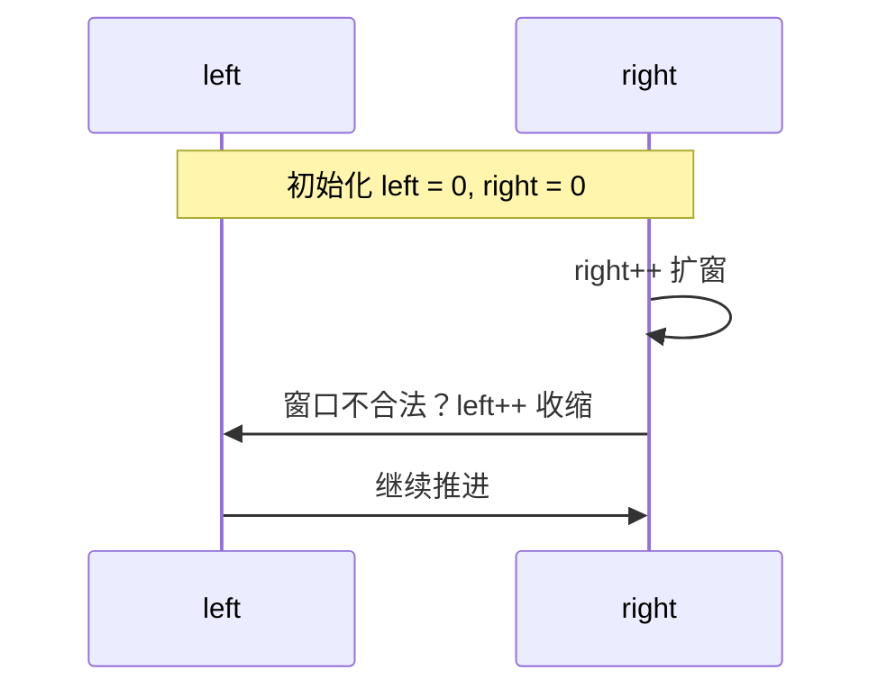

# 双指针与滑动窗口


## 一、为什么它们这么重要？

在数组/字符串题中，**双指针 / 滑动窗口**可以在线性时间 O(n) 内解决许多看似 O(n²) 的子数组问题，是面试最高频的题型之一。

它们的核心思想是：**两个指针协同推进**，避免内层循环的回退，使总步数为 O(n)。



## 二、双指针基础

### 2.1 对撞指针（左右指针）

有序数组找两数之和：

```java tab
int left = 0, right = n - 1;
while (left < right) {
    int sum = nums[left] + nums[right];
    if (sum == target) return new int[]{left, right};
    else if (sum < target) left++;
    else right--;
}
```
```typescript tab
let left = 0, right = n - 1;
while (left < right) {
    const sum = nums[left] + nums[right];
    if (sum === target) return [left, right];
    else if (sum < target) left++;
    else right--;
}
```
```python tab
left, right = 0, n - 1
while left < right:
    s = nums[left] + nums[right]
    if s == target: return [left, right]
    elif s < target: left += 1
    else: right -= 1
```

- **前提**：数据有序
- **复杂度**：O(n)

### 2.2 快慢指针（Floyd 判圈）

判链表是否有环：

```java tab
ListNode slow = head, fast = head;
while (fast != null && fast.next != null) {
    slow = slow.next;
    fast = fast.next.next;
    if (slow == fast) return true;
}
return false;
```
```typescript tab
let slow = head, fast = head;
while (fast && fast.next) {
    slow = slow!.next;
    fast = fast.next.next;
    if (slow === fast) return true;
}
return false;
```
```python tab
slow = fast = head
while fast and fast.next:
    slow = slow.next
    fast = fast.next.next
    if slow is fast: return True
return False
```

### 2.3 同向双指针（读写指针）

原地去重：

```java tab
int slow = 0;
for (int fast = 0; fast < n; fast++) {
    if (nums[fast] != val) {
        nums[slow++] = nums[fast];
    }
}
```
```typescript tab
let slow = 0;
for (let fast = 0; fast < n; fast++) {
    if (nums[fast] !== val) {
        nums[slow++] = nums[fast];
    }
}
```
```python tab
slow = 0
for fast in range(n):
    if nums[fast] != val:
        nums[slow] = nums[fast]
        slow += 1
```

## 三、滑动窗口

### 3.1 模板

最长模板：

```java tab
int left = 0, ans = 0;
int[] cnt = new int[128];
for (int right = 0; right < s.length(); right++) {
    char c = s.charAt(right);
    cnt[c]++;
    while (/* 窗口不再合法 */) {
        cnt[s.charAt(left)]--;
        left++;
    }
    ans = Math.max(ans, right - left + 1);
}
return ans;
```
```typescript tab
let left = 0, ans = 0;
const cnt = new Array(128).fill(0);
for (let right = 0; right < s.length; right++) {
    cnt[s.charCodeAt(right)]++;
    while (/* 窗口不再合法 */) {
        cnt[s.charCodeAt(left)]--;
        left++;
    }
    ans = Math.max(ans, right - left + 1);
}
return ans;
```
```python tab
left, ans = 0, 0
cnt = [0] * 128
for right in range(len(s)):
    cnt[ord(s[right])] += 1
    while <窗口不合法>:  # 如出现重复字符
        cnt[ord(s[left])] -= 1
        left += 1
    ans = max(ans, right - left + 1)
return ans
```

最短模板：

```java tab
int left = 0, ans = Integer.MAX_VALUE;
for (int right = 0; right < n; right++) {
    while (/* 窗口合法 */) {
        ans = Math.min(ans, right - left + 1);
        left++;
    }
}
return ans == Integer.MAX_VALUE ? 0 : ans;
```
```typescript tab
let left = 0, ans = Infinity;
for (let right = 0; right < n; right++) {
    while (/* 窗口合法 */) {
        ans = Math.min(ans, right - left + 1);
        left++;
    }
}
return ans === Infinity ? 0 : ans;
```
```python tab
left, ans = 0, float('inf')
for right in range(n):
    while True:  # 窗口合法
        ans = min(ans, right - left + 1)
        left += 1
        break
return 0 if ans == float('inf') else ans
```

固定长度模板：

```java tab
for (int right = 0; right < n; right++) {
    if (right >= k - 1) {
        left++;
    }
}
```
```typescript tab
for (let right = 0; right < n; right++) {
    if (right >= k - 1) {
        left++;
    }
}
```
```python tab
for right in range(n):
    if right >= k - 1:
        left += 1
```

### 3.2 例题：最小覆盖子串

求字符串 s 中包含 t 所有字符的最短子串。

```java tab
Map<Character, Integer> need = new HashMap<>();
for (char c : t.toCharArray()) need.merge(c, 1, Integer::sum);

int left = 0, valid = 0, start = 0, len = Integer.MAX_VALUE;
Map<Character, Integer> window = new HashMap<>();
for (int right = 0; right < s.length(); right++) {
    char c = s.charAt(right);
    window.merge(c, 1, Integer::sum);
    if (need.containsKey(c) && window.get(c).equals(need.get(c))) valid++;
    while (valid == need.size()) {
        if (right - left + 1 < len) {
            start = left; len = right - left + 1;
        }
        char d = s.charAt(left++);
        if (need.containsKey(d)) {
            if (window.get(d).equals(need.get(d))) valid--;
            window.merge(d, -1, Integer::sum);
        }
    }
}
return len == Integer.MAX_VALUE ? "" : s.substring(start, start + len);
```
```typescript tab
const need = new Map<string, number>();
for (const c of t) need.set(c, (need.get(c) ?? 0) + 1);

let left = 0, valid = 0, start = 0, len = Infinity;
const window = new Map<string, number>();
for (let right = 0; right < s.length; right++) {
    const c = s[right];
    window.set(c, (window.get(c) ?? 0) + 1);
    if (need.has(c) && window.get(c) === need.get(c)) valid++;
    while (valid === need.size) {
        if (right - left + 1 < len) { start = left; len = right - left + 1; }
        const d = s[left++];
        if (need.has(d)) {
            if (window.get(d) === need.get(d)) valid--;
            window.set(d, window.get(d)! - 1);
        }
    }
}
return len === Infinity ? '' : s.slice(start, start + len);
```
```python tab
from collections import Counter
need = Counter(t)
left, valid, start, min_len = 0, 0, 0, float('inf')
window = Counter()
for right in range(len(s)):
    c = s[right]
    window[c] += 1
    if c in need and window[c] == need[c]:
        valid += 1
    while valid == len(need):
        if right - left + 1 < min_len:
            start = left
            min_len = right - left + 1
        d = s[left]; left += 1
        if d in need:
            if window[d] == need[d]:
                valid -= 1
            window[d] -= 1
return '' if min_len == float('inf') else s[start:start + min_len]
```

**关键变量**：
- `need`: 目标频次
- `window`: 当前窗口频次
- `valid`: 满足要求的字符种类数（用于 O(1) 判断）

### 3.3 例题：长度最小的子数组

求和 ≥ s 的最短连续子数组。

```java tab
int left = 0, sum = 0, ans = Integer.MAX_VALUE;
for (int right = 0; right < n; right++) {
    sum += nums[right];
    while (sum >= s) {
        ans = Math.min(ans, right - left + 1);
        sum -= nums[left++];
    }
}
return ans == Integer.MAX_VALUE ? 0 : ans;
```
```typescript tab
let left = 0, sum = 0, ans = Infinity;
for (let right = 0; right < n; right++) {
    sum += nums[right];
    while (sum >= s) {
        ans = Math.min(ans, right - left + 1);
        sum -= nums[left++];
    }
}
return ans === Infinity ? 0 : ans;
```
```python tab
left, total, ans = 0, 0, float('inf')
for right in range(n):
    total += nums[right]
    while total >= s:
        ans = min(ans, right - left + 1)
        total -= nums[left]
        left += 1
return 0 if ans == float('inf') else ans
```

### 3.4 例题：无重复字符的最长子串（最长模板经典）

```java tab
int lengthOfLongestSubstring(String s) {
    Map<Character, Integer> last = new HashMap<>();
    int left = 0, ans = 0;
    for (int right = 0; right < s.length(); right++) {
        char c = s.charAt(right);
        if (last.containsKey(c)) {
            left = Math.max(left, last.get(c) + 1);
        }
        last.put(c, right);
        ans = Math.max(ans, right - left + 1);
    }
    return ans;
}
```
```typescript tab
function lengthOfLongestSubstring(s: string): number {
    const last = new Map<string, number>();
    let left = 0, ans = 0;
    for (let right = 0; right < s.length; right++) {
        const c = s[right];
        if (last.has(c)) left = Math.max(left, last.get(c)! + 1);
        last.set(c, right);
        ans = Math.max(ans, right - left + 1);
    }
    return ans;
}
```
```python tab
def length_of_longest_substring(s: str) -> int:
    last = {}
    left, ans = 0, 0
    for right, c in enumerate(s):
        if c in last:
            left = max(left, last[c] + 1)
        last[c] = right
        ans = max(ans, right - left + 1)
    return ans
```

**关键技巧**：`left = Math.max(left, last.get(c) + 1)` 而非 `left = last.get(c) + 1`——避免回退。

## 四、变种与技巧

### 4.1 计数窗口 vs 频次窗口

| 类型 | 适用 |
|------|------|
| 计数窗口 | "恰好出现 k 次""最多 k 个不同字符" |
| 频次窗口 | "包含所有字符""字符频次和恰好为 k" |

### 4.2 哈希表 + 计数器

用 `Map<Character, Integer>` 计数 + `valid` 变量维护**满足条件的字符种类数**。

### 4.3 数组前缀和 + 哈希表

子数组和为 k 的问题：

```java tab
int pre = 0, ans = 0;
Map<Integer, Integer> cnt = new HashMap<>();
cnt.put(0, 1);
for (int x : nums) {
    pre += x;
    ans += cnt.getOrDefault(pre - k, 0);
    cnt.merge(pre, 1, Integer::sum);
}
```
```typescript tab
let pre = 0, ans = 0;
const cnt = new Map<number, number>();
cnt.set(0, 1);
for (const x of nums) {
    pre += x;
    ans += cnt.get(pre - k) ?? 0;
    cnt.set(pre, (cnt.get(pre) ?? 0) + 1);
}
```
```python tab
from collections import defaultdict
pre, ans = 0, 0
cnt = defaultdict(int)
cnt[0] = 1
for x in nums:
    pre += x
    ans += cnt[pre - k]
    cnt[pre] += 1
```

### 4.4 字符串里的双指针

回文判断、字符串反转、单词反转：

```java tab
char[] arr = s.toCharArray();
int l = 0, r = arr.length - 1;
while (l < r) {
    char t = arr[l]; arr[l++] = arr[r]; arr[r--] = t;
}
```
```typescript tab
const arr = s.split('');
let l = 0, r = arr.length - 1;
while (l < r) {
    [arr[l], arr[r]] = [arr[r], arr[l]];
    l++; r--;
}
```
```python tab
arr = list(s)
l, r = 0, len(arr) - 1
while l < r:
    arr[l], arr[r] = arr[r], arr[l]
    l += 1; r -= 1
```

## 五、复杂度分析

为什么滑动窗口是 O(n)？

> **核心**：每个元素最多被 `right` 进入一次，被 `left` 离开一次。两次访问总计 2n 次 → O(n)。

## 六、常见误区

1. **忘记维护窗口状态**：`cnt[]` 不更新，结果会错。
2. **收缩条件写错**：不合法时收缩，合法时不收缩，反过来就死循环 / 漏解。
3. **最长 vs 最短模板搞混**：最长模板是"不合法则收缩"；最短模板是"合法则收缩"。
4. **边界没考虑**：`ans` 初始值 = MAX_VALUE 时要兜底返回 0。

## 七、刷题清单

| 难度 | 题目 | 模型 |
|------|------|------|
| 🟢 | 长度最小的子数组 | 滑动窗口（最短） |
| 🟢 | 无重复字符的最长子串 | 滑动窗口（最长） |
| 🟡 | 最小覆盖子串 | 计数窗口 |
| 🟡 | 字符串的排列 | 计数窗口 |
| 🟡 | 替换后的最长重复字符 | 计数窗口 |
| 🟠 | 滑动窗口最大值 | 单调队列 |
| 🟠 | 找到字符串中所有字母异位词 | 计数窗口 |
| 🔴 | 最小窗口子序列 | 进阶计数窗口 |

## 八、心法口诀

> **右端前进扩窗口，窗口不合法则收缩，收缩至合法再扩。**
>
> 最长问题：合法时记录答案；最短问题：合法时收缩。

## 九、多语言对照

```java tab
public int minSubArrayLen(int s, int[] nums) {
    int left = 0, sum = 0, ans = Integer.MAX_VALUE;
    for (int right = 0; right < nums.length; right++) {
        sum += nums[right];
        while (sum >= s) {
            ans = Math.min(ans, right - left + 1);
            sum -= nums[left++];
        }
    }
    return ans == Integer.MAX_VALUE ? 0 : ans;
}
```
```typescript tab
function minSubArrayLen(s: number, nums: number[]): number {
    const n = nums.length;
    let left = 0, sum = 0, ans = Infinity;
    for (let right = 0; right < n; right++) {
        sum += nums[right];
        while (sum >= s) {
            ans = Math.min(ans, right - left + 1);
            sum -= nums[left++];
        }
    }
    return ans === Infinity ? 0 : ans;
}
```
```python tab
def min_subarray_len(s: int, nums: list[int]) -> int:
    n = len(nums)
    left = total = 0
    ans = float('inf')
    for right in range(n):
        total += nums[right]
        while total >= s:
            ans = min(ans, right - left + 1)
            total -= nums[left]
            left += 1
    return 0 if ans == float('inf') else ans
```
