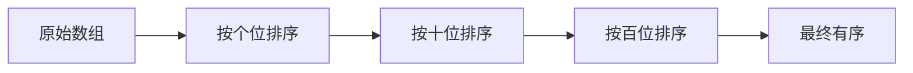
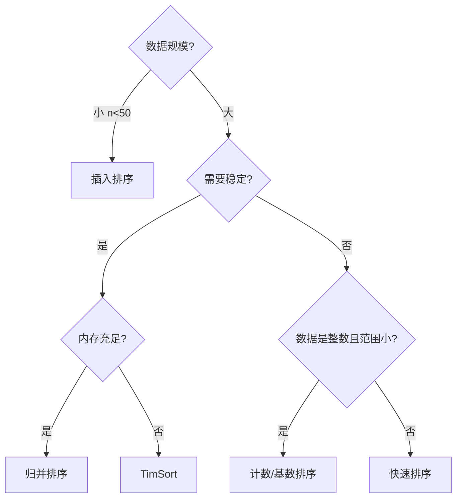

# 非比较排序：计数、基数与桶排序


## 一、为什么需要非比较排序？

基于比较的排序（快排、归并、堆排）有一个理论下界：**Ω(n log n)**。

但如果数据满足特定条件（范围有限、均匀分布），可以突破这个下界，达到 **O(n)** 的线性时间。

| 算法 | 时间 | 空间 | 稳定 | 适用条件 |
|------|------|------|------|----------|
| 计数排序 | O(n + k) | O(k) | ✅ | 整数，范围 k 不大 |
| 基数排序 | O(d·n) | O(n + k) | ✅ | 整数/定长字符串 |
| 桶排序 | O(n + k) 平均 | O(n + k) | ✅ | 数据均匀分布 |

> k = 值域范围，d = 最大位数。

## 二、计数排序（Counting Sort）

### 2.1 思想

统计每个值出现的次数，然后按顺序输出。

### 2.2 模板

```java tab
public void countingSort(int[] arr) {
    if (arr.length <= 1) return;
    int min = arr[0], max = arr[0];
    for (int x : arr) { min = Math.min(min, x); max = Math.max(max, x); }

    int range = max - min + 1;
    int[] count = new int[range];

    // 1. 计数
    for (int x : arr) count[x - min]++;

    // 2. 前缀和（确定每个元素的最终位置）
    for (int i = 1; i < range; i++) count[i] += count[i - 1];

    // 3. 逆序填充（保证稳定性）
    int[] output = new int[arr.length];
    for (int i = arr.length - 1; i >= 0; i--) {
        int idx = --count[arr[i] - min];
        output[idx] = arr[i];
    }
    System.arraycopy(output, 0, arr, 0, arr.length);
}
```

```typescript tab
function countingSort(arr: number[]): number[] {
    if (arr.length <= 1) return arr;
    const min = Math.min(...arr), max = Math.max(...arr);
    const count = new Array(max - min + 1).fill(0);
    for (const x of arr) count[x - min]++;
    const result: number[] = [];
    for (let i = 0; i < count.length; i++) {
        for (let j = 0; j < count[i]; j++) result.push(i + min);
    }
    return result;
}
```

```python tab
def counting_sort(arr: list[int]) -> list[int]:
    if not arr:
        return arr
    min_val, max_val = min(arr), max(arr)
    count = [0] * (max_val - min_val + 1)
    for x in arr:
        count[x - min_val] += 1
    result = []
    for i, c in enumerate(count):
        result.extend([i + min_val] * c)
    return result
```

- **时间**：O(n + k)，**空间**：O(n + k)
- **稳定**：✅（逆序遍历保证）

### 2.3 适用场景

- 学生成绩排序（0~100）
- 年龄排序（0~150）
- 字符排序（ASCII 0~127）

> 当 k >> n 时（如范围是 10⁹），计数排序空间爆炸，不适用。

## 三、基数排序（Radix Sort）

### 3.1 思想

将整数按**位**（个位、十位、百位...）分别排序，每一位使用**稳定的**计数排序。



### 3.2 模板（LSD，从最低位开始）

```java tab
public void radixSort(int[] arr) {
    if (arr.length <= 1) return;
    int max = arr[0];
    for (int x : arr) max = Math.max(max, x);

    for (int exp = 1; max / exp > 0; exp *= 10) {
        countingSortByDigit(arr, exp);
    }
}

private void countingSortByDigit(int[] arr, int exp) {
    int n = arr.length;
    int[] output = new int[n];
    int[] count = new int[10];     // 0~9

    for (int x : arr) count[(x / exp) % 10]++;
    for (int i = 1; i < 10; i++) count[i] += count[i - 1];

    for (int i = n - 1; i >= 0; i--) {
        int digit = (arr[i] / exp) % 10;
        output[--count[digit]] = arr[i];
    }
    System.arraycopy(output, 0, arr, 0, n);
}
```

```typescript tab
function radixSort(arr: number[]): void {
    if (arr.length <= 1) return;
    const max = Math.max(...arr);

    for (let exp = 1; Math.floor(max / exp) > 0; exp *= 10) {
        countingSortByDigit(arr, exp);
    }
}

function countingSortByDigit(arr: number[], exp: number): void {
    const n = arr.length;
    const output = new Array(n);
    const count = new Array(10).fill(0);     // 0~9

    for (const x of arr) count[Math.floor(x / exp) % 10]++;
    for (let i = 1; i < 10; i++) count[i] += count[i - 1];

    for (let i = n - 1; i >= 0; i--) {
        const digit = Math.floor(arr[i] / exp) % 10;
        output[--count[digit]] = arr[i];
    }
    for (let i = 0; i < n; i++) arr[i] = output[i];
}
```

```python tab
def radix_sort(arr: list[int]) -> None:
    if len(arr) <= 1:
        return
    max_val = max(arr)

    exp = 1
    while max_val // exp > 0:
        counting_sort_by_digit(arr, exp)
        exp *= 10

def counting_sort_by_digit(arr: list[int], exp: int) -> None:
    n = len(arr)
    output = [0] * n
    count = [0] * 10     # 0~9

    for x in arr:
        count[(x // exp) % 10] += 1
    for i in range(1, 10):
        count[i] += count[i - 1]

    for i in range(n - 1, -1, -1):
        digit = (arr[i] // exp) % 10
        count[digit] -= 1
        output[count[digit]] = arr[i]
    arr[:] = output
```

- **时间**：O(d × n)，d 为最大位数
- **空间**：O(n + 10)
- **稳定**：✅

### 3.3 LSD vs MSD

| 方式 | 方向 | 特点 |
|------|------|------|
| LSD（Least Significant Digit） | 从低位到高位 | 实现简单，适合等长数据 |
| MSD（Most Significant Digit） | 从高位到低位 | 可递归，适合变长字符串 |

### 3.4 处理负数

将所有数加上偏移量 `offset = -min`，排序后再减回：

```java tab
int min = Arrays.stream(arr).min().getAsInt();
for (int i = 0; i < arr.length; i++) arr[i] -= min;
radixSort(arr);   // 对非负数排序
for (int i = 0; i < arr.length; i++) arr[i] += min;
```

```typescript tab
const min = Math.min(...arr);
for (let i = 0; i < arr.length; i++) arr[i] -= min;
radixSort(arr);   // 对非负数排序
for (let i = 0; i < arr.length; i++) arr[i] += min;
```

```python tab
min_val = min(arr)
for i in range(len(arr)):
    arr[i] -= min_val
radix_sort(arr)   # 对非负数排序
for i in range(len(arr)):
    arr[i] += min_val
```

## 四、桶排序（Bucket Sort）

### 4.1 思想

1. 将值域分成 k 个**桶**。
2. 将每个元素放入对应的桶。
3. 桶内分别排序（插入排序/快排）。
4. 按桶顺序合并。

### 4.2 模板

```java tab
public void bucketSort(int[] arr) {
    if (arr.length <= 1) return;
    int min = arr[0], max = arr[0];
    for (int x : arr) { min = Math.min(min, x); max = Math.max(max, x); }

    int bucketCount = arr.length;
    List<List<Integer>> buckets = new ArrayList<>();
    for (int i = 0; i < bucketCount; i++) buckets.add(new ArrayList<>());

    // 分配
    for (int x : arr) {
        int idx = (int)((long)(x - min) * bucketCount / (max - min + 1));
        buckets.get(idx).add(x);
    }

    // 桶内排序 + 合并
    int k = 0;
    for (List<Integer> bucket : buckets) {
        Collections.sort(bucket);
        for (int x : bucket) arr[k++] = x;
    }
}
```

```typescript tab
function bucketSort(arr: number[]): void {
    if (arr.length <= 1) return;
    const min = Math.min(...arr), max = Math.max(...arr);

    const bucketCount = arr.length;
    const buckets: number[][] = Array.from({ length: bucketCount }, () => []);

    // 分配
    for (const x of arr) {
        const idx = Math.floor((x - min) * bucketCount / (max - min + 1));
        buckets[idx].push(x);
    }

    // 桶内排序 + 合并
    let k = 0;
    for (const bucket of buckets) {
        bucket.sort((a, b) => a - b);
        for (const x of bucket) arr[k++] = x;
    }
}
```

```python tab
def bucket_sort(arr: list[int]) -> None:
    if len(arr) <= 1:
        return
    min_val, max_val = min(arr), max(arr)

    bucket_count = len(arr)
    buckets = [[] for _ in range(bucket_count)]

    # 分配
    for x in arr:
        idx = (x - min_val) * bucket_count // (max_val - min_val + 1)
        buckets[idx].append(x)

    # 桶内排序 + 合并
    k = 0
    for bucket in buckets:
        bucket.sort()
        for x in bucket:
            arr[k] = x
            k += 1
```

- **平均时间**：O(n + k)，**最坏**：O(n²)（所有元素落入同一桶）
- **空间**：O(n + k)

### 4.3 适用场景

- 数据**均匀分布**在某个范围
- 浮点数排序（如 [0, 1) 区间）
- 外部排序的预处理

## 五、排序算法全景对比

| 算法 | 平均时间 | 最坏时间 | 空间 | 稳定 | 类型 |
|------|---------|---------|------|------|------|
| 冒泡排序 | O(n²) | O(n²) | O(1) | ✅ | 比较 |
| 选择排序 | O(n²) | O(n²) | O(1) | ❌ | 比较 |
| 插入排序 | O(n²) | O(n²) | O(1) | ✅ | 比较 |
| 希尔排序 | O(n^1.3) | O(n²) | O(1) | ❌ | 比较 |
| 归并排序 | O(n log n) | O(n log n) | O(n) | ✅ | 比较 |
| 快速排序 | O(n log n) | O(n²) | O(log n) | ❌ | 比较 |
| 堆排序 | O(n log n) | O(n log n) | O(1) | ❌ | 比较 |
| **计数排序** | O(n+k) | O(n+k) | O(k) | ✅ | 非比较 |
| **基数排序** | O(d·n) | O(d·n) | O(n) | ✅ | 非比较 |
| **桶排序** | O(n+k) | O(n²) | O(n+k) | ✅ | 非比较 |

## 六、面试常见题

- 🟢 排序数组（各排序实现）、最大间距（桶排序/基数排序）
- 🟡 前 K 个高频元素（计数 + 桶）、H 指数
- 🟠 数组中的第 K 大元素（QuickSelect）、颜色分类（计数排序思想）
- 🔴 最小差值 II、员工空闲时间（区间排序）

## 七、如何选择排序算法？



## 八、调试技巧

1. **验证稳定性**：用 `(value, id)` 对排序，检查相同 value 的 id 顺序。
2. **边界**：数组为空、只有一个元素、所有元素相同。
3. **计数排序范围**：先求 min/max，避免数组越界。
4. **基数排序位数**：`max / exp > 0` 作为循环条件。
