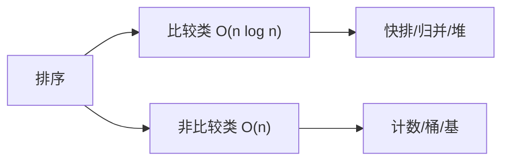

# 排序算法大总结

本篇对所有主流排序算法进行横向对比，帮助你在面试中快速选择正确的排序策略。

## 一、排序算法全景表



| 算法 | 平均时间 | 最坏时间 | 最好时间 | 空间 | 稳定 | 核心思想 |
|------|---------|---------|---------|------|------|---------|
| 冒泡排序 | O(n²) | O(n²) | O(n) | O(1) | ✅ | 相邻交换 |
| 选择排序 | O(n²) | O(n²) | O(n²) | O(1) | ❌ | 选最小放前面 |
| 插入排序 | O(n²) | O(n²) | O(n) | O(1) | ✅ | 向前找位置插入 |
| 希尔排序 | O(n^{1.3}) | O(n²) | O(n log n) | O(1) | ❌ | 分组插入 |
| 归并排序 | O(n log n) | O(n log n) | O(n log n) | O(n) | ✅ | 分治合并 |
| 快速排序 | O(n log n) | O(n²) | O(n log n) | O(log n) | ❌ | 分区递归 |
| 堆排序 | O(n log n) | O(n log n) | O(n log n) | O(1) | ❌ | 堆取极值 |
| 计数排序 | O(n+k) | O(n+k) | O(n+k) | O(k) | ✅ | 统计频次 |
| 基数排序 | O(d·n) | O(d·n) | O(d·n) | O(n+k) | ✅ | 按位分配 |
| 桶排序 | O(n+k) | O(n²) | O(n+k) | O(n+k) | ✅ | 分桶+桶内排序 |

**三个关键维度的取舍**：

```
            时间最优
              ▲
              │  归并 / 快排 / 堆排
              │  O(n log n)
              │
  空间最优 ◄──┼──────────────► 稳定最优
  堆排 O(1)   │                归并 O(n)
  快排 O(logn)│                插入 O(1)
              │
         没有算法能同时占据三个顶点
```

## 二、选择排序的决策树

```
数据规模？
├── n < 50 → 插入排序（常数小、近乎有序时 O(n)）
├── 50 < n < 5000 → 希尔排序 / 快排
└── n > 5000
    ├── 需要稳定？
    │   ├── 是 → 归并排序
    │   └── 否 → 快速排序
    ├── 数据范围有限（如 0~100）？→ 计数排序
    ├── 定长整数/字符串？→ 基数排序
    └── 均匀分布？→ 桶排序
```

**补充决策因素**：

| 场景 | 推荐算法 | 原因 |
|------|----------|------|
| 数据在链表上 | 归并排序 | 不需要随机访问，O(1) 额外空间 |
| 数据近乎有序 | TimSort / 插入排序 | 利用自然有序段，接近 O(n) |
| 数据量超出内存 | 外部归并排序 | 顺序 IO + 多路归并 |
| 只需第 K 大元素 | 快速选择 | 平均 O(n)，无需完全排序 |
| 数据流实时求中位数 | 对顶堆 | 动态维护，每次 O(log n) |
| 年龄/分数等小范围整数 | 计数排序 | O(n+k) 且 k 很小 |

## 三、工程中的混合排序

实际工程中，没有任何一种"纯粹"的排序算法被直接使用。主流语言都采用混合策略：

### TimSort（Java 对象排序 / Python / V8）

```
核心思想 = 归并排序 + 插入排序 + 自然有序段检测

1. 扫描数组，识别"自然有序段"（run）：连续递增或严格递减的子序列
2. 短 run 用插入排序扩展到最小长度（minrun，通常 32~64）
3. 将 run 压入栈，按规则（gallop 策略）决定何时合并相邻 run
4. 最终合并为一个完整的有序数组
```

**性能特点**：
- 完全有序：O(n)（只扫描一遍）
- 随机数据：O(n log n)，常数优于纯归并
- 部分有序：介于两者之间，有序度越高越快

### IntroSort（C++ std::sort）

```
核心思想 = 快速排序 + 堆排序 + 插入排序

1. 主体使用快速排序（三数取中选 pivot）
2. 递归深度超过 2·log₂(n) → 切换堆排序（保证最坏 O(n log n)）
3. 子数组长度 < 16 → 切换插入排序（减少递归开销）
```

**性能特点**：
- 平均表现与快排相同（常数极小）
- 最坏情况由堆排兜底，严格 O(n log n)
- 不稳定，原地排序 O(1) 额外空间（忽略递归栈）

### 双轴快排（Java 基本类型排序）

```
Arrays.sort(int[]) 的实现：
1. 选两个 pivot（p1 ≤ p2），将数组分为三段
2. 小数组（< 47）→ 插入排序
3. 中等数组 → 双轴快排
4. 大量重复元素 → 类似计数排序的紧凑处理
```

## 四、各语言内置排序

```java tab
// 基本类型（int[], long[] 等）
Arrays.sort(arr);
// → Dual-Pivot QuickSort（双轴快排）
// → 小数组切换插入排序（< 47）
// → 不要求稳定（基本类型无"相等对象"概念）

// 对象类型（Integer[], String[] 等）
Arrays.sort(arr);
// → TimSort（归并 + 插入的混合）
// → 稳定排序
// → 利用已有的"自然有序段"（run）

// Collections.sort(list)
// → 底层也是 TimSort

// 自定义比较器
Arrays.sort(arr, (a, b) -> a.score - b.score);
// 注意：a.score - b.score 可能溢出！
// 安全写法：Integer.compare(a.score, b.score)
```

```typescript tab
// 基本类型数组
arr.sort((a, b) => a - b);
// → V8 引擎使用 TimSort（稳定排序）
// → 小数组切换插入排序
// → 必须传比较函数，否则按字符串排序！

// ❌ 经典 bug：不传比较函数
[10, 9, 2, 1].sort()  // → [1, 10, 2, 9]（按字符串比较）

// 对象数组
arr.sort((a, b) => a.key - b.key);
// → 同样是 TimSort
// → 稳定排序（ES2019+ 规范保证）

// 多关键字排序
arr.sort((a, b) => a.age - b.age || b.score - a.score);
```

```python tab
# 基本类型列表
arr.sort()
# → Timsort（归并 + 插入的混合）
# → 稳定排序
# → 利用已有的"自然有序段"（run）

# 对象列表
arr.sort(key=lambda x: x.key)
# → 同样是 Timsort
# → 稳定排序
# → sorted(arr) 返回新列表

# 多关键字排序
arr.sort(key=lambda x: (x.age, -x.score))

# 自定义比较（需要 functools）
from functools import cmp_to_key
arr.sort(key=cmp_to_key(lambda a, b: a - b))
```

## 五、非比较排序详解

三种线性排序都突破了比较排序的 Ω(n log n) 下界，但各有前提：

### 计数排序

```
适用：值域 k = O(n) 的整数（如年龄 0~150、分数 0~100）

步骤：
1. 统计每个值的出现次数 count[v]
2. 前缀和确定每个值的最终位置
3. 从后向前遍历原数组，放入正确位置（保证稳定性）

arr = [2, 5, 3, 0, 2, 3, 0, 3]
count = [2, 0, 2, 3, 0, 1]  (值0出现2次, 值2出现2次, ...)
前缀和 = [2, 2, 4, 7, 7, 8]  (≤v 的元素总数)
→ 从后向前放置，得到 [0, 0, 2, 2, 3, 3, 3, 5]
```

### 基数排序

```
适用：d 位整数或等长字符串，d 为常数时 O(d·n) = O(n)

LSD（低位优先）：从最低位开始，每一位用稳定的计数排序
329 → 457 → 657 → 839 → 436 → 720 → 355

按个位排: 720 355 457 329 839 436 657
按十位排: 720 329 839 436 355 457 657
按百位排: 329 355 436 457 657 720 839 ✓

MSD（高位优先）：适合字符串排序（长度不等时按字典序）
```

### 桶排序

```
适用：数据均匀分布在 [0, 1) 或可映射到均匀区间

步骤：
1. 创建 n 个桶，将每个元素映射到对应桶
2. 每个桶内部用插入排序（桶内元素少，插入排序高效）
3. 依次连接所有桶

均匀分布时每个桶期望 O(1) 个元素 → 总时间 O(n)
最坏情况所有元素落入同一个桶 → 退化为桶内排序 O(n²)
```

**三者的选择**：

| 条件 | 选择 |
|------|------|
| 值域小（k ≤ n 的量级） | 计数排序 |
| 值域大但位数固定（如手机号、IP） | 基数排序 |
| 浮点数均匀分布 | 桶排序 |

## 六、面试高频问题

### Q1: 为什么快排平均比归并快？

- 快排是**原地**的，缓存友好（顺序访问）
- 归并需要 O(n) 额外空间，merge 时有随机写入
- 快排的常数因子更小（约 2~3 倍差距）
- 快排的递归深度期望 O(log n)，且内循环指令简单

### Q2: 如何避免快排最坏 O(n²)？

1. **随机化 pivot**：`swap(arr[lo], arr[random(lo, hi)])`
2. **三数取中**：取 lo, mid, hi 的中位数做 pivot
3. **三路快排**：处理大量重复元素
4. **IntroSort 兜底**：递归过深切换堆排序

### Q3: 什么时候用 O(n²) 排序？

- 数据量极小（n < 20~50）：插入排序常数最小
- 数据"近乎有序"：插入排序接近 O(n)
- 作为高级排序的"基础 case"：TimSort、Introsort 都内嵌插入排序

### Q4: 稳定排序的意义？

多关键字排序：先按次要关键字排，再按主要关键字**稳定排**，结果等价于同时按两个关键字排序。

```
例：学生按 (班级, 分数) 排序
方法一：直接自定义比较器 (a.班级 != b.班级) ? 班级比较 : 分数比较
方法二：先按分数稳定排序，再按班级稳定排序 → 结果相同
```

### Q5: 堆排序为什么实际比快排慢？

- 堆排的 sift-down 访问模式跳跃（父子节点间隔大），**缓存命中率低**
- 快排的 partition 是连续内存的顺序扫描
- 堆排的比较次数常数更大（约 2n log n vs 快排的 1.39n log n）
- 堆排的优势：严格最坏 O(n log n) + O(1) 空间，适合做兜底

### Q6: 链表上用什么排序？

- **归并排序**：只需顺序遍历 + 指针拼接，O(1) 额外空间
- 快排不适合：partition 需要随机访问和双向遍历
- 堆排不适合：建堆需要随机访问父子节点

### Q7: 第 K 大元素用什么算法？

- **快速选择（QuickSelect）**：快排的 partition 只递归一侧，平均 O(n)
- 数据流场景：大小为 K 的最小堆，每次 O(log K)
- 不需要完整排序，排序是 O(n log n) 的浪费

### Q8: 如何判断"近乎有序"并利用？

- TimSort 自动检测自然有序段（run），无需手动判断
- 手动策略：先扫描一遍统计逆序对数量，若 < n·log(n) 则用插入排序
- 归并排序的优化：`if (arr[mid] <= arr[mid+1])` 跳过合并

## 七、排序的下界

**定理**：基于比较的排序算法，最坏情况下至少需要 \(\lceil \log_2(n!) \rceil = \Omega(n \log n)\) 次比较。

**证明思路（决策树模型）**：

```
任何比较排序都可以表示为一棵决策树：
- 每个内部节点 = 一次比较 (aᵢ vs aⱼ)
- 每个叶子 = 一种排列结果
- n 个元素有 n! 种排列 → 至少 n! 个叶子
- 高度 h ≥ log₂(n!) = Ω(n log n)（Stirling 公式）
```

突破下界的排序（计数、基数、桶）都利用了**数据本身的性质**（范围有限、位数有限、均匀分布），而非仅靠比较。

## 八、排序相关面试真题

| 题目 | 难度 | 核心考点 |
|------|------|----------|
| 排序链表（LC 148） | 🟡 Medium | 链表归并排序 |
| 颜色分类（LC 75） | 🟡 Medium | 三路快排 partition |
| 数组中的第K个最大元素（LC 215） | 🟡 Medium | 快速选择 / 堆 |
| 前 K 个高频元素（LC 347） | 🟡 Medium | 计数 + 桶排序思想 |
| 最大间距（LC 164） | 🔴 Hard | 桶排序 / 鸽巢原理 |
| 数组中的逆序对（剑指51） | 🔴 Hard | 归并排序统计 |
| 摆动排序 II（LC 324） | 🟡 Medium | 快速选择 + 三路划分 |
| 合并区间（LC 56） | 🟡 Medium | 排序后线性扫描 |
| 根据字符出现频率排序（LC 451） | 🟡 Medium | 计数排序 |
| 有效的字母异位词（LC 242） | 🟢 Easy | 计数数组 |

## 九、一句话速记

| 算法 | 一句话记忆 |
|------|-----------|
| 冒泡 | 大的像气泡一样浮到末尾 |
| 选择 | 每轮选最小的"放到"已排区末尾 |
| 插入 | 打牌时整理手牌的方式 |
| 希尔 | 先粗调（大间隔）再细调（间隔→1） |
| 归并 | 拆到不能拆，合并时双指针比大小 |
| 快排 | 选基准，小的站左边，大的站右边，递归 |
| 堆排 | 建大顶堆，反复取堆顶放末尾 |
| 计数 | 数一数每个值出现几次，直接写结果 |
| 基数 | 按位排序，从个位到最高位 |
| 桶 | 均匀撒进桶里，桶内各自排好再拼 |
