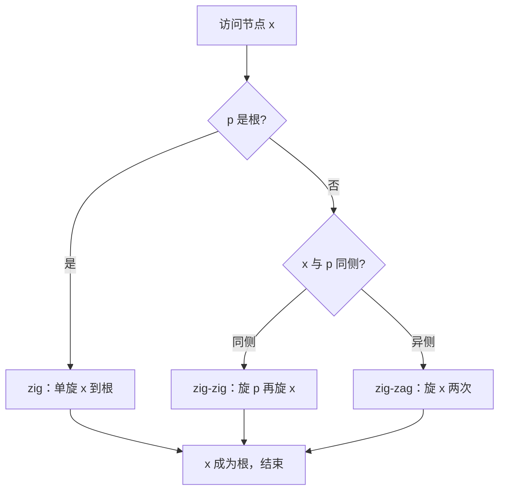

# 伸展树 Splay Tree

## 一、概念：为什么需要 Splay Tree

**伸展树（Splay Tree）** 是一种自调整（self-adjusting）的二叉搜索树，由 Sleator 和 Tarjan 于 1985 年提出。它**不显式维护平衡因子或节点高度**，而是对每次被访问（查找 / 插入 / 删除）的节点执行一个称为 **Splay** 的操作——通过一系列旋转把它「伸展」到树根。

因为最近访问的节点会被推到根，所以**频繁访问的元素离根更近**。从摊还（amortized）角度看，任意连续 m 次操作的总时间都是 O(m log n)，单次的摊还复杂度为 O(log n)，且无需存储任何平衡信息，实现极其简洁。

> 与 AVL / 红黑树的区别：AVL 靠高度严格平衡，红黑树靠颜色约束；Splay 树「懒」——平时可以很不平衡，但访问会顺手把热点拉到根。

## 二、核心操作：Splay（伸展）

Splay(x) 的目标：反复对节点 x 做旋转，直到 x 成为根。旋转分三种情形，设 p = parent(x)，g = parent(p)：

| 情形 | 条件 | 旋转动作 |
|---|---|---|
| **zig** | p 就是根 | 对 x 做一次单旋（左/右取决于 x 是 p 的哪侧孩子） |
| **zig-zig** | x 与 p 同为左孩子（或同为右孩子） | 先旋 p，再旋 x |
| **zig-zag** | x 是 p 的左孩子但 p 是 g 的右孩子（或相反） | 连续两次旋 x（第一次左旋/右旋，第二次相反） |

关键：**zig-zig / zig-zag 是「双旋」**，这正是 Splay 摊还复杂度 O(log n) 的来源（类似「减半距离」的势能论证）。



## 三、插入

Splay Tree 的插入 = **先按普通 BST 规则插入，再把新节点 Splay 到根**。

```typescript tab
interface Node { val: number; left: Node | null; right: Node | null; }

function splay(x: Node, root: Node): Node {
  // 完整 splay 需要节点持有 parent 指针；此处 Node 仅含 val/left/right，
  // 故给出核心逻辑示意。实际实现请补充 parent 字段，并按：
  // zig：p 为根 → 单旋 x 到根
  // zig-zig：x 与 p 同侧 → 先旋 p 再旋 x
  // zig-zag：x 与 p 异侧 → 连续两次旋 x
  return root; // 示意占位，需 parent 指针实现
}

function insert(root: Node | null, v: number): Node {
  if (!root) return { val: v, left: null, right: null };
  // 1) 普通 BST 插入
  let cur = root, parent: Node | null = null, isLeft = false;
  while (cur) {
    parent = cur;
    if (v < cur.val) { isLeft = true; cur = cur.left; }
    else if (v > cur.val) { isLeft = false; cur = cur.right; }
    else return root; // 重复值不插入
  }
  const node: Node = { val: v, left: null, right: null };
  if (isLeft) parent!.left = node; else parent!.right = node;
  // 2) 把新节点 splay 到根
  return splay(node, root);
}
```

```java tab
class Node {
    int val;
    Node left, right;
    Node(int v) { val = v; }
}

public static Node insert(Node root, int v) {
    if (root == null) return new Node(v);
    Node cur = root, parent = null;
    boolean isLeft = false;
    while (cur != null) {
        parent = cur;
        if (v < cur.val) { isLeft = true; cur = cur.left; }
        else if (v > cur.val) { isLeft = false; cur = cur.right; }
        else return root;
    }
    Node node = new Node(v);
    if (isLeft) parent.left = node; else parent.right = node;
    return splay(node, root); // 把新节点伸展到根
}

// splay 完整实现需要节点的 parent 指针；此处 Node 仅含 val/left/right，
// 故给出核心逻辑示意（zig / zig-zig / zig-zag 见概念节）。
static Node splay(Node x, Node root) { /* 需 parent 指针 */ return root; }
```

```python tab
class Node:
    def __init__(self, v):
        self.val = v
        self.left = None
        self.right = None

def splay(x, root):
    # 示意占位：完整实现需要 parent 指针，zig/zig-zig/zig-zag 见概念节
    return root

def insert(root, v):
    if root is None:
        return Node(v)
    cur = root
    parent = None
    is_left = False
    while cur is not None:
        parent = cur
        if v < cur.val:
            is_left = True
            cur = cur.left
        elif v > cur.val:
            is_left = False
            cur = cur.right
        else:
            return root
    node = Node(v)
    if is_left:
        parent.left = node
    else:
        parent.right = node
    return splay(node, root)  # 把新节点伸展到根
```

## 四、查找

查找与普通 BST 一致，唯一的区别是**找到（或走到空前的最后一个节点）后，把该节点 Splay 到根**。这样下次再查同一元素就是 O(1)。

```typescript tab
function search(root: Node | null, v: number): Node | null {
  let cur = root, last = null;
  while (cur) {
    last = cur;
    if (v === cur.val) break;
    cur = v < cur.val ? cur.left : cur.right;
  }
  // 把最后访问的节点伸展到根（last 可能是命中节点，也可能是最近的祖先）
  return last ? splay(last, root) : root;
}
```

## 五、删除

Splay 删除 = 先把目标节点 Splay 到根，然后合并左右子树：

1. Splay(x) → x 成为根，此时左子树 L 所有值 < x，右子树 R 所有值 > x。
2. 若 R 为空，直接返回 L；否则把 R 中的**最小节点** Splay 到 R 的根（它无左孩子）。
3. 将 L 接到 R 最小节点的左孩子上，返回 R。

```text
删除 x:
  splay(x)            // x 到根
  if x.right == null: return x.left
  splayMin(x.right)   // 右子树最小节点到顶（无左孩子）
  x.right.left = x.left
  return x.right
```

## 六、复杂度

| 操作 | 最坏单次 | 摊还 |
|---|---|---|
| 查找 / 插入 / 删除 | O(n) | O(log n) |
| 连续 m 次操作 | — | O(m log n) |

> 「摊还 O(log n)」的直觉：Splay 操作把访问节点的深度「减半」式地拉上来，势能下降的速度足以抵消最坏情况下的长链。

## 七、应用场景

- **缓存 / 内存管理**：Linux 内核的 VMA（虚拟内存区域）用 Splay Tree 管理；局部性好的访问模式性能极佳。
- **垃圾回收器（如 GCP、老版 JVM 的 mark-sweep 中某些实现）**：用 Splay Tree 组织堆对象。
- **网络路由表、词频统计、输入法等**：存在明显访问热点的场景。
- **无需持久化平衡字段**：嵌入式或实现成本敏感、且能接受偶发 O(n) 的场景。

> 与跳表对比：跳表靠概率多层索引做到期望 O(log n) 且实现简单、支持区间扫描；Splay Tree 不做任何随机化，靠「访问即上移」获得摊还保证，额外空间为 O(1)/节点。
