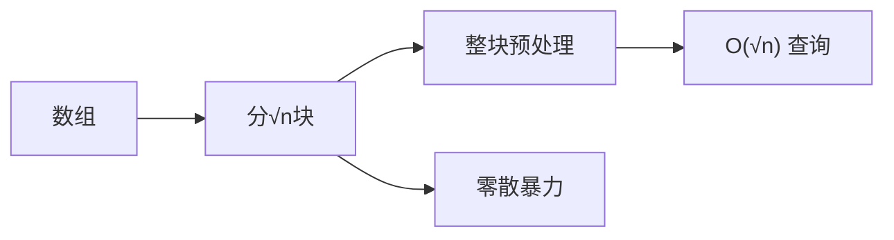

# 分块与莫队算法

分块（Sqrt Decomposition）是一种"暴力美学"——将数据分成 √n 大小的块，整块预处理、零散暴力，实现 O(√n) 的查询与修改。莫队算法则是分块思想在离线查询上的优雅应用。

## 一、分块思想



将长度为 n 的数组分成 ⌈n/B⌉ 个块（通常 B = √n）：

```
数组: [a0, a1, a2, a3, a4, a5, a6, a7, a8]
块:   |--- block 0 ---|--- block 1 ---|--- block 2 ---|
       B=3              B=3              B=3
```

- **整块操作**：O(1) 利用块的预处理信息
- **零散操作**：O(B) 暴力处理两端

## 二、区间求和 + 单点修改

```java tab
public class SqrtDecomposition {
    private int[] arr;
    private long[] blockSum;
    private int blockSize;

    public SqrtDecomposition(int[] arr) {
        this.arr = arr;
        int n = arr.length;
        blockSize = (int) Math.sqrt(n) + 1;
        blockSum = new long[(n + blockSize - 1) / blockSize];
        for (int i = 0; i < n; i++) {
            blockSum[i / blockSize] += arr[i];
        }
    }

    // 单点修改 O(1)
    public void update(int index, int val) {
        int block = index / blockSize;
        blockSum[block] += val - arr[index];
        arr[index] = val;
    }

    // 区间求和 O(√n)
    public long query(int l, int r) {
        long sum = 0;
        int blockL = l / blockSize;
        int blockR = r / blockSize;

        if (blockL == blockR) {
            // 同一块：暴力
            for (int i = l; i <= r; i++) sum += arr[i];
        } else {
            // 左零散
            for (int i = l; i < (blockL + 1) * blockSize; i++) sum += arr[i];
            // 中间整块
            for (int b = blockL + 1; b < blockR; b++) sum += blockSum[b];
            // 右零散
            for (int i = blockR * blockSize; i <= r; i++) sum += arr[i];
        }
        return sum;
    }
}
```

```typescript tab
class SqrtDecomposition {
    private arr: number[];
    private blockSum: number[];
    private blockSize: number;

    constructor(arr: number[]) {
        this.arr = arr;
        const n = arr.length;
        this.blockSize = Math.floor(Math.sqrt(n)) + 1;
        this.blockSum = new Array(Math.ceil(n / this.blockSize)).fill(0);
        for (let i = 0; i < n; i++) {
            this.blockSum[Math.floor(i / this.blockSize)] += arr[i];
        }
    }

    // 单点修改 O(1)
    update(index: number, val: number): void {
        const block = Math.floor(index / this.blockSize);
        this.blockSum[block] += val - this.arr[index];
        this.arr[index] = val;
    }

    // 区间求和 O(√n)
    query(l: number, r: number): number {
        let sum = 0;
        const blockL = Math.floor(l / this.blockSize);
        const blockR = Math.floor(r / this.blockSize);

        if (blockL === blockR) {
            // 同一块：暴力
            for (let i = l; i <= r; i++) sum += this.arr[i];
        } else {
            // 左零散
            for (let i = l; i < (blockL + 1) * this.blockSize; i++) sum += this.arr[i];
            // 中间整块
            for (let b = blockL + 1; b < blockR; b++) sum += this.blockSum[b];
            // 右零散
            for (let i = blockR * this.blockSize; i <= r; i++) sum += this.arr[i];
        }
        return sum;
    }
}
```

```python tab
class SqrtDecomposition:
    def __init__(self, arr: list[int]):
        self.arr = arr
        n = len(arr)
        self.block_size = int(n ** 0.5) + 1
        self.block_sum = [0] * ((n + self.block_size - 1) // self.block_size)
        for i in range(n):
            self.block_sum[i // self.block_size] += arr[i]

    # 单点修改 O(1)
    def update(self, index: int, val: int) -> None:
        block = index // self.block_size
        self.block_sum[block] += val - self.arr[index]
        self.arr[index] = val

    # 区间求和 O(√n)
    def query(self, l: int, r: int) -> int:
        s = 0
        block_l = l // self.block_size
        block_r = r // self.block_size

        if block_l == block_r:
            # 同一块：暴力
            for i in range(l, r + 1):
                s += self.arr[i]
        else:
            # 左零散
            for i in range(l, (block_l + 1) * self.block_size):
                s += self.arr[i]
            # 中间整块
            for b in range(block_l + 1, block_r):
                s += self.block_sum[b]
            # 右零散
            for i in range(block_r * self.block_size, r + 1):
                s += self.arr[i]
        return s
```

## 三、分块 vs 线段树 vs 树状数组

| 维度 | 分块 | 线段树 | 树状数组 |
|------|------|--------|---------|
| 查询 | O(√n) | O(log n) | O(log n) |
| 修改 | O(√n) 或 O(1) | O(log n) | O(log n) |
| 代码复杂度 | 低 | 高 | 中 |
| 灵活性 | 极高（任意操作） | 中 | 低（仅前缀和） |
| 适用 | 操作复杂/不好用线段树 | 通用区间操作 | 前缀和 |

## 四、莫队算法（离线区间查询）

莫队 = 分块排序 + 双指针移动

适用：多次查询 [l, r] 的某个聚合值（如区间内不同元素个数），且可以 O(1) 扩展/收缩。

```java tab
// 莫队模板：区间不同元素个数
public int[] countDistinct(int[] nums, int[][] queries) {
    int n = nums.length, q = queries.length;
    int blockSize = (int) Math.sqrt(n) + 1;

    // 按块排序：左端点所在块 → 右端点
    Integer[] order = new Integer[q];
    for (int i = 0; i < q; i++) order[i] = i;
    Arrays.sort(order, (a, b) -> {
        int blockA = queries[a][0] / blockSize;
        int blockB = queries[b][0] / blockSize;
        if (blockA != blockB) return blockA - blockB;
        return (blockA & 1) == 0 ? queries[a][1] - queries[b][1]
                                  : queries[b][1] - queries[a][1]; // 奇偶优化
    });

    int[] freq = new int[100001];
    int distinct = 0, curL = 0, curR = -1;
    int[] ans = new int[q];

    for (int idx : order) {
        int l = queries[idx][0], r = queries[idx][1];
        while (curR < r) { curR++; if (++freq[nums[curR]] == 1) distinct++; }
        while (curR > r) { if (--freq[nums[curR]] == 0) distinct--; curR--; }
        while (curL < l) { if (--freq[nums[curL]] == 0) distinct--; curL++; }
        while (curL > l) { curL--; if (++freq[nums[curL]] == 1) distinct++; }
        ans[idx] = distinct;
    }
    return ans;
}
```

```typescript tab
// 莫队模板：区间不同元素个数
function countDistinct(nums: number[], queries: number[][]): number[] {
    const n = nums.length, q = queries.length;
    const blockSize = Math.floor(Math.sqrt(n)) + 1;

    // 按块排序：左端点所在块 → 右端点
    const order = Array.from({ length: q }, (_, i) => i);
    order.sort((a, b) => {
        const blockA = Math.floor(queries[a][0] / blockSize);
        const blockB = Math.floor(queries[b][0] / blockSize);
        if (blockA !== blockB) return blockA - blockB;
        return (blockA & 1) === 0 ? queries[a][1] - queries[b][1]
                                  : queries[b][1] - queries[a][1]; // 奇偶优化
    });

    const freq = new Array(100001).fill(0);
    let distinct = 0, curL = 0, curR = -1;
    const ans = new Array(q).fill(0);

    for (const idx of order) {
        const l = queries[idx][0], r = queries[idx][1];
        while (curR < r) { curR++; if (++freq[nums[curR]] === 1) distinct++; }
        while (curR > r) { if (--freq[nums[curR]] === 0) distinct--; curR--; }
        while (curL < l) { if (--freq[nums[curL]] === 0) distinct--; curL++; }
        while (curL > l) { curL--; if (++freq[nums[curL]] === 1) distinct++; }
        ans[idx] = distinct;
    }
    return ans;
}
```

```python tab
# 莫队模板：区间不同元素个数
def count_distinct(nums: list[int], queries: list[list[int]]) -> list[int]:
    n, q = len(nums), len(queries)
    block_size = int(n ** 0.5) + 1

    # 按块排序：左端点所在块 → 右端点
    order = list(range(q))
    order.sort(key=lambda i: (queries[i][0] // block_size,
                              queries[i][1] if (queries[i][0] // block_size) % 2 == 0
                              else -queries[i][1]))  # 奇偶优化

    freq = [0] * 100001
    distinct = 0
    cur_l, cur_r = 0, -1
    ans = [0] * q

    for idx in order:
        l, r = queries[idx]
        while cur_r < r:
            cur_r += 1
            freq[nums[cur_r]] += 1
            if freq[nums[cur_r]] == 1:
                distinct += 1
        while cur_r > r:
            freq[nums[cur_r]] -= 1
            if freq[nums[cur_r]] == 0:
                distinct -= 1
            cur_r -= 1
        while cur_l < l:
            freq[nums[cur_l]] -= 1
            if freq[nums[cur_l]] == 0:
                distinct -= 1
            cur_l += 1
        while cur_l > l:
            cur_l -= 1
            freq[nums[cur_l]] += 1
            if freq[nums[cur_l]] == 1:
                distinct += 1
        ans[idx] = distinct
    return ans
```

## 五、复杂度

- 分块查询/修改：O(√n)
- 莫队总复杂度：O((n + q) · √n)
- 空间：O(n)

## 六、面试要点

1. **分块是"万能但慢"的方案**：当线段树/树状数组不好实现时，分块总能兜底
2. **莫队只能离线**：必须提前知道所有查询
3. **奇偶排序优化**：减少右指针的来回移动
4. **LeetCode**：303/307（区间和）、1310（子数组异或查询）
