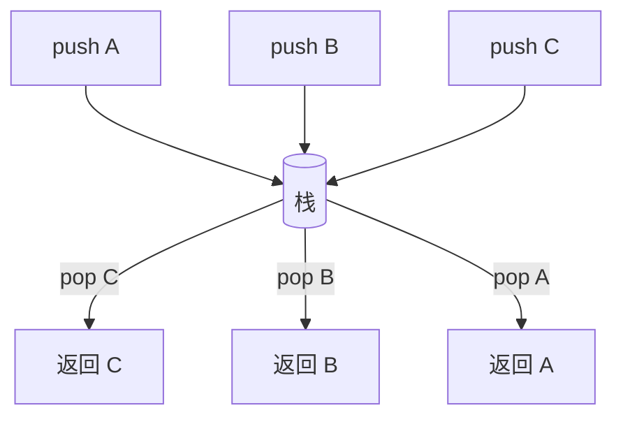

# 栈 Stack


## 一、什么是栈？

**栈（Stack）** 是一种**后进先出（LIFO, Last In First Out）** 的线性数据结构。就像一叠盘子——最后放上去的盘子最先被拿走。



## 二、核心操作

| 操作 | 说明 | 复杂度 |
|------|------|--------|
| `push` | 入栈（栈顶添加） | O(1) |
| `pop` | 出栈（栈顶移除） | O(1) |
| `peek` / `top` | 查看栈顶元素 | O(1) |
| `isEmpty` | 判断是否为空 | O(1) |
| `size` | 元素个数 | O(1) |

## 三、实现方式

### 3.1 基于数组（顺序栈）

```java tab
public class ArrayStack<E> {
    private E[] data;
    private int top = -1;

    @SuppressWarnings("unchecked")
    public ArrayStack(int capacity) {
        data = (E[]) new Object[capacity];
    }

    public void push(E e) {
        if (top == data.length - 1) throw new IllegalStateException("栈满");
        data[++top] = e;
    }

    public E pop() {
        if (top == -1) throw new NoSuchElementException("栈空");
        E e = data[top];
        data[top--] = null;
        return e;
    }

    public E peek() {
        if (top == -1) throw new NoSuchElementException("栈空");
        return data[top];
    }

    public boolean isEmpty() { return top == -1; }
}
```
```typescript tab
class ArrayStack<T> {
    private data: (T | undefined)[];
    private top = -1;

    constructor(capacity: number) {
        this.data = new Array(capacity);
    }

    push(e: T): void {
        if (this.top === this.data.length - 1) throw new Error('栈满');
        this.data[++this.top] = e;
    }

    pop(): T {
        if (this.top === -1) throw new Error('栈空');
        const e = this.data[this.top] as T;
        this.data[this.top--] = undefined;
        return e;
    }

    peek(): T {
        if (this.top === -1) throw new Error('栈空');
        return this.data[this.top] as T;
    }

    isEmpty(): boolean { return this.top === -1; }
}
```
```python tab
class ArrayStack:
    def __init__(self, capacity: int):
        self._data = [None] * capacity
        self._top = -1

    def push(self, e):
        if self._top == len(self._data) - 1:
            raise Exception('栈满')
        self._top += 1
        self._data[self._top] = e

    def pop(self):
        if self._top == -1:
            raise Exception('栈空')
        e = self._data[self._top]
        self._data[self._top] = None
        self._top -= 1
        return e

    def peek(self):
        if self._top == -1:
            raise Exception('栈空')
        return self._data[self._top]

    def is_empty(self) -> bool:
        return self._top == -1
```

### 3.2 基于链表（链式栈）

```java tab
public class LinkedStack<E> {
    private Node<E> top;
    private int size = 0;

    private static class Node<E> { E val; Node<E> next; Node(E v) { val = v; } }

    public void push(E e) {
        Node<E> node = new Node<>(e);
        node.next = top;
        top = node;
        size++;
    }

    public E pop() {
        if (top == null) throw new NoSuchElementException();
        E v = top.val;
        top = top.next;
        size--;
        return v;
    }
}
```
```typescript tab
class LinkedStack<T> {
    private top: { val: T; next: any } | null = null;
    private size = 0;

    push(e: T): void {
        this.top = { val: e, next: this.top };
        this.size++;
    }

    pop(): T {
        if (!this.top) throw new Error('栈空');
        const v = this.top.val;
        this.top = this.top.next;
        this.size--;
        return v;
    }
}
```
```python tab
class LinkedStack:
    def __init__(self):
        self._top = None
        self._size = 0

    def push(self, e):
        self._top = {'val': e, 'next': self._top}
        self._size += 1

    def pop(self):
        if not self._top:
            raise Exception('栈空')
        v = self._top['val']
        self._top = self._top['next']
        self._size -= 1
        return v
```

| 实现 | 优点 | 缺点 |
|------|------|------|
| 顺序栈 | 缓存友好、访问快 | 容量固定 / 扩容有成本 |
| 链式栈 | 容量无限 | 节点开销、缓存不友好 |

> Java 的 `java.util.Stack` 是基于 `Vector` 实现的（线程安全但慢），生产推荐用 `ArrayDeque` 或 `Deque` 接口。

## 四、典型应用

### 4.1 函数调用栈

每调用一个函数，分配一个栈帧；返回时弹栈。这是编程语言实现的基础。

### 4.2 表达式求值

```text
中缀: 3 + 4 * 2 - 5
后缀（逆波兰）: 3 4 2 * + 5 -
```

**算法**：用栈存操作数，遇运算符弹出两个数计算，结果入栈。

```java tab
public int evalRPN(String[] tokens) {
    Deque<Integer> stack = new ArrayDeque<>();
    for (String t : tokens) {
        if ("+-*/".contains(t) && t.length() == 1) {
            int b = stack.pop(), a = stack.pop();
            switch (t) {
                case "+": stack.push(a + b); break;
                case "-": stack.push(a - b); break;
                case "*": stack.push(a * b); break;
                case "/": stack.push(a / b); break;
            }
        } else {
            stack.push(Integer.parseInt(t));
        }
    }
    return stack.pop();
}
```
```typescript tab
function evalRPN(tokens: string[]): number {
    const stack: number[] = [];
    for (const t of tokens) {
        if ('+-*/'.includes(t) && t.length === 1) {
            const b = stack.pop()!, a = stack.pop()!;
            switch (t) {
                case '+': stack.push(a + b); break;
                case '-': stack.push(a - b); break;
                case '*': stack.push(a * b); break;
                case '/': stack.push(Math.trunc(a / b)); break;
            }
        } else {
            stack.push(parseInt(t));
        }
    }
    return stack.pop()!;
}
```
```python tab
def eval_rpn(tokens: list[str]) -> int:
    stack = []
    for t in tokens:
        if t in '+-*/':
            b, a = stack.pop(), stack.pop()
            if t == '+': stack.append(a + b)
            elif t == '-': stack.append(a - b)
            elif t == '*': stack.append(a * b)
            else: stack.append(int(a / b))
        else:
            stack.append(int(t))
    return stack.pop()
```

### 4.3 括号匹配

```java tab
public boolean isValid(String s) {
    Deque<Character> stack = new ArrayDeque<>();
    Map<Character, Character> pairs = Map.of(')', '(', ']', '[', '}', '{');
    for (char c : s.toCharArray()) {
        if (pairs.containsValue(c)) stack.push(c);
        else {
            if (stack.isEmpty() || stack.pop() != pairs.get(c)) return false;
        }
    }
    return stack.isEmpty();
}
```
```typescript tab
function isValid(s: string): boolean {
    const stack: string[] = [];
    const pairs: Record<string, string> = { ')': '(', ']': '[', '}': '{' };
    for (const c of s) {
        if (Object.values(pairs).includes(c)) {
            stack.push(c);
        } else {
            if (!stack.length || stack.pop() !== pairs[c]) return false;
        }
    }
    return stack.length === 0;
}
```
```python tab
def is_valid(s: str) -> bool:
    stack = []
    pairs = {')': '(', ']': '[', '}': '{'}
    for c in s:
        if c in pairs.values():
            stack.append(c)
        else:
            if not stack or stack.pop() != pairs[c]:
                return False
    return not stack
```

**变种**：
- 多个类型括号（题目：最长有效括号）。
- 通配符匹配（含 `*`）。

### 4.4 单调栈

见单独的"单调栈"专题教程。**核心套路**：维护栈的单调性，破坏时弹栈处理。

### 4.5 撤销/重做（undo/redo）

```java tab
class TextEditor {
    Deque<String> undo = new ArrayDeque<>();
    Deque<String> redo = new ArrayDeque<>();
    String text = "";

    void edit(String change) {
        undo.push(text);
        text = change;
        redo.clear();
    }

    void undo() {
        if (undo.isEmpty()) return;
        redo.push(text);
        text = undo.pop();
    }
}
```
```typescript tab
class TextEditor {
    private undoStack: string[] = [];
    private redoStack: string[] = [];
    text = '';

    edit(change: string): void {
        this.undoStack.push(this.text);
        this.text = change;
        this.redoStack = [];
    }

    undo(): void {
        if (!this.undoStack.length) return;
        this.redoStack.push(this.text);
        this.text = this.undoStack.pop()!;
    }
}
```
```python tab
class TextEditor:
    def __init__(self):
        self.undo_stack = []
        self.redo_stack = []
        self.text = ''

    def edit(self, change: str):
        self.undo_stack.append(self.text)
        self.text = change
        self.redo_stack.clear()

    def undo(self):
        if not self.undo_stack:
            return
        self.redo_stack.append(self.text)
        self.text = self.undo_stack.pop()
```

## 五、栈与递归

递归本身就是用栈实现的。手动"模拟递归"通常需要显式栈：

```java tab
// 递归版本
void dfs(Node u) {
    if (u == null) return;
    visit(u);
    dfs(u.left);
    dfs(u.right);
}

// 显式栈版本（避免栈溢出）
void dfsIterative(Node root) {
    if (root == null) return;
    Deque<Node> stack = new ArrayDeque<>();
    stack.push(root);
    while (!stack.isEmpty()) {
        Node u = stack.pop();
        visit(u);
        if (u.right != null) stack.push(u.right);
        if (u.left != null) stack.push(u.left);
    }
}
```
```typescript tab
// 递归版本
function dfs(u: TreeNode | null): void {
    if (!u) return;
    visit(u);
    dfs(u.left);
    dfs(u.right);
}

// 显式栈版本
function dfsIterative(root: TreeNode | null): void {
    if (!root) return;
    const stack: TreeNode[] = [root];
    while (stack.length) {
        const u = stack.pop()!;
        visit(u);
        if (u.right) stack.push(u.right);
        if (u.left) stack.push(u.left);
    }
}
```
```python tab
# 递归版本
def dfs(u):
    if u is None:
        return
    visit(u)
    dfs(u.left)
    dfs(u.right)

# 显式栈版本
def dfs_iterative(root):
    if root is None:
        return
    stack = [root]
    while stack:
        u = stack.pop()
        visit(u)
        if u.right:
            stack.append(u.right)
        if u.left:
            stack.append(u.left)
```

## 六、深度优先搜索（DFS）

```text
栈在 DFS 中的作用：
1. 起点入栈。
2. 栈顶出栈 → 处理 → 子节点入栈。
3. 直到栈空。
```

注意：递归 DFS 就是调用栈实现的，二者本质相同。

## 七、最小栈（设计题）

要求 `getMin()` 也 O(1)。

**思路**：辅助栈同步记录"当前位置之上的最小值"。

```java tab
class MinStack {
    Deque<int[]> stack = new ArrayDeque<>();

    public void push(int x) {
        int min = stack.isEmpty() ? x : Math.min(stack.peek()[1], x);
        stack.push(new int[]{x, min});
    }

    public void pop() { stack.pop(); }
    public int top() { return stack.peek()[0]; }
    public int getMin() { return stack.peek()[1]; }
}
```
```typescript tab
class MinStack {
    private stack: [number, number][] = [];

    push(x: number): void {
        const min = this.stack.length ? Math.min(this.stack[this.stack.length - 1][1], x) : x;
        this.stack.push([x, min]);
    }

    pop(): void { this.stack.pop(); }
    top(): number { return this.stack[this.stack.length - 1][0]; }
    getMin(): number { return this.stack[this.stack.length - 1][1]; }
}
```
```python tab
class MinStack:
    def __init__(self):
        self.stack = []  # (val, min)

    def push(self, x: int):
        cur_min = x if not self.stack else min(self.stack[-1][1], x)
        self.stack.append((x, cur_min))

    def pop(self): self.stack.pop()
    def top(self) -> int: return self.stack[-1][0]
    def get_min(self) -> int: return self.stack[-1][1]
```

## 八、用栈实现队列

> 经典面试题：只许用栈实现队列的 `push` / `pop` / `peek` / `empty`。

```java tab
class MyQueue {
    Deque<Integer> in = new ArrayDeque<>();
    Deque<Integer> out = new ArrayDeque<>();

    public void push(int x) { in.push(x); }

    public int pop() {
        if (out.isEmpty()) while (!in.isEmpty()) out.push(in.pop());
        return out.pop();
    }

    public int peek() {
        if (out.isEmpty()) while (!in.isEmpty()) out.push(in.pop());
        return out.peek();
    }

    public boolean empty() { return in.isEmpty() && out.isEmpty(); }
}
```
```typescript tab
class MyQueue {
    private inStack: number[] = [];
    private outStack: number[] = [];

    push(x: number): void { this.inStack.push(x); }

    pop(): number {
        if (!this.outStack.length)
            while (this.inStack.length) this.outStack.push(this.inStack.pop()!);
        return this.outStack.pop()!;
    }

    peek(): number {
        if (!this.outStack.length)
            while (this.inStack.length) this.outStack.push(this.inStack.pop()!);
        return this.outStack[this.outStack.length - 1];
    }

    empty(): boolean { return !this.inStack.length && !this.outStack.length; }
}
```
```python tab
class MyQueue:
    def __init__(self):
        self.in_stack = []
        self.out_stack = []

    def push(self, x: int): self.in_stack.append(x)

    def pop(self) -> int:
        if not self.out_stack:
            while self.in_stack:
                self.out_stack.append(self.in_stack.pop())
        return self.out_stack.pop()

    def peek(self) -> int:
        if not self.out_stack:
            while self.in_stack:
                self.out_stack.append(self.in_stack.pop())
        return self.out_stack[-1]

    def empty(self) -> bool:
        return not self.in_stack and not self.out_stack
```

**摊销复杂度**：每次元素最多"in→out"搬运一次 → **O(1) 摊销**。

## 九、复杂度汇总

| 操作 | 时间 | 空间 |
|------|------|------|
| push / pop / peek | O(1) | O(1) |
| 顺序栈 | O(1) | O(n) |
| 链式栈 | O(1) | O(n) |

## 十、易错点

1. **栈空还 pop**：必须先检查，否则抛异常。
2. **数组扩容**：顺序栈扩容到 2 倍，复杂度仍是 O(1) 摊销。
3. **递归改栈**：先 push 右子再 push 左子，才能保证左子先处理。
4. **栈帧爆栈**：递归深度 > 1e4 时改显式栈。
5. **注意 Java `Stack` 类**：已被标记 legacy，推荐用 `ArrayDeque`。

## 十一、刷题清单

| 难度 | 题目 | 类型 |
|------|------|------|
| 🟢 | 有效括号 | 括号匹配 |
| 🟢 | 用栈实现队列 | 双栈 |
| 🟡 | 最小栈 | 辅助栈 |
| 🟡 | 逆波兰表达式求值 | 表达式 |
| 🟡 | 比较含退格的字符串 | 双栈 |
| 🟡 | 字符串解码 | 嵌套解码 |
| 🟠 | 每日温度 | 单调栈 |
| 🟠 | 接雨水 | 单调栈 |
| 🟠 | 柱状图最大矩形 | 单调栈 |
| 🟠 | 移掉 K 位数字 | 单调栈 |
| 🔴 | 找出最长有效括号 | 栈/DP |

## 十二、心法

> **栈的本质：让"后到的先处理"**。  
> 看到"嵌套 / 匹配 / 后进先出 / 撤销"这些关键词，99% 是栈题。
