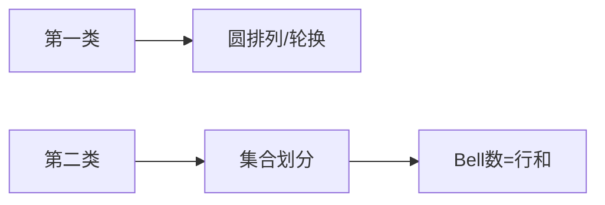

# 斯特林数（Stirling Numbers）

## 一、为什么学斯特林数？



两类斯特林数在组合数学与计数 DP 中高频出现：

- **第一类 (s(n,k))**：n 个元素分成 k 个**圆排列**（轮换）
- **第二类 (S(n,k))**：n 个元素划分成 k 个**非空无序集合**

常用转换：`x^n = Σ S(n,k)·x↑(k)`（上升阶乘）。

## 二、递推式

第一类（带符号）：`s(n,k) = s(n-1,k-1) - (n-1)·s(n-1,k)`
第一类（无符号）：`c(n,k) = c(n-1,k-1) + (n-1)·c(n-1,k)`

第二类：`S(n,k) = S(n-1,k-1) + k·S(n-1,k)`，边界 `S(0,0)=1`。

## 三、实现（第二类为例）

```java tab
// S[n][k] 模 mod
for (int i = 0; i <= n; i++) Arrays.fill(S[i], 0);
S[0][0] = 1;
for (int i = 1; i <= n; i++)
    for (int k = 1; k <= i; k++)
        S[i][k] = (S[i - 1][k - 1] + (long) k * S[i - 1][k]) % MOD;
```

```typescript tab
const S: number[][] = Array.from({ length: n + 1 }, () => new Array(k + 1).fill(0));
S[0][0] = 1;
for (let i = 1; i <= n; i++)
    for (let k = 1; k <= i; k++)
        S[i][k] = (S[i - 1][k - 1] + k * S[i - 1][k]) % MOD;
```

```python tab
S = [[0] * (k + 1) for _ in range(n + 1)]
S[0][0] = 1
for i in range(1, n + 1):
    for k in range(1, i + 1):
        S[i][k] = (S[i - 1][k - 1] + k * S[i - 1][k]) % MOD
```

## 四、行/列公式与生成函数

- 第二类行和：`Σ_k S(n,k) = Bell(n)`（贝尔数）
- 第一类无符号行和：`Σ_k c(n,k) = n!`
- 生成函数：`Σ_k S(n,k) x^k = x(x+1)…(x+n-1)` 的系数

## 五、复杂度

| 项目 | 复杂度 |
|------|--------|
| 递推表 | O(nk) |
| 单值（用 NTT） | O(k log k) |

## 六、面试要点

1. 第一类管"轮换/圆排列"，第二类管"集合划分"
2. 第二类常用于"把 n 个不同球放入 k 个相同盒子"
3. 与自然幂和、贝尔数紧密关联
